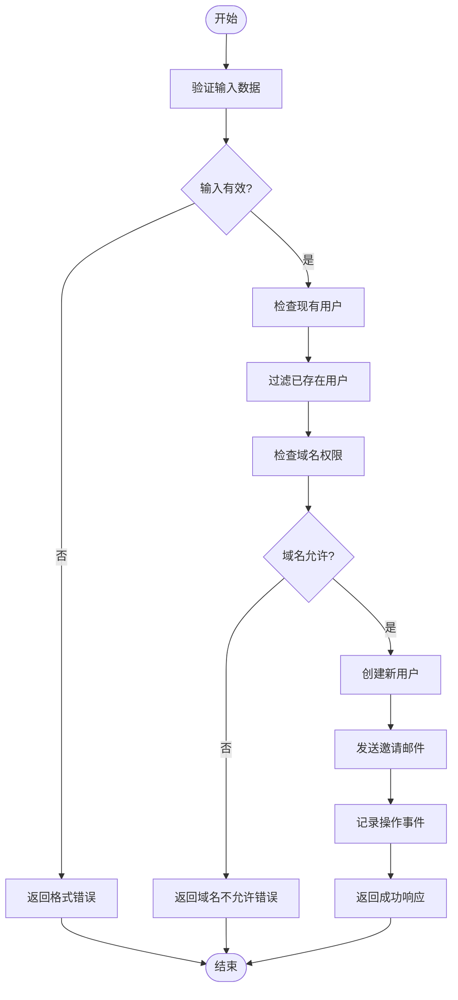
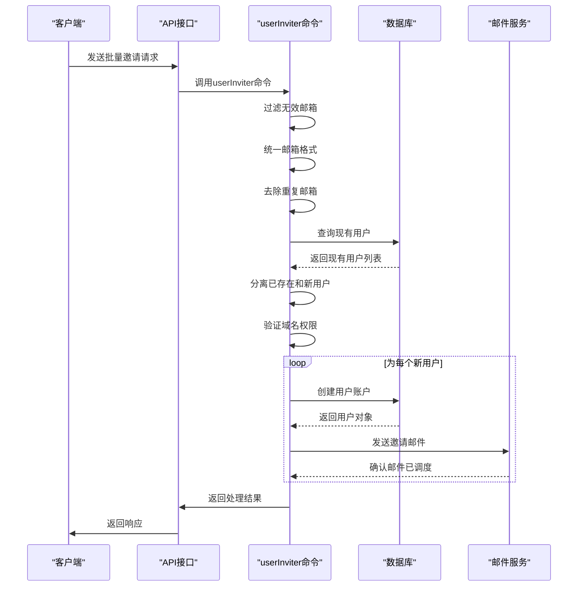
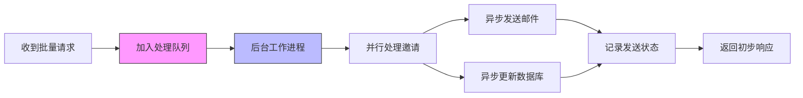

# 批量成员操作

<cite>
**本文档引用的文件**   
- [userMemberships.ts](file://server/routes/api/userMemberships/userMemberships.ts)
- [userInviter.ts](file://server/commands/userInviter.ts)
- [UserMembership.ts](file://server/models/UserMembership.ts)
- [schema.ts](file://server/routes/api/userMemberships/schema.ts)
</cite>

## 目录
1. [简介](#简介)
2. [批量操作API接口](#批量操作api接口)
3. [批量邀请处理流程](#批量邀请处理流程)
4. [性能优化措施](#性能优化措施)
5. [使用示例](#使用示例)
6. [最佳实践建议](#最佳实践建议)

## 简介
批量成员操作功能允许系统管理员或具有相应权限的用户通过API接口批量执行成员管理操作，包括批量邀请用户、批量更新成员状态和批量移除成员。该功能主要通过`userMemberships.ts`文件中的API路由和`userInviter.ts`命令实现，为团队协作和用户管理提供了高效的操作方式。

**Section sources**
- [userMemberships.ts](file://server/routes/api/userMemberships/userMemberships.ts#L1-L105)
- [userInviter.ts](file://server/commands/userInviter.ts#L1-L122)

## 批量操作API接口

### 请求格式
批量操作API采用POST请求方式，请求体包含操作所需的数据。对于批量邀请操作，请求体包含一个邀请对象数组，每个邀请对象包含姓名、邮箱和角色信息。

```json
{
  "invites": [
    {
      "name": "张三",
      "email": "zhangsan@example.com",
      "role": "member"
    },
    {
      "name": "李四",
      "email": "lisi@example.com",
      "role": "viewer"
    }
  ]
}
```

### 响应结构
API响应包含三个主要部分：已发送的邀请、未发送的邀请和创建的用户对象。

```json
{
  "sent": [
    {
      "name": "张三",
      "email": "zhangsan@example.com",
      "role": "member"
    }
  ],
  "unsent": [
    {
      "name": "李四",
      "email": "lisi@example.com",
      "role": "viewer"
    }
  ],
  "users": [
    {
      "id": "user-123",
      "name": "张三",
      "email": "zhangsan@example.com",
      "role": "member"
    }
  ]
}
```

### 错误处理策略
系统实现了全面的错误处理机制：
- 验证邮箱格式，过滤无效邮箱
- 检查域名是否允许，防止未经授权的域用户加入
- 处理重复邀请，避免向已存在的用户重复发送邀请
- 事务性操作确保数据一致性
- 详细的错误信息返回，便于客户端处理



**Diagram sources **
- [userInviter.ts](file://server/commands/userInviter.ts#L22-L120)
- [userMemberships.ts](file://server/routes/api/userMemberships/userMemberships.ts#L23-L63)

**Section sources**
- [schema.ts](file://server/routes/api/userMemberships/schema.ts#L4-L19)
- [userInviter.ts](file://server/commands/userInviter.ts#L22-L120)

## 批量邀请处理流程

### 处理步骤
批量邀请的处理流程包括以下几个关键步骤：

1. **输入验证和预处理**
   - 过滤空值和无效邮箱
   - 将邮箱地址转换为小写
   - 去除重复的邮箱地址

2. **权限检查**
   - 验证发起者是否有权限执行邀请操作
   - 检查目标邮箱域名是否在允许列表中

3. **用户状态检查**
   - 查询系统中是否已存在目标用户
   - 将邀请列表分为已存在用户和新用户

4. **用户创建和邀请发送**
   - 为新用户创建账户
   - 发送邀请邮件
   - 记录操作日志

### 验证与去重机制
系统通过以下方式确保数据质量和操作效率：



**Diagram sources **
- [userInviter.ts](file://server/commands/userInviter.ts#L22-L120)
- [UserMembership.ts](file://server/models/UserMembership.ts#L38-L410)

**Section sources**
- [userInviter.ts](file://server/commands/userInviter.ts#L22-L120)
- [UserMembership.ts](file://server/models/UserMembership.ts#L38-L410)

## 性能优化措施

### 异步处理
系统采用异步处理机制来提高批量操作的响应速度：



### 队列机制
通过消息队列实现请求的缓冲和有序处理，防止系统过载：

- 将批量邀请请求放入队列
- 后台工作进程从队列中取出请求进行处理
- 支持请求的重试机制
- 提供处理进度跟踪

### 进度跟踪
系统提供进度跟踪功能，便于监控批量操作的状态：

- 记录每个邀请的处理状态
- 提供API查询处理进度
- 支持失败重试机制
- 生成处理日志供审计

**Section sources**
- [userInviter.ts](file://server/commands/userInviter.ts#L22-L120)
- [userMemberships.ts](file://server/routes/api/userMemberships/userMemberships.ts#L71-L100)

## 使用示例

### 成功场景
```javascript
// 批量邀请新用户
const response = await fetch('/api/users.invite', {
  method: 'POST',
  headers: {
    'Content-Type': 'application/json',
  },
  body: JSON.stringify({
    invites: [
      {
        name: '王五',
        email: 'wangwu@company.com',
        role: 'member'
      },
      {
        name: '赵六',
        email: 'zhaoliu@company.com',
        role: 'viewer'
      }
    ]
  })
});

// 响应
{
  "sent": [
    {
      "name": "王五",
      "email": "wangwu@company.com",
      "role": "member"
    },
    {
      "name": "赵六",
      "email": "zhaoliu@company.com",
      "role": "viewer"
    }
  ],
  "unsent": [],
  "users": [
    {
      "id": "user-456",
      "name": "王五",
      "email": "wangwu@company.com",
      "role": "member"
    },
    {
      "id": "user-789",
      "name": "赵六",
      "email": "zhaoliu@company.com",
      "role": "viewer"
    }
  ]
}
```

### 失败场景
```javascript
// 包含已存在用户和无效邮箱的请求
const response = await fetch('/api/users.invite', {
  method: 'POST',
  headers: {
    'Content-Type': 'application/json',
  },
  body: JSON.stringify({
    invites: [
      {
        name: '张三',
        email: 'zhangsan@example.com', // 已存在用户
        role: 'member'
      },
      {
        name: '无效邮箱',
        email: 'invalid-email', // 无效邮箱格式
        role: 'viewer'
      }
    ]
  })
});

// 响应
{
  "sent": [],
  "unsent": [
    {
      "name": "张三",
      "email": "zhangsan@example.com",
      "role": "member"
    },
    {
      "name": "无效邮箱",
      "email": "invalid-email",
      "role": "viewer"
    }
  ],
  "users": []
}
```

**Section sources**
- [userInviter.ts](file://server/commands/userInviter.ts#L22-L120)
- [schema.ts](file://server/routes/api/userMemberships/schema.ts#L4-L19)

## 最佳实践建议

### 数据验证
- 在客户端进行初步验证，减少无效请求
- 确保邮箱格式正确
- 验证用户角色的有效性
- 检查批量大小，避免过大的请求

### 错误处理
- 处理部分成功的情况
- 记录详细的错误日志
- 提供清晰的错误信息给用户
- 实现重试机制

### 性能考虑
- 合理设置批量操作的大小
- 利用异步处理提高响应速度
- 监控系统资源使用情况
- 实施适当的限流策略

### 安全性
- 验证请求者的权限
- 检查域名白名单
- 防止滥用和垃圾邮件
- 记录所有操作日志

**Section sources**
- [userInviter.ts](file://server/commands/userInviter.ts#L22-L120)
- [userMemberships.ts](file://server/routes/api/userMemberships/userMemberships.ts#L1-L105)