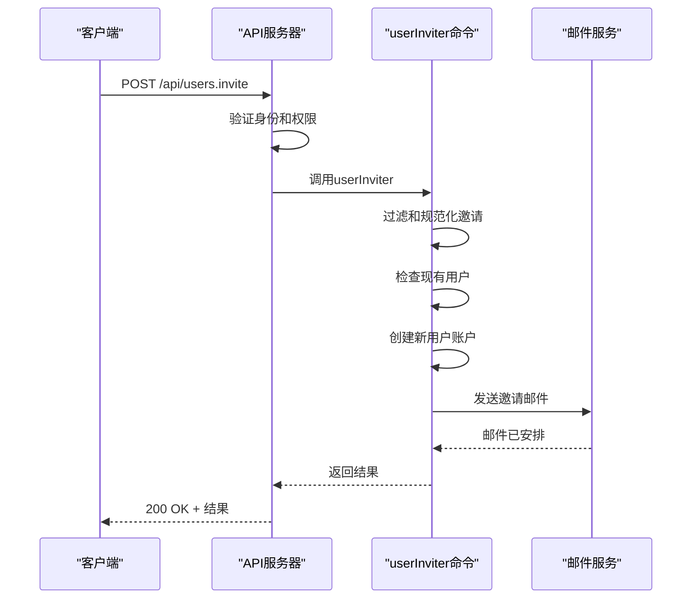
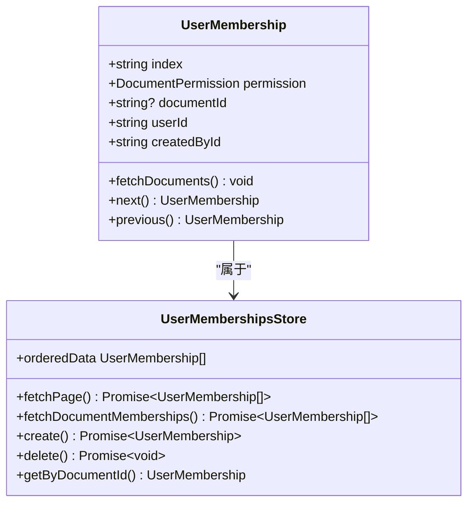

# 成员邀请

<cite>
**本文档中引用的文件**   
- [userMemberships.ts](file://server/routes/api/userMemberships/userMemberships.ts)
- [UserMembership.ts](file://app/models/UserMembership.ts)
- [userInviter.ts](file://server/commands/userInviter.ts)
- [InviteEmail.tsx](file://server/emails/templates/InviteEmail.tsx)
- [User.ts](file://app/models/User.ts)
- [UserMembership.ts](file://server/models/UserMembership.ts)
</cite>

## 目录
1. [简介](#简介)
2. [核心组件](#核心组件)
3. [API端点与请求参数](#api端点与请求参数)
4. [响应格式与错误处理](#响应格式与错误处理)
5. [UserMembership模型与状态管理](#usermembership模型与状态管理)
6. [邀请链接与安全验证](#邀请链接与安全验证)
7. [通知发送与批量处理](#通知发送与批量处理)
8. [邀请撤销与权限变更](#邀请撤销与权限变更)
9. [实际使用示例](#实际使用示例)
10. [结论](#结论)

## 简介
成员邀请功能是系统协作的核心机制，允许管理员或具有相应权限的用户邀请新成员加入团队或文档。该功能通过`userMemberships.ts`实现，涵盖了从邀请创建、状态管理到通知发送的完整流程。邀请流程不仅涉及用户账户的创建，还包括权限分配、安全验证和用户体验优化。本文档将详细解析该功能的实现细节，包括API端点、数据模型、状态转换和安全策略。

## 核心组件
成员邀请功能由多个核心组件协同工作。`UserMembership`模型是权限管理的基础，它定义了用户与文档或集合之间的访问关系。`userInviter`命令负责处理邀请的创建和用户账户的初始化。`InviteEmail`模板用于向被邀请者发送通知邮件。前端组件如`DocumentMemberList`和`InputMemberPermissionSelect`提供了用户界面，使邀请和权限管理变得直观易用。这些组件共同构成了一个完整的邀请系统，确保了功能的健壮性和用户体验的流畅性。

**Section sources**
- [userMemberships.ts](file://server/routes/api/userMemberships/userMemberships.ts#L1-L104)
- [UserMembership.ts](file://app/models/UserMembership.ts#L10-L97)
- [userInviter.ts](file://server/commands/userInviter.ts#L1-L121)

## API端点与请求参数
成员邀请功能通过`/api/users.invite` API端点暴露。该端点接受一个包含邀请列表的请求体，每个邀请对象包含`email`、`name`和`role`三个字段。`email`是被邀请者的电子邮件地址，`name`是其姓名，`role`定义了被邀请者在团队中的初始角色，可以是`admin`、`member`或`viewer`。请求需要管理员权限进行身份验证。此外，系统还提供了`/api/userMemberships.list`和`/api/userMemberships.update`端点，用于列出和更新用户成员资格，支持分页和排序。



**Diagram sources **
- [userMemberships.ts](file://server/routes/api/userMemberships/userMemberships.ts#L23-L63)
- [userInviter.ts](file://server/commands/userInviter.ts#L1-L121)

## 响应格式与错误处理
API端点返回JSON格式的响应。成功邀请时，响应包含`sent`、`unsent`和`users`三个数组。`sent`包含成功发送邀请的用户信息，`unsent`包含因已存在而未发送的用户信息，`users`包含新创建的用户对象。错误处理机制完善，会根据不同的错误情况返回相应的HTTP状态码和错误消息。例如，当邀请数量超过限制时，返回400状态码和"Too many invites"错误；当用户没有权限时，返回403状态码。系统还实现了域限制检查，防止向不允许的域发送邀请。

**Section sources**
- [userMemberships.ts](file://server/routes/api/userMemberships/userMemberships.ts#L71-L100)
- [userInviter.ts](file://server/commands/userInviter.ts#L1-L121)

## UserMembership模型与状态管理
`UserMembership`模型是权限系统的核心，它通过`permission`字段定义了用户的访问级别，如`read`、`readWrite`或`admin`。`documentId`字段指定了用户被授予访问权限的文档。模型中的`sourceId`字段支持权限继承，允许子文档继承父文档的访问权限。状态管理通过MobX实现，`UserMembershipsStore`负责同步和管理`UserMembership`对象的集合。`orderedData`计算属性根据`index`字段对成员资格进行排序，确保了用户界面的一致性。



**Diagram sources **
- [UserMembership.ts](file://app/models/UserMembership.ts#L10-L97)
- [UserMembershipsStore.ts](file://app/stores/UserMembershipsStore.ts#L8-L119)

## 邀请链接与安全验证
邀请链接通过JWT令牌实现安全验证。当用户被邀请时，系统会生成一个包含用户ID和创建时间的临时令牌，该令牌嵌入到邀请邮件中的链接里。用户点击链接后，系统会验证令牌的有效性，包括检查其是否过期（有效期为1分钟）和是否被篡改。验证成功后，用户将被重定向到登录页面，可以使用其电子邮件地址直接登录。这种机制确保了邀请过程的安全性，防止了链接被滥用。此外，系统还实现了反垃圾邮件策略，限制了用户在一定时间内可以发送的邀请数量。

**Section sources**
- [userInviter.ts](file://server/commands/userInviter.ts#L1-L121)
- [InviteEmail.tsx](file://server/emails/templates/InviteEmail.tsx#L1-L89)

## 通知发送与批量处理
邀请通知通过`InviteEmail`模板发送，该模板使用React组件构建，确保了邮件内容的动态性和可维护性。邮件内容包括邀请者姓名、团队名称和加入链接。系统支持批量邀请，可以在一次请求中邀请多个用户。`userInviter`命令会遍历邀请列表，为每个新用户创建账户并发送邀请邮件。对于已存在的用户，系统会将其添加到`unsent`列表中，避免重复发送。这种批量处理机制提高了效率，同时通过事务管理确保了数据的一致性。

**Section sources**
- [userInviter.ts](file://server/commands/userInviter.ts#L1-L121)
- [InviteEmail.tsx](file://server/emails/templates/InviteEmail.tsx#L1-L89)

## 邀请撤销与权限变更
系统支持邀请的撤销和权限的变更。通过`/api/documents.remove_user`端点，可以撤销用户对特定文档的访问权限。权限变更通过`/api/documents.add_user`端点实现，只需更新`permission`字段即可。`UserMembership`模型的`updateSourcedMemberships`钩子确保了当根成员资格的权限发生变化时，所有继承的成员资格也会自动更新。此外，系统还实现了最后管理员保护机制，防止团队中没有管理员的情况发生。当尝试删除最后一个管理员时，系统会抛出验证错误。

**Section sources**
- [userMemberships.ts](file://server/routes/api/userMemberships/userMemberships.ts#L1-L104)
- [UserMembership.ts](file://server/models/UserMembership.ts#L38-L410)

## 实际使用示例
以下是一个使用`curl`命令邀请用户的示例：
```bash
curl -X POST https://api.example.com/api/users.invite \
  -H "Authorization: Bearer <your_token>" \
  -H "Content-Type: application/json" \
  -d '{
    "invites": [
      {
        "email": "newuser@example.com",
        "name": "New User",
        "role": "member"
      }
    ]
  }'
```
此请求将邀请一个新用户加入团队，其角色为成员。成功后，系统会返回类似以下的响应：
```json
{
  "data": {
    "sent": [
      {
        "email": "newuser@example.com",
        "name": "New User",
        "role": "member"
      }
    ],
    "unsent": [],
    "users": [
      {
        "id": "user_123",
        "name": "New User",
        "email": "newuser@example.com",
        "role": "member"
      }
    ]
  }
}
```

## 结论
成员邀请功能是一个复杂而强大的系统，它通过精心设计的API、数据模型和安全机制，实现了高效、安全的团队协作。`UserMembership`模型作为权限管理的核心，提供了灵活的访问控制。`userInviter`命令和`InviteEmail`模板确保了邀请流程的顺畅和用户体验的友好。整个系统通过事务管理和验证机制，保证了数据的完整性和安全性。这些组件的协同工作，为用户提供了一个可靠、易用的邀请和权限管理解决方案。