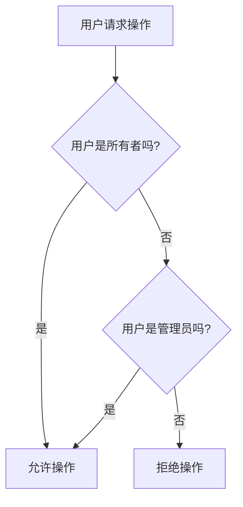

# 权限配置

<cite>
**Referenced Files in This Document**   
- [UserMembership.ts](file://app/models/UserMembership.ts)
- [UserMembership.ts](file://server/models/UserMembership.ts)
- [userMembership.ts](file://server/policies/userMembership.ts)
- [types.ts](file://shared/types.ts)
</cite>

## 目录
1. [权限级别定义](#权限级别定义)
2. [权限继承规则](#权限继承规则)
3. [权限验证策略](#权限验证策略)
4. [边界情况处理](#边界情况处理)

## 权限级别定义

`UserMembership` 模型中的 `role` 字段定义了用户在文档和集合中的不同权限级别。根据 `shared/types.ts` 文件中的定义，存在三种权限级别：`viewer`（查看者）、`editor`（编辑者）和 `admin`（管理员）。这些权限级别通过 `DocumentPermission` 枚举来表示，具体包括 `Read`（只读）、`ReadWrite`（读写）和 `Admin`（管理）。

**Section sources**
- [types.ts](file://shared/types.ts#L175-L179)

## 权限继承规则

当用户被邀请加入特定文档时，其权限会与团队级权限进行交互。如果文档属于某个集合，则用户的权限将继承自该集合的权限设置。例如，如果一个用户对集合具有 `ReadWrite` 权限，那么他们对该集合内的所有文档也默认拥有 `ReadWrite` 权限，除非在文档级别上进行了更具体的权限分配。

此外，`UserMembership` 模型通过 `sourceId` 字段支持权限的继承。这意味着，当一个用户被授予对某个文档的访问权限时，这个权限可以基于另一个“源”成员资格（source membership）而建立。这种机制允许系统在文档结构中传播权限，确保子文档能够继承父文档的访问控制规则。

**Section sources**
- [UserMembership.ts](file://app/models/UserMembership.ts#L10-L97)
- [UserMembership.ts](file://server/models/UserMembership.ts#L38-L410)

## 权限验证策略

权限验证策略实现在 `policies/userMembership.ts` 文件中。此策略使用 `cancan` 库来定义用户可以执行的操作。具体来说，只有当用户是成员资格的所有者或具有管理员角色时，才允许更新或删除成员资格。这通过 `allow` 函数实现，该函数检查两个条件：一是用户是否为成员资格的创建者（所有者），二是用户是否为管理员。

**Diagram sources**
- [userMembership.ts](file://server/policies/userMembership.ts#L1-L10)

**Section sources**
- [userMembership.ts](file://server/policies/userMembership.ts#L1-L10)

## 边界情况处理

在处理权限升级或降级时，系统需要考虑多种边界情况。例如，在 `UserMembership` 模型的 `validateLastAdminPermission` 方法中，系统会检查在移除或更改管理员权限之前，是否至少还有一个用户或组保有管理权限。这是为了防止集合或文档失去所有管理员，从而导致无法管理的情况发生。

此外，当用户被邀请加入文档时，系统会检查是否存在冲突的权限设置，并根据团队的默认角色来决定新用户的初始权限。这一过程确保了即使在复杂的权限结构下，也能维持一致性和安全性。

**Section sources**
- [UserMembership.ts](file://server/models/UserMembership.ts#L383-L409)