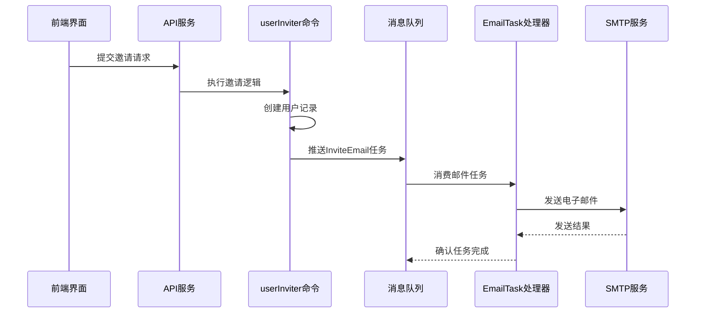
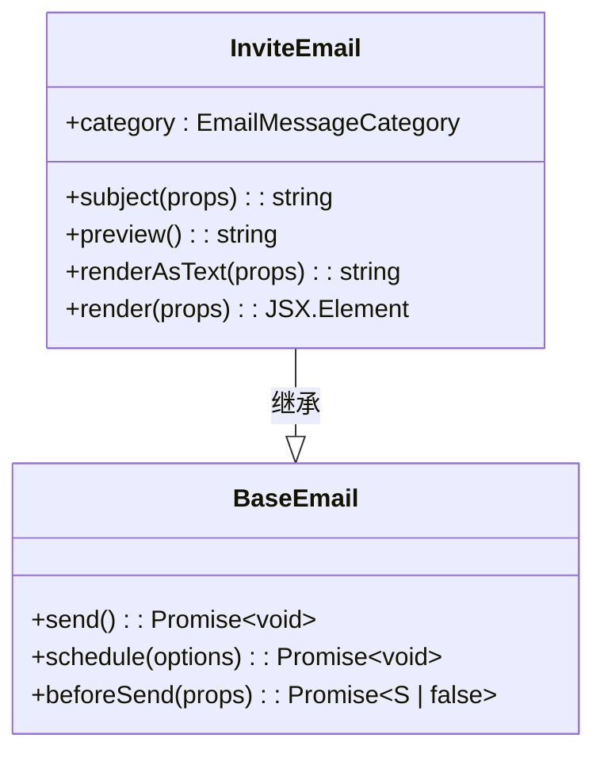
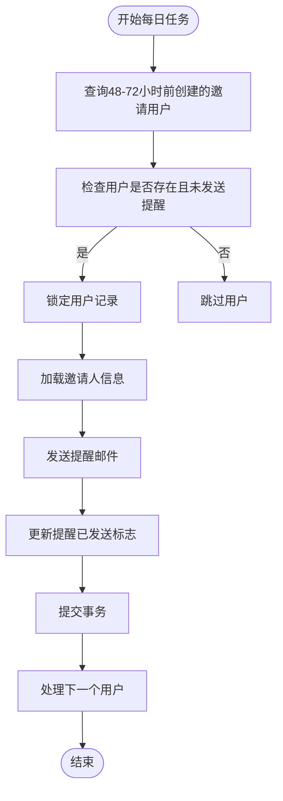

# 通知机制

<cite>
**本文档引用的文件**   
- [userInviter.ts](file://server/commands/userInviter.ts)
- [InviteEmail.tsx](file://server/emails/templates/InviteEmail.tsx)
- [InviteReminderEmail.tsx](file://server/emails/templates/InviteReminderEmail.tsx)
- [InviteAcceptedEmail.tsx](file://server/emails/templates/InviteAcceptedEmail.tsx)
- [mailer.tsx](file://server/emails/mailer.tsx)
- [EmailTask.ts](file://server/queues/tasks/EmailTask.ts)
- [InviteReminderTask.ts](file://server/queues/tasks/InviteReminderTask.ts)
- [User.ts](file://server/models/User.ts)
</cite>

## 目录
1. [成员邀请通知流程](#成员邀请通知流程)
2. [邀请邮件模板个性化内容](#邀请邮件模板个性化内容)
3. [通知重试机制与状态跟踪](#通知重试机制与状态跟踪)
4. [提醒通知功能](#提醒通知功能)
5. [用户接受邀请后的确认通知](#用户接受邀请后的确认通知)

## 成员邀请通知流程

当管理员创建用户邀请时，系统会通过消息队列触发电子邮件通知。整个流程始于`userInviter`命令的执行，该命令负责处理邀请逻辑。在成功创建用户记录后，系统会立即实例化`InviteEmail`模板，并调用其`schedule()`方法将发送任务推送到消息队列中。

消息队列由Bull实现，确保了高可靠性和异步处理能力。通过将邮件发送任务解耦到后台队列，系统能够快速响应前端请求，同时保证通知的最终送达。`EmailTask`作为队列任务处理器，从队列中消费任务并执行实际的邮件发送操作。

**Diagram sources**
- [userInviter.ts](file://server/commands/userInviter.ts#L22-L120)
- [EmailTask.ts](file://server/queues/tasks/EmailTask.ts#L8-L21)

**Section sources**
- [userInviter.ts](file://server/commands/userInviter.ts#L22-L120)

## 邀请邮件模板个性化内容

`InviteEmail`模板通过动态插入邀请人姓名、团队名称和有效期等信息实现内容个性化。模板接收多个参数，包括被邀请人姓名(`name`)、邀请人姓名(`actorName`)、邀请人邮箱(`actorEmail`)、团队名称(`teamName`)和团队URL(`teamUrl`)。这些参数在邮件渲染时被动态插入到HTML和纯文本版本中。

邮件主题行显示"邀请人姓名邀请您加入团队名称的工作区"，正文部分则包含邀请人的姓名和邮箱信息，以及指向团队工作区的加入按钮链接。链接中包含`ref=invite-email`参数用于追踪来源。系统还根据环境变量`APP_NAME`动态生成应用名称，确保品牌一致性。

**Diagram sources**
- [InviteEmail.tsx](file://server/emails/templates/InviteEmail.tsx#L23-L88)

**Section sources**
- [InviteEmail.tsx](file://server/emails/templates/InviteEmail.tsx#L23-L88)

## 通知重试机制与状态跟踪

系统实现了完善的邮件发送重试机制和状态跟踪功能。`BaseEmail`类中的`send()`方法包含了5次重试尝试，采用指数退避策略，初始延迟为60秒。当SMTP发送失败时，错误会被抛出并由队列系统捕获，触发重试逻辑。

邮件状态通过`Notification`模型进行跟踪，包含`emailedAt`时间戳字段记录实际发送时间。系统还集成了监控指标，成功发送时递增`email.sent`计数器，发送失败时递增`email.sending_failed`计数器。`mailer.tsx`中的日志记录功能详细追踪了邮件发送过程，便于故障排查。

对于已查看的通知，系统会跳过邮件发送，避免重复通知。`beforeSend`钩子函数提供了在发送前加载额外数据的机会，如果返回`false`则会中止发送流程。

**Section sources**
- [mailer.tsx](file://server/emails/mailer.tsx#L200-L260)
- [BaseEmail.tsx](file://server/emails/templates/BaseEmail.tsx#L51-L88)

## 提醒通知功能

系统实现了自动提醒功能，当邀请创建两天后用户仍未激活账户时，会自动发送提醒邮件。`InviteReminderTask`作为定时任务每天执行一次，查询过去48-72小时内创建的邀请用户。

为防止重复发送提醒，系统使用`UserFlag.InviteReminderSent`标志位进行跟踪。在事务性操作中，系统首先锁定用户记录，检查是否已发送过提醒，若未发送则创建`InviteReminderEmail`并更新标志位。提醒邮件的主题为"提醒：邀请人姓名邀请您加入团队名称的工作区"，内容与初始邀请类似但明确标注为提醒。

**Diagram sources**
- [InviteReminderTask.ts](file://server/queues/tasks/InviteReminderTask.ts#L26-L56)

**Section sources**
- [InviteReminderTask.ts](file://server/queues/tasks/InviteReminderTask.ts#L26-L56)

## 用户接受邀请后的确认通知

当被邀请用户成功接受邀请并创建账户后，系统会向邀请人发送确认通知。这一流程通过`userProvisioner`命令中的逻辑触发，当检测到新用户是通过邀请注册时，系统会立即调度`InviteAcceptedEmail`。

确认邮件包含被邀请人的姓名和指向团队工作区的打开按钮。邮件还提供了退订链接，允许邀请人选择不再接收此类通知。`unsubscribeUrl`通过`NotificationSettingsHelper`生成，包含加密的退订令牌，实现无需登录的一键退订功能。

该通知属于`Notification`类别，与邀请邀请的`Invitation`类别相区分。系统通过`NotificationEventType.InviteAccepted`事件类型进行跟踪和管理，用户可以在通知设置中控制是否接收此类通知。

**Section sources**
- [InviteAcceptedEmail.tsx](file://server/emails/templates/InviteAcceptedEmail.tsx#L28-L86)
- [userProvisioner.ts](file://server/commands/userProvisioner.ts#L52-L239)