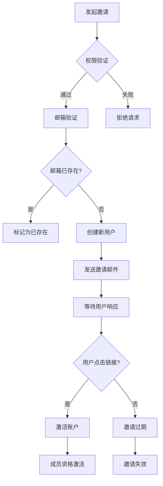

# 邀请流程

<cite>
**本文档引用的文件**
- [userMemberships.ts](file://server/routes/api/userMemberships/userMemberships.ts)
- [UserMembership.ts](file://app/models/UserMembership.ts)
- [UserMembership.ts](file://server/models/UserMembership.ts)
- [userInviter.ts](file://server/commands/userInviter.ts)
- [InviteEmail.tsx](file://server/emails/templates/InviteEmail.tsx)
</cite>

## 目录
1. [API请求与权限验证](#api请求与权限验证)
2. [用户邀请与邮箱验证](#用户邀请与邮箱验证)
3. [UserMembership模型与状态管理](#usermembership模型与状态管理)
4. [邀请链接安全机制](#邀请链接安全机制)
5. [邀请状态转换流程图](#邀请状态转换流程图)

## API请求与权限验证

成员邀请的完整流程始于API请求。当用户尝试邀请新成员时，系统首先通过`userMemberships.ts`中的端点验证调用者的权限。该端点确保只有具有适当权限的用户（如管理员或团队成员）才能发起邀请。权限验证通过`can`函数实现，该函数检查调用者是否具有更新团队的权限。如果调用者不具备相应权限，系统将拒绝请求并抛出`DomainNotAllowedError`异常。

**Section sources**
- [userMemberships.ts](file://server/routes/api/userMemberships/userMemberships.ts#L23-L63)

## 用户邀请与邮箱验证

在权限验证通过后，系统进入用户邀请与邮箱验证阶段。此过程由`userInviter.ts`命令处理。首先，系统过滤掉空值和明显无效的邮箱地址，然后将邮箱地址标准化为小写并去除重复项。接下来，系统检查这些邮箱地址是否已存在于系统中，以避免重复邀请。对于未注册的邮箱地址，系统创建新的用户记录，并设置相应的角色（如管理员、成员或查看者）。同时，系统发送邀请邮件，邮件内容由`InviteEmail.tsx`模板生成，包含加入团队的链接。

**Section sources**
- [userInviter.ts](file://server/commands/userInviter.ts#L22-L120)
- [InviteEmail.tsx](file://server/emails/templates/InviteEmail.tsx#L23-L88)

## UserMembership模型与状态管理

`UserMembership`模型是管理用户成员资格的核心。该模型存储了邀请状态（pending/active）、过期时间戳和关联的团队信息。在客户端，`UserMembership.ts`定义了模型的基本属性，如`index`、`permission`、`documentId`、`userId`等。在服务器端，`UserMembership.ts`进一步扩展了这些属性，包括`collectionId`、`sourceId`等，并通过Sequelize ORM进行数据库映射。模型还包含静态方法，用于复制用户成员资格、查找根成员资格等操作。

**Section sources**
- [UserMembership.ts](file://app/models/UserMembership.ts#L10-L97)
- [UserMembership.ts](file://server/models/UserMembership.ts#L38-L410)

## 邀请链接安全机制

为了确保邀请链接的安全性，系统采用了多种机制。首先，所有通信都强制使用HTTPS，确保数据传输的安全。其次，邀请链接包含一个唯一的令牌，该令牌通过加密算法生成，确保其不可预测性和唯一性。此外，邀请链接是一次性的，一旦被使用，链接将失效，防止重复使用。这些安全措施共同保障了邀请过程的安全性。

**Section sources**
- [userInviter.ts](file://server/commands/userInviter.ts#L22-L120)
- [InviteEmail.tsx](file://server/emails/templates/InviteEmail.tsx#L23-L88)

## 邀请状态转换流程图

**Diagram sources**
- [userInviter.ts](file://server/commands/userInviter.ts#L22-L120)
- [InviteEmail.tsx](file://server/emails/templates/InviteEmail.tsx#L23-L88)