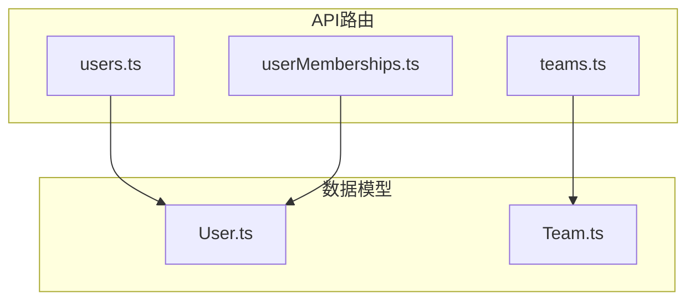
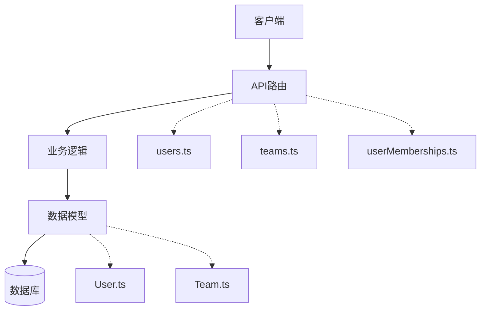
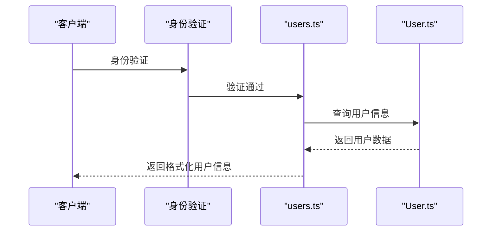
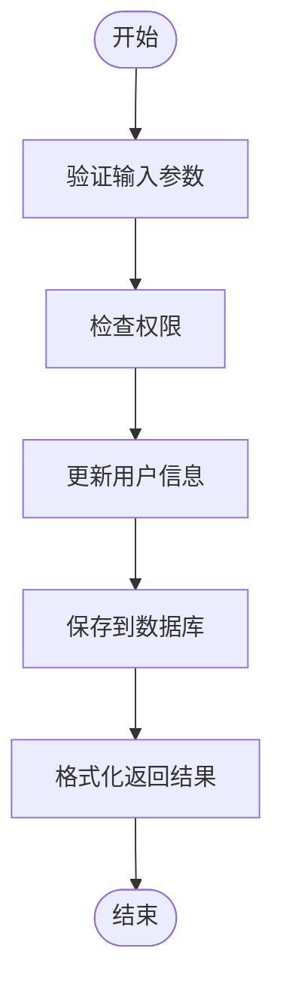
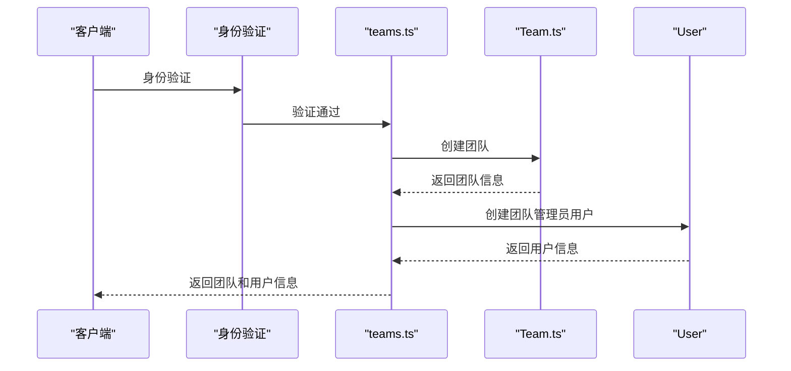
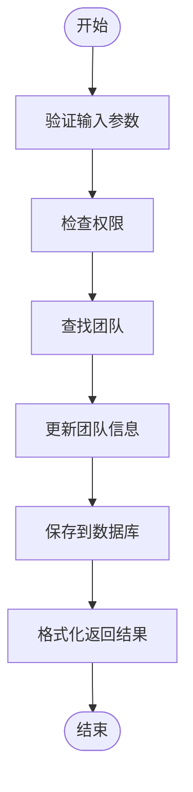
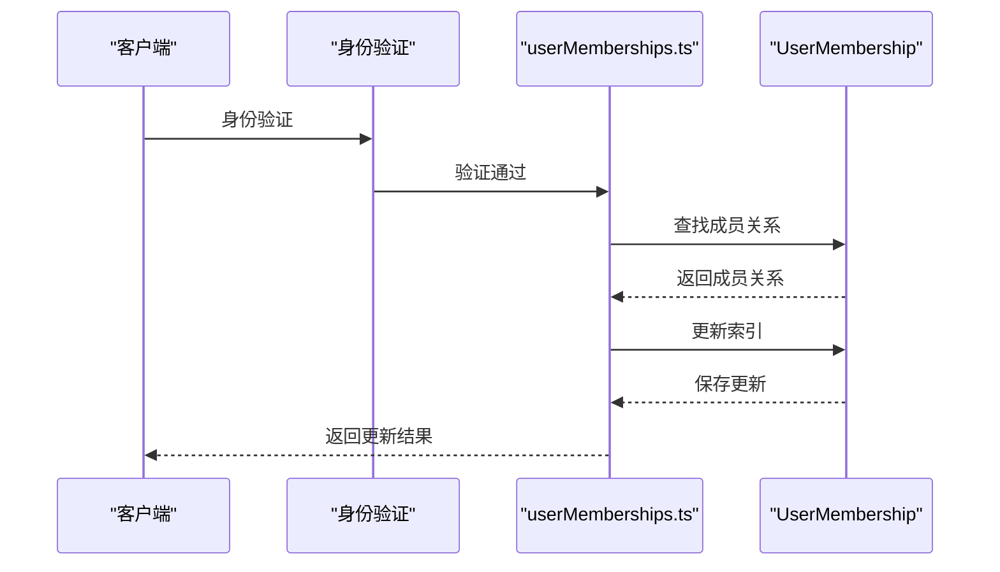
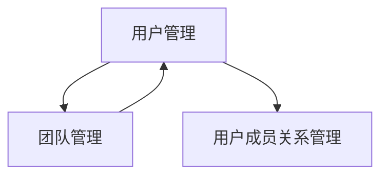

# 用户与团队API

<cite>
**本文档中引用的文件**  
- [users.ts](file://server/routes/api/users/users.ts)
- [teams.ts](file://server/routes/api/teams/teams.ts)
- [User.ts](file://server/models/User.ts)
- [Team.ts](file://server/models/Team.ts)
- [userMemberships.ts](file://server/routes/api/userMemberships/userMemberships.ts)
</cite>

## 目录
1. [简介](#简介)
2. [项目结构](#项目结构)
3. [核心组件](#核心组件)
4. [架构概述](#架构概述)
5. [详细组件分析](#详细组件分析)
6. [依赖分析](#依赖分析)
7. [性能考虑](#性能考虑)
8. [故障排除指南](#故障排除指南)
9. [结论](#结论)

## 简介
本文档详细介绍了用户与团队管理API的功能，涵盖用户创建、团队管理、成员邀请和权限分配等核心功能。重点说明了`users.ts`和`teams.ts`中定义的端点，包括用户资料更新、团队创建、成员添加/移除等操作的请求参数、响应格式和错误码。结合`User.ts`和`Team.ts`模型解释数据结构，并说明`userMemberships.ts`如何管理用户与团队的关系。提供关于团队权限控制、邀请流程和成员状态管理的实现细节，以及实际使用示例。

## 项目结构
用户与团队管理功能分布在服务器端的API路由和模型文件中。主要功能模块包括用户管理、团队管理和用户成员关系管理，分别由独立的路由文件和模型文件实现。

**图示来源**
- [users.ts](file://server/routes/api/users/users.ts#L1-L703)
- [teams.ts](file://server/routes/api/teams/teams.ts#L1-L168)
- [userMemberships.ts](file://server/routes/api/userMemberships/userMemberships.ts#L1-L105)
- [User.ts](file://server/models/User.ts#L1-L860)
- [Team.ts](file://server/models/Team.ts#L1-L477)

**章节来源**
- [users.ts](file://server/routes/api/users/users.ts#L1-L703)
- [teams.ts](file://server/routes/api/teams/teams.ts#L1-L168)

## 核心组件
核心组件包括用户管理、团队管理和用户成员关系管理三大模块。用户管理模块负责用户创建、更新、删除和权限变更；团队管理模块负责团队创建、更新和删除；用户成员关系管理模块负责管理用户与文档的权限关系。

**章节来源**
- [users.ts](file://server/routes/api/users/users.ts#L1-L703)
- [teams.ts](file://server/routes/api/teams/teams.ts#L1-L168)
- [userMemberships.ts](file://server/routes/api/userMemberships/userMemberships.ts#L1-L105)

## 架构概述
系统采用分层架构，API路由层处理HTTP请求，业务逻辑层处理核心功能，数据模型层管理数据持久化。用户与团队管理功能通过RESTful API提供服务，所有操作都需要身份验证。

**图示来源**
- [users.ts](file://server/routes/api/users/users.ts#L1-L703)
- [teams.ts](file://server/routes/api/teams/teams.ts#L1-L168)
- [userMemberships.ts](file://server/routes/api/userMemberships/userMemberships.ts#L1-L105)
- [User.ts](file://server/models/User.ts#L1-L860)
- [Team.ts](file://server/models/Team.ts#L1-L477)

## 详细组件分析
### 用户管理分析
用户管理模块提供了完整的用户生命周期管理功能，包括用户信息查询、更新、权限变更、邀请和删除等操作。

#### 用户信息查询

**图示来源**
- [users.ts](file://server/routes/api/users/users.ts#L100-L130)
- [User.ts](file://server/models/User.ts#L1-L860)

#### 用户资料更新

**图示来源**
- [users.ts](file://server/routes/api/users/users.ts#L200-L250)
- [User.ts](file://server/models/User.ts#L1-L860)

**章节来源**
- [users.ts](file://server/routes/api/users/users.ts#L100-L703)
- [User.ts](file://server/models/User.ts#L1-L860)

### 团队管理分析
团队管理模块提供了团队创建、更新和删除功能，以及团队级别的权限控制。

#### 团队创建流程

**图示来源**
- [teams.ts](file://server/routes/api/teams/teams.ts#L120-L167)
- [Team.ts](file://server/models/Team.ts#L1-L477)

#### 团队更新流程

**图示来源**
- [teams.ts](file://server/routes/api/teams/teams.ts#L20-L60)
- [Team.ts](file://server/models/Team.ts#L1-L477)

**章节来源**
- [teams.ts](file://server/routes/api/teams/teams.ts#L1-L167)
- [Team.ts](file://server/models/Team.ts#L1-L477)

### 用户成员关系管理分析
用户成员关系管理模块负责管理用户与文档的权限关系，支持权限索引更新等功能。

#### 成员关系更新流程

**图示来源**
- [userMemberships.ts](file://server/routes/api/userMemberships/userMemberships.ts#L50-L104)
- [User.ts](file://server/models/User.ts#L1-L860)

**章节来源**
- [userMemberships.ts](file://server/routes/api/userMemberships/userMemberships.ts#L1-L105)
- [User.ts](file://server/models/User.ts#L1-L860)

## 依赖分析
用户与团队管理模块之间存在明确的依赖关系，团队管理依赖于用户管理，用户成员关系管理依赖于用户管理。

**图示来源**
- [users.ts](file://server/routes/api/users/users.ts#L1-L703)
- [teams.ts](file://server/routes/api/teams/teams.ts#L1-L168)
- [userMemberships.ts](file://server/routes/api/userMemberships/userMemberships.ts#L1-L105)

**章节来源**
- [users.ts](file://server/routes/api/users/users.ts#L1-L703)
- [teams.ts](file://server/routes/api/teams/teams.ts#L1-L168)
- [userMemberships.ts](file://server/routes/api/userMemberships/userMemberships.ts#L1-L105)

## 性能考虑
用户与团队管理API在设计时考虑了性能优化，包括：
- 使用数据库索引提高查询效率
- 实现分页功能避免大量数据传输
- 采用事务处理确保数据一致性
- 缓存常用数据减少数据库查询

## 故障排除指南
常见问题及解决方案：
- **用户无法创建团队**：检查用户是否具有创建团队的权限
- **成员邀请失败**：检查邮箱域名是否在允许列表中
- **权限更新无效**：检查用户角色是否满足权限变更条件
- **API调用频率受限**：遵循速率限制策略，避免频繁调用

**章节来源**
- [users.ts](file://server/routes/api/users/users.ts#L1-L703)
- [teams.ts](file://server/routes/api/teams/teams.ts#L1-L168)

## 结论
用户与团队管理API提供了完整的用户生命周期管理和团队协作功能，通过清晰的RESTful接口设计和严谨的权限控制机制，确保了系统的安全性和可用性。各模块之间职责分明，依赖关系清晰，便于维护和扩展。