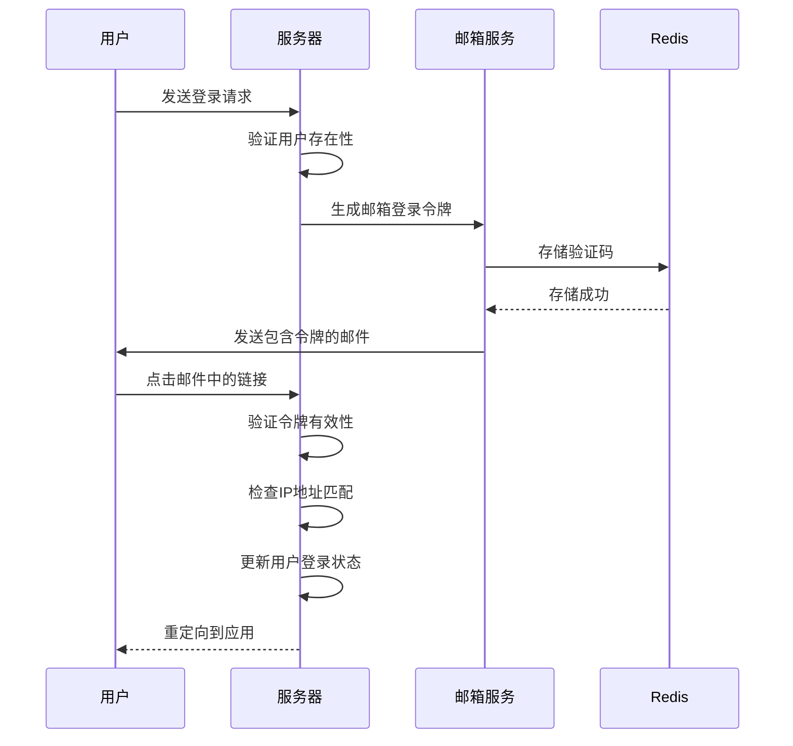
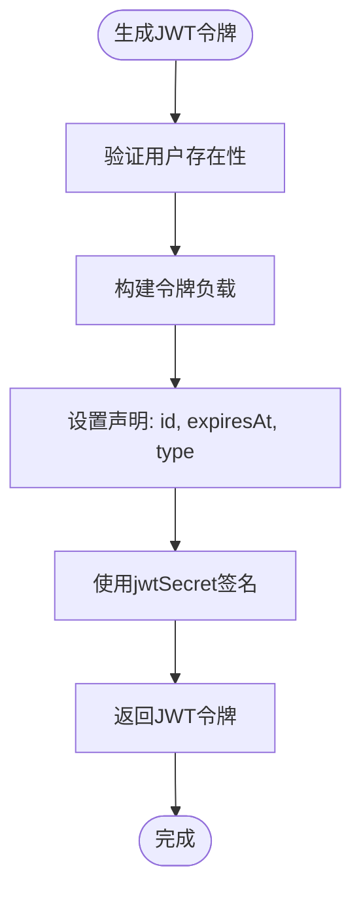
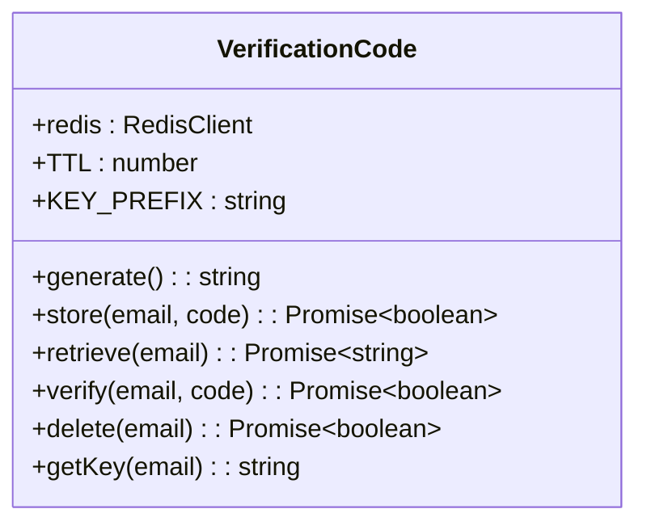
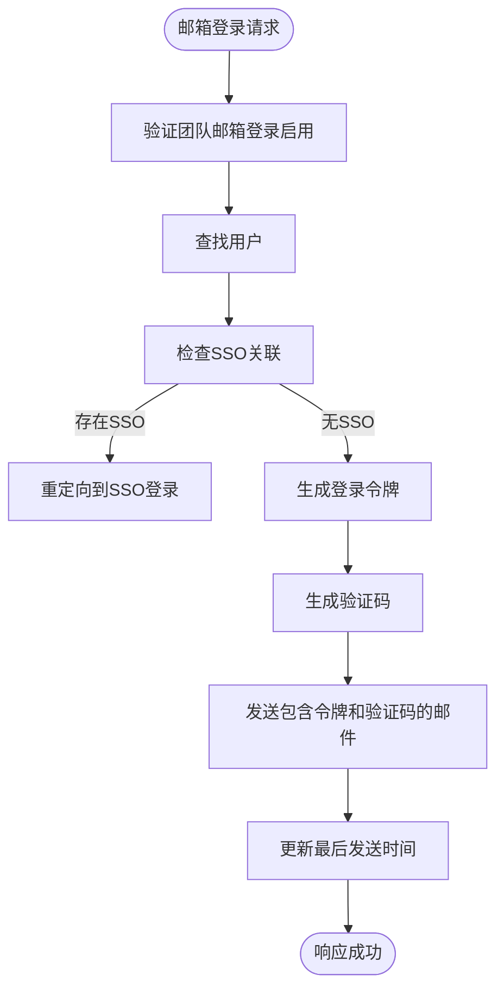
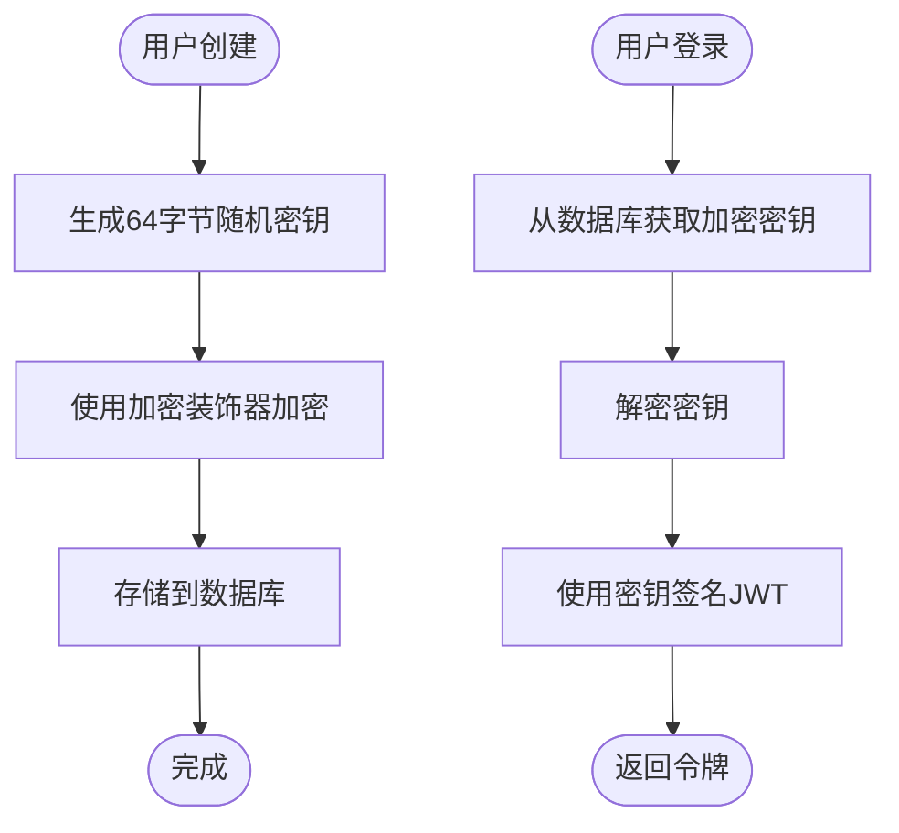
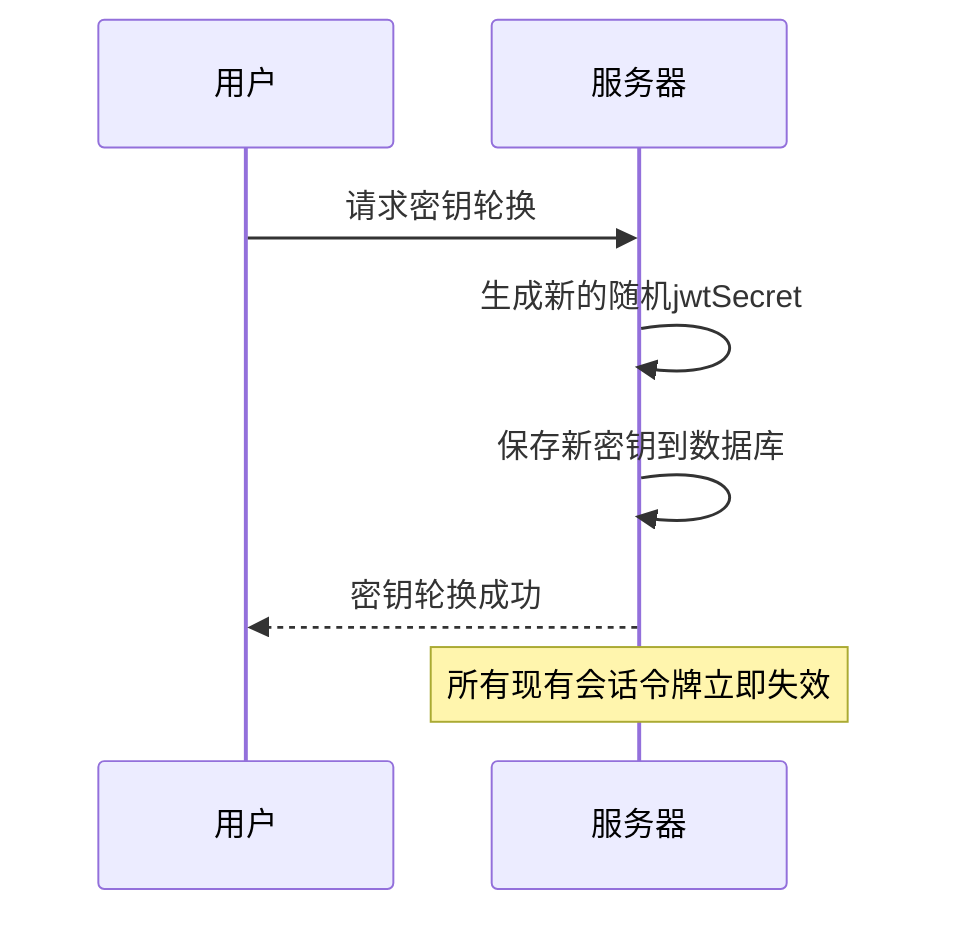
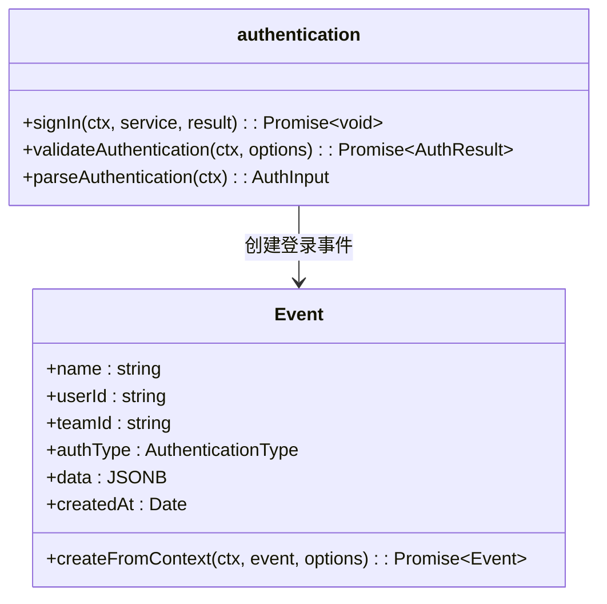
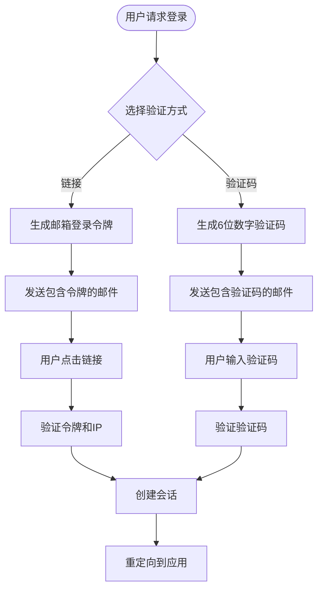

# 用户安全

<cite>
**本文档引用的文件**
- [User.ts](file://app/models/User.ts)
- [User.ts](file://server/models/User.ts)
- [jwt.ts](file://server/utils/jwt.ts)
- [VerificationCode.ts](file://server/utils/VerificationCode.ts)
- [email.ts](file://plugins/email/server/auth/email.ts)
- [authentication.ts](file://server/utils/authentication.ts)
- [authentication.ts](file://server/middlewares/authentication.ts)
</cite>

## 目录
1. [简介](#简介)
2. [用户身份验证流程](#用户身份验证流程)
3. [JWT令牌管理](#jwt令牌管理)
4. [邮箱验证与密码重置](#邮箱验证与密码重置)
5. [会话管理与安全](#会话管理与安全)
6. [安全日志与监控](#安全日志与监控)
7. [安全最佳实践](#安全最佳实践)

## 简介
本文档详细阐述了用户安全管理系统的实现，涵盖JWT令牌生成、密码重置、邮箱验证和会话管理等安全相关功能。文档重点分析了用户身份验证流程、令牌过期策略、会话固定攻击防护和安全日志记录等关键安全机制。

**Section sources**
- [User.ts](file://server/models/User.ts#L81-L856)
- [jwt.ts](file://server/utils/jwt.ts#L0-L142)

## 用户身份验证流程
系统实现了多因素身份验证流程，包括基于JWT的会话管理和基于邮箱的登录验证。用户可以通过邮箱链接或验证码进行身份验证，系统会根据用户状态和团队设置进行相应的安全检查。

**Diagram sources**
- [email.ts](file://plugins/email/server/auth/email.ts#L29-L77)
- [jwt.ts](file://server/utils/jwt.ts#L77-L109)

**Section sources**
- [email.ts](file://plugins/email/server/auth/email.ts#L0-L211)
- [authentication.ts](file://server/utils/authentication.ts#L0-L181)

## JWT令牌管理
系统使用JWT（JSON Web Token）进行用户会话管理，实现了多种类型的令牌以满足不同的安全需求。

### JWT令牌类型
系统实现了多种JWT令牌类型，每种类型都有特定的用途和安全特性：

| 令牌类型 | 用途 | 过期时间 | 安全特性 |
|--------|------|--------|--------|
| 会话令牌 | API请求认证 | 可配置 | 基于jwtSecret签名 |
| 协作令牌 | 实时协作 | 24小时 | 基于jwtSecret签名 |
| 转移令牌 | 子域名会话转移 | 1分钟 | 一次性使用，带创建时间戳 |
| 邮箱登录令牌 | 邮箱登录验证 | 10分钟 | 绑定IP地址，带创建时间戳 |

### 令牌生成与验证
系统通过`getJwtToken`方法生成会话令牌，使用用户的`jwtSecret`作为签名密钥。令牌包含用户ID、过期时间和令牌类型等信息。

**Diagram sources**
- [User.ts](file://server/models/User.ts#L566-L615)
- [jwt.ts](file://server/utils/jwt.ts#L0-L142)

**Section sources**
- [User.ts](file://server/models/User.ts#L566-L615)
- [jwt.ts](file://server/utils/jwt.ts#L0-L142)

## 邮箱验证与密码重置
系统实现了安全的邮箱验证和密码重置机制，使用双重验证方式确保账户安全。

### 邮箱验证码生成
系统使用`VerificationCode`类生成和管理6位数字验证码，验证码存储在Redis中并设置10分钟的TTL。

**Diagram sources**
- [VerificationCode.ts](file://server/utils/VerificationCode.ts#L0-L95)

### 邮箱登录流程
系统支持两种邮箱登录方式：链接令牌和验证码。用户可以选择更安全的验证码方式或更便捷的链接方式。

**Diagram sources**
- [email.ts](file://plugins/email/server/auth/email.ts#L29-L77)

**Section sources**
- [VerificationCode.ts](file://server/utils/VerificationCode.ts#L0-L95)
- [email.ts](file://plugins/email/server/auth/email.ts#L0-L211)

## 会话管理与安全
系统实现了全面的会话管理机制，包括会话固定攻击防护、令牌轮换和会话转移等功能。

### jwtSecret加密存储
用户的`jwtSecret`字段使用`@Encrypted`装饰器进行加密存储，确保密钥在数据库中的安全性。

**Diagram sources**
- [User.ts](file://server/models/User.ts#L154-L156)
- [User.ts](file://server/models/User.ts#L719-L722)

### 令牌轮换机制
系统通过`rotateJwtSecret`方法实现JWT密钥轮换，该操作会立即使所有已签发的令牌失效。

**Section sources**
- [User.ts](file://server/models/User.ts#L540-L548)
- [User.ts](file://server/models/User.ts#L556-L564)

## 安全日志与监控
系统实现了全面的安全日志记录机制，跟踪用户登录、会话创建和安全事件。

### 安全日志记录
系统通过`Event`模型记录所有安全相关事件，包括用户登录、会话创建和身份验证失败等。

**Diagram sources**
- [authentication.ts](file://server/utils/authentication.ts#L0-L181)
- [authentication.ts](file://server/middlewares/authentication.ts#L0-L279)

**Section sources**
- [authentication.ts](file://server/utils/authentication.ts#L0-L181)
- [authentication.ts](file://server/middlewares/authentication.ts#L0-L279)

## 安全最佳实践
基于系统实现，总结以下安全最佳实践：

### 密码策略
- 使用强随机数生成器创建jwtSecret（64字节十六进制字符串）
- 对敏感字段（如jwtSecret）进行加密存储
- 定期轮换JWT密钥以减少密钥泄露风险

### 登录尝试限制
- 使用速率限制中间件（RateLimiter）防止暴力破解
- 每小时限制10次邮箱登录请求
- 每分钟限制5次回调请求

### 可疑活动检测
- 绑定邮箱登录令牌到用户IP地址
- 验证令牌创建时间，防止重放攻击
- 记录用户登录IP和时间，便于审计

### 双因素认证流程
系统通过邮箱验证码实现类似双因素认证的安全机制：
1. 用户请求登录
2. 系统生成6位数字验证码并发送到注册邮箱
3. 用户输入收到的验证码
4. 系统验证验证码的正确性和时效性
5. 验证成功后创建会话

**Section sources**
- [VerificationCode.ts](file://server/utils/VerificationCode.ts#L0-L95)
- [email.ts](file://plugins/email/server/auth/email.ts#L0-L211)
- [User.ts](file://server/models/User.ts#L312-L320)