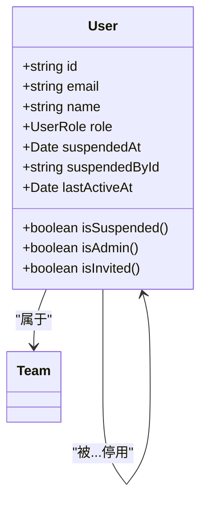
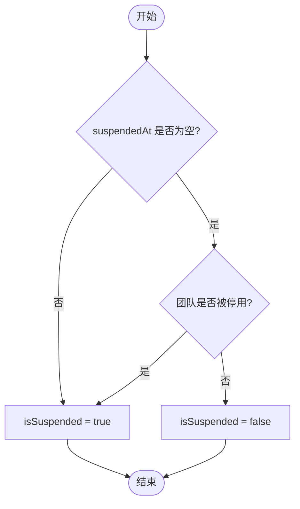
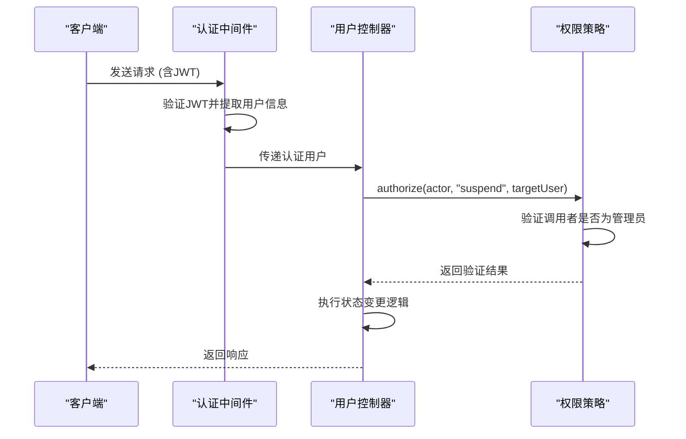
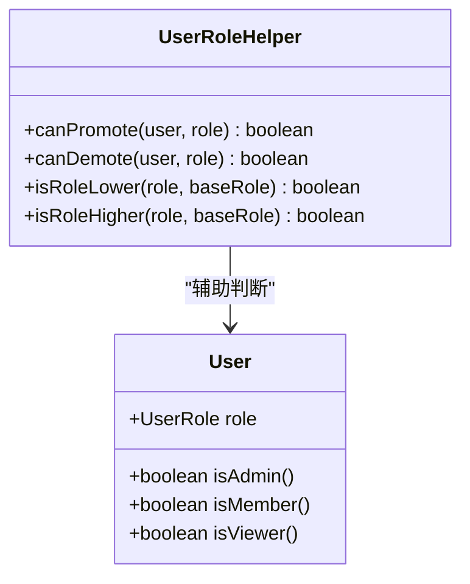
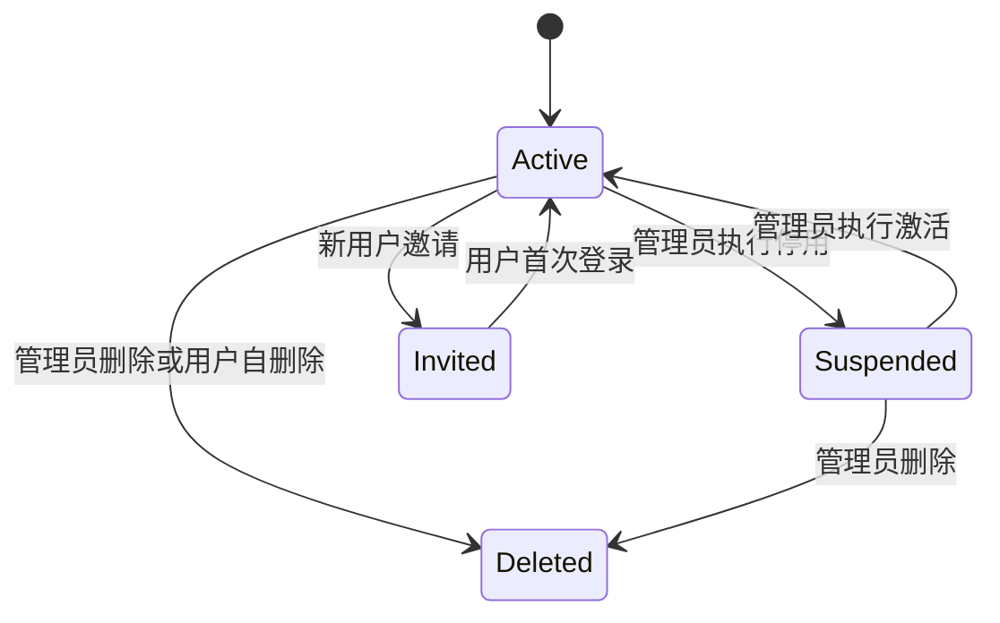
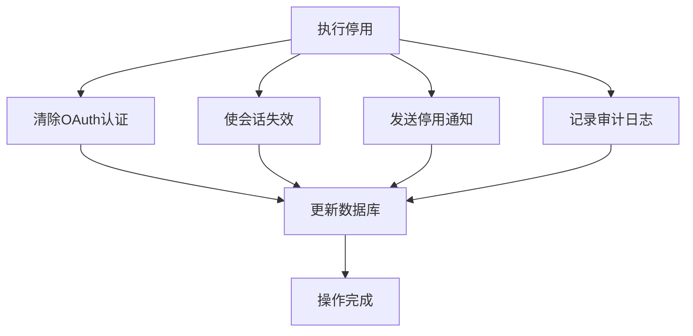

# 用户状态

<cite>
**本文档引用的文件**
- [users.ts](file://server/routes/api/users/users.ts)
- [User.ts](file://server/models/User.ts)
- [User.ts](file://app/models/User.ts)
- [UserSuspendedProcessor.ts](file://server/queues/processors/UserSuspendedProcessor.ts)
- [ErrorSuspended.tsx](file://app/scenes/Errors/ErrorSuspended.tsx)
</cite>

## 目录
1. [简介](#简介)
2. [核心模型设计](#核心模型设计)
3. [用户状态管理端点](#用户状态管理端点)
4. [权限控制与策略](#权限控制与策略)
5. [状态转换逻辑](#状态转换逻辑)
6. [副作用处理与事件机制](#副作用处理与事件机制)
7. [用户生命周期管理](#用户生命周期管理)
8. [批量状态操作](#批量状态操作)
9. [审计日志与通知机制](#审计日志与通知机制)
10. [异常处理与最佳实践](#异常处理与最佳实践)

## 简介
本文档详细阐述了用户状态管理系统的实现机制，涵盖用户激活、停用、角色变更和邀请流程等核心功能。系统通过`suspendedAt`、`suspendedById`、`role`等字段实现用户状态的精确控制，结合前端组件与后端API端点，构建了完整的用户生命周期管理体系。文档重点分析了`/suspend`、`/activate`、`/update_role`等关键端点的权限验证、状态转换逻辑和副作用处理机制。

## 核心模型设计

### 用户模型状态字段
用户模型通过多个字段实现复杂的状态管理：

- **suspendedAt**: 记录用户被停用的时间戳，`null`表示用户处于激活状态
- **suspendedById**: 记录执行停用操作的管理员用户ID
- **role**: 用户角色，包含`Admin`、`Member`、`Viewer`、`Guest`等层级
- **lastActiveAt**: 记录用户最后活跃时间，用于区分已邀请但未激活的用户

**图源**
- [User.ts](file://server/models/User.ts#L183-L185)
- [User.ts](file://server/models/User.ts#L228-L230)

### 状态属性计算逻辑
系统通过计算属性实现状态判断：

- **isSuspended**: 组合判断用户自身停用状态和团队停用状态
- **isAdmin**: 通过角色比较判断是否为管理员
- **isInvited**: 通过`lastActiveAt`字段判断是否为已邀请未激活用户

**图源**
- [User.ts](file://server/models/User.ts#L251-L252)
- [User.ts](file://app/models/User.ts#L63)

**本节源码**
- [User.ts](file://server/models/User.ts#L251-L252)
- [User.ts](file://app/models/User.ts#L63)

## 用户状态管理端点

### 状态管理API端点
系统提供RESTful API端点进行用户状态管理：

- **POST /api/users.suspend**: 停用用户账户
- **POST /api/users.activate**: 激活用户账户
- **POST /api/users.update_role**: 更新用户角色
- **POST /api/users.invite**: 邀请新用户

### 权限控制机制
每个端点都实现了严格的权限验证：

- **管理员权限**: `/suspend`、`/activate`、`/update_role`端点要求调用者为管理员角色
- **自我保护**: 禁止用户修改自己的角色或停用自己
- **角色验证**: 确保目标角色与当前角色不同，防止无效操作

**图源**
- [users.ts](file://server/routes/api/users/users.ts#L420-L448)
- [users.ts](file://server/routes/api/users/users.ts#L450-L478)

**本节源码**
- [users.ts](file://server/routes/api/users/users.ts#L420-L478)

## 权限控制与策略

### 角色权限体系
系统采用基于角色的访问控制（RBAC）模型：

- **Admin**: 拥有完全管理权限，可管理用户、团队和计费
- **Member**: 可创建、编辑和评论文档
- **Viewer**: 仅可查看和评论文档
- **Guest**: 受限访问，通常用于外部协作者

### 权限继承机制
角色变更时自动处理权限继承：

- **降级处理**: 当用户从管理员降级时，系统确保团队中至少保留一名管理员
- **权限同步**: 用户角色变更时，自动更新其在集合中的权限级别
- **通知机制**: 角色变更后触发通知，告知用户新的权限范围

**图源**
- [User.ts](file://server/models/User.ts#L265)
- [UserRoleHelper.ts](file://shared/utils/UserRoleHelper.ts#L4)

**本节源码**
- [User.ts](file://server/models/User.ts#L265)
- [UserRoleHelper.ts](file://shared/utils/UserRoleHelper.ts#L4)

## 状态转换逻辑

### 用户状态机
用户状态遵循严格的转换规则：

### 状态转换验证
系统在状态转换时执行多重验证：

- **停用验证**: 确保调用者有`suspend`权限，且不自我停用
- **激活验证**: 确保调用者有`activate`权限
- **角色变更验证**: 确保角色发生变化，且不自我变更角色

**本节源码**
- [users.ts](file://server/routes/api/users/users.ts#L420-L478)
- [User.ts](file://server/models/User.ts#L251-L252)

## 副作用处理与事件机制

### 停用副作用处理
用户停用时触发一系列副作用操作：

- **OAuth认证清除**: 删除用户的所有OAuth认证信息
- **会话终止**: 使用户的所有活动会话失效
- **通知发送**: 向被停用用户发送通知邮件

**图源**
- [UserSuspendedProcessor.ts](file://server/queues/processors/UserSuspendedProcessor.ts#L4-L13)
- [users.ts](file://server/routes/api/users/users.ts#L420-L435)

### 通知机制
系统通过多种渠道通知用户状态变更：

- **邮件通知**: 发送停用、激活、角色变更等通知邮件
- **前端提示**: 在用户界面显示状态变更提示
- **API响应**: 在API响应中包含状态变更信息

**本节源码**
- [UserSuspendedProcessor.ts](file://server/queues/processors/UserSuspendedProcessor.ts#L4-L13)
- [ErrorSuspended.tsx](file://app/scenes/Errors/ErrorSuspended.tsx#L7-L34)

## 用户生命周期管理

### 用户激活流程
新用户激活流程包括：

1. 管理员发送邀请
2. 用户接收邀请邮件
3. 用户点击链接完成注册
4. 系统记录`lastActiveAt`时间
5. 用户进入激活状态

### 用户停用流程
用户停用流程包括：

1. 管理员在管理界面选择停用
2. 系统验证权限并记录`suspendedById`
3. 设置`suspendedAt`时间戳
4. 触发副作用处理队列
5. 更新用户状态

**本节源码**
- [users.ts](file://server/routes/api/users/users.ts#L420-L478)
- [UserSuspendedProcessor.ts](file://server/queues/processors/UserSuspendedProcessor.ts#L4-L13)

## 批量状态操作

### 批量查询与过滤
系统支持基于状态的批量操作：

- **按状态过滤**: 支持查询`suspended`、`active`、`invited`等状态的用户
- **角色过滤**: 支持按`Admin`、`Member`、`Viewer`等角色过滤
- **组合查询**: 支持状态与角色的组合查询

### 批量处理限制
为防止滥用，系统实施以下限制：

- **邀请限制**: 单次最多邀请10个用户
- **重试限制**: 邀请邮件最多发送3次
- **速率限制**: 关键操作实施速率限制

**本节源码**
- [users.ts](file://server/routes/api/users/users.ts#L100-L150)
- [users.ts](file://server/routes/api/users/users.ts#L650-L670)

## 审计日志与通知机制

### 审计日志记录
所有状态变更操作均记录审计日志：

- **事件类型**: `users.suspend`、`users.activate`、`users.update_role`
- **操作者**: 记录执行操作的用户ID
- **目标用户**: 记录受影响的用户ID
- **时间戳**: 记录操作发生时间

### 通知策略
系统采用分层通知策略：

- **即时通知**: 通过WebSocket向相关用户发送即时通知
- **邮件通知**: 对重要状态变更发送邮件通知
- **界面提示**: 在用户界面显示操作结果提示

**本节源码**
- [users.ts](file://server/routes/api/users/users.ts#L420-L478)
- [EventHelper.ts](file://shared/utils/EventHelper.ts#L24-L77)

## 异常处理与最佳实践

### 常见异常场景
系统处理以下异常场景：

- **最后管理员删除**: 禁止删除团队的最后一名管理员
- **自我操作限制**: 禁止用户停用或删除自己
- **重复操作**: 防止对同一用户重复执行相同状态变更

### 最佳实践建议
推荐的用户状态管理最佳实践：

- **优先停用而非删除**: 建议停用而非删除用户，以便保留历史数据
- **权限最小化**: 遵循最小权限原则分配用户角色
- **审计跟踪**: 定期审查用户状态变更日志
- **通知透明**: 确保用户了解其账户状态变更原因

**本节源码**
- [User.ts](file://server/models/User.ts#L550-L580)
- [users.ts](file://server/routes/api/users/users.ts#L420-L478)