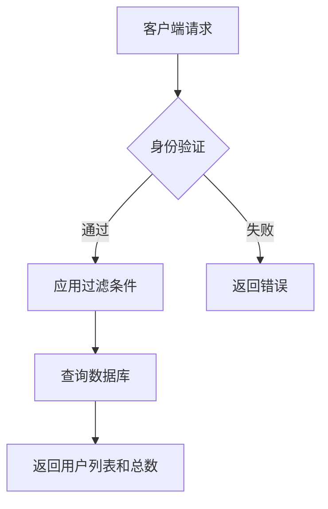
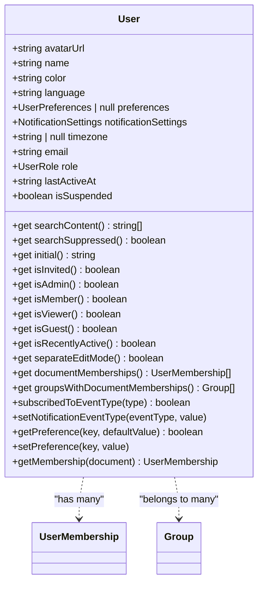
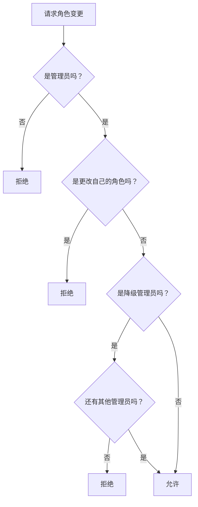

# 用户管理

<cite>
**Referenced Files in This Document**   
- [users.ts](file://server/routes/api/users/users.ts)
- [User.ts](file://app/models/User.ts)
- [User.ts](file://server/models/User.ts)
</cite>

## 目录
1. [简介](#简介)
2. [用户管理API端点](#用户管理api端点)
3. [用户数据模型](#用户数据模型)
4. [用户状态管理](#用户状态管理)
5. [角色权限控制](#角色权限控制)
6. [JWT令牌生成机制](#jwt令牌生成机制)
7. [用户活跃度跟踪与会话管理](#用户活跃度跟踪与会话管理)
8. [安全策略](#安全策略)
9. [使用示例](#使用示例)

## 简介
本文档详细介绍了用户管理系统的API设计、数据结构、状态管理、权限控制和安全机制。系统通过RESTful API提供用户创建、更新、删除和查询等操作，结合前端和后端的User模型定义了完整的用户数据结构。文档重点阐述了用户状态管理（如isSuspended、isInvited）、角色权限控制（Admin/Member/Viewer/Guest）、JWT令牌生成机制、用户活跃度跟踪、登录会话管理和安全策略等核心功能。

**Section sources**
- [users.ts](file://server/routes/api/users/users.ts#L1-L703)
- [User.ts](file://app/models/User.ts#L1-L249)
- [User.ts](file://server/models/User.ts#L1-L860)

## 用户管理API端点
用户管理API提供了丰富的端点来处理用户相关的操作，包括用户列表查询、用户信息获取、用户更新、角色变更、用户邀请、用户删除等。这些端点通过Koa路由进行定义，并使用身份验证和事务处理来确保安全性和数据一致性。

### 用户列表查询
`users.list`端点允许获取用户列表，支持多种过滤和排序选项。可以通过角色、状态（如邀请、激活、暂停）、ID列表、邮箱列表等条件进行过滤，并支持分页。



**Diagram sources**
- [users.ts](file://server/routes/api/users/users.ts#L35-L105)

### 用户信息获取
`users.info`端点用于获取特定用户的信息。如果未指定用户ID，则返回当前认证用户的信息。该端点确保用户只能访问其有权限查看的信息。

**Section sources**
- [users.ts](file://server/routes/api/users/users.ts#L107-L125)

### 用户更新
`users.update`端点允许更新用户的基本信息，如姓名、头像URL、语言、偏好设置和时区。该操作需要身份验证，并在事务中执行以确保数据一致性。

**Section sources**
- [users.ts](file://server/routes/api/users/users.ts#L207-L245)

### 角色变更
`users.update_role`端点用于更改用户的角色。该操作仅限管理员执行，并在事务中进行，以确保在角色变更时正确更新相关的权限。

**Section sources**
- [users.ts](file://server/routes/api/users/users.ts#L285-L352)

### 用户邀请
`users.invite`端点允许邀请新用户加入团队。该操作需要身份验证，并在事务中执行。系统会发送邀请邮件，并限制每次邀请的用户数量。

**Section sources**
- [users.ts](file://server/routes/api/users/users.ts#L398-L437)

### 用户删除
`users.delete`端点用于删除用户。对于删除自己的账户，需要提供确认码以防止CSRF攻击。该操作在事务中执行，并确保不会删除团队中的最后一个用户或唯一的管理员。

**Section sources**
- [users.ts](file://server/routes/api/users/users/users.ts#L518-L568)

## 用户数据模型
用户数据模型在前端和后端都有定义，确保了数据结构的一致性。模型包含了用户的基本信息、状态、权限和各种辅助属性。

### 前端用户模型
前端的User模型定义了用户在客户端的状态和行为。它继承自ParanoidModel并实现了Searchable接口。



**Diagram sources**
- [User.ts](file://app/models/User.ts#L22-L245)

### 后端用户模型
后端的User模型使用Sequelize进行数据库映射，包含了更多的数据库特定属性和方法。

```mermaid
classDiagram
class User {
+string | null email
+string name
+UserRole role
+string jwtSecret
+Date | null lastActiveAt
+string | null lastActiveIp
+Date | null lastSignedInAt
+string | null lastSignedInIp
+Date | null lastSigninEmailSentAt
+Date | null suspendedAt
+{[key in UserFlag]? : number} | null flags
+UserPreferences | null preferences
+NotificationSettings notificationSettings
+string | null language
+string | null timezone
+string | null avatarUrl
+User | null suspendedBy
+string | null suspendedById
+User | null invitedBy
+string | null invitedById
+Team team
+string teamId
+UserAuthentication[] authentications
+get isSuspended() boolean
+get isInvited() boolean
+get isAdmin() boolean
+get isMember() boolean
+get isViewer() boolean
+get isGuest() boolean
+get color() string
+get defaultCollectionPermission() CollectionPermission
+get defaultDocumentPermission() DocumentPermission
+get deleteConfirmationCode() string
+setNotificationEventType(type, value)
+subscribedToEventType(type) boolean
+setFlag(flag, value)
+getFlag(flag) number
+incrementFlag(flag, value)
+setPreference(preference, value)
+getPreference(preference) boolean
+groups(options) Promise~Group[]~
+groupIds(options) Promise~string[]~
+collectionIds(options) Promise~string[]~
+updateActiveAt(ctx, force)
+updateSignedIn(ctx)
+rotateJwtSecret(options)
+getJwtToken(expiresAt)
+getCollaborationToken()
+getTransferToken()
+getEmailSigninToken(ctx)
+getEmailVerificationCode()
+getEmailUpdateToken(email)
+availableTeams()
}
User ..> UserAuthentication : "has many"
User ..> Team : "belongs to"
User ..> User : "suspended by"
User ..> User : "invited by"
```

**Diagram sources**
- [User.ts](file://server/models/User.ts#L81-L856)

## 用户状态管理
用户状态管理是系统的核心功能之一，通过多个属性和方法来跟踪和控制用户的状态。

### 用户状态属性
- `isSuspended`: 表示用户是否被暂停。如果用户或其团队被暂停，则返回true。
- `isInvited`: 表示用户是否已被邀请但尚未登录。如果lastActiveAt为空，则返回true。
- `lastActiveAt`: 记录用户最后活跃的时间，用于判断用户是否最近活跃。
- `suspendedAt`: 记录用户被暂停的时间。

### 状态管理方法
- `updateActiveAt(ctx, force)`: 更新用户的最后活跃时间和IP地址。为了减少数据库写入，只有在距离上次更新超过5分钟时才会更新。
- `updateSignedIn(ctx)`: 更新用户的最后登录时间和IP地址。
- `rotateJwtSecret(options)`: 旋转用户的JWT密钥，使所有先前的令牌失效。

**Section sources**
- [User.ts](file://server/models/User.ts#L200-L235)

## 角色权限控制
系统实现了基于角色的权限控制（RBAC），定义了四种用户角色：Admin、Member、Viewer和Guest。

### 角色定义
- **Admin**: 管理员，拥有最高权限，可以管理用户、团队和所有内容。
- **Member**: 成员（编辑者），可以创建和编辑内容。
- **Viewer**: 查看者，只能查看内容，不能编辑。
- **Guest**: 访客，权限最低，通常用于临时访问。

### 权限检查
系统通过`can`和`authorize`函数进行权限检查。例如，在更新用户角色时，会检查当前用户是否有权限进行该操作。



**Diagram sources**
- [users.ts](file://server/routes/api/users/users.ts#L285-L352)

## JWT令牌生成机制
系统使用JWT（JSON Web Tokens）进行身份验证和会话管理。用户的JWT密钥存储在数据库中，并用于生成各种类型的令牌。

### 令牌类型
- **会话令牌 (session)**: 用于API请求，存储在客户端浏览器的cookies中。
- **协作令牌 (collaboration)**: 用于协作请求，存储在客户端内存中。
- **转移令牌 (transfer)**: 用于在子域名或域名之间转移会话，有效期很短，只能使用一次。
- **邮箱登录令牌 (email-signin)**: 用于通过邮箱登录，只能使用一次，有中等长度的有效期。
- **邮箱更新令牌 (email-update)**: 用于更新用户的邮箱地址。

### 令牌生成方法
- `getJwtToken(expiresAt)`: 生成会话令牌。
- `getCollaborationToken()`: 生成协作令牌。
- `getTransferToken()`: 生成转移令牌。
- `getEmailSigninToken(ctx)`: 生成邮箱登录令牌。
- `getEmailUpdateToken(email)`: 生成邮箱更新令牌。

**Section sources**
- [User.ts](file://server/models/User.ts#L530-L590)

## 用户活跃度跟踪与会话管理
系统通过多种机制跟踪用户的活跃度和管理会话。

### 活跃度跟踪
- `updateActiveAt(ctx, force)`: 更新用户的最后活跃时间。系统会根据用户使用的客户端（桌面应用、桌面网页、移动网页）设置相应的标志。
- `isRecentlyActive`: 判断用户是否在最近5分钟内活跃。

### 会话管理
- `updateSignedIn(ctx)`: 更新用户的最后登录时间和IP地址。
- `rotateJwtSecret(options)`: 旋转JWT密钥，使所有先前的会话失效。这在用户请求注销所有设备时非常有用。

**Section sources**
- [User.ts](file://server/models/User.ts#L200-L235)

## 安全策略
系统实施了多种安全策略来保护用户数据和防止滥用。

### 数据保护
- `jwtSecret`: 存储在数据库中的BLOB字段中，并使用@Encrypted装饰器进行加密。
- `removeIdentifyingInfo`: 在删除用户时，移除其识别信息（如邮箱、姓名、头像等），以保护隐私。

### 防止滥用
- `rateLimiter`: 对某些敏感操作（如更新邮箱、请求删除账户）进行速率限制。
- `checkLastUser`: 确保不会删除团队中的最后一个用户。
- `checkLastAdmin`: 确保不会删除唯一的管理员。

### 邮箱验证
- `getEmailVerificationCode()`: 生成6位验证码并存储在Redis中，有效期为10分钟。

**Section sources**
- [User.ts](file://server/models/User.ts#L650-L750)

## 使用示例
以下是一些常见的使用示例：

### 获取当前用户信息
```javascript
// GET /api/users.info
{
  "id": "current"
}
```

### 更新用户偏好
```javascript
// POST /api/users.update
{
  "preferences": {
    "seamlessEdit": false
  }
}
```

### 更改用户角色
```javascript
// POST /api/users.update_role
{
  "id": "user-123",
  "role": "viewer"
}
```

### 邀请新用户
```javascript
// POST /api/users.invite
{
  "invites": [
    {
      "email": "newuser@example.com",
      "name": "New User"
    }
  ]
}
```

**Section sources**
- [users.ts](file://server/routes/api/users/users.ts#L1-L703)