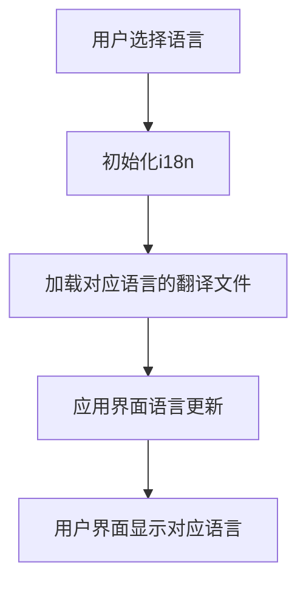
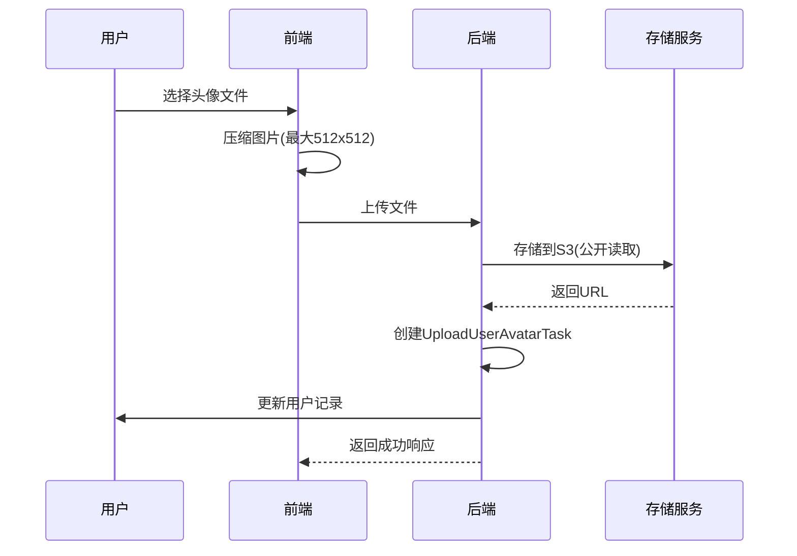
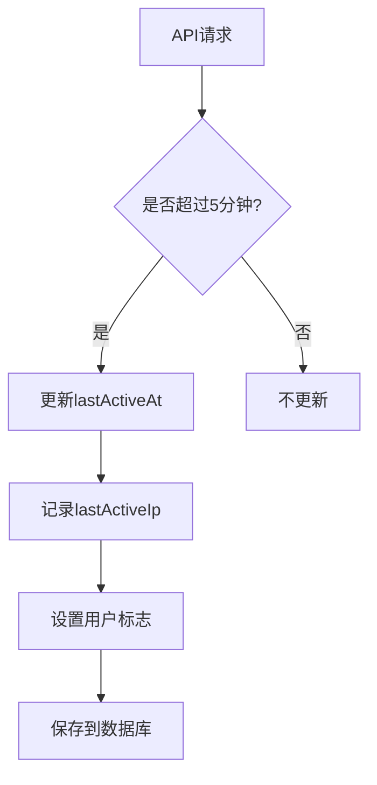
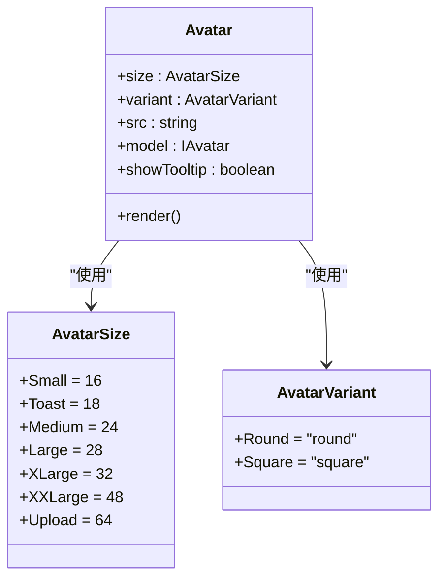

# 用户资料

<cite>
**本文档引用的文件**   
- [users.ts](file://server/routes/api/users/users.ts)
- [User.ts](file://app/models/User.ts)
- [User.ts](file://server/models/User.ts)
- [ImageInput.tsx](file://app/scenes/Settings/components/ImageInput.tsx)
- [ImageUpload.tsx](file://app/scenes/Settings/components/ImageUpload.tsx)
- [UploadUserAvatarTask.ts](file://server/queues/tasks/UploadUserAvatarTask.ts)
- [i18n.ts](file://app/utils/i18n.ts)
</cite>

## 目录
1. [简介](#简介)
2. [核心数据结构](#核心数据结构)
3. [用户资料读取与更新](#用户资料读取与更新)
4. [用户偏好设置](#用户偏好设置)
5. [多语言支持](#多语言支持)
6. [头像上传处理](#头像上传处理)
7. [用户活跃度跟踪](#用户活跃度跟踪)
8. [前端组件集成](#前端组件集成)

## 简介
本文档详细说明了用户资料管理系统的实现，涵盖用户姓名、头像、语言、时区和偏好设置的读取与更新操作。文档重点分析了用户资料模型、API端点、偏好设置机制以及相关功能的实现细节。

## 核心数据结构

用户资料的核心数据结构定义在`User`模型中，包含用户的基本信息、偏好设置和系统状态。主要字段包括：

- **name**: 用户姓名，字符串类型，必填字段，最大长度受`UserValidation.maxNameLength`限制。
- **avatarUrl**: 头像URL，字符串类型，可为空，最大长度4096字符。
- **language**: 用户界面语言，字符串类型，枚举值来自`@shared/i18n`中的`languages`，默认值为`env.DEFAULT_LANGUAGE`。
- **timezone**: 用户时区，字符串类型，可为空。
- **preferences**: 用户偏好设置，JSONB类型，存储用户自定义的界面和行为偏好。
- **lastActiveAt**: 用户最后活跃时间，日期类型，用于跟踪用户在线状态。
- **email**: 用户邮箱，字符串类型，必填且唯一。
- **role**: 用户角色，枚举类型，包括Admin、Member、Viewer、Guest。

**Section sources**
- [User.ts](file://app/models/User.ts#L22-L245)
- [User.ts](file://server/models/User.ts#L81-L856)

## 用户资料读取与更新

用户资料的读取与更新通过API端点`/api/users.info`和`/api/users.update`实现。

### 读取用户资料
`users.info`端点用于获取用户资料信息。该端点需要用户认证，可以获取指定用户或当前认证用户的信息。响应包含用户的基本信息和权限策略。

**请求参数：**
- `id` (可选): 要查询的用户ID，如果未提供则返回当前用户信息。

**响应格式：**
```json
{
  "data": {
    "id": "string",
    "name": "string",
    "email": "string",
    "avatarUrl": "string",
    "language": "string",
    "timezone": "string",
    "preferences": {
      "rememberLastPath": "boolean",
      "useCursorPointer": "boolean"
    },
    "lastActiveAt": "string",
    "role": "string",
    "isSuspended": "boolean"
  },
  "policies": {
    "users.info": "boolean",
    "users.update": "boolean"
  }
}
```

### 更新用户资料
`users.update`端点用于更新用户资料信息。该端点需要用户认证，并验证用户是否有权限更新指定用户的信息。

**请求参数：**
- `id` (可选): 要更新的用户ID，如果未提供则更新当前用户。
- `name` (可选): 新的用户姓名。
- `avatarUrl` (可选): 新的头像URL。
- `language` (可选): 新的语言设置。
- `preferences` (可选): 新的偏好设置对象。
- `timezone` (可选): 新的时区设置。

**验证规则：**
- 用户必须有`update`权限才能修改用户资料。
- 邮箱域名必须在团队允许的域名列表中。
- 新邮箱地址不能与团队中其他用户冲突。
- 所有更新操作都在数据库事务中执行，确保数据一致性。

**Section sources**
- [users.ts](file://server/routes/api/users/users.ts#L35-L179)

## 用户偏好设置

用户偏好设置（UserPreference）是存储用户个性化配置的核心机制，影响应用的界面显示和行为模式。

### 存储机制
用户偏好设置存储在数据库的`preferences`字段中，类型为JSONB。该字段存储一个键值对对象，其中键是`UserPreference`枚举值，值是布尔类型。

```typescript
export enum UserPreference {
  RememberLastPath = "rememberLastPath",
  UseCursorPointer = "useCursorPointer",
  CodeBlockLineNumers = "codeBlockLineNumbers",
  SeamlessEdit = "seamlessEdit",
  FullWidthDocuments = "fullWidthDocuments",
  SortCommentsByOrderInDocument = "sortCommentsByOrderInDocument",
  EnableSmartText = "enableSmartText",
}
```

### 可配置选项
用户偏好设置包含以下可配置选项：

- **RememberLastPath**: 重新打开应用时是否重定向到上次查看的文档。
- **UseCursorPointer**: 是否在交互元素上使用web风格的手型指针。
- **CodeBlockLineNumbers**: 代码块是否显示行号。
- **SeamlessEdit**: 文档是否使用无缝编辑模式（始终可编辑）而非分离的编辑模式。
- **FullWidthDocuments**: 文档是否以全宽模式开始。
- **SortCommentsByOrderInDocument**: 是否按文档中的顺序对评论进行排序。
- **EnableSmartText**: 是否启用智能文本替换功能。

### 对应用行为的影响
用户偏好设置直接影响应用的用户体验：

- `UseCursorPointer`偏好影响全局光标样式，当设置为`true`时，所有交互元素都会显示手型指针。
- `SeamlessEdit`偏好决定文档的编辑模式，该设置可以被团队级别的`SeamlessEdit`偏好覆盖。
- `RememberLastPath`偏好影响应用启动时的导航行为，帮助用户快速回到上次工作位置。

**Section sources**
- [User.ts](file://app/models/User.ts#L221-L238)
- [User.ts](file://server/models/User.ts#L381-L427)

## 多语言支持

系统通过i18n机制实现多语言支持，允许用户选择界面显示语言。

### 实现细节
多语言支持通过`i18next`库实现，具体实现位于`app/utils/i18n.ts`文件中。



**Diagram sources**
- [i18n.ts](file://app/utils/i18n.ts#L1-L47)

关键实现细节包括：
- 使用`initI18n`函数初始化i18n库，加载所有可用的翻译文件。
- 支持的语言列表来自`@shared/i18n`中的`languages`常量。
- 翻译文件通过API后端动态加载，路径为`/locales/{locale}.json`。
- 语言代码在CLDR格式和BCP47格式之间进行转换以确保兼容性。

### 语言切换流程
1. 用户在设置界面选择新的语言。
2. 前端调用`user.save()`方法更新用户的`language`字段。
3. 服务器验证并保存新的语言设置。
4. 前端重新初始化i18n库，加载新的语言包。
5. 界面所有文本更新为新语言。

**Section sources**
- [i18n.ts](file://app/utils/i18n.ts#L1-L47)
- [Preferences.tsx](file://app/scenes/Settings/Preferences.tsx#L79-L83)

## 头像上传处理

头像上传处理涉及前端用户界面、文件上传和后端异步处理三个主要部分。

### 处理流程


**Diagram sources**
- [ImageUpload.tsx](file://app/scenes/Settings/components/ImageUpload.tsx#L35-L74)
- [UploadUserAvatarTask.ts](file://server/queues/tasks/UploadUserAvatarTask.ts#L1-L40)

### 前端实现
前端头像上传功能由`ImageInput`和`ImageUpload`组件实现：

- **ImageInput**: 显示当前头像和编辑按钮，提供移除头像的功能。
- **ImageUpload**: 处理文件拖拽上传，调用`react-dropzone`库。
- **AvatarEditorDialog**: 提供头像裁剪界面，允许用户调整缩放比例。

上传流程：
1. 用户选择或拖拽图片文件。
2. 图片被压缩到最大512x512像素。
3. 压缩后的图片上传到服务器。
4. 服务器返回附件URL，更新用户头像。

### 后端实现
后端通过`UploadUserAvatarTask`异步任务处理头像上传：

- 任务从SSO提供商获取原始头像URL。
- 使用`FileStorage.storeFromUrl`将图片存储到S3。
- 更新用户记录中的`avatarUrl`字段。
- 任务支持3次重试，确保上传可靠性。

**Section sources**
- [ImageInput.tsx](file://app/scenes/Settings/components/ImageInput.tsx#L1-L77)
- [ImageUpload.tsx](file://app/scenes/Settings/components/ImageUpload.tsx#L1-L217)
- [UploadUserAvatarTask.ts](file://server/queues/tasks/UploadUserAvatarTask.ts#L1-L40)

## 用户活跃度跟踪

系统通过`lastActiveAt`字段跟踪用户活跃度，用于显示用户在线状态和最近活动时间。

### 实现机制
用户活跃度跟踪在`User`模型的`updateActiveAt`方法中实现：



**Diagram sources**
- [User.ts](file://server/models/User.ts#L473-L519)

关键实现细节：
- 仅当距离上次更新超过5分钟时才更新`lastActiveAt`，避免频繁数据库写入。
- 记录用户的IP地址到`lastActiveIp`字段。
- 根据用户代理设置用户标志（UserFlag），区分桌面应用、桌面网页和移动网页用户。
- 更新操作仅在有变化时才执行数据库写入，提高性能。

### 活跃状态判断
系统通过`isRecentlyActive`计算属性判断用户是否最近活跃：

```typescript
@computed
get isRecentlyActive(): boolean {
  return new Date(this.lastActiveAt) > subMinutes(now(10000), 5);
}
```

用户状态分为：
- **在线**: 最近5分钟内有活动。
- **离线**: 超过5分钟无活动。
- **从未登录**: `lastActiveAt`为空。

**Section sources**
- [User.ts](file://server/models/User.ts#L473-L519)
- [User.ts](file://app/models/User.ts#L132-L140)

## 前端组件集成

前端通过一系列组件实现用户资料管理功能，主要组件包括`Avatar`、`ImageInput`和`ImageUpload`。

### Avatar组件
`Avatar`组件用于显示用户头像，支持多种尺寸和变体：



**Diagram sources**
- [Avatar.tsx](file://app/components/Avatar/Avatar.tsx#L1-L110)

### 设置界面集成
用户资料设置界面通过`Preferences`场景组件实现，提供直观的偏好设置界面：

- 语言选择：下拉菜单选择界面语言。
- 外观设置：选择浅色、深色或系统主题。
- 行为偏好：开关控件管理各种行为偏好。
- 危险操作：删除账户等敏感操作有明确警告。

组件通过MobX状态管理，实时响应用户操作并保存到服务器。

**Section sources**
- [Avatar.tsx](file://app/components/Avatar/Avatar.tsx#L1-L110)
- [Preferences.tsx](file://app/scenes/Settings/Preferences.tsx#L21-L266)