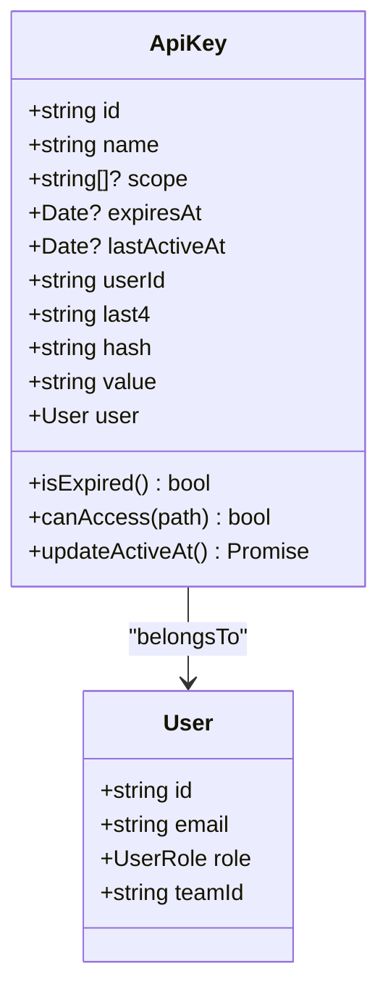
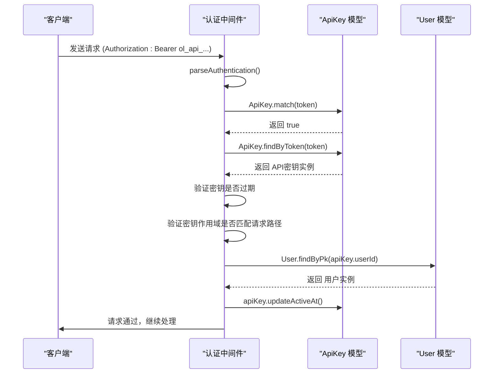

# API密钥认证

<cite>
**本文档中引用的文件**  
- [apiKeys.ts](file://server/routes/api/apiKeys/apiKeys.ts)
- [ApiKey.ts](file://server/models/ApiKey.ts)
- [authentication.ts](file://server/middlewares/authentication.ts)
- [apiKey.ts](file://server/presenters/apiKey.ts)
- [ApiKey.ts](file://app/models/ApiKey.ts)
</cite>

## 目录
1. [简介](#简介)
2. [API密钥模型](#api密钥模型)
3. [核心端点](#核心端点)
4. [认证与授权](#认证与授权)
5. [作用域（Scopes）管理](#作用域（scopes）管理)
6. [密钥哈希与安全存储](#密钥哈希与安全存储)
7. [过期与使用策略](#过期与使用策略)
8. [开发者使用示例](#开发者使用示例)
9. [最佳实践与故障排除](#最佳实践与故障排除)

## 简介
API密钥是baozi项目中用于程序化访问和控制工作区数据的核心认证机制。它允许用户通过API进行自动化操作，如文档管理、数据同步和集成开发。本指南详细介绍了API密钥的创建、管理和使用流程，涵盖了从密钥生成到权限控制的各个方面。API密钥通过安全的哈希存储和作用域限制来确保系统的安全性，同时提供了过期和最后使用时间等管理功能。

## API密钥模型
API密钥模型定义了密钥的核心属性和行为，包括名称、作用域、过期时间以及使用状态。



**Diagram sources**
- [ApiKey.ts](file://server/models/ApiKey.ts#L26-L182)
- [User.ts](file://server/models/User.ts#L81-L856)

**Section sources**
- [ApiKey.ts](file://server/models/ApiKey.ts#L26-L182)
- [ApiKey.ts](file://app/models/ApiKey.ts#L7-L55)

## 核心端点
API密钥系统提供了三个核心REST端点，用于密钥的全生命周期管理。

### 创建API密钥 (POST /api.apiKeys.create)
此端点用于为当前用户创建一个新的API密钥。

**HTTP方法**: `POST`  
**权限**: 成员角色 (UserRole.Member)  
**认证类型**: APP

**请求体 (Request Body)**:
```json
{
  "name": "My New Key",
  "scope": ["documents.read", "collections.write"],
  "expiresAt": "2025-12-31T23:59:59Z"
}
```

**成功响应 (200 OK)**:
```json
{
  "data": {
    "id": "ak_123",
    "name": "My New Key",
    "scope": ["documents.read", "collections.write"],
    "value": "ol_api_abc123...", // 仅在创建时返回
    "last4": "1234",
    "createdAt": "2024-01-01T00:00:00Z",
    "expiresAt": "2025-12-31T23:59:59Z",
    "lastActiveAt": null
  }
}
```

**Section sources**
- [apiKeys.ts](file://server/routes/api/apiKeys/apiKeys.ts#L23-L45)

### 列出API密钥 (POST /api.apiKeys.list)
此端点用于列出API密钥，支持分页和用户过滤。

**HTTP方法**: `POST`  
**权限**: 成员角色 (UserRole.Member)  
**认证类型**: 无特定要求

**请求体 (Request Body)**:
```json
{
  "userId": "user_123", // 可选，仅管理员可列出其他用户的密钥
  "limit": 10,
  "offset": 0
}
```

**成功响应 (200 OK)**:
```json
{
  "pagination": {
    "limit": 10,
    "offset": 0,
    "total": 1
  },
  "data": [
    {
      "id": "ak_123",
      "name": "My Key",
      "scope": [],
      "last4": "1234",
      "createdAt": "2024-01-01T00:00:00Z"
    }
  ]
}
```

**Section sources**
- [apiKeys.ts](file://server/routes/api/apiKeys/apiKeys.ts#L53-L96)

### 删除API密钥 (POST /api.apiKeys.delete)
此端点用于撤销（删除）一个现有的API密钥。

**HTTP方法**: `POST`  
**权限**: 成员角色 (UserRole.Member)  
**认证类型**: APP

**请求体 (Request Body)**:
```json
{
  "id": "ak_123"
}
```

**成功响应 (200 OK)**:
```json
{
  "success": true
}
```

**Section sources**
- [apiKeys.ts](file://server/routes/api/apiKeys/apiKeys.ts#L107-L126)

## 认证与授权
API密钥的认证流程由中间件 `authentication.ts` 统一处理，确保所有API请求的安全性。



**Diagram sources**
- [authentication.ts](file://server/middlewares/authentication.ts#L144-L278)
- [ApiKey.ts](file://server/models/ApiKey.ts#L128-L131)

**Section sources**
- [authentication.ts](file://server/middlewares/authentication.ts#L144-L278)

## 作用域（Scopes）管理
作用域（Scopes）是API密钥权限控制的核心机制，它定义了密钥可以访问的API路径。

- **空作用域**: 如果API密钥的作用域为空或未定义，则该密钥拥有对所有API的完全访问权限。
- **作用域格式**: 作用域通常以 `/api/` 为前缀，例如 `documents.read` 会被自动转换为 `/api/documents.read`。
- **路径匹配**: 在 `authentication.ts` 中，`canAccess` 方法会检查请求的URL路径是否在密钥的作用域内。

**Section sources**
- [ApiKey.ts](file://server/models/ApiKey.ts#L172-L178)
- [authentication.ts](file://server/middlewares/authentication.ts#L250-L255)

## 密钥哈希与安全存储
为了确保API密钥的安全性，系统采用哈希存储机制，避免明文存储。

- **生成流程**: 当创建一个新的API密钥时，系统会生成一个以 `ol_api_` 为前缀的38位随机字符串。
- **哈希存储**: 该明文密钥（`value`）会立即通过 `hash()` 函数进行哈希处理，哈希值（`hash`）被存储在数据库中，而明文值仅在创建时短暂存在于内存中。
- **历史兼容**: 旧的密钥可能使用 `secret` 字段，但新系统已迁移到 `hash` 字段，确保了向后兼容性。

**Section sources**
- [ApiKey.ts](file://server/models/ApiKey.ts#L94-L102)
- [crypto.ts](file://server/utils/crypto.ts#L26-L28)

## 过期与使用策略
API密钥支持灵活的生命周期管理，包括过期和使用追踪。

- **过期时间 (expiresAt)**: 可选字段，定义了密钥的失效时间。认证中间件会检查此时间，过期的密钥将被拒绝。
- **最后使用时间 (lastActiveAt)**: 该字段记录密钥最后一次被成功使用的时间。为了减少数据库写入，系统设置了5分钟的更新间隔，即只有在距离上次更新超过5分钟后，才会更新此时间戳。
- **自动清理**: 系统可能包含后台任务（如 `ApiKeyCleanupProcessor`）来定期清理已过期的密钥。

**Section sources**
- [ApiKey.ts](file://server/models/ApiKey.ts#L140-L146)
- [authentication.ts](file://server/middlewares/authentication.ts#L245-L247)

## 开发者使用示例
以下是如何使用API密钥进行认证的代码示例。

### 使用 curl
```bash
curl -X POST https://api.baozi.com/documents.create \
  -H "Authorization: Bearer ol_api_abc123..." \
  -H "Content-Type: application/json" \
  -d '{
    "title": "New Document",
    "text": "Hello World"
  }'
```

### 使用 JavaScript 客户端
```javascript
const apiKey = 'ol_api_abc123...';
const response = await fetch('https://api.baozi.com/documents.create', {
  method: 'POST',
  headers: {
    'Authorization': `Bearer ${apiKey}`,
    'Content-Type': 'application/json',
  },
  body: JSON.stringify({
    title: 'New Document',
    text: 'Hello World'
  })
});
```

## 最佳实践与故障排除
### 安全最佳实践
- **妥善保管**: API密钥应被视为密码，切勿在客户端代码、版本控制系统或日志中暴露。
- **最小权限**: 为每个应用创建具有最小必要作用域的密钥。
- **设置过期**: 对于临时或测试用途的密钥，务必设置合理的过期时间。

### 常见问题
- **401 Unauthorized**: 检查 `Authorization` 头是否正确，密钥是否已过期或被撤销。
- **403 Forbidden**: 检查密钥的作用域是否包含请求的API路径。
- **密钥未返回明文**: 明文密钥 (`value`) 仅在创建API密钥时返回一次，之后无法再次获取。如果丢失，需要创建新密钥。

**Section sources**
- [apiKeys.ts](file://server/routes/api/apiKeys/apiKeys.ts)
- [authentication.ts](file://server/middlewares/authentication.ts)