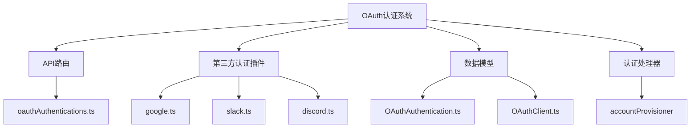
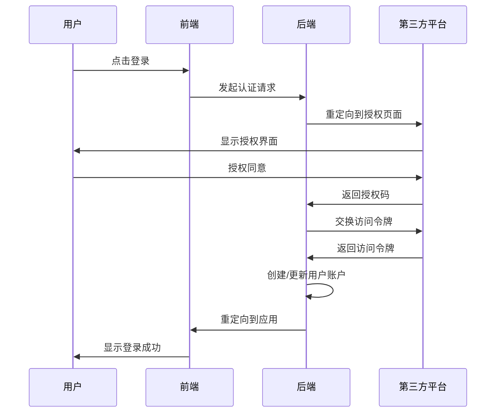
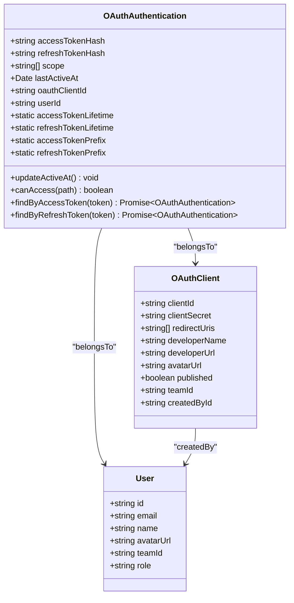
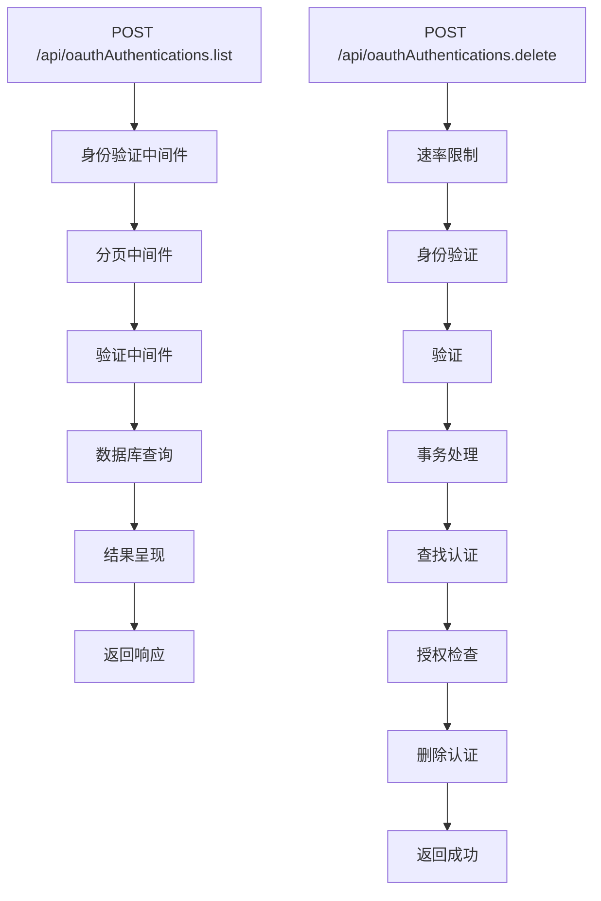
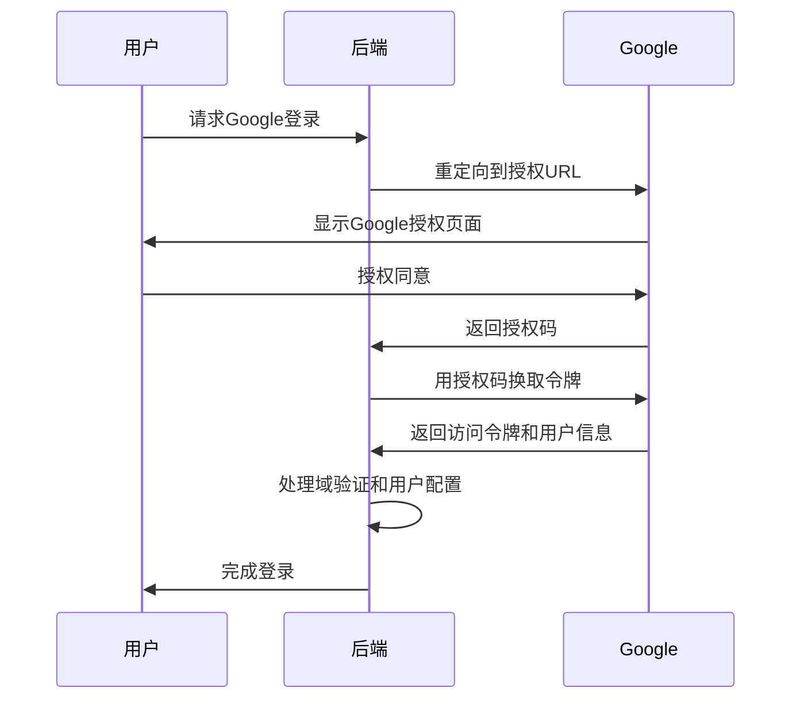
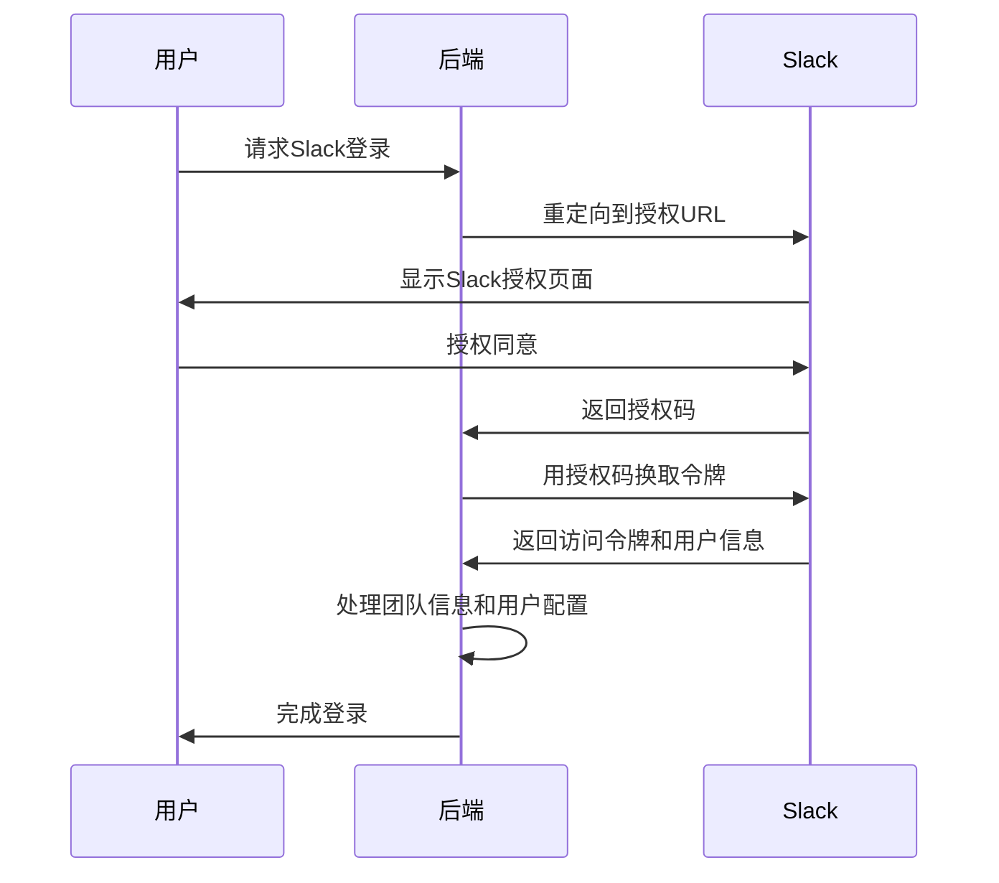
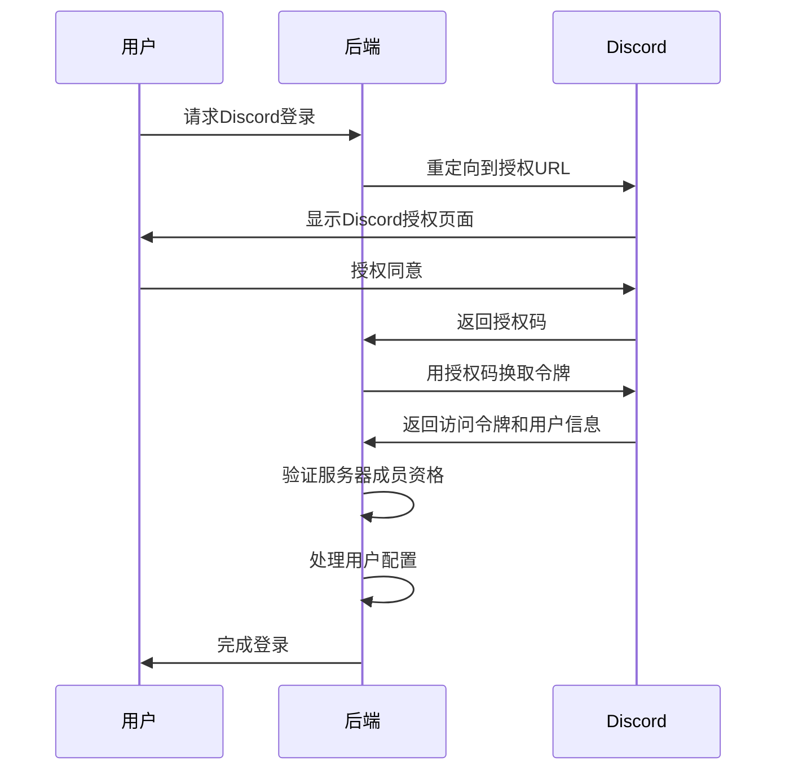
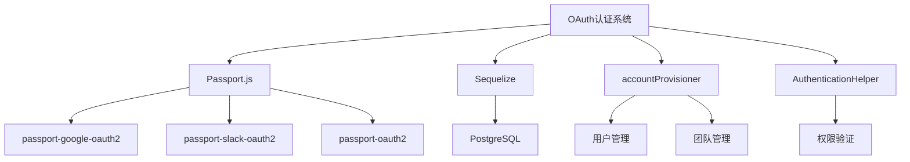

# OAuth认证

<cite>
**本文档引用的文件**  
- [oauthAuthentications.ts](file://server/routes/api/oauthAuthentications/oauthAuthentications.ts)
- [google.ts](file://plugins/google/server/auth/google.ts)
- [slack.ts](file://plugins/slack/server/auth/slack.ts)
- [discord.ts](file://plugins/discord/server/auth/discord.ts)
- [OAuthAuthentication.ts](file://server/models/oauth/OAuthAuthentication.ts)
- [OAuthClient.ts](file://server/models/oauth/OAuthClient.ts)
- [presentOAuthAuthentication.ts](file://server/presenters/oauthAuthentication.ts)
- [schema.ts](file://server/routes/api/oauthAuthentications/schema.ts)
</cite>

## 目录
1. [简介](#简介)
2. [项目结构](#项目结构)
3. [核心组件](#核心组件)
4. [架构概述](#架构概述)
5. [详细组件分析](#详细组件分析)
6. [依赖分析](#依赖分析)
7. [性能考虑](#性能考虑)
8. [故障排除指南](#故障排除指南)
9. [结论](#结论)

## 简介
baozi项目实现了基于OAuth 2.0协议的第三方认证集成，支持Google、Slack、Discord等多个平台的登录功能。该系统通过标准化的OAuth流程处理用户身份验证、令牌交换和用户信息获取，为开发者提供了安全可靠的认证机制。文档将深入解析认证流程的各个阶段，包括授权、回调处理、用户账户关联等关键环节。

## 项目结构
项目采用模块化设计，OAuth相关功能分布在多个目录中。核心认证逻辑位于`server/routes/oauth`目录，各第三方平台的认证实现位于`plugins`目录下的对应插件中。数据模型定义在`server/models/oauth`目录，API路由和验证规则在`server/routes/api/oauthAuthentications`中定义。

**Diagram sources**
- [oauthAuthentications.ts](file://server/routes/api/oauthAuthentications/oauthAuthentications.ts)
- [google.ts](file://plugins/google/server/auth/google.ts)
- [slack.ts](file://plugins/slack/server/auth/slack.ts)
- [discord.ts](file://plugins/discord/server/auth/discord.ts)
- [OAuthAuthentication.ts](file://server/models/oauth/OAuthAuthentication.ts)
- [OAuthClient.ts](file://server/models/oauth/OAuthClient.ts)

**Section sources**
- [oauthAuthentications.ts](file://server/routes/api/oauthAuthentications/oauthAuthentications.ts)
- [google.ts](file://plugins/google/server/auth/google.ts)
- [slack.ts](file://plugins/slack/server/auth/slack.ts)
- [discord.ts](file://plugins/discord/server/auth/discord.ts)

## 核心组件
系统的核心组件包括OAuth认证模型、认证路由处理器和第三方认证策略。`OAuthAuthentication`模型负责存储用户的认证信息，包括访问令牌、刷新令牌和作用域等。API路由处理器处理认证列表和删除操作，而各第三方认证策略实现了特定平台的OAuth流程。

**Section sources**
- [OAuthAuthentication.ts](file://server/models/oauth/OAuthAuthentication.ts)
- [oauthAuthentications.ts](file://server/routes/api/oauthAuthentications/oauthAuthentications.ts)
- [google.ts](file://plugins/google/server/auth/google.ts)

## 架构概述
系统采用分层架构，前端通过API与后端交互，后端使用Passport.js框架处理OAuth认证流程。认证成功后，系统通过accountProvisioner命令创建或更新用户账户，并建立用户与认证提供者的关联。

**Diagram sources**
- [google.ts](file://plugins/google/server/auth/google.ts)
- [slack.ts](file://plugins/slack/server/auth/slack.ts)
- [discord.ts](file://plugins/discord/server/auth/discord.ts)
- [accountProvisioner.ts](file://server/commands/accountProvisioner.ts)

## 详细组件分析

### OAuth认证模型分析
`OAuthAuthentication`模型是系统的核心数据结构，负责存储用户的第三方认证信息。模型包含访问令牌哈希、刷新令牌哈希、作用域列表和最后活动时间等字段。

**Diagram sources**
- [OAuthAuthentication.ts](file://server/models/oauth/OAuthAuthentication.ts)
- [OAuthClient.ts](file://server/models/oauth/OAuthClient.ts)
- [User.ts](file://server/models/User.ts)

**Section sources**
- [OAuthAuthentication.ts](file://server/models/oauth/OAuthAuthentication.ts)
- [OAuthClient.ts](file://server/models/oauth/OAuthClient.ts)

### 认证路由分析
API路由处理器提供了两个主要端点：获取认证列表和删除认证。这些端点使用Koa框架的中间件进行身份验证、速率限制和事务处理。

**Diagram sources**
- [oauthAuthentications.ts](file://server/routes/api/oauthAuthentications/oauthAuthentications.ts)
- [schema.ts](file://server/routes/api/oauthAuthentications/schema.ts)

**Section sources**
- [oauthAuthentications.ts](file://server/routes/api/oauthAuthentications/oauthAuthentications.ts)
- [schema.ts](file://server/routes/api/oauthAuthentications/schema.ts)

### 第三方认证策略分析
各第三方平台的认证策略实现了统一的OAuth流程，但针对各平台的特性进行了定制化处理。Google认证需要处理Gmail账户和Google Workspace域的区分，Slack认证支持团队集成，Discord认证支持服务器成员资格验证。

#### Google认证流程

**Diagram sources**
- [google.ts](file://plugins/google/server/auth/google.ts)

#### Slack认证流程

**Diagram sources**
- [slack.ts](file://plugins/slack/server/auth/slack.ts)

#### Discord认证流程

**Diagram sources**
- [discord.ts](file://plugins/discord/server/auth/discord.ts)

**Section sources**
- [google.ts](file://plugins/google/server/auth/google.ts)
- [slack.ts](file://plugins/slack/server/auth/slack.ts)
- [discord.ts](file://plugins/discord/server/auth/discord.ts)

## 依赖分析
系统依赖于多个外部库和内部模块。主要依赖包括Passport.js用于OAuth认证处理，Sequelize用于数据库操作，以及各第三方平台的官方OAuth库。

**Diagram sources**
- [google.ts](file://plugins/google/server/auth/google.ts)
- [slack.ts](file://plugins/slack/server/auth/slack.ts)
- [discord.ts](file://plugins/discord/server/auth/discord.ts)
- [accountProvisioner.ts](file://server/commands/accountProvisioner.ts)
- [AuthenticationHelper.ts](file://shared/helpers/AuthenticationHelper.ts)

**Section sources**
- [google.ts](file://plugins/google/server/auth/google.ts)
- [slack.ts](file://plugins/slack/server/auth/slack.ts)
- [discord.ts](file://plugins/discord/server/auth/discord.ts)
- [package.json](file://package.json)

## 性能考虑
系统在设计时考虑了性能优化，包括数据库查询优化、缓存机制和速率限制。认证列表查询使用了DISTINCT ON子句来避免重复记录，同时应用了分页机制来限制返回结果的数量。

## 故障排除指南
常见问题包括认证回调失败、令牌交换错误和用户信息获取失败。调试时应检查环境变量配置、重定向URL匹配和第三方平台的应用设置。

**Section sources**
- [errors.ts](file://server/errors.ts)
- [google.ts](file://plugins/google/server/auth/google.ts)
- [slack.ts](file://plugins/slack/server/auth/slack.ts)
- [discord.ts](file://plugins/discord/server/auth/discord.ts)

## 结论
baozi项目的OAuth认证系统提供了一个安全、可扩展的第三方登录解决方案。通过模块化设计和标准化的OAuth流程，系统能够轻松集成新的认证提供者，同时保持代码的可维护性和安全性。