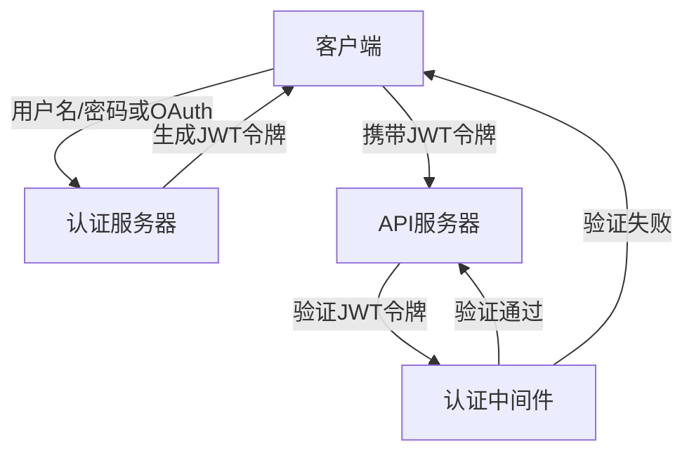
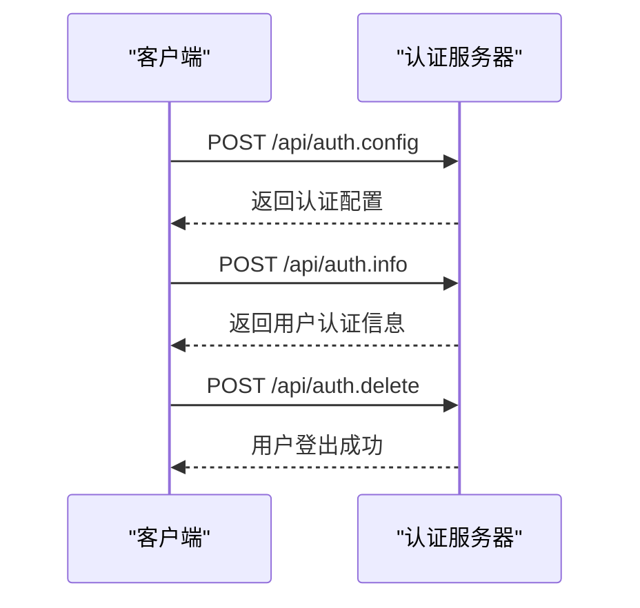
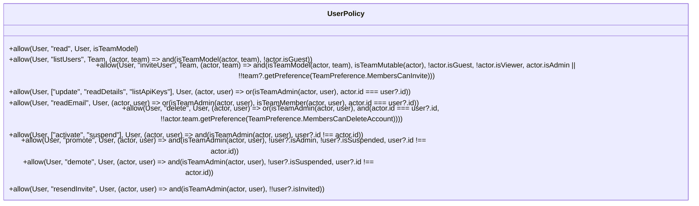
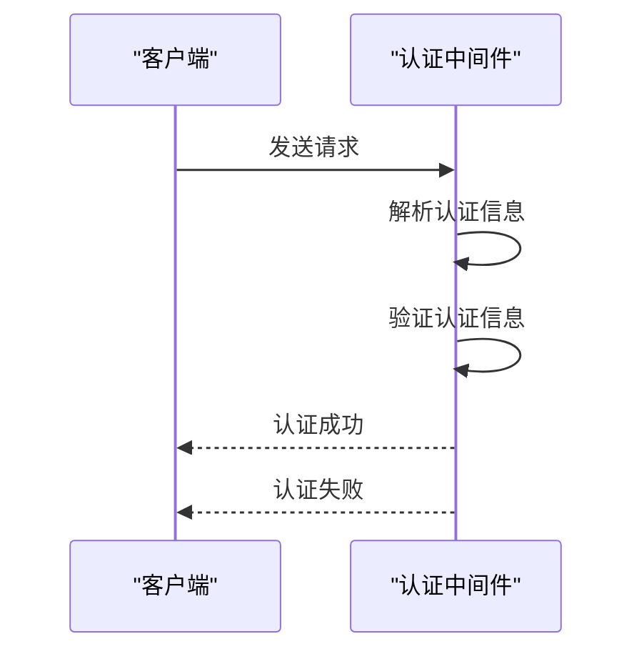
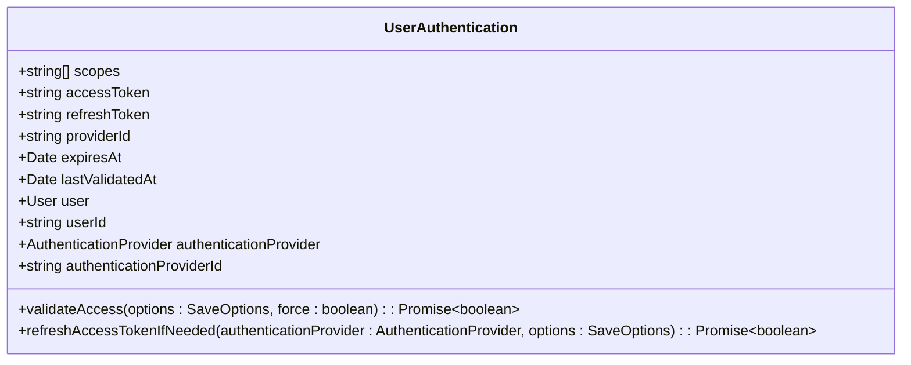
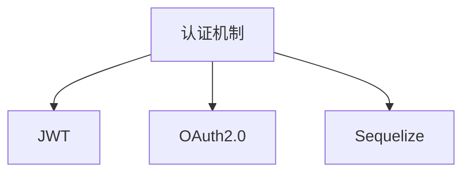

# 基础认证

<cite>
**本文档中引用的文件**  
- [auth.ts](file://server/routes/api/auth/auth.ts)
- [User.ts](file://server/models/User.ts)
- [user.ts](file://server/policies/user.ts)
- [authentication.ts](file://server/middlewares/authentication.ts)
- [jwt.ts](file://server/utils/jwt.ts)
- [UserAuthentication.ts](file://server/models/UserAuthentication.ts)
</cite>

## 目录
1. [简介](#简介)
2. [项目结构](#项目结构)
3. [核心组件](#核心组件)
4. [架构概述](#架构概述)
5. [详细组件分析](#详细组件分析)
6. [依赖分析](#依赖分析)
7. [性能考虑](#性能考虑)
8. [故障排除指南](#故障排除指南)
9. [结论](#结论)

## 简介
本文档详细介绍了baozi项目中的基础认证机制，重点涵盖用户名/密码登录、会话管理以及JWT令牌的生成与验证流程。文档基于`auth.ts`中的实际实现，说明了认证流程、密码哈希处理和会话持久化机制。同时，解释了与用户模型（User.ts）和认证策略（user.ts）的集成方式，包括密码重置和账户锁定逻辑。为开发者提供了安全最佳实践、常见问题排查（如令牌过期处理）和客户端集成示例。

## 项目结构
baozi项目的认证相关代码主要分布在`server/routes/api/auth/`、`server/models/`和`server/middlewares/`目录中。`auth.ts`文件定义了认证相关的API端点，`User.ts`文件定义了用户模型，`user.ts`文件定义了用户相关的权限策略，`authentication.ts`文件定义了认证中间件，`jwt.ts`文件定义了JWT相关的工具函数，`UserAuthentication.ts`文件定义了用户认证模型。

**Section sources**
- [auth.ts](file://server/routes/api/auth/auth.ts)
- [User.ts](file://server/models/User.ts)
- [user.ts](file://server/policies/user.ts)
- [authentication.ts](file://server/middlewares/authentication.ts)
- [jwt.ts](file://server/utils/jwt.ts)
- [UserAuthentication.ts](file://server/models/UserAuthentication.ts)

## 核心组件
核心组件包括认证API端点、用户模型、认证策略、认证中间件、JWT工具函数和用户认证模型。这些组件共同实现了baozi项目的认证机制。

**Section sources**
- [auth.ts](file://server/routes/api/auth/auth.ts)
- [User.ts](file://server/models/User.ts)
- [user.ts](file://server/policies/user.ts)
- [authentication.ts](file://server/middlewares/authentication.ts)
- [jwt.ts](file://server/utils/jwt.ts)
- [UserAuthentication.ts](file://server/models/UserAuthentication.ts)

## 架构概述
baozi项目的认证架构基于JWT（JSON Web Token）和OAuth2.0协议。用户通过用户名/密码登录或第三方OAuth服务进行认证，认证成功后生成JWT令牌，用于后续的API请求认证。会话管理通过JWT令牌的过期时间和刷新机制实现。



**Diagram sources**
- [auth.ts](file://server/routes/api/auth/auth.ts)
- [authentication.ts](file://server/middlewares/authentication.ts)
- [jwt.ts](file://server/utils/jwt.ts)

## 详细组件分析

### 认证API端点分析
认证API端点包括`auth.config`、`auth.info`和`auth.delete`。`auth.config`端点返回认证配置信息，`auth.info`端点返回用户认证信息，`auth.delete`端点用于用户登出。

#### 对于API/服务组件：


**Diagram sources**
- [auth.ts](file://server/routes/api/auth/auth.ts)

**Section sources**
- [auth.ts](file://server/routes/api/auth/auth.ts)

### 用户模型分析
用户模型（User.ts）定义了用户的基本信息，包括用户名、邮箱、角色、JWT密钥等。用户模型还定义了用户相关的实例方法，如`getJwtToken`、`getCollaborationToken`等，用于生成JWT令牌。

#### 对于对象导向组件：
```mermaid
classDiagram
class User {
+string email
+string name
+UserRole role
+string jwtSecret
+Date lastActiveAt
+string lastActiveIp
+Date lastSignedInAt
+string lastSignedInIp
+Date lastSigninEmailSentAt
+Date suspendedAt
+{[key in UserFlag]? : number} flags
+UserPreferences preferences
+NotificationSettings notificationSettings
+keyof typeof locales language
+string timezone
+string avatarUrl
+User suspendedBy
+string suspendedById
+User invitedBy
+string invitedById
+Team team
+string teamId
+UserAuthentication[] authentications
+boolean isSuspended()
+boolean isInvited()
+boolean isAdmin()
+boolean isMember()
+boolean isViewer()
+boolean isGuest()
+string color()
+CollectionPermission defaultCollectionPermission()
+DocumentPermission defaultDocumentPermission()
+string deleteConfirmationCode()
+setNotificationEventType(type : NotificationEventType, value : boolean)
+subscribedToEventType(type : NotificationEventType) : boolean
+setFlag(flag : UserFlag, value : boolean)
+getFlag(flag : UserFlag) : number
+incrementFlag(flag : UserFlag, value : number)
+setPreference(preference : UserPreference, value : boolean)
+getPreference(preference : UserPreference) : boolean
+groups(options : FindOptions~Group~) : Promise~Group[]~
+groupIds(options : FindOptions~Group~) : Promise~string[]~
+collectionIds(options : FindOptions~Collection~) : Promise~string[]~
+updateActiveAt(ctx : Context, force : boolean) : Promise~void~
+updateSignedIn(ctx : Context | APIContext) : Promise~void~
+rotateJwtSecret(options : SaveOptions) : Promise~void~
+getJwtToken(expiresAt : Date) : string
+getCollaborationToken() : string
+getTransferToken() : string
+getEmailSigninToken(ctx : Context) : string
+getEmailVerificationCode() : Promise~string~
+getEmailUpdateToken(email : string) : string
+availableTeams() : Promise~Team[]~
}
```

**Diagram sources**
- [User.ts](file://server/models/User.ts)

**Section sources**
- [User.ts](file://server/models/User.ts)

### 认证策略分析
认证策略（user.ts）定义了用户相关的权限策略，如`read`、`listUsers`、`inviteUser`等。这些策略用于控制用户对资源的访问权限。

#### 对于对象导向组件：


**Diagram sources**
- [user.ts](file://server/policies/user.ts)

**Section sources**
- [user.ts](file://server/policies/user.ts)

### 认证中间件分析
认证中间件（authentication.ts）负责解析和验证请求中的认证信息。它支持多种认证方式，包括Bearer Token、Cookie、Body和Query参数。

#### 对于API/服务组件：


**Diagram sources**
- [authentication.ts](file://server/middlewares/authentication.ts)

**Section sources**
- [authentication.ts](file://server/middlewares/authentication.ts)

### JWT工具函数分析
JWT工具函数（jwt.ts）提供了JWT相关的工具函数，如`getJWTPayload`、`getUserForJWT`、`getUserForEmailSigninToken`等，用于解析和验证JWT令牌。

#### 对于对象导向组件：
```mermaid
classDiagram
class JWTUtils {
+getJWTPayload(token : string) : JWT.JwtPayload
+getUserForJWT(token : string, allowedTypes : string[]) : Promise~User~
+getUserForEmailSigninToken(ctx : Context, token : string) : Promise~User~
+getDetailsForEmailUpdateToken(token : string, options : FindOptions~User~) : Promise~{ user : User; email : string }~
}
```

**Diagram sources**
- [jwt.ts](file://server/utils/jwt.ts)

**Section sources**
- [jwt.ts](file://server/utils/jwt.ts)

### 用户认证模型分析
用户认证模型（UserAuthentication.ts）定义了用户认证的相关信息，包括访问令牌、刷新令牌、提供者ID等。该模型还定义了验证和刷新访问令牌的实例方法。

#### 对于对象导向组件：


**Diagram sources**
- [UserAuthentication.ts](file://server/models/UserAuthentication.ts)

**Section sources**
- [UserAuthentication.ts](file://server/models/UserAuthentication.ts)

## 依赖分析
认证机制依赖于JWT、OAuth2.0、Sequelize等第三方库。JWT用于生成和验证令牌，OAuth2.0用于第三方认证，Sequelize用于数据库操作。



**Diagram sources**
- [auth.ts](file://server/routes/api/auth/auth.ts)
- [User.ts](file://server/models/User.ts)
- [authentication.ts](file://server/middlewares/authentication.ts)
- [jwt.ts](file://server/utils/jwt.ts)
- [UserAuthentication.ts](file://server/models/UserAuthentication.ts)

**Section sources**
- [auth.ts](file://server/routes/api/auth/auth.ts)
- [User.ts](file://server/models/User.ts)
- [authentication.ts](file://server/middlewares/authentication.ts)
- [jwt.ts](file://server/utils/jwt.ts)
- [UserAuthentication.ts](file://server/models/UserAuthentication.ts)

## 性能考虑
认证机制的性能主要受JWT令牌的生成和验证速度影响。为了提高性能，可以采用缓存机制，如Redis，来存储和验证JWT令牌。

## 故障排除指南
常见问题包括令牌过期、令牌无效、认证失败等。解决方法包括检查令牌的有效期、重新生成令牌、检查认证信息等。

**Section sources**
- [auth.ts](file://server/routes/api/auth/auth.ts)
- [authentication.ts](file://server/middlewares/authentication.ts)
- [jwt.ts](file://server/utils/jwt.ts)

## 结论
baozi项目的认证机制基于JWT和OAuth2.0协议，实现了安全、高效的用户认证和会话管理。通过详细的文档和示例，开发者可以快速理解和集成该认证机制。