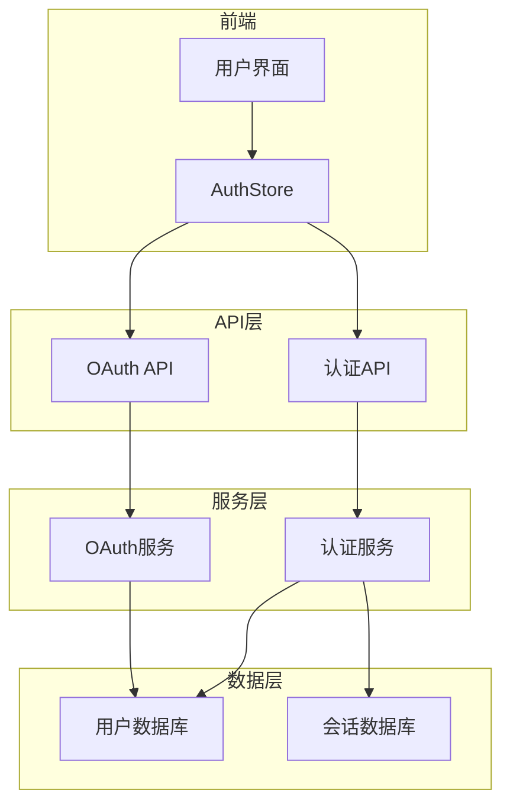
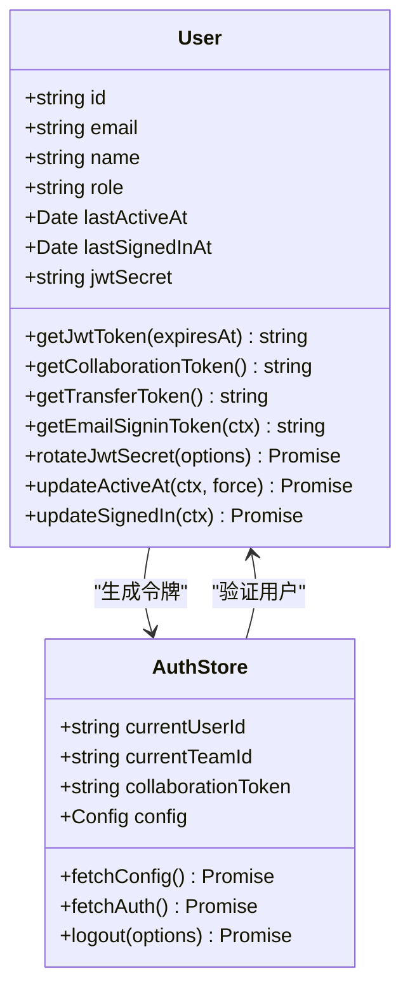
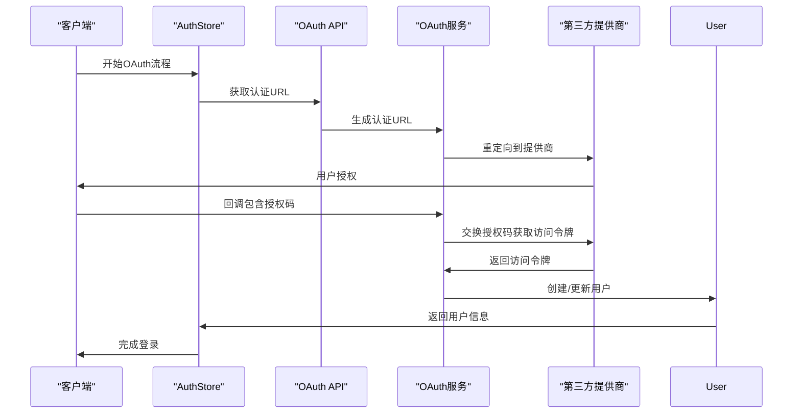
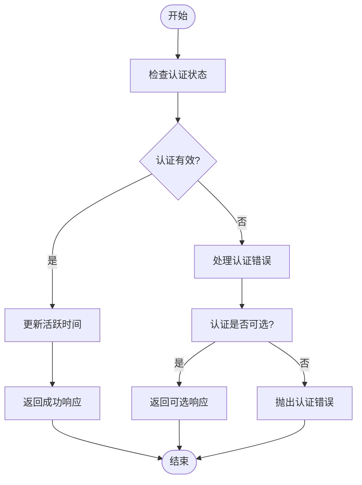
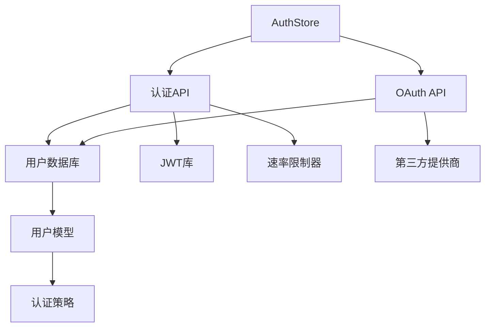

# 认证API

<cite>
**本文档中引用的文件**  
- [auth.ts](file://server/routes/api/auth/auth.ts)
- [oauthAuthentications.ts](file://server/routes/api/oauthAuthentications/oauthAuthentications.ts)
- [User.ts](file://app/models/User.ts)
- [User.ts](file://server/models/User.ts)
- [user.ts](file://server/policies/user.ts)
- [authentication.ts](file://server/middlewares/authentication.ts)
- [AuthStore.ts](file://app/stores/AuthStore.ts)
- [OAuthAuthenticationsStore.ts](file://app/stores/OAuthAuthenticationsStore.ts)
</cite>

## 目录
1. [简介](#简介)
2. [项目结构](#项目结构)
3. [核心组件](#核心组件)
4. [架构概述](#架构概述)
5. [详细组件分析](#详细组件分析)
6. [依赖分析](#依赖分析)
7. [性能考虑](#性能考虑)
8. [故障排除指南](#故障排除指南)
9. [结论](#结论)

## 简介
本文档详细介绍了baozi项目的认证API，重点涵盖用户认证、OAuth集成和会话管理机制。文档详细记录了登录、登出、令牌刷新、第三方认证（如Google、Slack、Discord）等端点的HTTP方法、请求/响应模式和安全策略。通过auth.ts和oauthAuthentications.ts中的实际实现，说明了认证流程、JWT令牌生成和验证机制。同时解释了与用户模型（User.ts）和认证策略（user.ts）的集成方式。为开发者提供了安全最佳实践、常见问题排查（如令牌过期处理）和客户端集成示例。

## 项目结构
baozi项目的认证功能主要分布在以下几个目录中：
- `server/routes/api/auth/`：包含认证相关的API路由
- `server/routes/api/oauthAuthentications/`：包含OAuth认证相关的API路由
- `app/models/`：包含前端用户模型
- `server/models/`：包含后端用户模型
- `server/middlewares/`：包含认证中间件
- `app/stores/`：包含前端认证状态管理

**Section sources**
- [auth.ts](file://server/routes/api/auth/auth.ts)
- [oauthAuthentications.ts](file://server/routes/api/oauthAuthentications/oauthAuthentications.ts)

## 核心组件
认证系统的核心组件包括用户认证、OAuth集成和会话管理。这些组件通过JWT令牌、OAuth2.0协议和会话cookie实现安全的用户身份验证和授权。

**Section sources**
- [auth.ts](file://server/routes/api/auth/auth.ts)
- [User.ts](file://server/models/User.ts)
- [authentication.ts](file://server/middlewares/authentication.ts)

## 架构概述
baozi项目的认证架构采用分层设计，包括前端UI层、API网关层、业务逻辑层和数据存储层。认证流程通过JWT令牌和OAuth2.0协议实现，确保用户身份的安全验证。

**Diagram sources**
- [auth.ts](file://server/routes/api/auth/auth.ts)
- [oauthAuthentications.ts](file://server/routes/api/oauthAuthentications/oauthAuthentications.ts)
- [AuthStore.ts](file://app/stores/AuthStore.ts)

## 详细组件分析

### 用户认证分析
用户认证组件负责处理用户的登录、登出和会话管理。通过JWT令牌实现无状态的会话管理，确保认证的安全性和可扩展性。

**Diagram sources**
- [User.ts](file://server/models/User.ts)
- [AuthStore.ts](file://app/stores/AuthStore.ts)

### OAuth集成分析
OAuth集成组件负责处理第三方认证（如Google、Slack、Discord）的集成。通过OAuth2.0协议实现安全的第三方身份验证。

**Diagram sources**
- [oauthAuthentications.ts](file://server/routes/api/oauthAuthentications/oauthAuthentications.ts)
- [AuthStore.ts](file://app/stores/AuthStore.ts)

### 会话管理分析
会话管理组件负责处理用户的会话状态，包括会话创建、验证和销毁。通过JWT令牌和cookie实现安全的会话管理。

**Diagram sources**
- [authentication.ts](file://server/middlewares/authentication.ts)
- [AuthStore.ts](file://app/stores/AuthStore.ts)

## 依赖分析
认证系统依赖于多个核心组件和外部服务，包括用户模型、认证策略、JWT库和第三方OAuth提供商。

**Diagram sources**
- [auth.ts](file://server/routes/api/auth/auth.ts)
- [oauthAuthentications.ts](file://server/routes/api/oauthAuthentications/oauthAuthentications.ts)
- [user.ts](file://server/policies/user.ts)

## 性能考虑
认证系统的性能主要受以下因素影响：
- JWT令牌的生成和验证开销
- 数据库查询的效率
- 第三方OAuth提供商的响应时间
- 会话状态的管理开销

建议通过以下方式优化性能：
- 使用缓存减少数据库查询
- 优化JWT令牌的生成和验证算法
- 实现异步处理减少请求延迟
- 使用连接池管理数据库连接

## 故障排除指南
### 常见问题
1. **令牌过期**：检查令牌的过期时间，确保在过期前刷新令牌
2. **认证失败**：检查认证凭据是否正确，确保第三方提供商的配置正确
3. **会话丢失**：检查cookie设置，确保跨域请求的cookie正确传递
4. **OAuth回调失败**：检查回调URL配置，确保与提供商的配置一致

### 调试技巧
- 使用浏览器开发者工具检查网络请求和响应
- 查看服务器日志获取详细的错误信息
- 使用调试工具逐步跟踪认证流程
- 检查JWT令牌的有效性

**Section sources**
- [authentication.ts](file://server/middlewares/authentication.ts)
- [AuthStore.ts](file://app/stores/AuthStore.ts)

## 结论
baozi项目的认证系统通过JWT令牌、OAuth2.0协议和会话cookie实现了安全、可扩展的用户身份验证和授权。系统设计考虑了安全性、性能和可维护性，为开发者提供了完整的认证解决方案。通过遵循本文档中的最佳实践，开发者可以有效地集成和使用认证功能，确保应用的安全性。