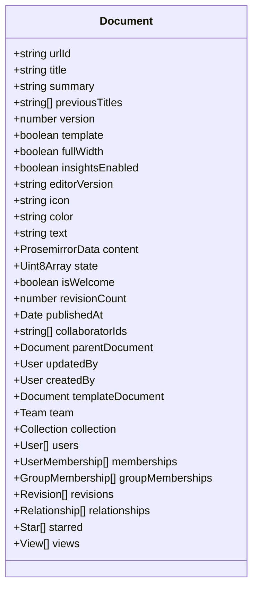
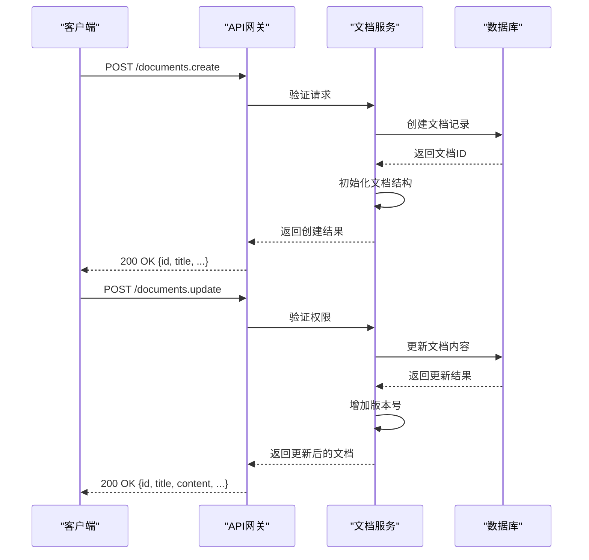
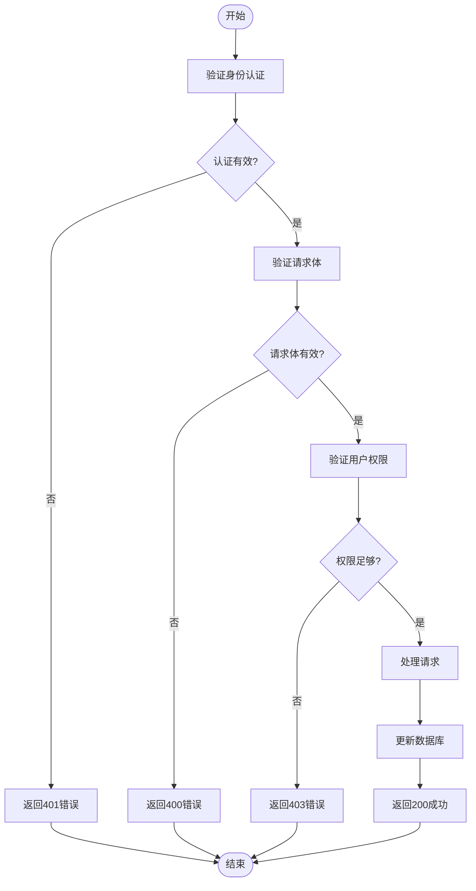
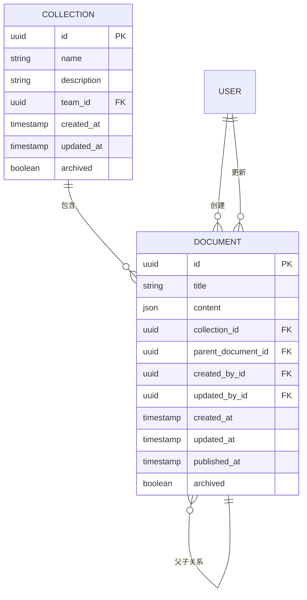

# 文档管理API

<cite>
**本文档中引用的文件**   
- [documents.ts](file://server/routes/api/documents/documents.ts)
- [Document.ts](file://app/models/Document.ts)
- [Document.ts](file://server/models/Document.ts)
- [schema.ts](file://server/routes/api/documents/schema.ts)
</cite>

## 目录
1. [简介](#简介)
2. [核心功能](#核心功能)
3. [文档数据结构](#文档数据结构)
4. [API端点详细说明](#api端点详细说明)
5. [请求验证规则](#请求验证规则)
6. [操作示例](#操作示例)
7. [文档与集合关系](#文档与集合关系)
8. [内容序列化格式](#内容序列化格式)
9. [权限验证机制](#权限验证机制)
10. [结论](#结论)

## 简介
文档管理API提供了一套完整的文档生命周期管理功能，包括文档的创建、编辑、移动和共享。该API基于RESTful设计原则，通过清晰的端点和请求/响应模式实现文档的全面管理。系统支持复杂的文档结构，允许文档在集合中组织，并提供细粒度的权限控制。文档内容以Prosemirror JSON格式存储，同时支持Markdown和HTML的序列化转换。

**Section sources**
- [documents.ts](file://server/routes/api/documents/documents.ts#L0-L2158)

## 核心功能
文档管理API的核心功能包括文档的创建、编辑、移动和共享。创建功能允许用户通过指定标题、内容和元数据来新建文档。编辑功能支持文档内容的更新和版本控制。移动功能允许文档在集合间或作为子文档重新组织。共享功能提供文档的权限管理，支持用户和组级别的访问控制。所有操作都经过严格的权限验证，确保只有授权用户才能执行相应操作。

**Section sources**
- [documents.ts](file://server/routes/api/documents/documents.ts#L0-L2158)

## 文档数据结构
文档数据结构由Document.ts模型定义，包含标题、内容、状态和元数据等核心属性。标题是文档的名称，最大长度受验证规则限制。内容以Prosemirror JSON格式存储，同时保留Markdown文本作为备份。状态字段包括发布状态、归档状态和删除状态。元数据包含文档的创建者、更新者、创建时间、更新时间以及协作编辑者列表。文档还支持图标、颜色、全宽布局等显示属性。



**Diagram sources **
- [Document.ts](file://server/models/Document.ts#L94-L1314)
- [Document.ts](file://app/models/Document.ts#L39-L703)

## API端点详细说明
文档管理API提供多个端点来处理文档操作。创建文档使用POST /documents.create端点，需要提供标题和可选内容。更新文档使用POST /documents.update端点，支持部分更新。移动文档使用POST /documents.move端点，可以改变文档的集合或父文档。获取文档信息使用POST /documents.info端点，返回完整的文档数据。所有端点都要求身份验证，并根据用户权限进行访问控制。



**Diagram sources **
- [documents.ts](file://server/routes/api/documents/documents.ts#L0-L2158)

## 请求验证规则
请求验证规则在schema.ts中定义，使用Zod库进行类型安全的验证。创建文档时，标题长度不能超过最大限制，内容格式必须正确。移动文档时，目标集合和父文档必须存在且用户有相应权限。更新文档时，不能创建无限嵌套的文档结构。所有请求都验证用户身份和权限，确保操作的安全性。验证规则还包括对URL ID、颜色值、图标类型等特定字段的格式检查。



**Diagram sources **
- [schema.ts](file://server/routes/api/documents/schema.ts#L0-L475)

## 操作示例
### 创建文档
```typescript
// 创建新文档
const response = await api.post('/documents.create', {
  title: '项目计划',
  text: '这是项目的第一阶段计划...',
  collectionId: 'col-123',
  publish: true
});
```

### 更新文档内容
```typescript
// 更新文档内容
const response = await api.post('/documents.update', {
  id: 'doc-456',
  text: '这是更新后的项目计划...',
  append: true
});
```

### 移动文档位置
```typescript
// 移动文档到新位置
const response = await api.post('/documents.move', {
  id: 'doc-456',
  collectionId: 'col-789',
  parentDocumentId: 'doc-001'
});
```

### 设置文档权限
```typescript
// 为用户添加文档访问权限
const response = await api.post('/documents.add_user', {
  id: 'doc-456',
  userId: 'user-789',
  permission: 'read_write'
});
```

**Section sources**
- [documents.ts](file://server/routes/api/documents/documents.ts#L0-L2158)

## 文档与集合关系
文档与集合之间存在一对多的关系，每个文档属于一个集合，而一个集合包含多个文档。这种关系在数据库中通过外键约束实现。文档的移动操作会更新其集合ID和父文档ID，同时维护集合的文档结构树。集合的权限设置会影响其包含的所有文档，默认情况下文档继承集合的访问权限。用户对集合的访问权限决定了其能否查看或编辑集合中的文档。



**Diagram sources **
- [Document.ts](file://server/models/Document.ts#L94-L1314)

## 内容序列化格式
文档内容主要以Prosemirror JSON格式存储，这是一种结构化的文档表示格式，支持丰富的文本样式和嵌入内容。系统提供多种序列化方法，可以将文档转换为Markdown或HTML格式。Markdown序列化用于文本导出和API响应，HTML序列化用于页面渲染和打印。内容序列化过程保留了文档的结构信息，包括标题层级、列表、代码块等元素。序列化格式的设计确保了内容在不同表示形式间的无损转换。

**Section sources**
- [Document.ts](file://server/models/Document.ts#L94-L1314)

## 权限验证机制
权限验证机制基于角色和策略模式实现。每个API端点在执行前都会验证用户的身份和权限。系统使用authorize函数检查用户是否有权执行特定操作，如读取、写入或删除文档。权限检查考虑了文档的所有者、集合权限、用户成员资格和组成员资格。对于共享文档，系统还验证分享链接的有效性和访问权限。权限验证贯穿整个请求处理流程，确保数据安全和访问控制。

**Section sources**
- [documents.ts](file://server/routes/api/documents/documents.ts#L0-L2158)

## 结论
文档管理API提供了一套完整、安全且易于使用的文档管理解决方案。通过清晰的端点设计、严格的验证规则和灵活的权限控制，API支持复杂的文档操作场景。文档数据结构的设计考虑了性能和可扩展性，支持高效的查询和更新操作。内容序列化格式的选择确保了文档在不同环境下的兼容性和可移植性。整体架构遵循最佳实践，为文档管理功能提供了坚实的基础。