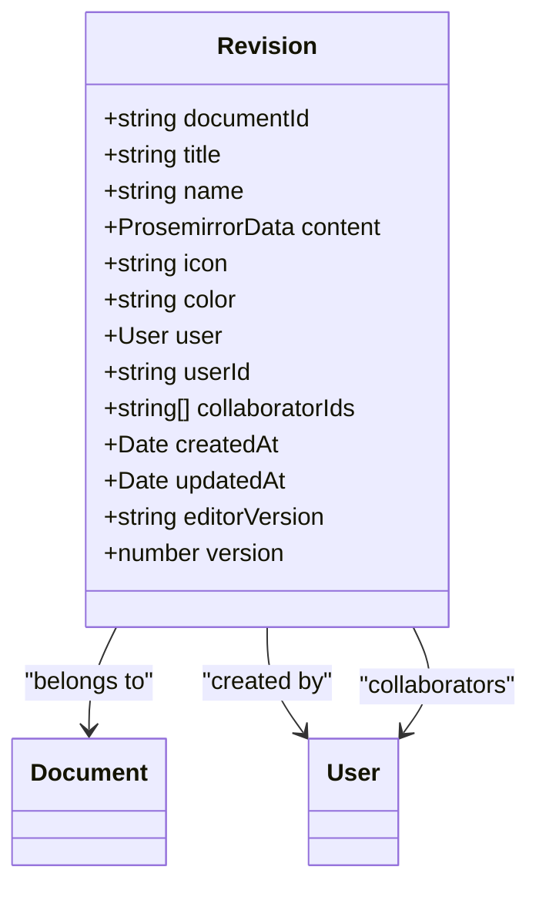
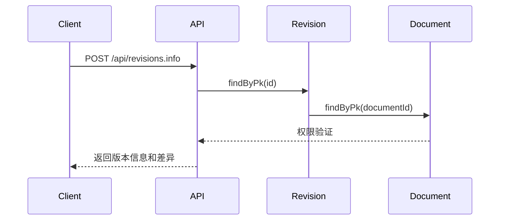
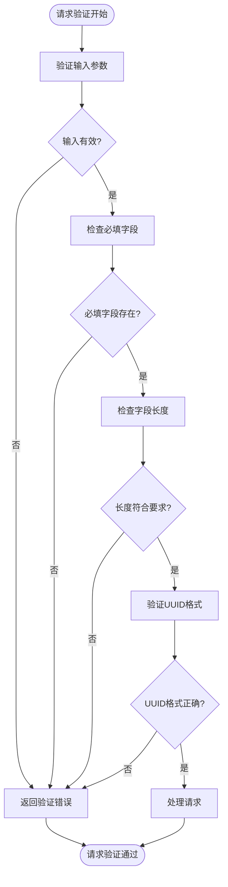
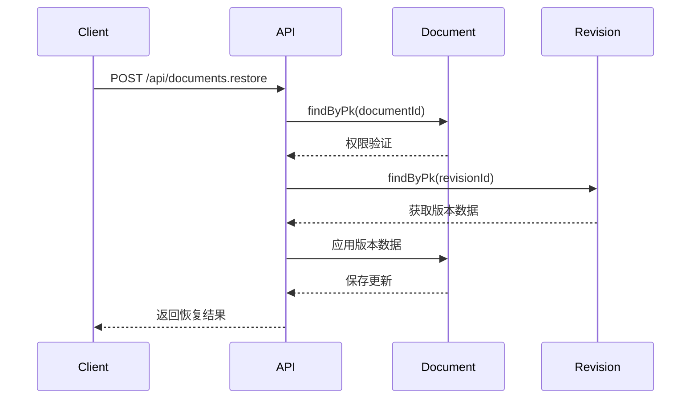
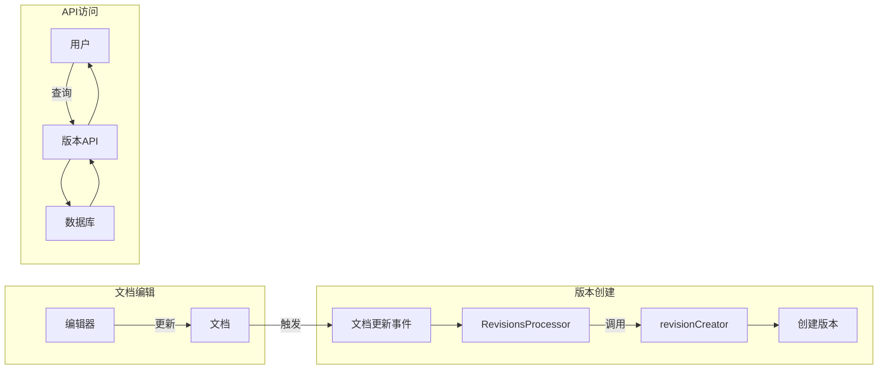

# 版本控制API

<cite>
**本文档引用的文件**  
- [revisions.ts](file://server/routes/api/revisions/revisions.ts)
- [Revision.ts](file://server/models/Revision.ts)
- [schema.ts](file://server/routes/api/revisions/schema.ts)
- [DocumentHelper.tsx](file://server/models/helpers/DocumentHelper.tsx)
- [revisionCreator.ts](file://server/commands/revisionCreator.ts)
- [RevisionsProcessor.ts](file://server/queues/processors/RevisionsProcessor.ts)
</cite>

## 目录
1. [简介](#简介)
2. [核心功能](#核心功能)
3. [版本数据结构](#版本数据结构)
4. [端点详细说明](#端点详细说明)
5. [请求验证规则](#请求验证规则)
6. [版本比较与恢复机制](#版本比较与恢复机制)
7. [集成与工作流程](#集成与工作流程)

## 简介
版本控制API为文档管理系统提供了完整的版本管理功能，支持文档版本的创建、查询、比较和恢复操作。该系统通过自动和手动方式创建文档快照，保留内容、作者、时间戳和变更摘要等关键信息。API设计遵循REST原则，通过清晰的端点和验证规则确保操作的安全性和一致性。

**Section sources**
- [revisions.ts](file://server/routes/api/revisions/revisions.ts#L1-L20)

## 核心功能
版本控制API提供以下核心功能：
- **版本创建**：在文档更新时自动创建版本快照
- **版本查询**：获取特定文档的所有版本历史
- **版本比较**：生成两个版本之间的差异对比
- **版本恢复**：将文档恢复到历史版本状态
- **版本管理**：支持版本重命名和删除操作

这些功能通过一系列REST端点实现，每个操作都包含严格的权限验证和输入验证机制。

**Section sources**
- [revisions.ts](file://server/routes/api/revisions/revisions.ts#L20-L30)

## 版本数据结构
版本控制API使用Revision模型来存储文档快照，该模型包含以下关键属性：

**Diagram sources**
- [Revision.ts](file://server/models/Revision.ts#L23-L84)

### 数据结构说明
- **documentId**: 关联的文档ID
- **title**: 创建版本时的文档标题
- **name**: 版本的可选名称（用于标识特定版本）
- **content**: 使用Prosemirror格式存储的内容JSON数据
- **icon**: 文档图标或表情符号
- **color**: 图标颜色
- **user**: 创建版本的用户
- **collaboratorIds**: 协作编辑此版本的用户ID数组
- **createdAt**: 版本创建时间戳
- **editorVersion**: 创建版本时的编辑器版本

**Section sources**
- [Revision.ts](file://server/models/Revision.ts#L23-L84)

## 端点详细说明
版本控制API提供多个端点来管理文档版本，每个端点都有明确的HTTP方法、URL模式、请求/响应模式和权限要求。

### 获取版本信息

**Diagram sources**
- [revisions.ts](file://server/routes/api/revisions/revisions.ts#L24-L64)

#### 端点信息
| 属性 | 值 |
|------|-----|
| **HTTP方法** | POST |
| **URL模式** | /api/revisions.info |
| **权限要求** | 用户必须有权限列出文档版本 |
| **请求参数** | id 或 documentId（必填） |
| **响应格式** | 包含版本数据和权限策略的JSON对象 |

**Section sources**
- [revisions.ts](file://server/routes/api/revisions/revisions.ts#L24-L64)
- [schema.ts](file://server/routes/api/revisions/schema.ts#L17-L24)

### 列出版本历史
#### 端点信息
| 属性 | 值 |
|------|-----|
| **HTTP方法** | POST |
| **URL模式** | /api/revisions.list |
| **权限要求** | 用户必须有权限列出文档版本 |
| **请求参数** | documentId（必填），sort，direction |
| **响应格式** | 分页的版本列表，包含分页信息和权限策略 |

**Section sources**
- [revisions.ts](file://server/routes/api/revisions/revisions.ts#L191-L219)
- [schema.ts](file://server/routes/api/revisions/schema.ts#L60-L66)

### 比较版本差异
#### 端点信息
| 属性 | 值 |
|------|-----|
| **HTTP方法** | POST |
| **URL模式** | /api/revisions.diff |
| **权限要求** | 用户必须有权限列出文档版本 |
| **请求参数** | id（必填），compareToId（可选） |
| **响应格式** | HTML格式的差异对比，或JSON格式的差异内容 |

**Section sources**
- [revisions.ts](file://server/routes/api/revisions/revisions.ts#L131-L183)
- [schema.ts](file://server/routes/api/revisions/schema.ts#L26-L32)

### 更新版本信息
#### 端点信息
| 属性 | 值 |
|------|-----|
| **HTTP方法** | POST |
| **URL模式** | /api/revisions.update |
| **权限要求** | 用户必须有权限更新文档和版本 |
| **请求参数** | id（必填），name（可选） |
| **响应格式** | 更新后的版本数据和权限策略 |

**Section sources**
- [revisions.ts](file://server/routes/api/revisions/revisions.ts#L101-L124)
- [schema.ts](file://server/routes/api/revisions/schema.ts#L42-L58)

### 删除版本
#### 端点信息
| 属性 | 值 |
|------|-----|
| **HTTP方法** | POST |
| **URL模式** | /api/revisions.delete |
| **权限要求** | 用户必须是管理员角色 |
| **请求参数** | id（必填） |
| **响应格式** | 成功状态的JSON对象 |

**Section sources**
- [revisions.ts](file://server/routes/api/revisions/revisions.ts#L80-L98)
- [schema.ts](file://server/routes/api/revisions/schema.ts#L68-L68)

## 请求验证规则
版本控制API使用Zod库定义严格的请求验证规则，确保输入数据的完整性和安全性。

**Diagram sources**
- [schema.ts](file://server/routes/api/revisions/schema.ts#L6-L68)

### 验证规则详情
- **ID验证**：所有ID必须是有效的UUID格式
- **长度限制**：
  - 版本名称最大长度：`RevisionValidation.maxNameLength`
  - 文档标题最大长度：`DocumentValidation.maxTitleLength`
- **必填字段**：根据操作类型验证必填字段
- **排序参数**：只允许预定义的排序字段

**Section sources**
- [schema.ts](file://server/routes/api/revisions/schema.ts#L6-L68)

## 版本比较与恢复机制
版本控制API提供强大的版本比较和恢复功能，支持用户查看和恢复历史版本。

### 版本比较流程
1. 获取指定版本（after）
2. 获取前一个版本（before）
3. 使用DocumentHelper.diff方法生成差异
4. 返回HTML格式的差异对比

### 版本恢复机制
版本恢复通过文档恢复端点实现，使用版本ID作为恢复依据：

**Diagram sources**
- [DocumentHelper.tsx](file://server/models/helpers/DocumentHelper.tsx#L450-L580)

**Section sources**
- [DocumentHelper.tsx](file://server/models/helpers/DocumentHelper.tsx#L450-L580)

## 集成与工作流程
版本控制功能与文档编辑操作深度集成，通过事件驱动机制自动创建版本。

**Diagram sources**
- [revisions.ts](file://server/routes/api/revisions/revisions.ts#L1-L224)
- [RevisionsProcessor.ts](file://server/queues/processors/RevisionsProcessor.ts#L7-L56)
- [revisionCreator.ts](file://server/commands/revisionCreator.ts#L6-L32)

### 自动版本创建流程
1. 用户编辑文档并保存
2. 系统触发"documents.update"事件
3. RevisionsProcessor监听到事件
4. 调用revisionCreator命令
5. 创建新的版本快照并保存到数据库

### 权限验证机制
所有版本操作都通过统一的权限验证机制：
- 使用`authorize`函数检查用户权限
- 基于用户角色和文档权限进行验证
- 管理员权限要求用于删除操作

**Section sources**
- [revisions.ts](file://server/routes/api/revisions/revisions.ts#L1-L224)
- [RevisionsProcessor.ts](file://server/queues/processors/RevisionsProcessor.ts#L7-L56)
- [revisionCreator.ts](file://server/commands/revisionCreator.ts#L6-L32)