# 集合与文档API

<cite>
**本文档引用的文件**   
- [collections.ts](file://server/routes/api/collections/collections.ts)
- [documents.ts](file://server/routes/api/documents/documents.ts)
- [revisions.ts](file://server/routes/api/revisions/revisions.ts)
- [Collection.ts](file://app/models/Collection.ts)
- [Document.ts](file://app/models/Document.ts)
- [Collection.ts](file://server/models/Collection.ts)
- [Document.ts](file://server/models/Document.ts)
</cite>

## 目录
1. [简介](#简介)
2. [集合管理](#集合管理)
3. [文档管理](#文档管理)
4. [版本控制](#版本控制)
5. [数据结构](#数据结构)
6. [权限继承](#权限继承)
7. [内容序列化格式](#内容序列化格式)
8. [实际代码示例](#实际代码示例)

## 简介
本文档全面介绍了集合与文档管理API，重点涵盖文档创建、编辑、版本控制和集合管理功能。详细记录了collections.ts和documents.ts中所有端点的HTTP方法、URL模式、请求/响应模式和权限验证机制。使用Collection.ts和Document.ts模型解释数据结构，说明revisions.ts如何实现文档版本控制。提供关于文档权限继承、集合层级结构、内容序列化格式的详细说明，并给出创建文档、更新内容、查看历史版本等操作的实际代码示例。

## 集合管理
集合管理API提供了创建、更新、删除和查询集合的功能。集合是文档的容器，可以设置权限、共享和排序规则。

### 创建集合
创建新集合的API端点。

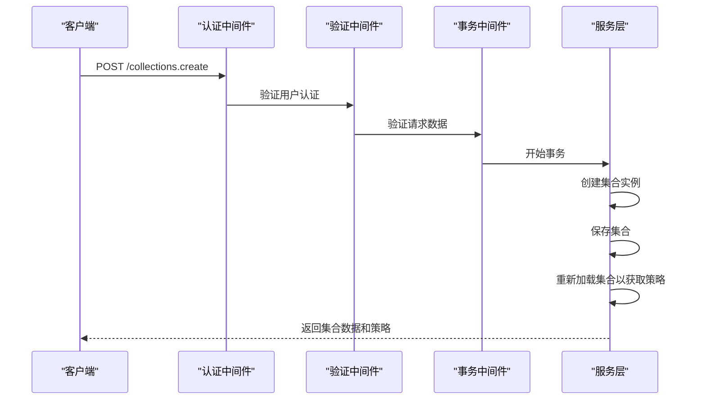

**Diagram sources**
- [collections.ts](file://server/routes/api/collections/collections.ts#L20-L79)

**Section sources**
- [collections.ts](file://server/routes/api/collections/collections.ts#L20-L79)
- [Collection.ts](file://server/models/Collection.ts#L87-L1007)

### 更新集合
更新现有集合的API端点。

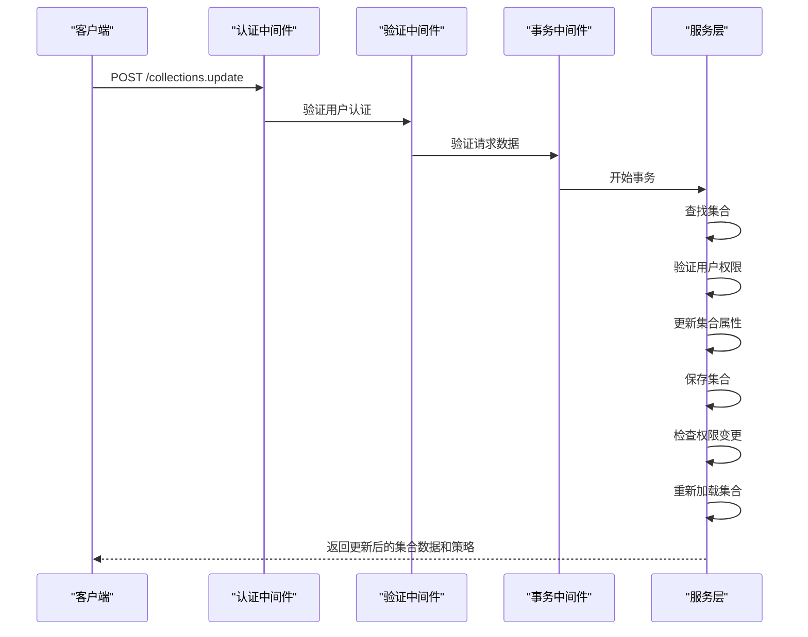

**Diagram sources**
- [collections.ts](file://server/routes/api/collections/collections.ts#L587-L686)

**Section sources**
- [collections.ts](file://server/routes/api/collections/collections.ts#L587-L686)
- [Collection.ts](file://server/models/Collection.ts#L87-L1007)

### 删除集合
删除集合的API端点。

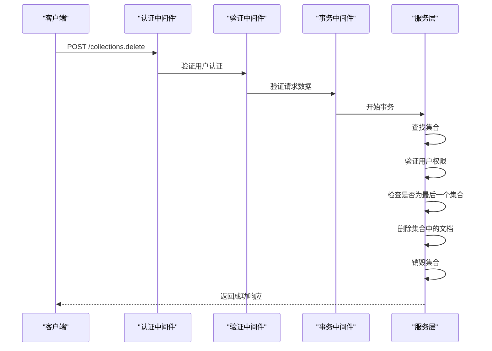

**Diagram sources**
- [collections.ts](file://server/routes/api/collections/collections.ts#L789-L879)

**Section sources**
- [collections.ts](file://server/routes/api/collections/collections.ts#L789-L879)
- [Collection.ts](file://server/models/Collection.ts#L87-L1007)

## 文档管理
文档管理API提供了创建、更新、删除和查询文档的功能。文档是内容的基本单位，可以属于集合或作为独立文档存在。

### 创建文档
创建新文档的API端点。

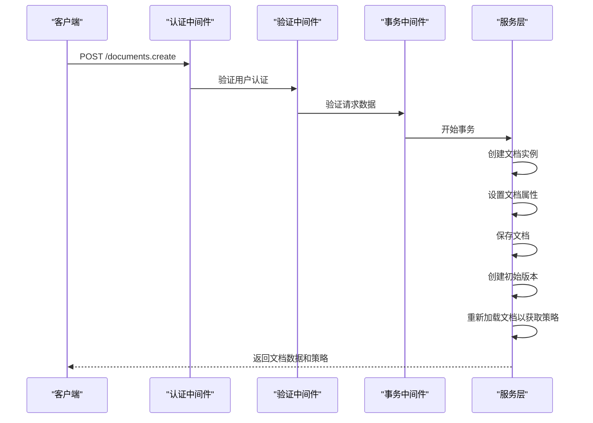

**Diagram sources**
- [documents.ts](file://server/routes/api/documents/documents.ts#L88-L308)

**Section sources**
- [documents.ts](file://server/routes/api/documents/documents.ts#L88-L308)
- [Document.ts](file://server/models/Document.ts#L94-L1314)

### 更新文档
更新现有文档的API端点。

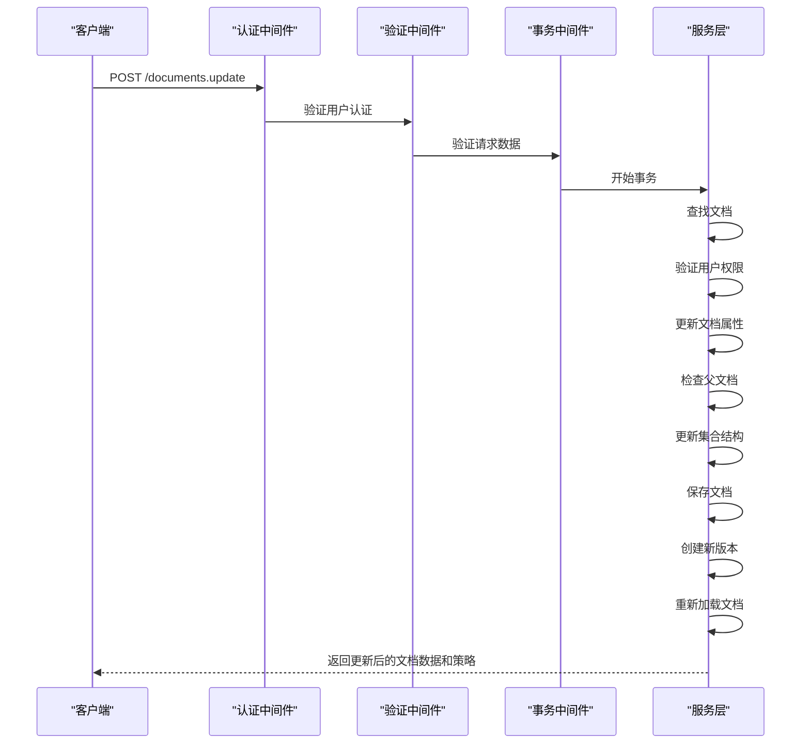

**Diagram sources**
- [documents.ts](file://server/routes/api/documents/documents.ts#L316-L386)

**Section sources**
- [documents.ts](file://server/routes/api/documents/documents.ts#L316-L386)
- [Document.ts](file://server/models/Document.ts#L94-L1314)

### 删除文档
删除文档的API端点。

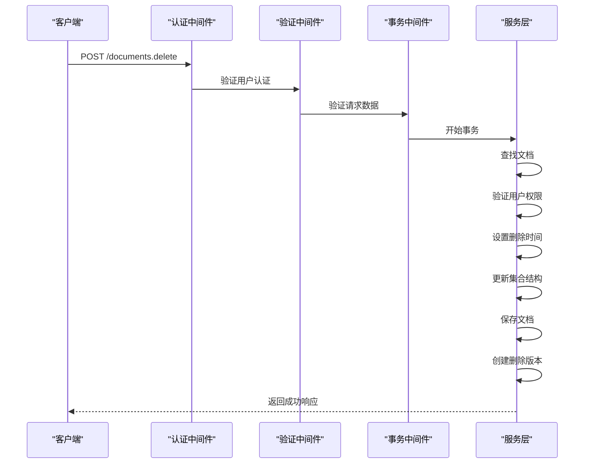

**Diagram sources**
- [documents.ts](file://server/routes/api/documents/documents.ts#L394-L464)

**Section sources**
- [documents.ts](file://server/routes/api/documents/documents.ts#L394-L464)
- [Document.ts](file://server/models/Document.ts#L94-L1314)

## 版本控制
版本控制API提供了查看、比较和管理文档历史版本的功能。每个文档的更改都会创建一个新的版本，允许用户查看和恢复到之前的版本。

### 获取版本列表
获取文档所有版本的API端点。

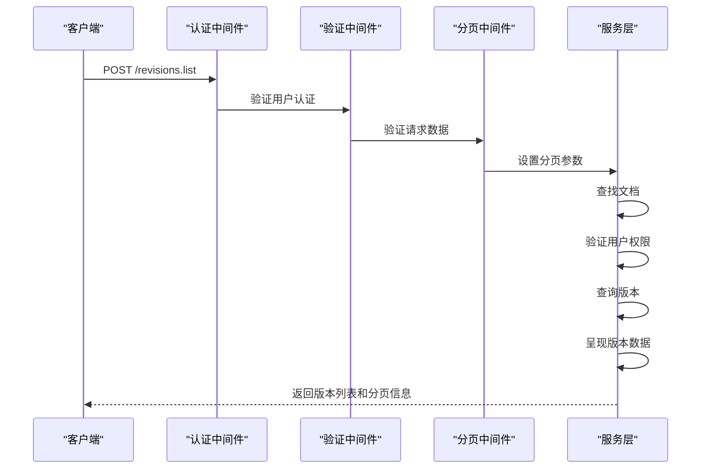

**Diagram sources**
- [revisions.ts](file://server/routes/api/revisions/revisions.ts#L131-L183)

**Section sources**
- [revisions.ts](file://server/routes/api/revisions/revisions.ts#L131-L183)
- [Revision.ts](file://server/models/Revision.ts#L23-L232)

### 获取版本差异
获取两个版本之间差异的API端点。

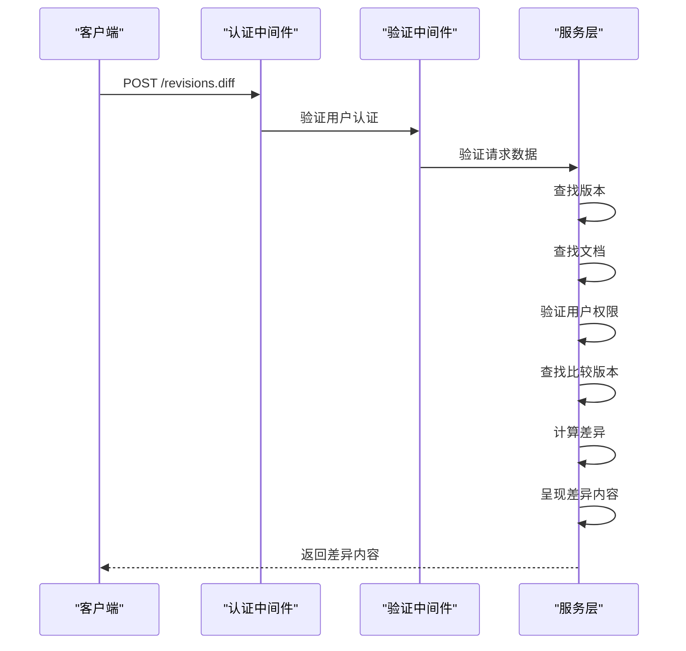

**Diagram sources**
- [revisions.ts](file://server/routes/api/revisions/revisions.ts#L77-L130)

**Section sources**
- [revisions.ts](file://server/routes/api/revisions/revisions.ts#L77-L130)
- [Revision.ts](file://server/models/Revision.ts#L23-L232)

## 数据结构
本节详细说明集合和文档的数据结构，包括字段定义、关系和约束。

### 集合数据结构
集合模型定义了集合的属性和关系。

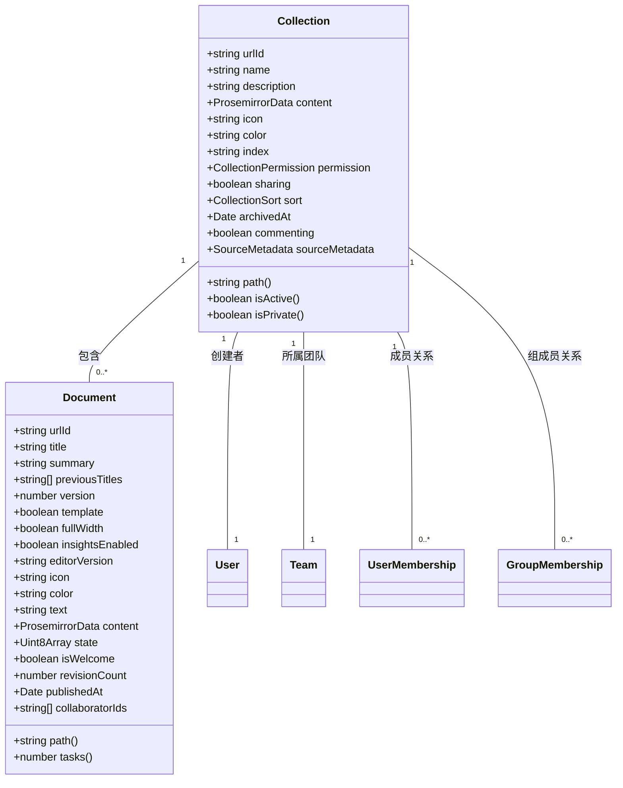

**Diagram sources**
- [Collection.ts](file://server/models/Collection.ts#L87-L1007)
- [Document.ts](file://server/models/Document.ts#L94-L1314)

**Section sources**
- [Collection.ts](file://server/models/Collection.ts#L87-L1007)
- [Document.ts](file://server/models/Document.ts#L94-L1314)

### 文档数据结构
文档模型定义了文档的属性和关系。

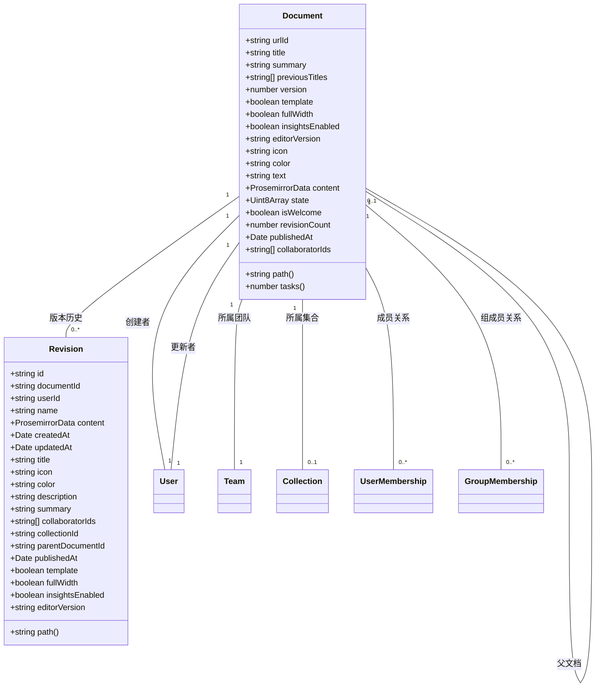

**Diagram sources**
- [Document.ts](file://server/models/Document.ts#L94-L1314)
- [Revision.ts](file://server/models/Revision.ts#L23-L232)

**Section sources**
- [Document.ts](file://server/models/Document.ts#L94-L1314)
- [Revision.ts](file://server/models/Revision.ts#L23-L232)

## 权限继承
权限继承机制确保文档和集合的访问权限正确传递和应用。

### 集合权限继承
集合权限决定了集合内文档的默认访问权限。

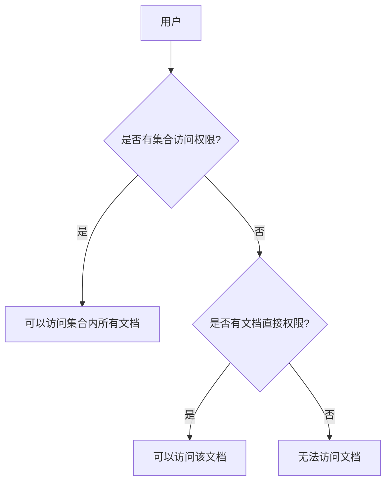

**Diagram sources**
- [Collection.ts](file://server/models/Collection.ts#L87-L1007)
- [Document.ts](file://server/models/Document.ts#L94-L1314)

**Section sources**
- [Collection.ts](file://server/models/Collection.ts#L87-L1007)
- [Document.ts](file://server/models/Document.ts#L94-L1314)

### 文档权限继承
文档权限可以覆盖集合权限，实现更细粒度的访问控制。

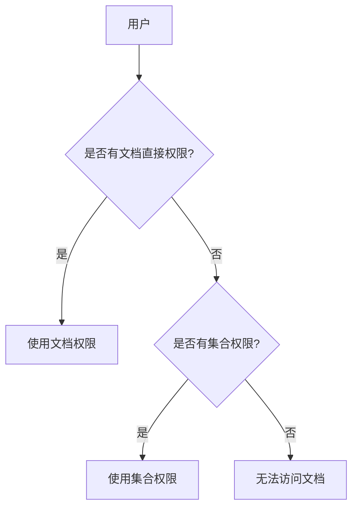

**Diagram sources**
- [Document.ts](file://server/models/Document.ts#L94-L1314)
- [Collection.ts](file://server/models/Collection.ts#L87-L1007)

**Section sources**
- [Document.ts](file://server/models/Document.ts#L94-L1314)
- [Collection.ts](file://server/models/Collection.ts#L87-L1007)

## 内容序列化格式
内容序列化格式定义了文档内容的存储和传输方式。

### Prosemirror数据格式
文档内容以Prosemirror JSON格式存储。

```json
{
  "type": "doc",
  "content": [
    {
      "type": "heading",
      "attrs": {
        "level": 1
      },
      "content": [
        {
          "type": "text",
          "text": "文档标题"
        }
      ]
    },
    {
      "type": "paragraph",
      "content": [
        {
          "type": "text",
          "text": "这是文档的第一段内容。"
        }
      ]
    }
  ]
}
```

**Section sources**
- [Document.ts](file://server/models/Document.ts#L94-L1314)
- [DocumentHelper.tsx](file://server/models/helpers/DocumentHelper.tsx#L38-L580)

### Markdown格式
文档内容可以转换为Markdown格式用于导出。

```markdown
# 文档标题

这是文档的第一段内容。
```

**Section sources**
- [DocumentHelper.tsx](file://server/models/helpers/DocumentHelper.tsx#L38-L580)
- [Document.ts](file://server/models/Document.ts#L94-L1314)

## 实际代码示例
本节提供创建文档、更新内容、查看历史版本等操作的实际代码示例。

### 创建文档
创建新文档的代码示例。

```typescript
// 创建文档
const response = await client.post("/documents.create", {
  title: "新文档",
  collectionId: "collection-123",
  text: "这是文档内容",
});

const document = response.data.document;
```

**Section sources**
- [documents.ts](file://server/routes/api/documents/documents.ts#L88-L308)
- [Document.ts](file://app/models/Document.ts#L39-L703)

### 更新文档内容
更新现有文档内容的代码示例。

```typescript
// 更新文档内容
const response = await client.post("/documents.update", {
  id: "document-123",
  text: "这是更新后的内容",
  title: "更新后的文档标题",
});

const document = response.data.document;
```

**Section sources**
- [documents.ts](file://server/routes/api/documents/documents.ts#L316-L386)
- [Document.ts](file://app/models/Document.ts#L39-L703)

### 查看文档历史版本
查看文档历史版本的代码示例。

```typescript
// 获取文档版本列表
const response = await client.post("/revisions.list", {
  documentId: "document-123",
  limit: 10,
  offset: 0,
});

const revisions = response.data.data;
```

**Section sources**
- [revisions.ts](file://server/routes/api/revisions/revisions.ts#L131-L183)
- [Revision.ts](file://app/models/Revision.ts#L9-L67)

### 比较两个版本
比较文档两个版本之间差异的代码示例。

```typescript
// 比较两个版本
const response = await client.post("/revisions.diff", {
  id: "revision-456",
  compareToId: "revision-123",
});

const diff = response.data.data;
```

**Section sources**
- [revisions.ts](file://server/routes/api/revisions/revisions.ts#L77-L130)
- [Revision.ts](file://app/models/Revision.ts#L9-L67)