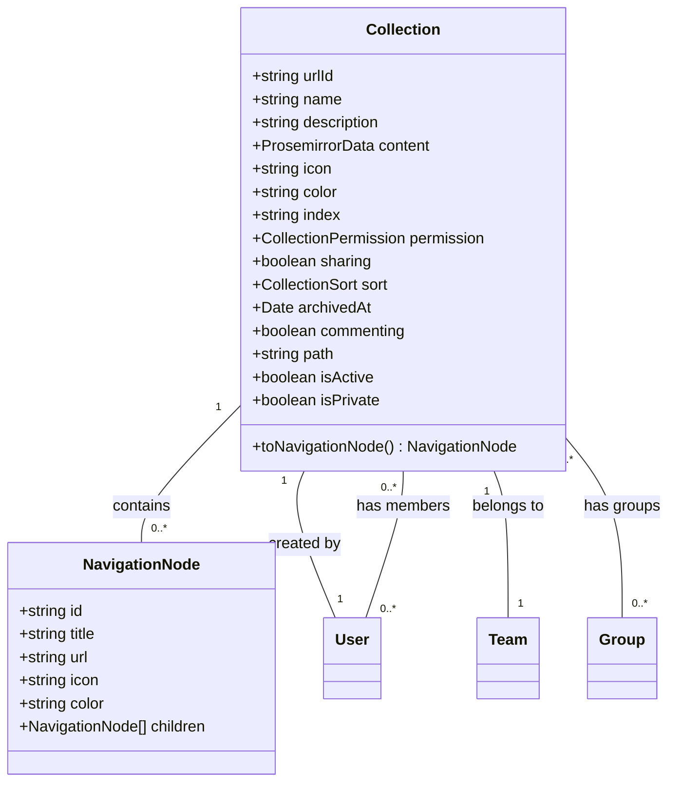
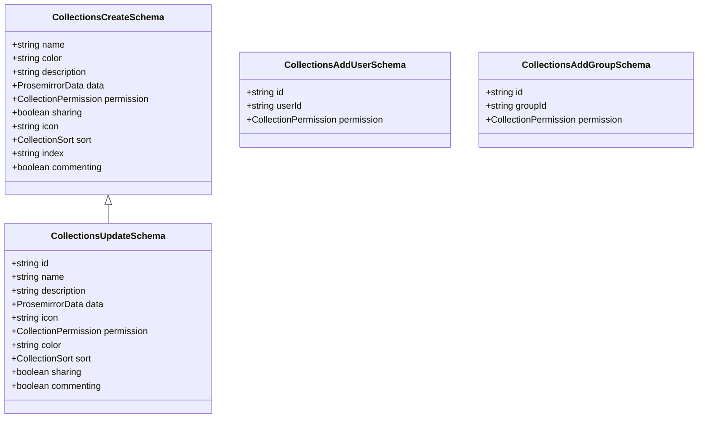
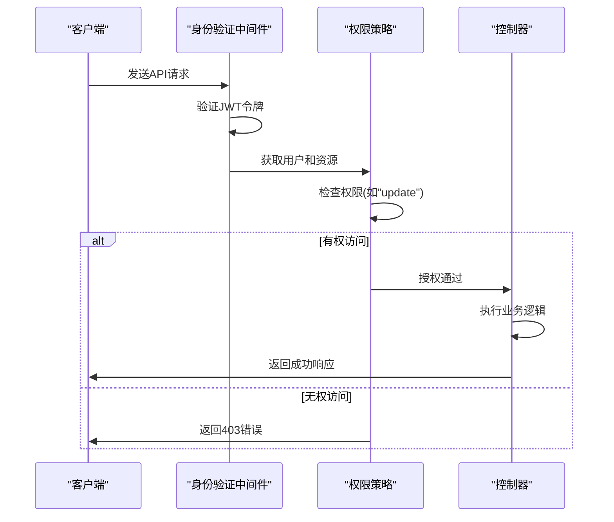

# 集合管理API

<cite>
**本文档中引用的文件**   
- [collections.ts](file://server/routes/api/collections/collections.ts)
- [Collection.ts](file://server/models/Collection.ts)
- [schema.ts](file://server/routes/api/collections/schema.ts)
- [Collection.ts](file://app/models/Collection.ts)
</cite>

## 目录
1. [简介](#简介)
2. [核心功能](#核心功能)
3. [集合数据结构](#集合数据结构)
4. [请求验证规则](#请求验证规则)
5. [API端点详细说明](#api端点详细说明)
6. [权限控制机制](#权限控制机制)
7. [集合与文档关系](#集合与文档关系)
8. [代码示例](#代码示例)

## 简介
集合管理API提供了一套完整的集合创建、更新、删除和权限控制功能。该API允许用户通过HTTP请求管理集合资源，包括设置集合属性、管理成员权限、控制访问策略等。集合作为组织文档的核心容器，其管理功能对于系统整体的权限体系和数据组织至关重要。

**Section sources**
- [collections.ts](file://server/routes/api/collections/collections.ts#L1-L50)

## 核心功能
集合管理API支持以下核心操作：
- 集合的创建、更新和删除
- 集合权限的配置和管理
- 集合成员（用户和用户组）的添加和移除
- 集合的导入和导出功能
- 集合的归档和恢复操作
- 集合的排序和移动

这些功能通过RESTful API端点提供，每个操作都有相应的权限验证机制确保安全性。

**Section sources**
- [collections.ts](file://server/routes/api/collections/collections.ts#L50-L100)

## 集合数据结构
集合模型定义了集合的核心属性和关系，包括名称、描述、权限设置和层级关系。



**Diagram sources **
- [Collection.ts](file://server/models/Collection.ts#L87-L200)
- [Collection.ts](file://app/models/Collection.ts#L19-L100)

## 请求验证规则
请求验证规则在schema.ts文件中定义，确保所有API请求的数据格式和内容符合要求。



**Diagram sources **
- [schema.ts](file://server/routes/api/collections/schema.ts#L20-L100)

## API端点详细说明
集合管理API提供了多个端点来处理不同的集合操作。

### 创建集合
创建新集合的API端点。

**HTTP方法**: POST  
**URL模式**: /collections.create  
**请求体**:
```json
{
  "name": "集合名称",
  "color": "颜色代码",
  "description": "描述",
  "data": "Prosemirror数据",
  "permission": "权限级别",
  "sharing": true,
  "icon": "图标",
  "sort": {
    "field": "title|index",
    "direction": "asc|desc"
  },
  "index": "排序索引",
  "commenting": true
}
```

**响应模式**:
```json
{
  "data": {
    "id": "集合ID",
    "name": "集合名称",
    "path": "集合路径",
    "permission": "权限级别",
    "sharing": true,
    "createdAt": "创建时间",
    "updatedAt": "更新时间"
  },
  "policies": {
    "abilities": {
      "read": true,
      "update": true,
      "delete": true
    }
  }
}
```

**权限验证**: 用户必须具有创建集合的权限。

**Section sources**
- [collections.ts](file://server/routes/api/collections/collections.ts#L50-L100)
- [schema.ts](file://server/routes/api/collections/schema.ts#L20-L50)

### 更新集合
更新现有集合属性的API端点。

**HTTP方法**: POST  
**URL模式**: /collections.update  
**请求体**:
```json
{
  "id": "集合ID",
  "name": "新名称",
  "description": "新描述",
  "data": "新Prosemirror数据",
  "icon": "新图标",
  "permission": "新权限级别",
  "color": "新颜色代码",
  "sort": {
    "field": "title|index",
    "direction": "asc|desc"
  },
  "sharing": false,
  "commenting": false
}
```

**响应模式**: 与创建集合的响应模式相同。

**权限验证**: 用户必须具有更新集合的权限。

**Section sources**
- [collections.ts](file://server/routes/api/collections/collections.ts#L400-L450)
- [schema.ts](file://server/routes/api/collections/schema.ts#L180-L200)

### 删除集合
删除集合的API端点。

**HTTP方法**: POST  
**URL模式**: /collections.delete  
**请求体**:
```json
{
  "id": "集合ID"
}
```

**响应模式**:
```json
{
  "success": true
}
```

**权限验证**: 用户必须具有删除集合的权限，且不能删除团队的最后一个集合。

**Section sources**
- [collections.ts](file://server/routes/api/collections/collections.ts#L700-L750)
- [schema.ts](file://server/routes/api/collections/schema.ts#L220-L230)

### 列出集合
获取用户有权访问的集合列表。

**HTTP方法**: POST  
**URL模式**: /collections.list  
**请求体**:
```json
{
  "includeListOnly": false,
  "query": "搜索查询",
  "statusFilter": ["active", "archived"]
}
```

**响应模式**:
```json
{
  "pagination": {
    "page": 1,
    "limit": 20,
    "total": 100
  },
  "data": [
    {
      "id": "集合ID",
      "name": "集合名称",
      "path": "集合路径",
      "permission": "权限级别",
      "sharing": true,
      "createdAt": "创建时间",
      "updatedAt": "更新时间"
    }
  ],
  "policies": [
    {
      "abilities": {
        "read": true,
        "update": true,
        "delete": true
      }
    }
  ]
}
```

**权限验证**: 用户必须经过身份验证。

**Section sources**
- [collections.ts](file://server/routes/api/collections/collections.ts#L500-L550)
- [schema.ts](file://server/routes/api/collections/schema.ts#L160-L180)

## 权限控制机制
集合管理API实现了细粒度的权限控制机制，确保只有授权用户才能执行特定操作。



**Diagram sources **
- [collections.ts](file://server/routes/api/collections/collections.ts#L50-L100)
- [Collection.ts](file://server/models/Collection.ts#L300-L400)

### 权限级别
集合支持以下权限级别：
- **读写权限**(ReadWrite): 可以读取和修改集合内容
- **只读权限**(Read): 只能读取集合内容
- **管理员权限**(Admin): 可以管理集合权限和成员

当集合的权限设置为null时，表示该集合是私有的，需要明确的成员资格才能访问。

**Section sources**
- [Collection.ts](file://server/models/Collection.ts#L150-L180)

## 集合与文档关系
集合与文档之间存在继承关系和访问控制策略。

```mermaid
flowchart TD
A[集合] --> B[文档1]
A --> C[文档2]
A --> D[文档3]
B --> E[子文档1]
B --> F[子文档2]
C --> G[子文档3]
style A fill:#f9f,stroke:#333
style B fill:#bbf,stroke:#333
style C fill:#bbf,stroke:#333
style D fill:#bbf,stroke:#333
style E fill:#dfd,stroke:#333
style F fill:#dfd,stroke:#333
style G fill:#dfd,stroke:#333
subgraph "权限继承"
A --> |"继承权限" B
A --> |"继承权限" C
A --> |"继承权限" D
end
subgraph "文档结构"
B --> |"父子关系" E
B --> |"父子关系" F
C --> |"父子关系" G
end
```

**Diagram sources **
- [Collection.ts](file://server/models/Collection.ts#L500-L600)

### 继承关系
- 文档继承其所属集合的权限设置
- 集合的权限变更会触发文档权限策略的更新
- 私有集合中的文档默认也是私有的

### 访问控制策略
- 用户对集合的访问权限决定了其对集合内所有文档的访问权限
- 可以为单个文档设置独立的权限，覆盖集合的默认权限
- 集合的共享设置影响其内所有文档的共享状态

**Section sources**
- [Collection.ts](file://server/models/Collection.ts#L500-L700)

## 代码示例
以下是使用集合管理API的实际代码示例。

### 创建集合
```typescript
// 示例代码路径: server/routes/api/collections/collections.ts#L50-L100
// 实际代码内容不在此显示，仅提供路径引用
```

### 更新集合权限
```typescript
// 示例代码路径: server/routes/api/collections/collections.ts#L400-L450
// 实际代码内容不在此显示，仅提供路径引用
```

### 添加用户到集合
```typescript
// 示例代码路径: server/routes/api/collections/collections.ts#L250-L300
// 实际代码内容不在此显示，仅提供路径引用
```

**Section sources**
- [collections.ts](file://server/routes/api/collections/collections.ts#L50-L100)
- [collections.ts](file://server/routes/api/collections/collections.ts#L400-L450)
- [collections.ts](file://server/routes/api/collections/collections.ts#L250-L300)