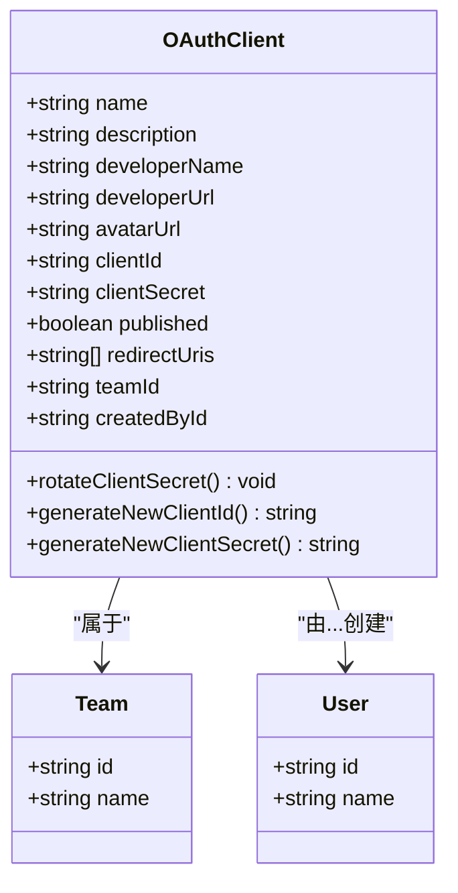
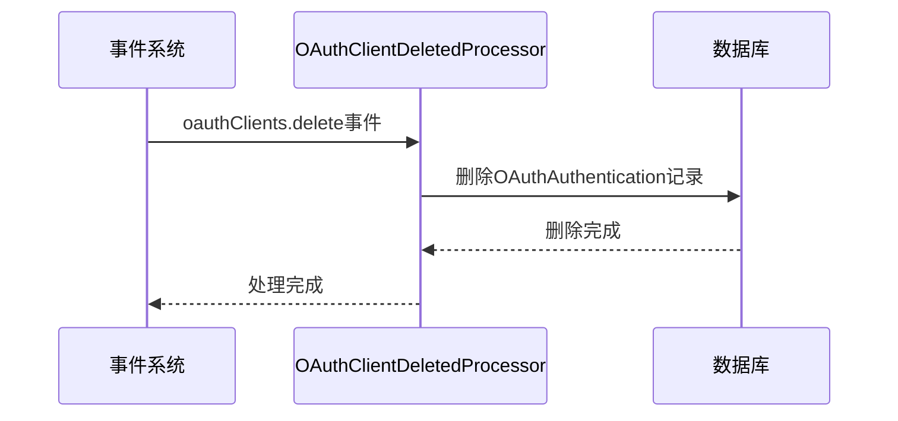

# OAuth客户端权限管理

<cite>
**本文档引用的文件**   
- [oauthClient.ts](file://server/policies/oauthClient.ts)
- [OAuthClient.ts](file://server/models/oauth/OAuthClient.ts)
- [OAuthClientDeletedProcessor.ts](file://server/queues/processors/OAuthClientDeletedProcessor.ts)
</cite>

## 目录
1. [简介](#简介)
2. [权限检查逻辑](#权限检查逻辑)
3. [OAuthClient模型与团队关联](#oauthclient模型与团队关联)
4. [权限清理与级联删除](#权限清理与级联删除)
5. [最佳实践](#最佳实践)
6. [故障排除](#故障排除)

## 简介
本文档详细说明了OAuth客户端权限管理的实现，重点介绍基于角色的访问控制（RBAC）机制。文档涵盖权限检查逻辑、团队关联机制、权限清理行为以及最佳实践。

**Section sources**
- [oauthClient.ts](file://server/policies/oauthClient.ts#L1-L20)

## 权限检查逻辑
权限检查逻辑定义在`policies/oauthClient.ts`文件中，使用`allow`函数为不同用户角色设置对OAuth客户端的创建、读取、更新和删除操作的权限规则。

```mermaid
flowchart TD
A[用户角色] --> B{操作类型}
B --> C[创建OAuth客户端]
B --> D[列出OAuth客户端]
B --> E[读取OAuth客户端]
B --> F[更新/删除OAuth客户端]
C --> G[团队模型 && 可变 && 管理员]
D --> H[团队管理员]
E --> I[团队模型 || 已发布]
F --> J[团队模型 && 可变 && 管理员]
```

**Diagram sources**
- [oauthClient.ts](file://server/policies/oauthClient.ts#L1-L20)

### 创建权限
只有满足以下条件的用户才能创建OAuth客户端：
- 是团队模型的一部分
- 团队是可变的
- 是管理员

### 读取权限
用户可以读取OAuth客户端如果：
- 是团队模型的一部分
- 或者客户端已发布

### 更新和删除权限
更新和删除操作需要满足以下条件：
- 是团队模型的一部分
- 团队是可变的
- 是管理员

**Section sources**
- [oauthClient.ts](file://server/policies/oauthClient.ts#L1-L20)

## OAuthClient模型与团队关联
`OAuthClient`模型定义了OAuth客户端的数据结构及其与团队的关联关系。



**Diagram sources**
- [OAuthClient.ts](file://server/models/oauth/OAuthClient.ts#L28-L156)

### 模型属性
- **name**: 客户端名称
- **description**: 描述
- **developerName**: 开发者名称
- **developerUrl**: 开发者URL
- **avatarUrl**: 头像URL
- **clientId**: 客户端ID
- **clientSecret**: 客户端密钥（加密存储）
- **published**: 是否已发布
- **redirectUris**: 重定向URI列表
- **teamId**: 所属团队ID
- **createdById**: 创建者ID

### 关联关系
- 每个OAuth客户端属于一个团队
- 每个OAuth客户端由一个用户创建

**Section sources**
- [OAuthClient.ts](file://server/models/oauth/OAuthClient.ts#L28-L156)

## 权限清理与级联删除
当OAuth客户端被删除时，系统会自动清理相关的认证信息。



**Diagram sources**
- [OAuthClientDeletedProcessor.ts](file://server/queues/processors/OAuthClientDeletedProcessor.ts#L4-L14)

### 处理流程
1. 系统触发`oauthClients.delete`事件
2. `OAuthClientDeletedProcessor`处理器接收事件
3. 删除与该客户端相关的所有`OAuthAuthentication`记录
4. 完成清理操作

**Section sources**
- [OAuthClientDeletedProcessor.ts](file://server/queues/processors/OAuthClientDeletedProcessor.ts#L4-L14)

## 最佳实践
### 最小权限原则
- 仅授予用户完成其工作所需的最小权限
- 定期审查和调整权限分配
- 使用团队管理员角色进行权限管理

### 审计日志记录
- 记录所有关键操作（创建、更新、删除）
- 包含操作者、时间戳和操作详情
- 定期审查审计日志

### 安全建议
- 定期轮换客户端密钥
- 限制重定向URI的数量和范围
- 监控异常访问模式

## 故障排除
### 常见问题
- **无法创建OAuth客户端**: 检查用户是否为管理员且团队可变
- **无法读取OAuth客户端**: 确认客户端已发布或用户属于正确团队
- **更新失败**: 验证用户权限和团队状态
- **删除后仍有认证信息**: 检查队列处理器是否正常运行

### 诊断步骤
1. 检查用户角色和权限
2. 验证团队状态和配置
3. 查看相关日志文件
4. 确认数据库状态一致性

**Section sources**
- [oauthClient.ts](file://server/policies/oauthClient.ts#L1-L20)
- [OAuthClient.ts](file://server/models/oauth/OAuthClient.ts#L28-L156)
- [OAuthClientDeletedProcessor.ts](file://server/queues/processors/OAuthClientDeletedProcessor.ts#L4-L14)