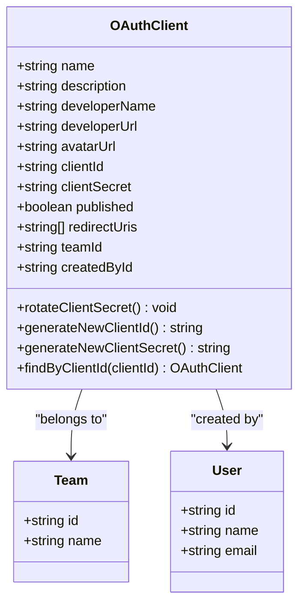
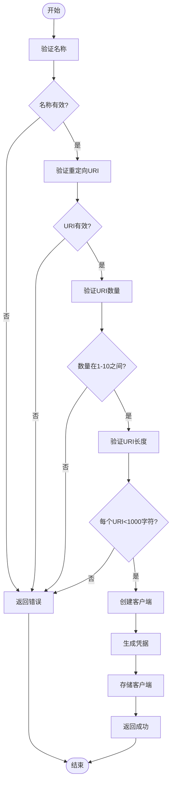
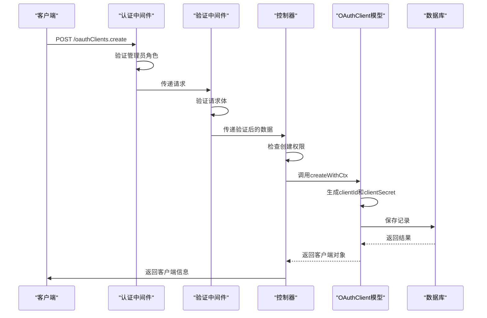
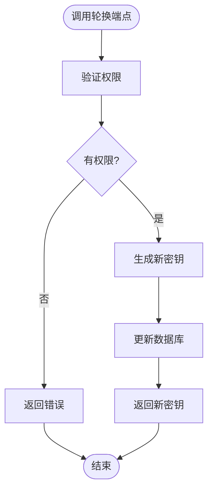

# OAuth客户端注册

<cite>
**本文档中引用的文件**  
- [oauthClients.ts](file://server/routes/api/oauthClients/oauthClients.ts)
- [OAuthClient.ts](file://server/models/oauth/OAuthClient.ts)
- [schema.ts](file://server/routes/api/oauthClients/schema.ts)
- [validations.ts](file://shared/validations.ts)
</cite>

## 目录
1. [简介](#简介)
2. [核心组件](#核心组件)
3. [数据结构与模型](#数据结构与模型)
4. [请求验证规则](#请求验证规则)
5. [客户端注册流程](#客户端注册流程)
6. [API使用示例](#api使用示例)
7. [安全机制](#安全机制)

## 简介
本文档详细介绍了OAuth客户端注册功能的实现，重点涵盖客户端创建端点的逻辑处理、数据结构定义、验证规则以及安全机制。系统通过REST API提供客户端注册、更新、密钥轮换和删除等功能，确保第三方应用能够安全地集成到平台中。

## 核心组件

### 客户端注册端点
客户端注册功能由`oauthClients.ts`文件中的路由处理器实现，主要包含以下端点：
- `oauthClients.create`：创建新的OAuth客户端
- `oauthClients.info`：获取客户端信息
- `oauthClients.update`：更新客户端配置
- `oauthClients.rotate_secret`：轮换客户端密钥
- `oauthClients.delete`：删除客户端

这些端点受到管理员角色认证保护，并通过事务处理确保数据一致性。

**Section sources**
- [oauthClients.ts](file://server/routes/api/oauthClients/oauthClients.ts#L1-L181)

## 数据结构与模型

### OAuthClient模型
`OAuthClient`模型定义了客户端的核心数据结构，包含以下关键字段：

- **clientId**：客户端的公共标识符，由系统自动生成
- **clientSecret**：客户端密钥，加密存储，前缀为`ol_sk_`
- **name**：客户端名称，最大长度100字符
- **description**：客户端描述，最大长度1000字符
- **developerName**：开发者名称，最大长度100字符
- **developerUrl**：开发者URL，最大长度1000字符
- **avatarUrl**：头像URL，最大长度1000字符
- **redirectUris**：重定向URI数组，最多10个，每个最大长度1000字符
- **published**：是否发布状态
- **teamId**：所属团队ID
- **createdById**：创建者用户ID



**Diagram sources**
- [OAuthClient.ts](file://server/models/oauth/OAuthClient.ts#L28-L156)

**Section sources**
- [OAuthClient.ts](file://server/models/oauth/OAuthClient.ts#L1-L159)

## 请求验证规则

### Schema验证定义
`schema.ts`文件中定义了客户端注册的请求验证规则，使用Zod库进行类型安全的验证。

#### 创建请求验证
- **name**：必需字符串
- **description**：可选字符串
- **developerName**：可选字符串
- **developerUrl**：可选字符串
- **avatarUrl**：可选字符串
- **redirectUris**：必需数组，至少1个，最多10个有效URL
- **published**：布尔值，默认false



**Diagram sources**
- [schema.ts](file://server/routes/api/oauthClients/schema.ts#L20-L65)

**Section sources**
- [schema.ts](file://server/routes/api/oauthClients/schema.ts#L1-L128)

## 客户端注册流程

### 创建端点处理逻辑
客户端创建端点的处理流程如下：

1. 身份验证：确保用户具有管理员角色
2. 速率限制：每小时最多5次请求
3. 请求验证：使用Zod schema验证输入
4. 事务处理：确保数据一致性
5. 权限检查：验证用户是否有权创建客户端
6. 凭据生成：自动生成clientId和clientSecret
7. 数据存储：保存客户端信息
8. 响应返回：返回客户端信息和策略



**Diagram sources**
- [oauthClients.ts](file://server/routes/api/oauthClients/oauthClients.ts#L40-L60)

## API使用示例

### 成功场景
**请求：**
```json
POST /api/oauthClients.create
{
  "name": "My App",
  "description": "A sample application",
  "developerName": "John Doe",
  "developerUrl": "https://example.com",
  "avatarUrl": "https://example.com/avatar.png",
  "redirectUris": ["https://example.com/callback"],
  "published": true
}
```

**响应：**
```json
{
  "data": {
    "id": "uuid",
    "name": "My App",
    "description": "A sample application",
    "developerName": "John Doe",
    "developerUrl": "https://example.com",
    "avatarUrl": "https://example.com/avatar.png",
    "clientId": "generated_client_id",
    "clientSecret": "ol_sk_generated_secret",
    "redirectUris": ["https://example.com/callback"],
    "published": true,
    "createdAt": "timestamp",
    "updatedAt": "timestamp"
  },
  "policies": [...]
}
```

### 失败场景
**无效重定向URI：**
```json
{
  "error": "Validation error",
  "message": "redirect_uri is invalid"
}
```

**缺少必要字段：**
```json
{
  "error": "Validation error",
  "message": "At least one redirect uri is required"
}
```

**Section sources**
- [oauthClients.ts](file://server/routes/api/oauthClients/oauthClients.ts#L40-L60)
- [schema.ts](file://server/routes/api/oauthClients/schema.ts#L20-L65)

## 安全机制

### 客户端密钥安全存储
客户端密钥采用以下安全措施：

1. **加密存储**：使用`@Encrypted`装饰器对`clientSecret`字段进行加密
2. **前缀标识**：密钥以`ol_sk_`开头，便于识别和管理
3. **生成算法**：使用`randomString(32)`生成32位随机字符串
4. **密钥轮换**：提供`rotate_secret`端点用于定期轮换密钥

### 密钥轮换策略
密钥轮换流程：
1. 调用`rotate_secret`端点
2. 系统生成新的密钥
3. 更新数据库记录
4. 返回新密钥信息



**Diagram sources**
- [OAuthClient.ts](file://server/models/oauth/OAuthClient.ts#L100-L115)
- [oauthClients.ts](file://server/routes/api/oauthClients/oauthClients.ts#L90-L110)

**Section sources**
- [OAuthClient.ts](file://server/models/oauth/OAuthClient.ts#L100-L115)
- [oauthClients.ts](file://server/routes/api/oauthClients/oauthClients.ts#L90-L110)