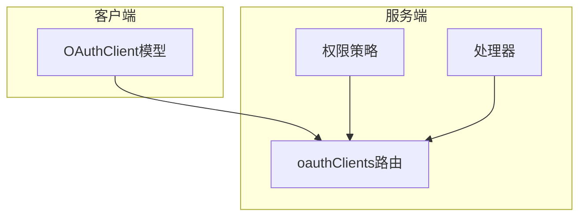
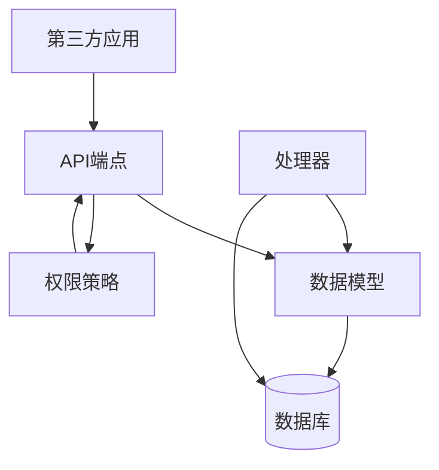
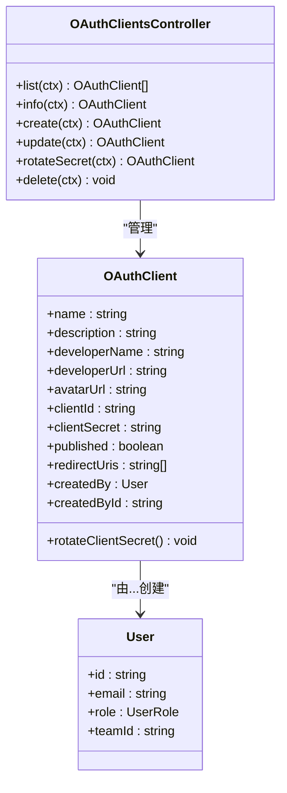
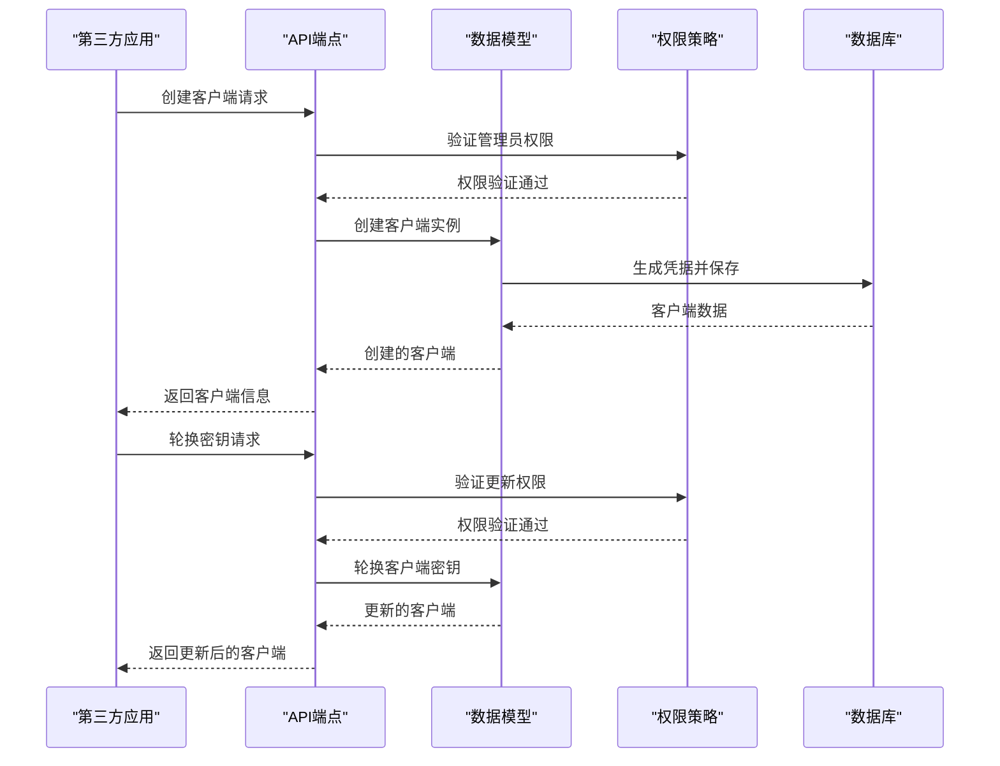
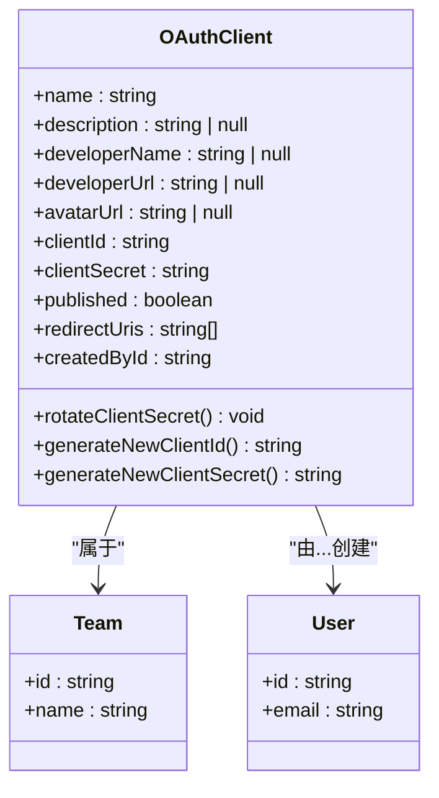
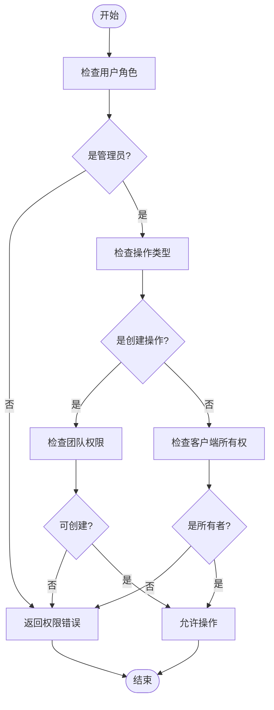
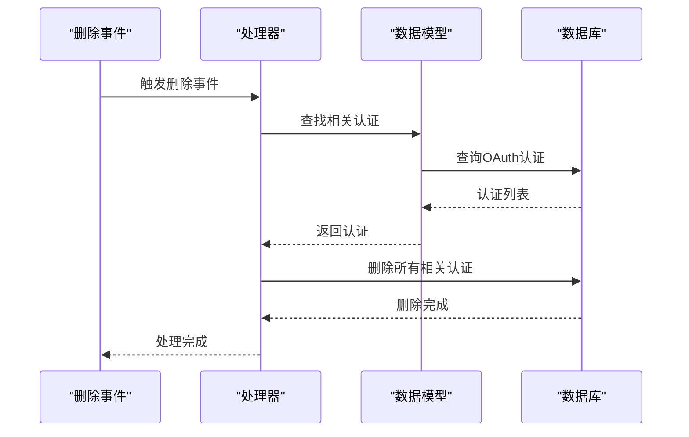
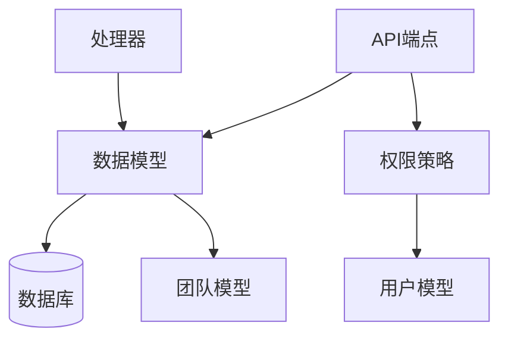

# OAuth客户端管理

<cite>
**本文档引用的文件**   
- [oauthClients.ts](file://server/routes/api/oauthClients/oauthClients.ts)
- [OAuthClient.ts](file://app/models/oauth/OAuthClient.ts)
- [OAuthClient.ts](file://server/models/oauth/OAuthClient.ts)
- [oauthClient.ts](file://server/policies/oauthClient.ts)
- [OAuthClientDeletedProcessor.ts](file://server/queues/processors/OAuthClientDeletedProcessor.ts)
</cite>

## 目录
1. [简介](#简介)
2. [项目结构](#项目结构)
3. [核心组件](#核心组件)
4. [架构概述](#架构概述)
5. [详细组件分析](#详细组件分析)
6. [依赖分析](#依赖分析)
7. [性能考虑](#性能考虑)
8. [故障排除指南](#故障排除指南)
9. [结论](#结论)
10. [附录](#附录)（如有必要）

## 简介
本文档详细介绍了OAuth客户端管理API的实现，重点涵盖OAuth 2.0客户端的注册、配置和管理功能。文档详细记录了客户端创建、更新、删除和密钥轮换的端点，解释了OAuthClient模型的数据结构、重定向URI验证和作用域管理。同时，说明了权限控制策略和清理逻辑，并提供了第三方应用集成OAuth认证的实际示例。

## 项目结构
项目结构清晰地组织了OAuth客户端管理相关的文件和模块。核心功能分布在服务器路由、模型定义、策略和处理器中。客户端管理的API端点位于`server/routes/api/oauthClients/`目录下，而客户端数据模型则在`app/models/oauth/`和`server/models/oauth/`中定义。

**Diagram sources**
- [oauthClients.ts](file://server/routes/api/oauthClients/oauthClients.ts)
- [OAuthClient.ts](file://app/models/oauth/OAuthClient.ts)

**Section sources**
- [oauthClients.ts](file://server/routes/api/oauthClients/oauthClients.ts)
- [OAuthClient.ts](file://app/models/oauth/OAuthClient.ts)

## 核心组件
核心组件包括OAuth客户端的API端点、数据模型、权限策略和处理器。这些组件共同实现了OAuth客户端的完整生命周期管理，从创建到删除，以及密钥轮换等操作。

**Section sources**
- [oauthClients.ts](file://server/routes/api/oauthClients/oauthClients.ts)
- [OAuthClient.ts](file://server/models/oauth/OAuthClient.ts)

## 架构概述
系统架构围绕OAuth客户端管理展开，通过API端点接收客户端操作请求，利用数据模型处理数据持久化，通过权限策略确保操作的安全性，并使用处理器执行清理任务。

**Diagram sources**
- [oauthClients.ts](file://server/routes/api/oauthClients/oauthClients.ts)
- [OAuthClient.ts](file://server/models/oauth/OAuthClient.ts)

## 详细组件分析

### OAuth客户端API端点分析
API端点实现了OAuth客户端的完整管理功能，包括创建、读取、更新和删除（CRUD）操作，以及密钥轮换。

#### API端点类图

**Diagram sources**
- [oauthClients.ts](file://server/routes/api/oauthClients/oauthClients.ts)
- [OAuthClient.ts](file://app/models/oauth/OAuthClient.ts)

#### API操作序列图

**Diagram sources**
- [oauthClients.ts](file://server/routes/api/oauthClients/oauthClients.ts)
- [OAuthClient.ts](file://server/models/oauth/OAuthClient.ts)

**Section sources**
- [oauthClients.ts](file://server/routes/api/oauthClients/oauthClients.ts)
- [OAuthClient.ts](file://server/models/oauth/OAuthClient.ts)

### OAuth客户端数据模型分析
数据模型定义了OAuth客户端的结构和行为，包括属性验证、关联关系和实例方法。

#### 数据模型类图

**Diagram sources**
- [OAuthClient.ts](file://server/models/oauth/OAuthClient.ts)
- [Team.ts](file://server/models/Team.ts)

**Section sources**
- [OAuthClient.ts](file://server/models/oauth/OAuthClient.ts)
- [Team.ts](file://server/models/Team.ts)

### 权限控制策略分析
权限策略定义了用户对OAuth客户端的操作权限，确保只有授权用户才能执行特定操作。

#### 权限策略流程图

**Diagram sources**
- [oauthClient.ts](file://server/policies/oauthClient.ts)

**Section sources**
- [oauthClient.ts](file://server/policies/oauthClient.ts)

### 清理逻辑分析
清理逻辑在OAuth客户端被删除时自动执行，确保相关认证记录也被清除。

#### 清理逻辑序列图

**Diagram sources**
- [OAuthClientDeletedProcessor.ts](file://server/queues/processors/OAuthClientDeletedProcessor.ts)
- [OAuthAuthentication.ts](file://server/models/oauth/OAuthAuthentication.ts)

**Section sources**
- [OAuthClientDeletedProcessor.ts](file://server/queues/processors/OAuthClientDeletedProcessor.ts)
- [OAuthAuthentication.ts](file://server/models/oauth/OAuthAuthentication.ts)

## 依赖分析
系统组件之间存在明确的依赖关系，API端点依赖于数据模型和权限策略，处理器依赖于数据模型来执行清理任务。

**Diagram sources**
- [oauthClients.ts](file://server/routes/api/oauthClients/oauthClients.ts)
- [OAuthClient.ts](file://server/models/oauth/OAuthClient.ts)

**Section sources**
- [oauthClients.ts](file://server/routes/api/oauthClients/oauthClients.ts)
- [OAuthClient.ts](file://server/models/oauth/OAuthClient.ts)

## 性能考虑
系统在处理OAuth客户端操作时考虑了性能优化，包括使用事务确保数据一致性，通过速率限制防止滥用，以及使用缓存减少数据库查询。

**Section sources**
- [oauthClients.ts](file://server/routes/api/oauthClients/oauthClients.ts)
- [OAuthClient.ts](file://server/models/oauth/OAuthClient.ts)

## 故障排除指南
常见问题包括权限错误、重定向URI验证失败和密钥轮换问题。确保用户具有管理员权限，重定向URI正确配置，并遵循密钥轮换的最佳实践。

**Section sources**
- [oauthClients.ts](file://server/routes/api/oauthClients/oauthClients.ts)
- [OAuthClient.ts](file://app/models/oauth/OAuthClient.ts)

## 结论
本文档全面介绍了OAuth客户端管理系统的实现，涵盖了API端点、数据模型、权限策略和清理逻辑。通过这些组件的协同工作，系统提供了安全可靠的OAuth客户端管理功能。