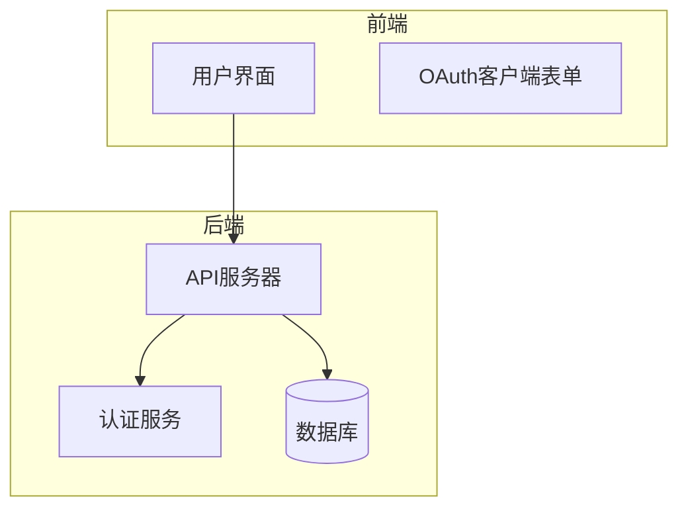
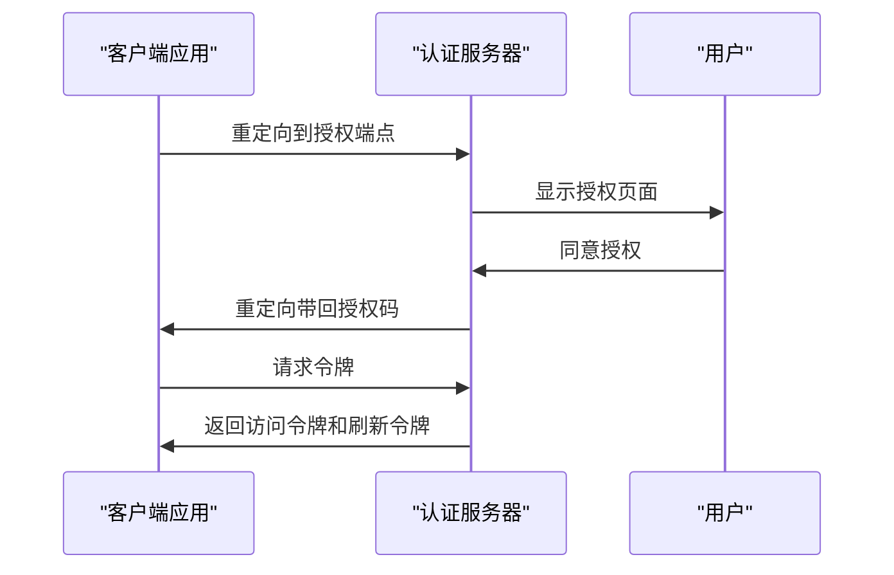
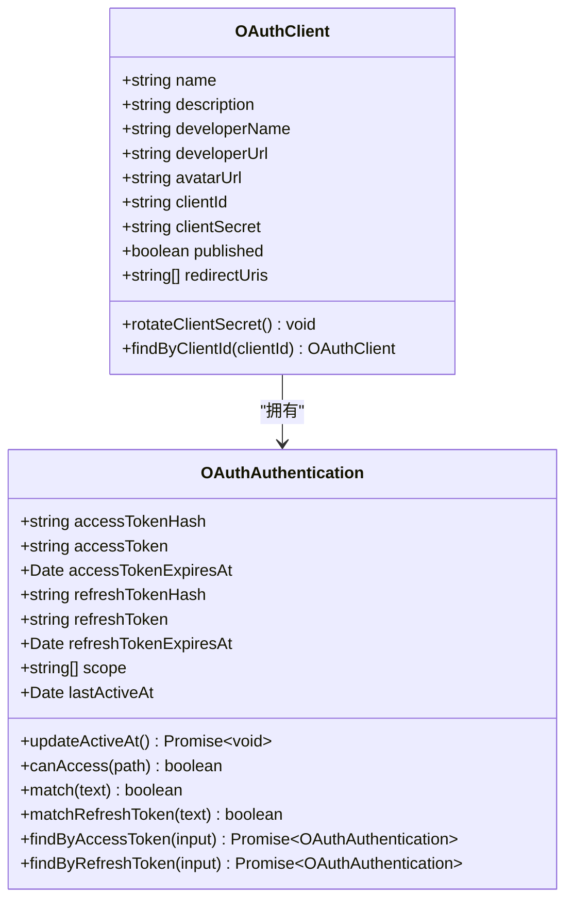
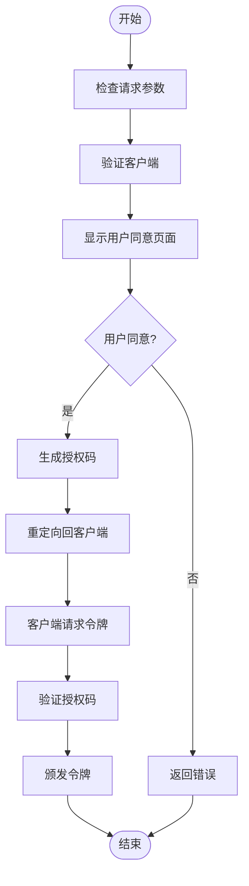
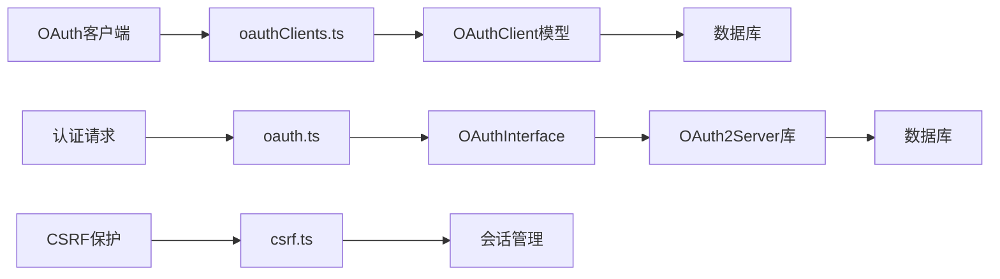

# OAuth认证流程

<cite>
**本文档引用的文件**   
- [oauthClients.ts](file://server/routes/api/oauthClients/oauthClients.ts)
- [OAuthAuthentication.ts](file://server/models/oauth/OAuthAuthentication.ts)
- [oauth.ts](file://server/routes/oauth/index.ts)
- [csrf.ts](file://server/middlewares/csrf.ts)
- [OAuthClient.ts](file://server/models/oauth/OAuthClient.ts)
- [OAuthInterface.ts](file://server/utils/oauth/OAuthInterface.ts)
- [oauthAuthentications.ts](file://server/routes/api/oauthAuthentications/oauthAuthentications.ts)
</cite>

## 目录
1. [介绍](#介绍)
2. [项目结构](#项目结构)
3. [核心组件](#核心组件)
4. [架构概述](#架构概述)
5. [详细组件分析](#详细组件分析)
6. [依赖分析](#依赖分析)
7. [性能考虑](#性能考虑)
8. [故障排除指南](#故障排除指南)
9. [结论](#结论)

## 介绍
本文档详细介绍了OAuth认证流程的实现机制，重点阐述了授权码流程的处理方式。文档涵盖了oauthClients.ts如何与OAuth认证系统集成，包括授权请求处理、令牌颁发和回调验证。同时解释了OAuthAuthentication.ts模型中的用户认证状态管理和会话处理机制，以及OAuth路由中的中间件和错误处理机制。通过完整的认证流程序列图展示了从客户端重定向到令牌获取的全过程，并包含了CSRF保护、PKCE实现和令牌有效期管理等安全性考虑。

## 项目结构
项目结构清晰地组织了OAuth相关组件，主要分为以下几个部分：
- `server/routes/api/oauthClients/`：包含OAuth客户端管理的API路由
- `server/models/oauth/`：包含OAuth相关的数据模型
- `server/routes/oauth/`：包含OAuth核心认证流程的路由
- `server/middlewares/`：包含CSRF保护等中间件
- `server/utils/oauth/`：包含OAuth接口实现

**图源**
- [oauthClients.ts](file://server/routes/api/oauthClients/oauthClients.ts#L1-L182)
- [OAuthAuthentication.ts](file://server/models/oauth/OAuthAuthentication.ts#L1-L221)

**节源**
- [oauthClients.ts](file://server/routes/api/oauthClients/oauthClients.ts#L1-L182)
- [OAuthAuthentication.ts](file://server/models/oauth/OAuthAuthentication.ts#L1-L221)

## 核心组件
核心组件包括OAuth客户端管理、认证状态管理和令牌处理。oauthClients.ts文件实现了OAuth客户端的创建、更新、删除和查询功能，通过Koa路由处理API请求。OAuthAuthentication.ts模型负责管理用户的认证状态，包括访问令牌、刷新令牌和作用域等信息。

**节源**
- [oauthClients.ts](file://server/routes/api/oauthClients/oauthClients.ts#L26-L182)
- [OAuthAuthentication.ts](file://server/models/oauth/OAuthAuthentication.ts#L26-L217)

## 架构概述
系统采用标准的OAuth 2.0授权码流程，结合PKCE（Proof Key for Code Exchange）增强安全性。认证流程包括授权请求、用户同意、授权码发放、令牌交换等步骤。系统通过中间件实现CSRF保护，确保认证过程的安全性。

**图源**
- [oauth.ts](file://server/routes/oauth/index.ts#L1-L135)
- [OAuthInterface.ts](file://server/utils/oauth/OAuthInterface.ts#L1-L293)

## 详细组件分析

### OAuth客户端管理分析
OAuth客户端管理组件负责处理客户端应用的注册和管理。系统通过oauthClients.ts文件中的路由处理客户端的创建、更新、删除和查询操作。每个客户端都有唯一的client_id和client_secret，用于身份验证。

**图源**
- [OAuthClient.ts](file://server/models/oauth/OAuthClient.ts#L1-L160)
- [OAuthAuthentication.ts](file://server/models/oauth/OAuthAuthentication.ts#L1-L221)

### 认证流程分析
认证流程组件实现了OAuth 2.0授权码流程的核心逻辑。系统通过oauth.ts文件中的路由处理授权和令牌请求，利用OAuthInterface.ts中的接口实现与OAuth2Server库的集成。

**图源**
- [oauth.ts](file://server/routes/oauth/index.ts#L1-L135)
- [OAuthInterface.ts](file://server/utils/oauth/OAuthInterface.ts#L1-L293)

## 依赖分析
系统依赖于多个关键组件和库来实现OAuth认证功能。主要依赖包括：
- `@node-oauth/oauth2-server`：提供OAuth 2.0协议的核心实现
- `sequelize`：用于数据库操作和模型管理
- `koa`：Web框架，处理HTTP请求和响应
- `crypto`：用于生成安全的随机字符串和哈希值

**图源**
- [go.mod](file://go.mod#L1-L20)
- [package.json](file://package.json#L1-L10)

**节源**
- [go.mod](file://go.mod#L1-L30)
- [package.json](file://package.json#L1-L50)

## 性能考虑
在性能方面，系统通过以下方式优化认证流程：
- 使用数据库索引加速OAuth客户端和认证记录的查询
- 实现令牌缓存机制，减少数据库访问频率
- 采用异步处理方式，提高请求处理效率
- 限制API调用频率，防止滥用

## 故障排除指南
常见问题及解决方案：
- **授权码无效**：检查授权码是否过期（默认有效期为10分钟）
- **重定向URI不匹配**：确保客户端注册的重定向URI与请求中的URI完全一致
- **CSRF令牌错误**：检查CSRF保护中间件是否正确配置
- **令牌刷新失败**：验证刷新令牌是否有效且未被撤销

**节源**
- [errors.ts](file://server/errors.ts#L1-L50)
- [validation.ts](file://server/validation.ts#L1-L30)

## 结论
本文档详细介绍了OAuth认证流程的实现机制，涵盖了从客户端管理到令牌处理的各个方面。系统采用标准的OAuth 2.0授权码流程，结合PKCE和CSRF保护等安全措施，确保了认证过程的安全性和可靠性。通过清晰的架构设计和模块化实现，系统具有良好的可维护性和扩展性。