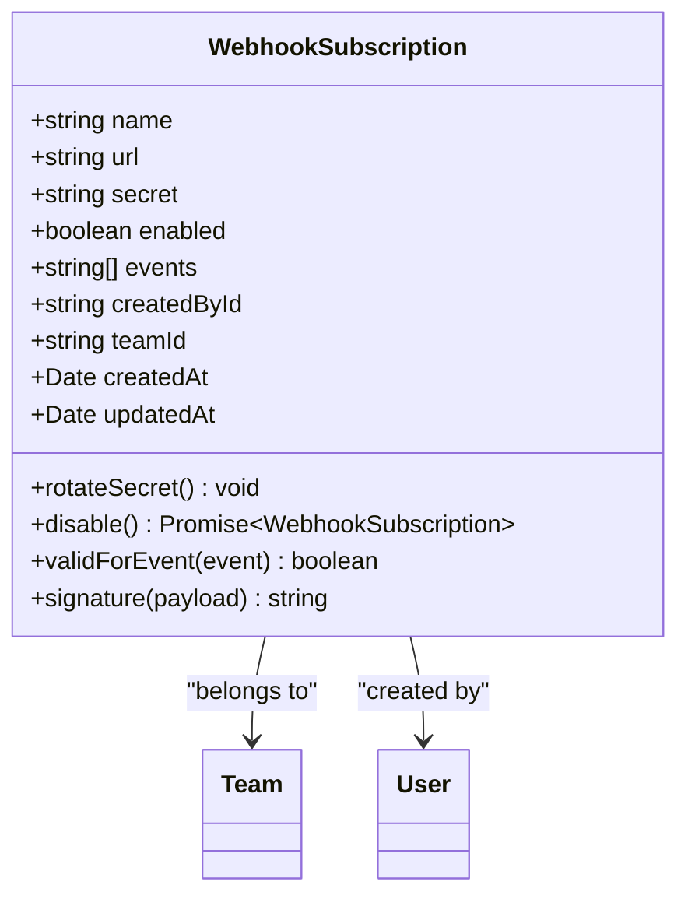
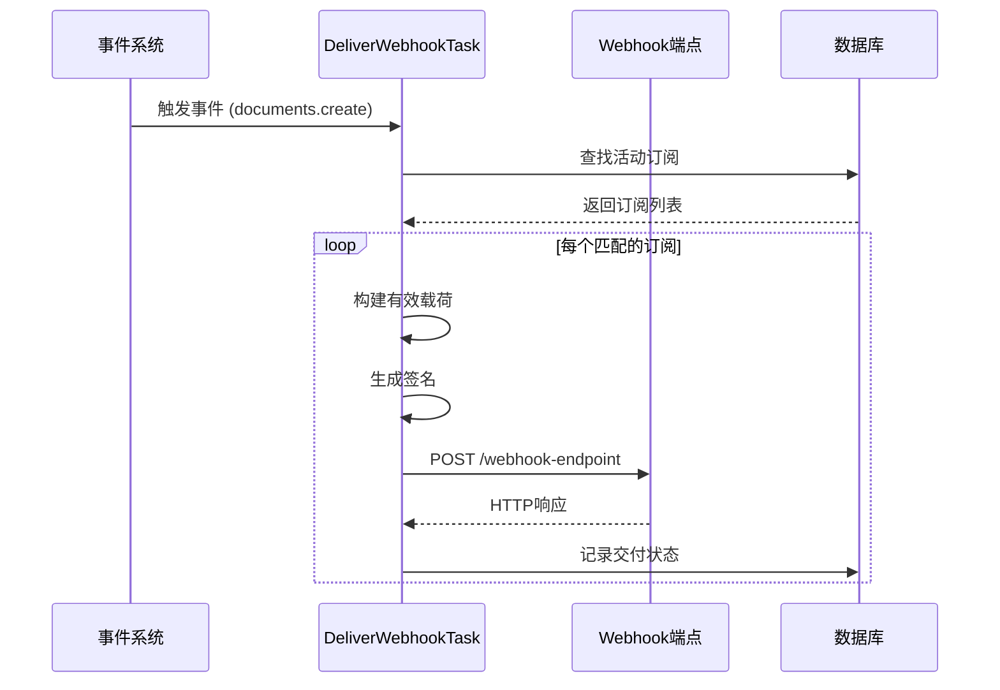
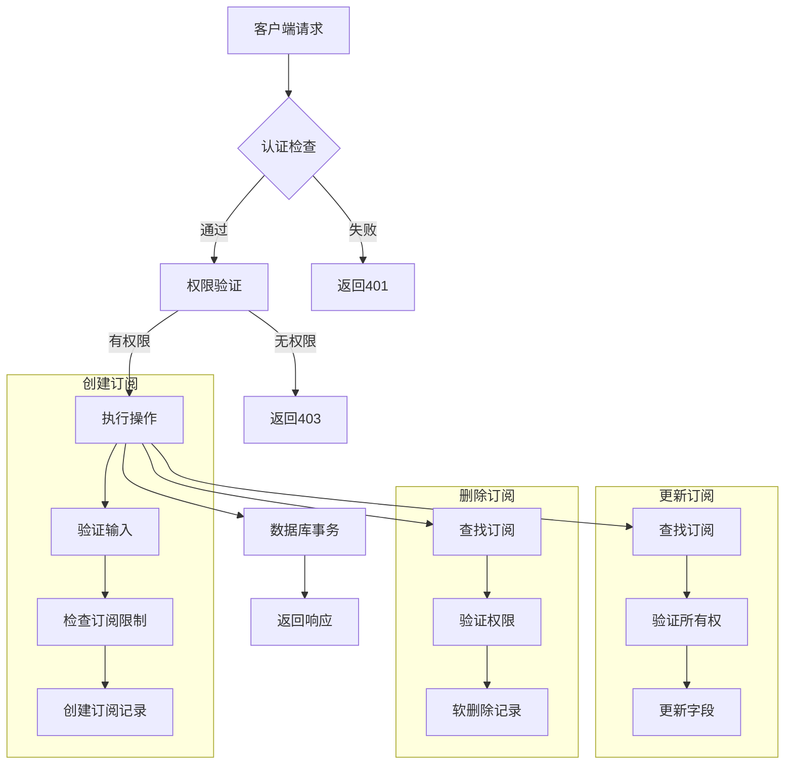
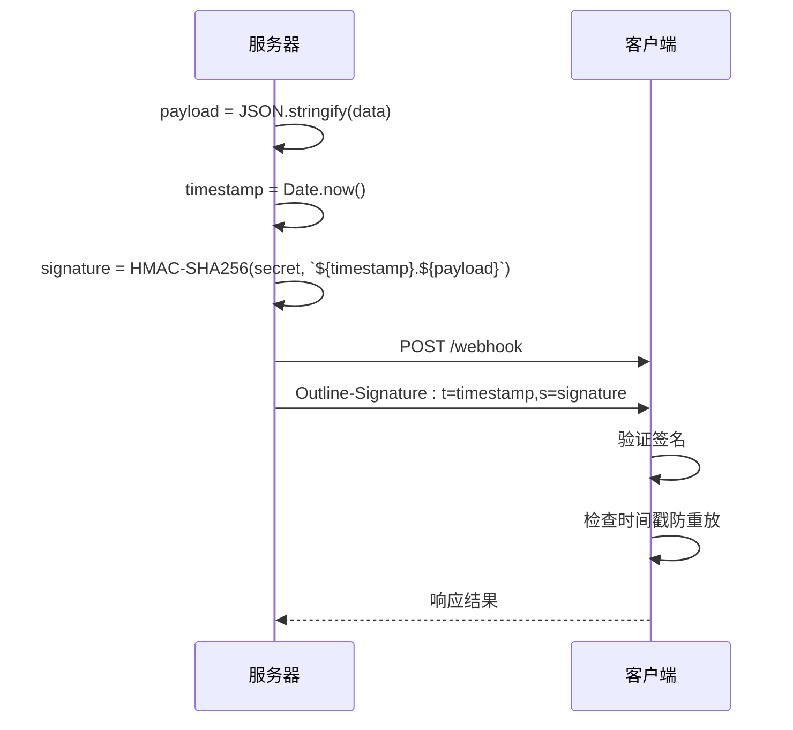
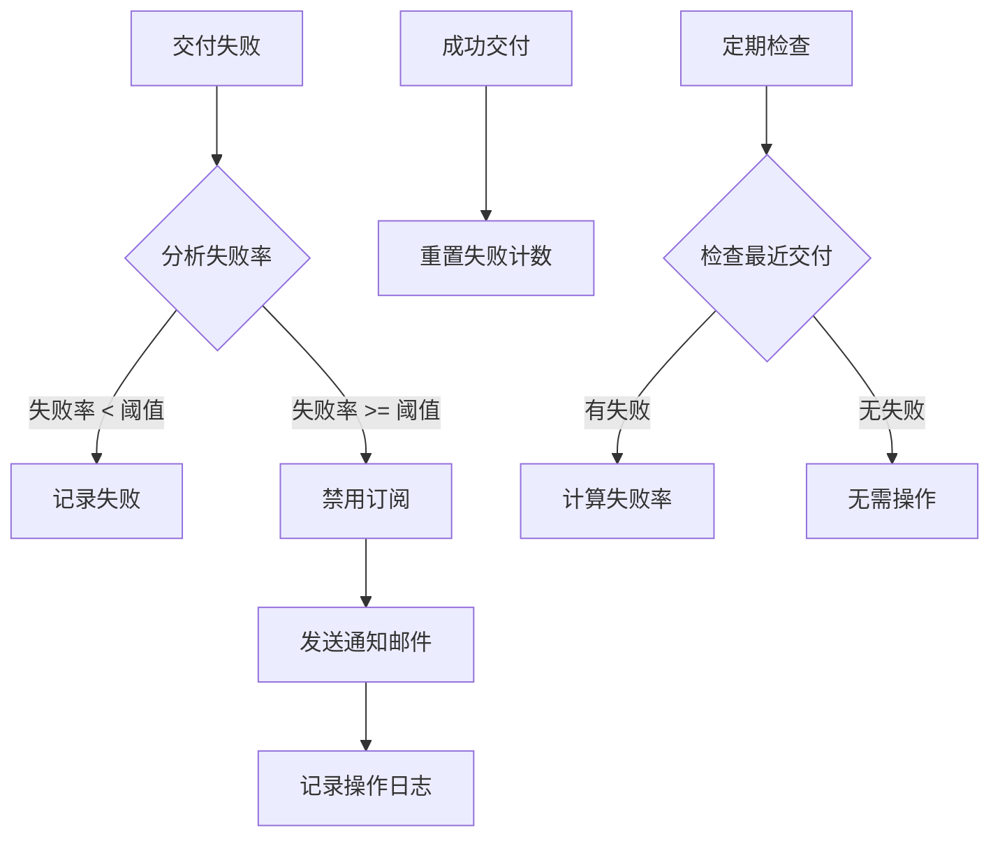
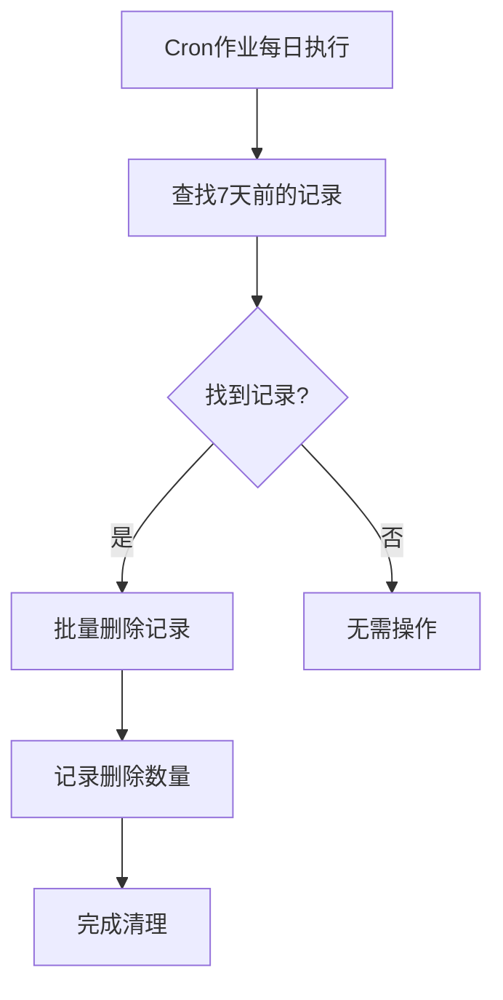
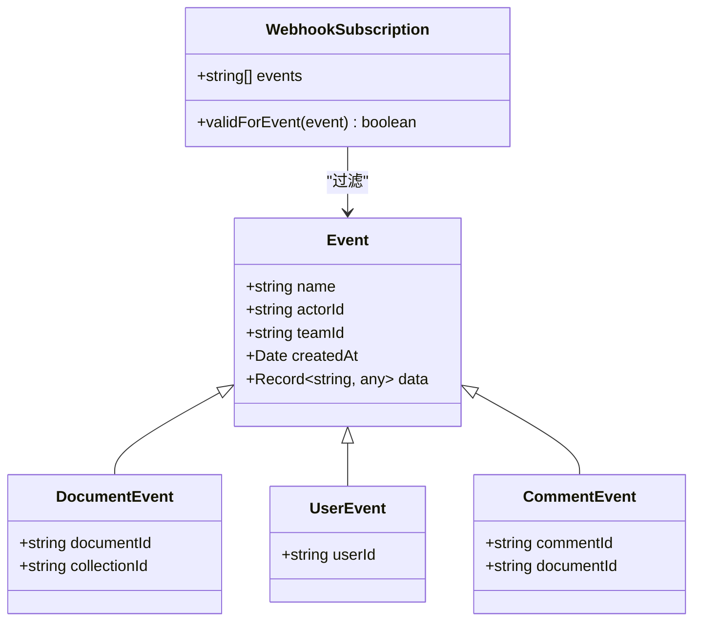
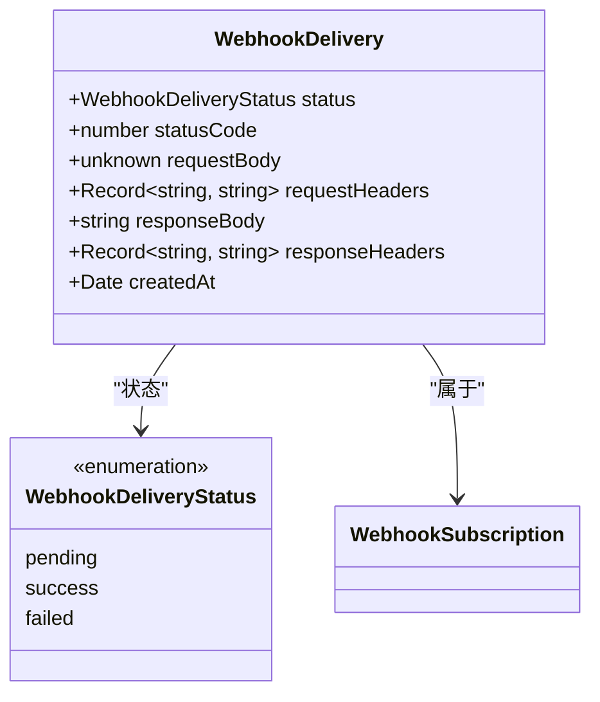
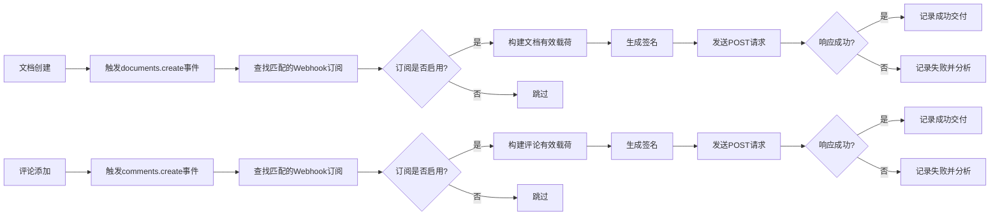

# Webhook管理

<cite>
**本文档中引用的文件**
- [WebhookSubscription.ts](file://app/models/WebhookSubscription.ts)
- [WebhookSubscription.ts](file://server/models/WebhookSubscription.ts)
- [DeliverWebhookTask.ts](file://plugins/webhooks/server/tasks/DeliverWebhookTask.ts)
- [CleanupWebhookDeliveriesTask.ts](file://plugins/webhooks/server/tasks/CleanupWebhookDeliveriesTask.ts)
- [validateWebhook.ts](file://server/middlewares/validateWebhook.ts)
- [webhookSubscriptions.ts](file://plugins/webhooks/server/api/webhookSubscriptions.ts)
- [webhookSubscription.ts](file://plugins/webhooks/server/presenters/webhookSubscription.ts)
- [webhook.ts](file://plugins/webhooks/server/presenters/webhook.ts)
- [WebhookDelivery.ts](file://server/models/WebhookDelivery.ts)
</cite>

## 目录
1. [简介](#简介)
2. [Webhook订阅数据结构](#webhook订阅数据结构)
3. [事件推送机制](#事件推送机制)
4. [端点管理](#端点管理)
5. [签名机制与安全性](#签名机制与安全性)
6. [重试策略与失败处理](#重试策略与失败处理)
7. [过期记录清理](#过期记录清理)
8. [事件类型与过滤](#事件类型与过滤)
9. [错误处理与调试](#错误处理与调试)
10. [实际应用示例](#实际应用示例)

## 简介
Webhook系统为应用程序提供了实时通知机制，当系统内发生特定事件时，会向预配置的URL发送HTTP请求。本系统实现了完整的Webhook订阅管理、事件推送、签名验证和失败处理机制。核心功能包括创建和管理Webhook订阅、处理各种事件类型、确保通信安全以及维护系统性能。

**Section sources**
- [WebhookSubscription.ts](file://app/models/WebhookSubscription.ts#L4-L26)
- [WebhookSubscription.ts](file://server/models/WebhookSubscription.ts#L30-L164)

## Webhook订阅数据结构
Webhook订阅模型定义了订阅的核心属性和行为。该模型在客户端和服务器端都有定义，确保了数据的一致性。

**Diagram sources**
- [WebhookSubscription.ts](file://server/models/WebhookSubscription.ts#L30-L164)

**Section sources**
- [WebhookSubscription.ts](file://server/models/WebhookSubscription.ts#L30-L164)

## 事件推送机制
事件推送由`DeliverWebhookTask`类处理，该类负责将事件交付给订阅的Webhook端点。系统采用异步任务队列模式，确保事件处理不会阻塞主应用流程。

**Diagram sources**
- [DeliverWebhookTask.ts](file://plugins/webhooks/server/tasks/DeliverWebhookTask.ts#L81-L842)

**Section sources**
- [DeliverWebhookTask.ts](file://plugins/webhooks/server/tasks/DeliverWebhookTask.ts#L81-L842)

## 端点管理
Webhook订阅通过REST API端点进行管理，支持创建、读取、更新和删除操作。所有端点都需要管理员权限认证。

**Diagram sources**
- [webhookSubscriptions.ts](file://plugins/webhooks/server/api/webhookSubscriptions.ts#L25-L136)

**Section sources**
- [webhookSubscriptions.ts](file://plugins/webhooks/server/api/webhookSubscriptions.ts#L25-L136)

## 签名机制与安全性
系统实现了基于HMAC的签名验证机制，确保Webhook请求的真实性和完整性。签名包含时间戳和签名值，防止重放攻击。

**Diagram sources**
- [validateWebhook.ts](file://server/middlewares/validateWebhook.ts#L0-L36)
- [WebhookSubscription.ts](file://server/models/WebhookSubscription.ts#L145-L164)

**Section sources**
- [validateWebhook.ts](file://server/middlewares/validateWebhook.ts#L0-L36)
- [WebhookSubscription.ts](file://server/models/WebhookSubscription.ts#L145-L164)

## 重试策略与失败处理
系统实现了智能的失败检测和处理机制。当Webhook交付连续失败时，系统会自动禁用订阅并通知创建者。

**Diagram sources**
- [DeliverWebhookTask.ts](file://plugins/webhooks/server/tasks/DeliverWebhookTask.ts#L763-L841)

**Section sources**
- [DeliverWebhookTask.ts](file://plugins/webhooks/server/tasks/DeliverWebhookTask.ts#L763-L841)

## 过期记录清理
系统定期清理过期的Webhook交付记录，保持数据库性能和存储效率。

**Diagram sources**
- [CleanupWebhookDeliveriesTask.ts](file://plugins/webhooks/server/tasks/CleanupWebhookDeliveriesTask.ts#L9-L32)

**Section sources**
- [CleanupWebhookDeliveriesTask.ts](file://plugins/webhooks/server/tasks/CleanupWebhookDeliveriesTask.ts#L9-L32)

## 事件类型与过滤
系统支持多种事件类型，并允许订阅者通过事件过滤器精确控制接收的事件。

**Diagram sources**
- [WebhookSubscription.ts](file://server/models/WebhookSubscription.ts#L122-L135)
- [DeliverWebhookTask.ts](file://plugins/webhooks/server/tasks/DeliverWebhookTask.ts#L100-L250)

**Section sources**
- [WebhookSubscription.ts](file://server/models/WebhookSubscription.ts#L122-L135)
- [DeliverWebhookTask.ts](file://plugins/webhooks/server/tasks/DeliverWebhookTask.ts#L100-L250)

## 错误处理与调试
系统提供了全面的错误处理和调试支持，包括详细的日志记录和交付状态跟踪。

**Diagram sources**
- [WebhookDelivery.ts](file://server/models/WebhookDelivery.ts#L15-L55)

**Section sources**
- [WebhookDelivery.ts](file://server/models/WebhookDelivery.ts#L15-L55)

## 实际应用示例
以下是处理文档创建和评论添加事件的实际示例：

**Diagram sources**
- [DeliverWebhookTask.ts](file://plugins/webhooks/server/tasks/DeliverWebhookTask.ts#L252-L383)
- [DeliverWebhookTask.ts](file://plugins/webhooks/server/tasks/DeliverWebhookTask.ts#L385-L443)

**Section sources**
- [DeliverWebhookTask.ts](file://plugins/webhooks/server/tasks/DeliverWebhookTask.ts#L252-L443)