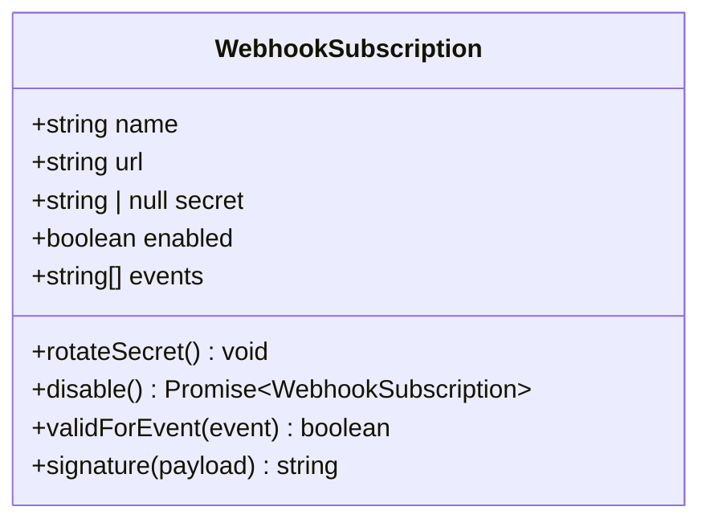
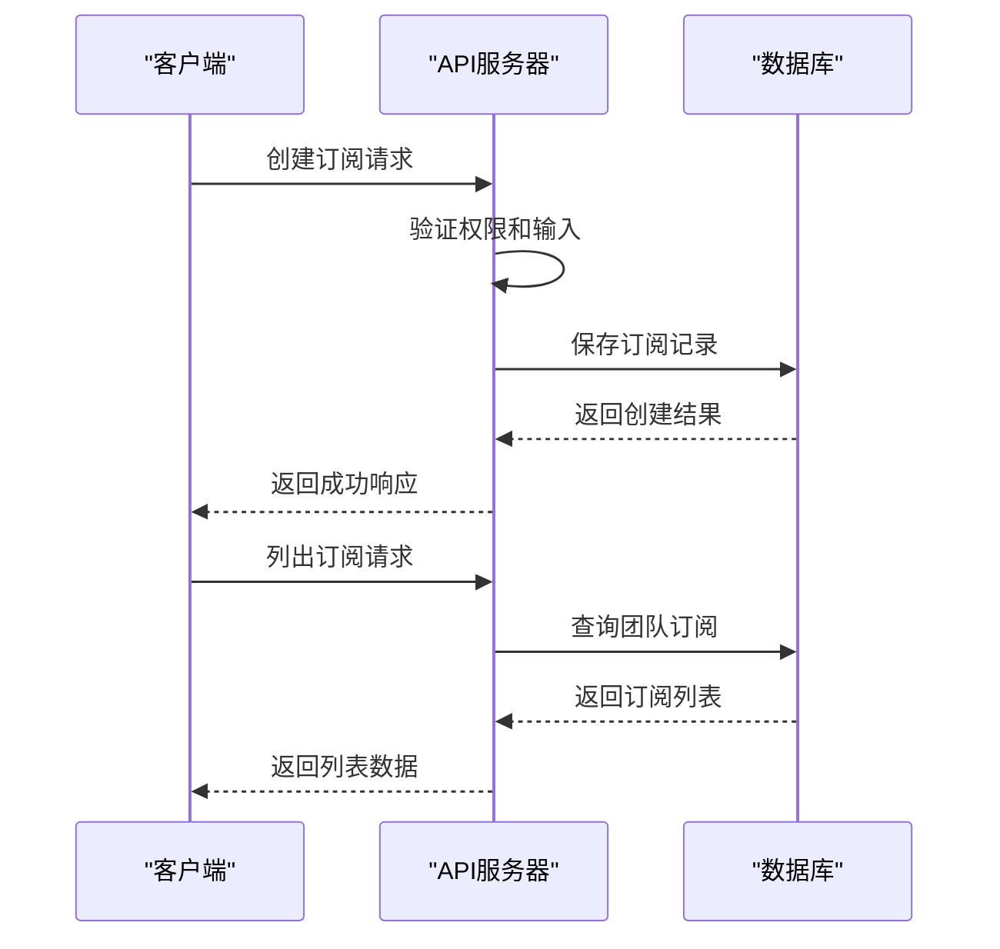
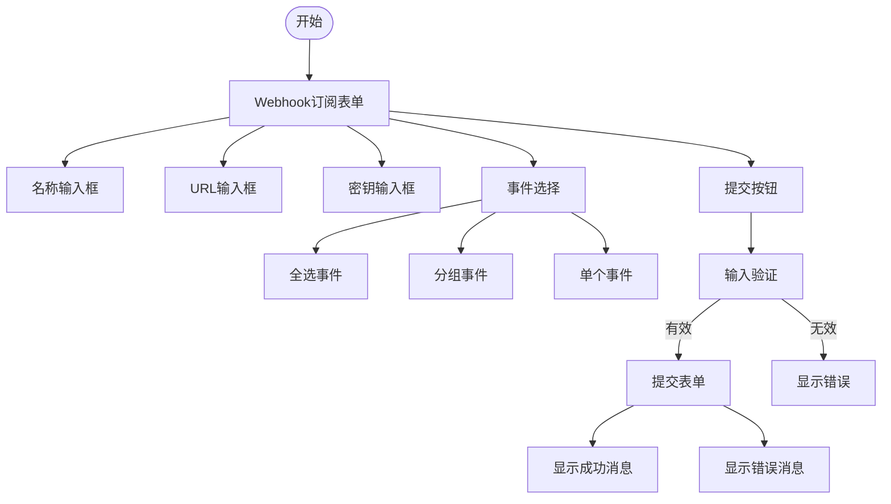
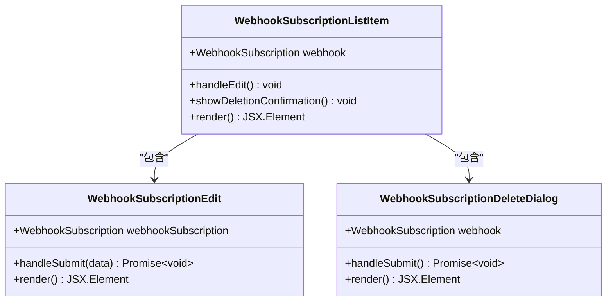
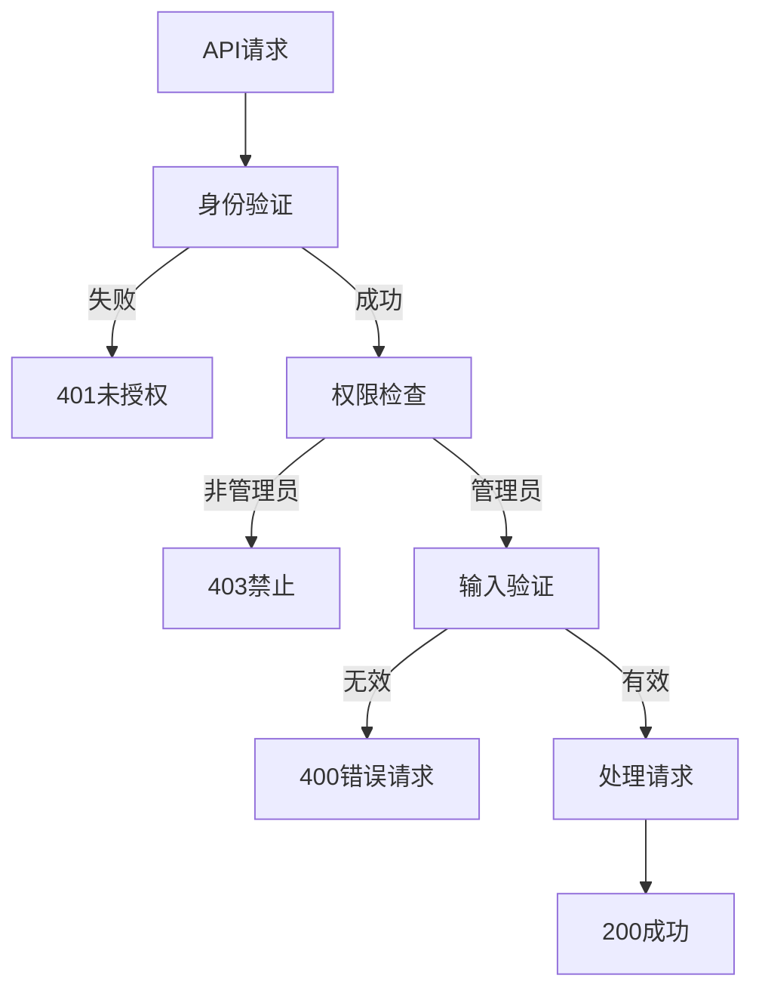
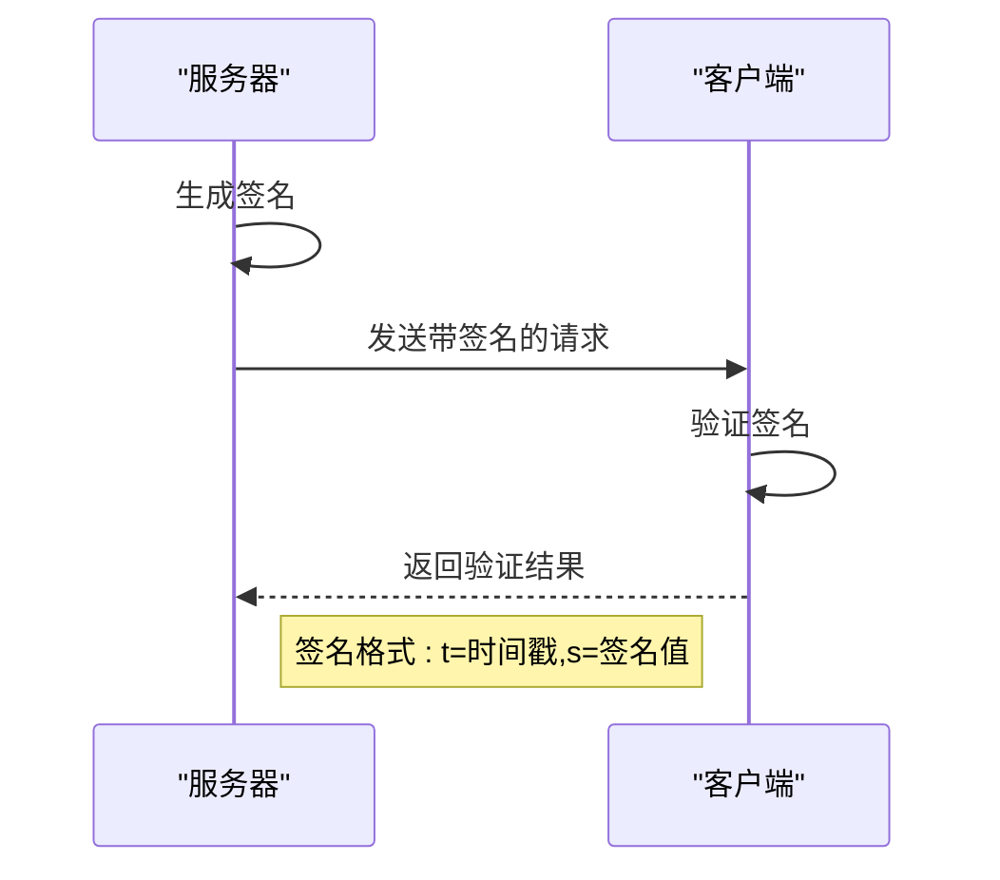
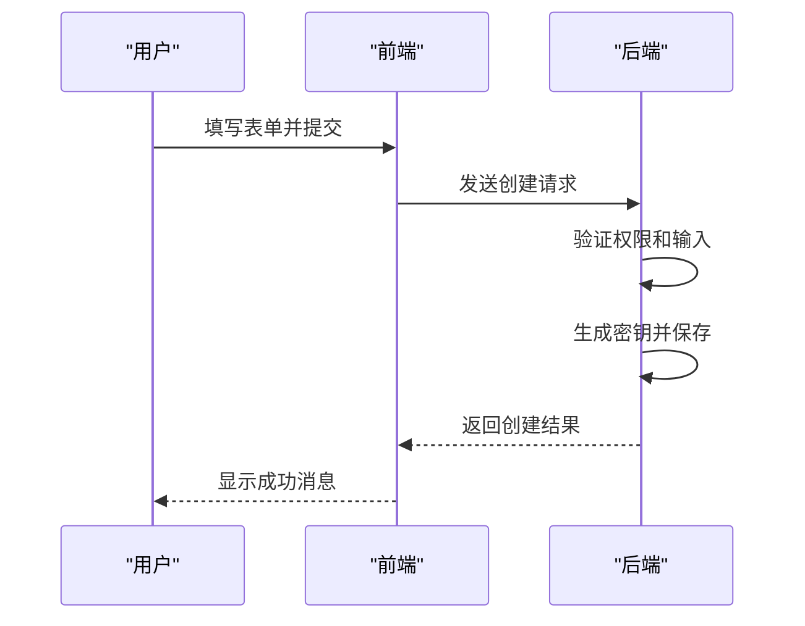
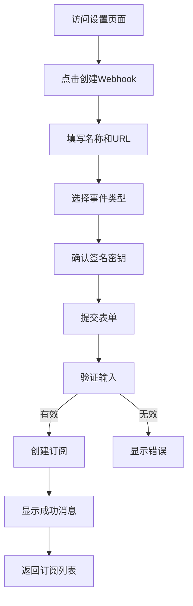

# Webhook订阅管理

<cite>
**本文档中引用的文件**  
- [WebhookSubscription.ts](file://app/models/WebhookSubscription.ts)
- [WebhookSubscriptionStore.ts](file://app/stores/WebhookSubscriptionStore.ts)
- [webhookSubscriptions.ts](file://plugins/webhooks/server/api/webhookSubscriptions.ts)
- [WebhookSubscriptionNew.tsx](file://plugins/webhooks/client/components/WebhookSubscriptionNew.tsx)
- [WebhookSubscriptionForm.tsx](file://plugins/webhooks/client/components/WebhookSubscriptionForm.tsx)
- [WebhookSubscriptionEdit.tsx](file://plugins/webhooks/client/components/WebhookSubscriptionEdit.tsx)
- [WebhookSubscriptionListItem.tsx](file://plugins/webhooks/client/components/WebhookSubscriptionListItem.tsx)
- [validateWebhook.ts](file://server/middlewares/validateWebhook.ts)
</cite>

## 目录
1. [简介](#简介)
2. [数据结构](#数据结构)
3. [API端点](#api端点)
4. [前端实现](#前端实现)
5. [权限与验证](#权限与验证)
6. [安全机制](#安全机制)
7. [使用示例](#使用示例)
8. [最佳实践](#最佳实践)

## 简介
Webhook订阅系统允许用户在特定事件发生时接收实时通知。该系统支持创建、更新、验证和删除Webhook订阅，通过安全的HTTP POST请求将事件数据推送到指定的URL。管理员可以管理团队范围内的Webhook订阅，系统提供了完整的前端界面和后端API支持。

## 数据结构

### Webhook订阅模型
Webhook订阅的核心数据结构包含以下字段：

- **name**: 订阅的名称，用于标识和描述
- **url**: 目标URL，事件发生时接收POST请求的端点
- **secret**: 签名密钥，用于验证请求来源的真实性
- **enabled**: 启用状态，布尔值表示订阅是否激活
- **events**: 事件类型数组，指定订阅的具体事件

**图源**
- [WebhookSubscription.ts](file://app/models/WebhookSubscription.ts#L4-L26)
- [WebhookSubscription.ts](file://server/models/WebhookSubscription.ts#L30-L164)

**节源**
- [WebhookSubscription.ts](file://app/models/WebhookSubscription.ts#L4-L26)
- [WebhookSubscription.ts](file://server/models/WebhookSubscription.ts#L30-L164)

## API端点

### 订阅管理API
系统提供了完整的RESTful API来管理Webhook订阅：

- **创建订阅**: `POST /api/webhookSubscriptions.create`
- **列出订阅**: `POST /api/webhookSubscriptions.list`
- **更新订阅**: `POST /api/webhookSubscriptions.update`
- **删除订阅**: `POST /api/webhookSubscriptions.delete`

**图源**
- [webhookSubscriptions.ts](file://plugins/webhooks/server/api/webhookSubscriptions.ts#L34-L88)
- [schema.ts](file://plugins/webhooks/server/api/schema.ts#L0-L37)

**节源**
- [webhookSubscriptions.ts](file://plugins/webhooks/server/api/webhookSubscriptions.ts#L34-L88)

## 前端实现

### 表单组件
前端实现了完整的Webhook订阅管理界面，包括创建、编辑和删除功能。

**图源**
- [WebhookSubscriptionForm.tsx](file://plugins/webhooks/client/components/WebhookSubscriptionForm.tsx#L0-L315)
- [WebhookSubscriptionNew.tsx](file://plugins/webhooks/client/components/WebhookSubscriptionNew.tsx#L0-L44)

**节源**
- [WebhookSubscriptionForm.tsx](file://plugins/webhooks/client/components/WebhookSubscriptionForm.tsx#L0-L315)
- [WebhookSubscriptionNew.tsx](file://plugins/webhooks/client/components/WebhookSubscriptionNew.tsx#L0-L44)

### 列表展示
订阅列表以清晰的方式展示所有活动和非活动的Webhook订阅。

**图源**
- [WebhookSubscriptionListItem.tsx](file://plugins/webhooks/client/components/WebhookSubscriptionListItem.tsx#L0-L85)
- [WebhookSubscriptionEdit.tsx](file://plugins/webhooks/client/components/WebhookSubscriptionEdit.tsx#L0-L50)

**节源**
- [WebhookSubscriptionListItem.tsx](file://plugins/webhooks/client/components/WebhookSubscriptionListItem.tsx#L0-L85)

## 权限与验证

### 输入验证
系统对Webhook订阅的输入数据进行严格验证：

- 名称长度限制为255个字符
- URL必须是有效的HTTP/HTTPS地址
- 每个团队的订阅数量有限制
- 事件类型必须是预定义的有效事件

### 权限控制
只有团队管理员才能管理Webhook订阅：

- 创建、更新和删除操作都需要管理员权限
- 用户身份通过JWT令牌验证
- 操作权限基于用户角色进行检查

**图源**
- [webhookSubscriptions.ts](file://plugins/webhooks/server/api/webhookSubscriptions.ts#L49-L68)
- [validateWebhook.ts](file://server/middlewares/validateWebhook.ts#L0-L36)

**节源**
- [webhookSubscriptions.ts](file://plugins/webhooks/server/api/webhookSubscriptions.ts#L49-L68)

## 安全机制

### 签名验证
系统使用HMAC-SHA256算法生成和验证Webhook请求的签名：

**图源**
- [WebhookSubscription.ts](file://server/models/WebhookSubscription.ts#L145-L164)
- [validateWebhook.ts](file://server/middlewares/validateWebhook.ts#L0-L36)

**节源**
- [WebhookSubscription.ts](file://server/models/WebhookSubscription.ts#L145-L164)

### 密钥管理
签名密钥的安全管理机制：

- 密钥在数据库中加密存储
- 支持密钥轮换功能
- 新创建的订阅会自动生成安全的随机密钥
- 密钥长度为32个字符，确保足够的安全性

## 使用示例

### API使用示例
通过API创建Webhook订阅的示例：

### UI交互流程
用户界面的完整交互流程：

**节源**
- [Settings.tsx](file://plugins/webhooks/client/Settings.tsx#L20-L78)
- [WebhookSubscriptionNew.tsx](file://plugins/webhooks/client/components/WebhookSubscriptionNew.tsx#L0-L44)

## 最佳实践

### 安全建议
- 使用HTTPS URL确保传输安全
- 定期轮换签名密钥
- 限制订阅的事件范围，只订阅必要的事件
- 在生产环境中验证Webhook端点的可用性

### 性能考虑
- 避免创建过多的Webhook订阅
- 确保目标URL具有足够的处理能力
- 监控Webhook交付的延迟和成功率
- 实施适当的重试机制处理临时故障

### 错误处理
系统实现了完善的错误处理机制：

- 输入验证失败时提供清晰的错误消息
- 权限不足时返回适当的HTTP状态码
- 数据库操作失败时进行适当的回滚
- 记录关键操作的日志以便审计和调试

**节源**
- [errors.ts](file://server/errors.ts#L113-L117)
- [onerror.ts](file://server/onerror.ts)