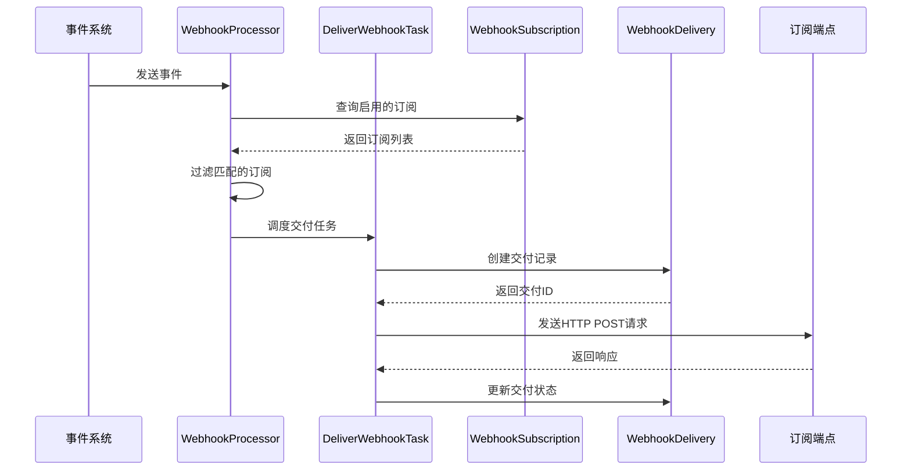
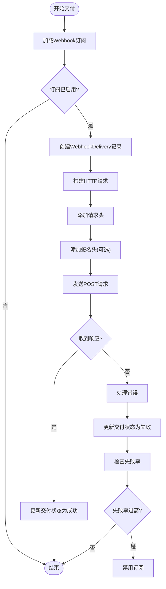
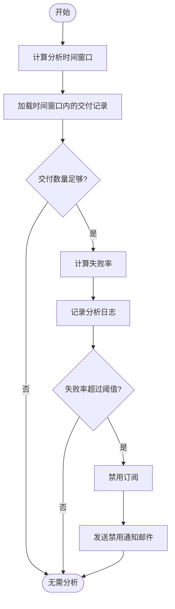
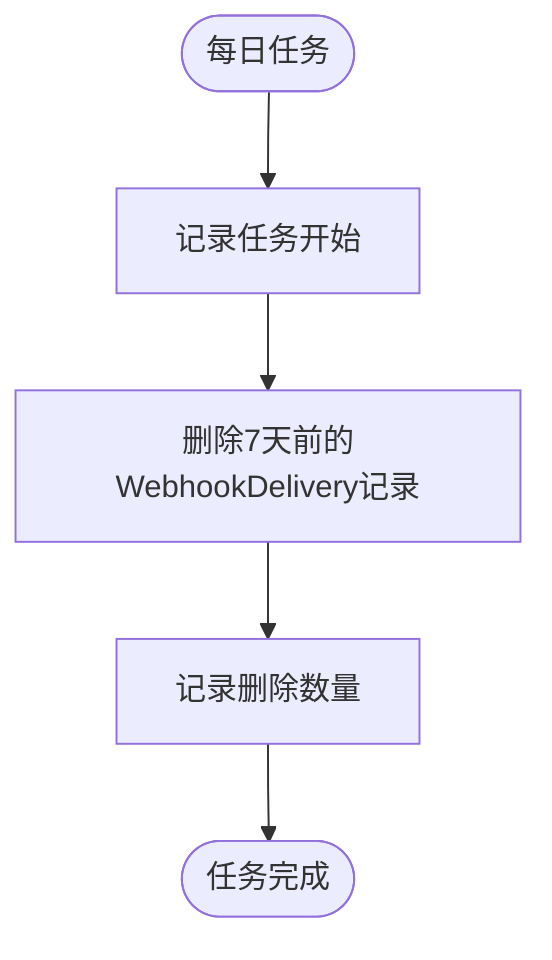

# 事件推送机制

<cite>
**本文档引用的文件**
- [WebhookProcessor.ts](file://plugins/webhooks/server/processors/WebhookProcessor.ts)
- [DeliverWebhookTask.ts](file://plugins/webhooks/server/tasks/DeliverWebhookTask.ts)
- [WebhookSubscription.ts](file://server/models/WebhookSubscription.ts)
- [WebhookDelivery.ts](file://server/models/WebhookDelivery.ts)
- [NotificationsProcessor.ts](file://server/queues/processors/NotificationsProcessor.ts)
- [webhook.ts](file://plugins/webhooks/server/presenters/webhook.ts)
- [CleanupWebhookDeliveriesTask.ts](file://plugins/webhooks/server/tasks/CleanupWebhookDeliveriesTask.ts)
</cite>

## 目录
1. [简介](#简介)
2. [核心组件](#核心组件)
3. [事件处理流程](#事件处理流程)
4. [HTTP请求与交付机制](#http请求与交付机制)
5. [重试与速率控制](#重试与速率控制)
6. [事件负载结构](#事件负载结构)
7. [性能优化建议](#性能优化建议)
8. [监控与清理](#监控与清理)

## 简介
本文档深入解析Webhook事件推送机制，重点描述DeliverWebhookTask如何从队列中处理事件并推送到订阅的端点。详细说明HTTP请求的构建过程、超时设置、重试策略（指数退避）和速率限制机制。解释NotificationsProcessor如何触发Webhook事件的生成和分发。涵盖事件负载的结构、序列化格式和时间戳处理。提供性能优化建议，如批量处理和连接池管理，并说明如何监控事件交付状态。

## 核心组件

Webhook事件推送机制由多个核心组件构成，包括WebhookProcessor、DeliverWebhookTask、WebhookSubscription和WebhookDelivery。这些组件协同工作，确保事件能够可靠地从系统推送到外部端点。

**Section sources**
- [WebhookProcessor.ts](file://plugins/webhooks/server/processors/WebhookProcessor.ts#L1-L35)
- [DeliverWebhookTask.ts](file://plugins/webhooks/server/tasks/DeliverWebhookTask.ts#L1-L844)
- [WebhookSubscription.ts](file://server/models/WebhookSubscription.ts#L1-L168)
- [WebhookDelivery.ts](file://server/models/WebhookDelivery.ts#L1-L59)

## 事件处理流程

Webhook事件处理流程始于事件的产生，通过WebhookProcessor进行订阅匹配，然后由DeliverWebhookTask负责实际的HTTP推送。整个流程确保了事件能够根据订阅规则被正确地分发到相应的端点。



**Diagram sources**
- [WebhookProcessor.ts](file://plugins/webhooks/server/processors/WebhookProcessor.ts#L1-L35)
- [DeliverWebhookTask.ts](file://plugins/webhooks/server/tasks/DeliverWebhookTask.ts#L1-L844)

**Section sources**
- [WebhookProcessor.ts](file://plugins/webhooks/server/processors/WebhookProcessor.ts#L1-L35)
- [DeliverWebhookTask.ts](file://plugins/webhooks/server/tasks/DeliverWebhookTask.ts#L1-L844)

## HTTP请求与交付机制

DeliverWebhookTask负责构建和发送HTTP请求到订阅的端点。请求包含序列化的事件负载和必要的头部信息，包括可选的签名验证。



**Diagram sources**
- [DeliverWebhookTask.ts](file://plugins/webhooks/server/tasks/DeliverWebhookTask.ts#L1-L844)
- [WebhookSubscription.ts](file://server/models/WebhookSubscription.ts#L1-L168)

**Section sources**
- [DeliverWebhookTask.ts](file://plugins/webhooks/server/tasks/DeliverWebhookTask.ts#L1-L844)

## 重试与速率控制

系统实现了智能的重试和速率控制机制，确保在面对临时性故障时能够自动恢复，同时避免对订阅端点造成过大的压力。

### 重试策略
系统采用指数退避算法进行重试，初始重试间隔较短，随着失败次数增加而指数级增长。当失败率达到预设阈值时，系统会自动禁用订阅以保护目标端点。

### 速率限制
通过RateLimiter组件实现全局和路径级别的速率限制，防止滥用和DDoS攻击。配置包括每分钟5到100次请求的多种策略。



**Diagram sources**
- [DeliverWebhookTask.ts](file://plugins/webhooks/server/tasks/DeliverWebhookTask.ts#L763-L842)
- [RateLimiter.ts](file://server/utils/RateLimiter.ts#L1-L102)

**Section sources**
- [DeliverWebhookTask.ts](file://plugins/webhooks/server/tasks/DeliverWebhookTask.ts#L763-L842)
- [RateLimiter.ts](file://server/utils/RateLimiter.ts#L1-L102)

## 事件负载结构

事件负载采用标准化的JSON格式，包含事件元数据和具体的负载数据。所有事件都遵循统一的结构，便于订阅方进行解析和处理。

### 负载格式
```json
{
  "id": "delivery-id",
  "actorId": "user-id",
  "webhookSubscriptionId": "subscription-id",
  "event": "event.name",
  "createdAt": "timestamp",
  "payload": {
    "id": "model-id",
    "model": { /* 模型数据 */ }
  }
}
```

### 时间戳处理
所有时间戳均采用ISO 8601格式，确保跨时区的一致性。创建时间(createdAt)字段精确到毫秒，提供足够的时间精度用于排序和分析。

**Section sources**
- [webhook.ts](file://plugins/webhooks/server/presenters/webhook.ts#L1-L39)
- [DeliverWebhookTask.ts](file://plugins/webhooks/server/tasks/DeliverWebhookTask.ts#L1-L844)

## 性能优化建议

为了确保Webhook系统的高性能和可扩展性，建议采用以下优化策略：

### 批量处理
对于高频率的事件，考虑实现批量处理机制，将多个事件合并为单个请求发送，减少网络开销和连接建立成本。

### 连接池管理
使用HTTP连接池来复用TCP连接，避免频繁的连接建立和关闭开销。配置合理的连接池大小和超时参数。

### 异步处理
确保所有Webhook处理都在异步任务队列中执行，避免阻塞主线程。合理设置任务优先级和重试策略。

### 缓存优化
对频繁访问的订阅信息进行缓存，减少数据库查询次数。使用Redis等内存数据库作为缓存层。

## 监控与清理

系统提供了完善的监控和清理机制，确保长期运行的稳定性和数据的整洁性。

### 交付状态监控
通过WebhookDelivery模型记录每次交付的详细信息，包括请求/响应头、状态码和响应体。这些数据可用于故障排查和性能分析。

### 自动清理
CleanupWebhookDeliveriesTask定期清理过期的交付记录，保持数据库的整洁。默认配置为删除一周前的记录。



**Diagram sources**
- [CleanupWebhookDeliveriesTask.ts](file://plugins/webhooks/server/tasks/CleanupWebhookDeliveriesTask.ts#L1-L32)

**Section sources**
- [CleanupWebhookDeliveriesTask.ts](file://plugins/webhooks/server/tasks/CleanupWebhookDeliveriesTask.ts#L1-L32)