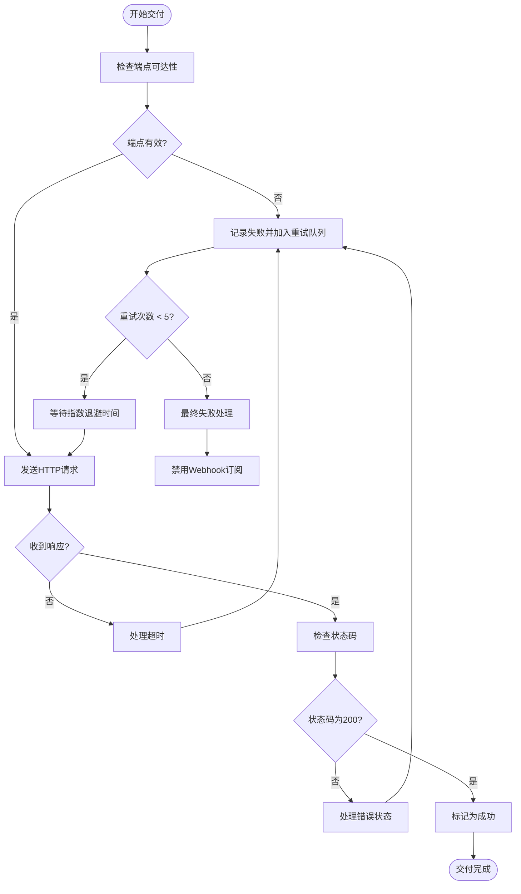
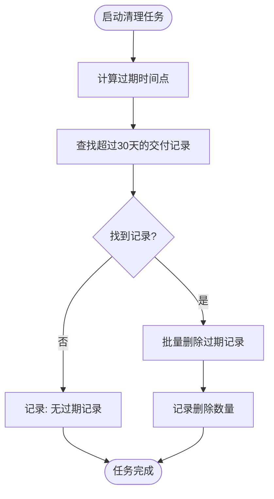
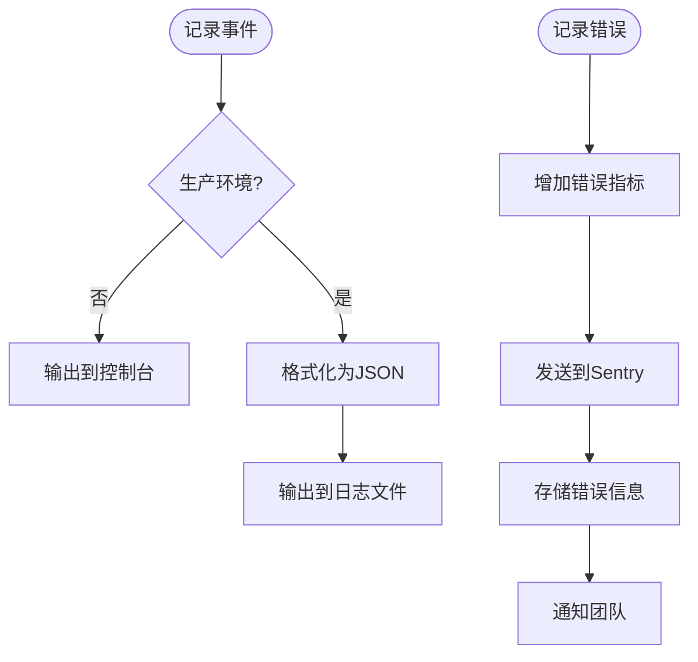

# 错误处理与恢复

<cite>
**本文档引用的文件**   
- [WebhookSubscription.ts](file://server/models/WebhookSubscription.ts)
- [WebhookDelivery.ts](file://server/models/WebhookDelivery.ts)
- [index.ts](file://server/queues/index.ts)
- [CleanupWebhookDeliveriesTask.ts](file://plugins/webhooks/server/tasks/CleanupWebhookDeliveriesTask.ts)
- [Logger.ts](file://server/logging/Logger.ts)
- [sentry.ts](file://server/logging/sentry.ts)
- [validateWebhook.ts](file://server/middlewares/validateWebhook.ts)
</cite>

## 目录
1. [Webhook错误处理机制](#webhook错误处理机制)
2. [重试逻辑与失败处理](#重试逻辑与失败处理)
3. [交付记录清理任务](#交付记录清理任务)
4. [日志记录与监控告警](#日志记录与监控告警)
5. [调试工具与方法](#调试工具与方法)

## Webhook错误处理机制

Webhook系统在目标端点不可达、返回错误状态码或超时时，会触发相应的错误处理流程。系统通过`WebhookSubscription`模型管理订阅，每个订阅包含名称、URL、启用状态和事件列表等属性。当事件发生时，系统会检查订阅的有效性，并尝试向配置的URL发送请求。

如果目标端点返回非200状态码或连接超时，系统会将交付状态标记为"failed"，并记录响应状态码、请求头、响应头和响应体等详细信息。这些信息存储在`WebhookDelivery`模型中，便于后续分析和调试。

**Section sources**
- [WebhookSubscription.ts](file://server/models/WebhookSubscription.ts#L30-L164)
- [WebhookDelivery.ts](file://server/models/WebhookDelivery.ts#L15-L55)

## 重试逻辑与失败处理

系统采用指数退避策略进行重试，最大重试次数为5次。重试间隔从1秒开始，每次重试间隔时间呈指数增长。这一配置在`server/queues/index.ts`中定义，通过`createQueue`函数创建任务队列时设置。

当Webhook交付失败达到预设阈值（默认24小时内失败率达到80%）时，系统会自动禁用该Webhook订阅，防止持续失败影响系统性能。此机制通过环境变量`WEBHOOK_FAILURE_TIME_WINDOW`和`WEBHOOK_FAILURE_RATE_THRESHOLD`进行配置。

**Diagram sources **
- [index.ts](file://server/queues/index.ts#L3-L9)
- [WebhookSubscription.ts](file://server/models/WebhookSubscription.ts#L89-L99)

## 交付记录清理任务

`CleanupWebhookDeliveriesTask`负责清理过期的Webhook交付记录，以维护数据库性能。该任务定期执行，删除超过30天的交付记录。清理操作通过`subDays`函数计算过期时间点，然后使用批量删除操作移除符合条件的记录。

此任务的优先级设置为后台任务，确保不会影响系统的正常运行。清理过程会记录删除的记录数量，便于监控和审计。通过定期清理过期数据，系统可以保持数据库的高效运行，避免存储空间的无谓消耗。

**Diagram sources **
- [CleanupWebhookDeliveriesTask.ts](file://plugins/webhooks/server/tasks/CleanupWebhookDeliveriesTask.ts#L14-L24)

## 日志记录与监控告警

系统使用Winston日志库进行详细的日志记录，所有Webhook相关的操作都会被记录。日志包含分类信息，如"webhooks"、"queue"等，便于过滤和分析。在生产环境中，日志以JSON格式输出，包含时间戳、级别、消息和附加数据。

错误信息会通过Sentry进行集中监控和告警。系统配置了Sentry DSN，所有错误都会被发送到Sentry服务。对于警告和错误级别的日志，系统会自动增加相应的监控指标。敏感信息如密码、令牌等在日志中会被过滤，确保数据安全。

**Diagram sources **
- [Logger.ts](file://server/logging/Logger.ts#L32-L257)
- [sentry.ts](file://server/logging/sentry.ts#L47-L87)

## 调试工具与方法

系统提供了多种调试工具和方法，帮助用户诊断和解决Webhook交付问题。首先，所有交付尝试的详细信息都存储在数据库中，包括请求头、响应头、状态码和响应体，便于排查问题。

开发者可以通过查看任务队列的状态来监控Webhook交付的进度。系统使用Bull队列管理异步任务，可以通过管理界面查看队列中的任务、重试次数和执行状态。此外，系统还提供了详细的日志记录，包含时间戳、级别和上下文信息。

对于Webhook接收端，系统支持签名验证，确保请求来自可信源。验证中间件会检查请求头中的签名，并与计算的签名进行比对。这一机制不仅提高了安全性，也为调试提供了便利，可以验证请求的完整性和来源。

**Section sources**
- [validateWebhook.ts](file://server/middlewares/validateWebhook.ts#L1-L36)
- [Logger.ts](file://server/logging/Logger.ts#L32-L257)
- [sentry.ts](file://server/logging/sentry.ts#L47-L87)