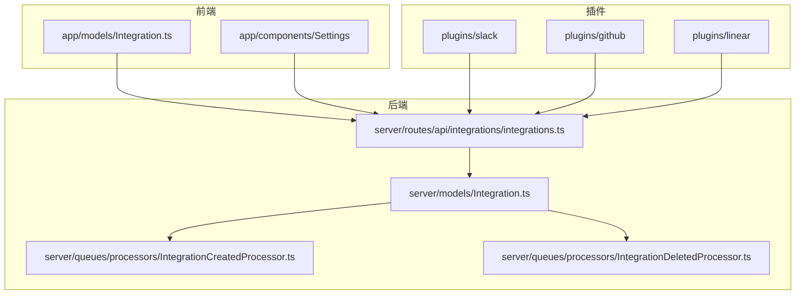
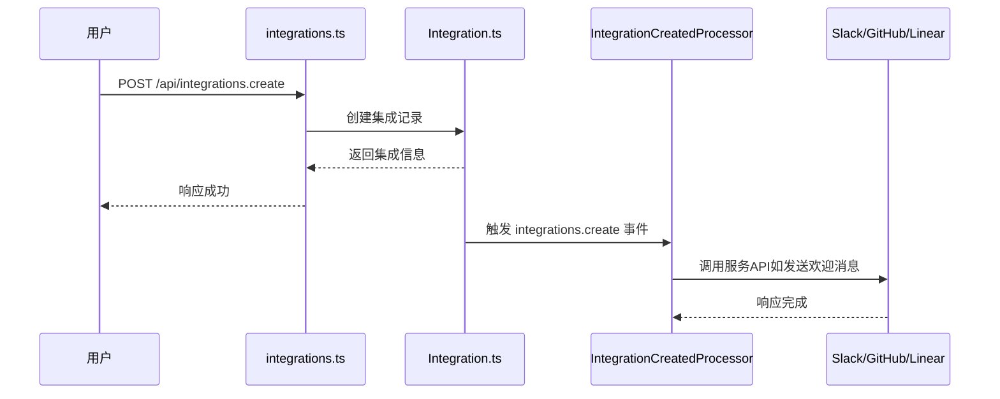
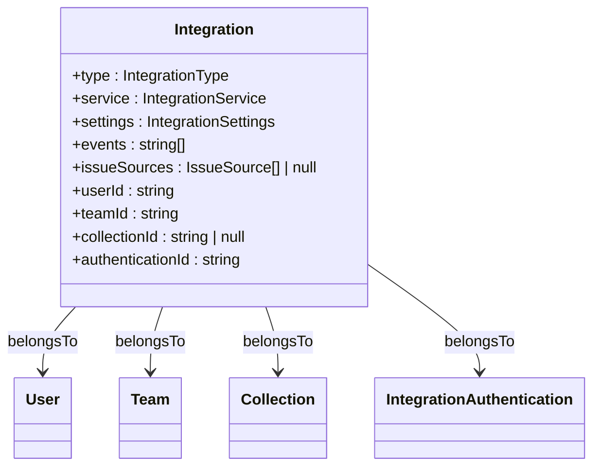
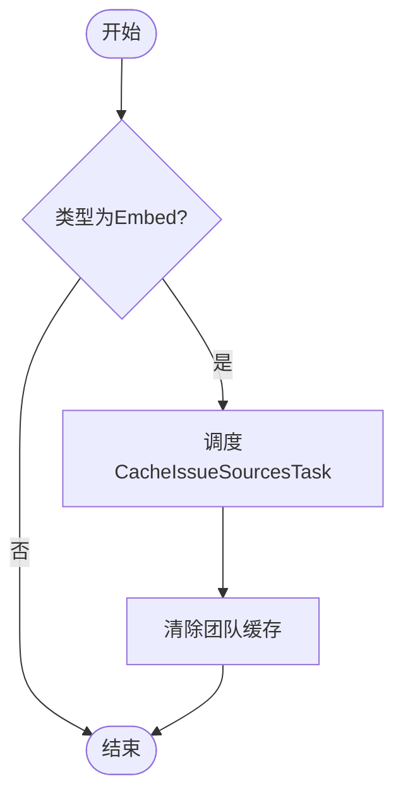
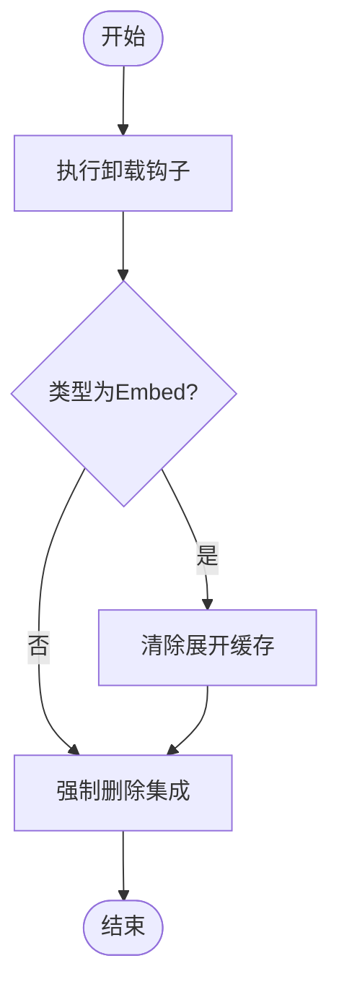
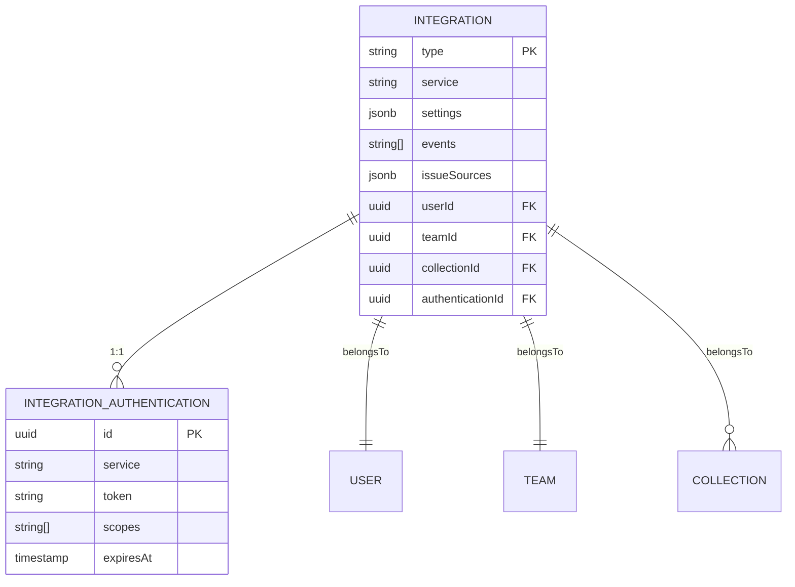

# 应用集成管理

<cite>
**本文档中引用的文件**  
- [integrations.ts](file://server/routes/api/integrations/integrations.ts)
- [Integration.ts](file://app/models/Integration.ts)
- [Integration.ts](file://server/models/Integration.ts)
- [IntegrationCreatedProcessor.ts](file://server/queues/processors/IntegrationCreatedProcessor.ts)
- [IntegrationDeletedProcessor.ts](file://server/queues/processors/IntegrationDeletedProcessor.ts)
- [SlackProcessor.ts](file://plugins/slack/server/processors/SlackProcessor.ts)
- [github.ts](file://plugins/github/server/api/github.ts)
- [linear.ts](file://plugins/linear/server/api/linear.ts)
</cite>

## 目录
1. [简介](#简介)
2. [项目结构](#项目结构)
3. [核心组件](#核心组件)
4. [架构概述](#架构概述)
5. [详细组件分析](#详细组件分析)
6. [依赖分析](#依赖分析)
7. [性能考虑](#性能考虑)
8. [故障排除指南](#故障排除指南)
9. [结论](#结论)

## 简介
本文档详细介绍了应用集成管理系统的API功能，重点涵盖集成的创建、配置、启用和禁用机制。系统通过RESTful端点实现与Slack、GitHub、Linear等第三方服务的无缝集成，支持事件驱动的自动化流程。文档深入解析了`Integration`模型的数据结构、验证规则及生命周期事件处理机制，并说明了`IntegrationCreatedProcessor`和`IntegrationDeletedProcessor`如何响应集成状态变更。此外，还涵盖了认证机制、错误处理策略、速率限制和安全性设计。

## 项目结构
该系统采用分层架构，前端位于`app/`目录，后端逻辑在`server/`目录，插件系统位于`plugins/`目录。核心集成逻辑由`server/routes/api/integrations/integrations.ts`中的REST API处理，模型定义在`server/models/Integration.ts`中，生命周期事件由`server/queues/processors/`下的处理器管理。各第三方服务（如Slack、GitHub、Linear）通过独立插件实现，确保功能解耦和可扩展性。

**图示来源**
- [integrations.ts](file://server/routes/api/integrations/integrations.ts)
- [Integration.ts](file://app/models/Integration.ts)
- [Integration.ts](file://server/models/Integration.ts)

## 核心组件
核心组件包括集成API控制器、集成数据模型、生命周期事件处理器以及各第三方服务插件。API控制器处理所有集成相关的CRUD操作，数据模型定义了集成的结构和关系，处理器负责在集成创建或删除时执行异步任务，插件则封装了与具体服务的交互逻辑。

**节来源**
- [integrations.ts](file://server/routes/api/integrations/integrations.ts)
- [Integration.ts](file://server/models/Integration.ts)

## 架构概述
系统采用事件驱动架构，当用户通过API创建或删除集成时，相应的事件被触发，由后台处理器执行后续操作。例如，创建Slack集成后，系统会发送欢迎消息到指定频道；创建GitHub或Linear集成后，会缓存可用的问题源。所有操作均通过事务保证数据一致性，并利用缓存机制提升性能。

**图示来源**
- [integrations.ts](file://server/routes/api/integrations/integrations.ts)
- [IntegrationCreatedProcessor.ts](file://server/queues/processors/IntegrationCreatedProcessor.ts)

## 详细组件分析

### 集成API控制器分析
`integrations.ts`文件实现了管理集成的RESTful端点，包括创建、读取、更新和删除操作。所有端点均需认证，且创建、更新、删除操作要求用户具有管理员权限。

#### API端点定义
以下表格列出了主要的RESTful端点：

| 端点 | HTTP方法 | 描述 | 认证要求 | 权限要求 |
|------|---------|------|----------|----------|
| `/api/integrations.create` | POST | 创建新的集成 | 必需 | 管理员 |
| `/api/integrations.list` | POST | 列出团队的集成 | 必需 | 无 |
| `/api/integrations.info` | POST | 获取集成详情 | 必需 | 读取权限 |
| `/api/integrations.update` | POST | 更新集成配置 | 必需 | 管理员 |
| `/api/integrations.delete` | POST | 删除集成 | 必需 | 删除权限 |

**节来源**
- [integrations.ts](file://server/routes/api/integrations/integrations.ts)

### 集成数据模型分析
`Integration.ts`模型定义了集成的核心数据结构，包含类型、服务、设置、事件等字段，并与用户、团队、集合等实体建立关联。

#### 数据结构与字段定义

**图示来源**
- [Integration.ts](file://server/models/Integration.ts)

**节来源**
- [Integration.ts](file://app/models/Integration.ts)
- [Integration.ts](file://server/models/Integration.ts)

### 生命周期事件处理器分析
`IntegrationCreatedProcessor`和`IntegrationDeletedProcessor`监听集成的创建和删除事件，并执行相应的异步任务。

#### 集成创建处理器流程

**图示来源**
- [IntegrationCreatedProcessor.ts](file://server/queues/processors/IntegrationCreatedProcessor.ts)

#### 集成删除处理器流程

**图示来源**
- [IntegrationDeletedProcessor.ts](file://server/queues/processors/IntegrationDeletedProcessor.ts)

**节来源**
- [IntegrationCreatedProcessor.ts](file://server/queues/processors/IntegrationCreatedProcessor.ts)
- [IntegrationDeletedProcessor.ts](file://server/queues/processors/IntegrationDeletedProcessor.ts)

### 第三方服务集成示例

#### Slack集成
Slack集成支持两种类型：`Post`和`Command`。`Post`类型用于在文档发布或更新时向Slack频道发送通知，`Command`类型允许通过Slack命令与系统交互。

- **配置参数**：Webhook URL、频道名称、频道ID
- **权限设置**：需要`incoming-webhook`权限
- **事件处理**：监听`documents.publish`和`revisions.create`事件

**节来源**
- [SlackProcessor.ts](file://plugins/slack/server/processors/SlackProcessor.ts)

#### GitHub集成
GitHub集成类型为`Embed`，用于在文档中嵌入GitHub问题和拉取请求的预览。

- **配置参数**：安装ID、仓库信息、OAuth令牌
- **权限设置**：通过GitHub应用安装获取权限
- **事件处理**：监听`installation`、`installation_repositories`、`repository`等Webhook事件，同步权限和仓库变更

**节来源**
- [github.ts](file://plugins/github/server/api/github.ts)

#### Linear集成
Linear集成类型为`Embed`，用于在文档中嵌入Linear问题的预览。

- **配置参数**：工作区ID、名称、密钥、Logo URL
- **权限设置**：需要`read,issues:create` OAuth范围
- **事件处理**：在OAuth回调中创建集成，并调度任务上传工作区Logo

**节来源**
- [linear.ts](file://plugins/linear/server/api/linear.ts)

## 依赖分析
系统依赖Sequelize作为ORM，Koa作为Web框架，通过插件机制实现功能扩展。各插件通过`PluginManager`注册钩子函数，在集成生命周期事件中被调用。数据库层面，`Integration`模型与`IntegrationAuthentication`、`User`、`Team`、`Collection`等模型存在外键关联。

**图示来源**
- [Integration.ts](file://server/models/Integration.ts)

**节来源**
- [Integration.ts](file://server/models/Integration.ts)

## 性能考虑
系统通过多种机制优化性能：
- **缓存**：使用`CacheHelper`清除相关缓存，确保数据一致性。
- **异步处理**：耗时操作（如获取问题源、上传Logo）通过任务队列异步执行。
- **数据库优化**：合理使用索引，避免N+1查询，通过`include`一次性加载关联数据。
- **节流与延迟**：在发送通知前加入延迟，避免短时间内重复通知。

## 故障排除指南
常见问题及解决方案：
- **集成创建失败**：检查OAuth回调中的错误信息，确认环境变量（如`SLACK_CLIENT_ID`）已正确配置。
- **通知未发送**：确认集成的`events`字段包含相应事件，且文档已发布。
- **嵌入预览不显示**：检查`issueSources`是否已正确缓存，确认第三方服务的权限设置。
- **Webhook验证失败**：确保`GITHUB_WEBHOOK_SECRET`等密钥配置正确。

**节来源**
- [integrations.ts](file://server/routes/api/integrations/integrations.ts)
- [SlackProcessor.ts](file://plugins/slack/server/processors/SlackProcessor.ts)

## 结论
本文档全面介绍了应用集成管理系统的架构与实现。系统通过清晰的RESTful API、灵活的数据模型和事件驱动的处理机制，实现了与多种第三方服务的高效集成。通过插件化设计，系统具备良好的可扩展性，能够轻松支持新的集成服务。安全性、性能和用户体验在设计中均得到充分考虑，为用户提供稳定可靠的集成体验。