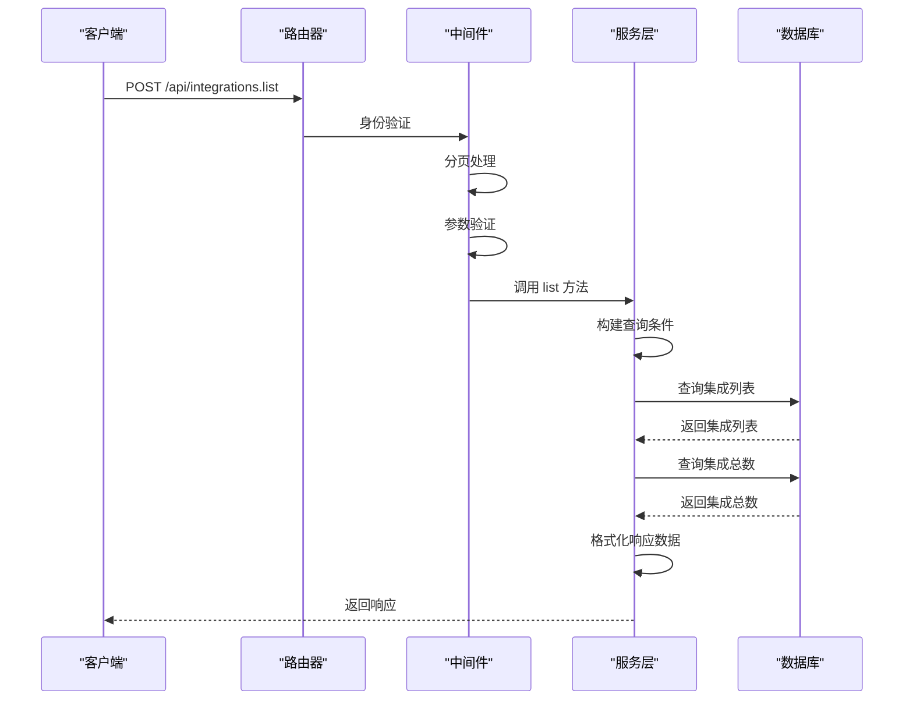
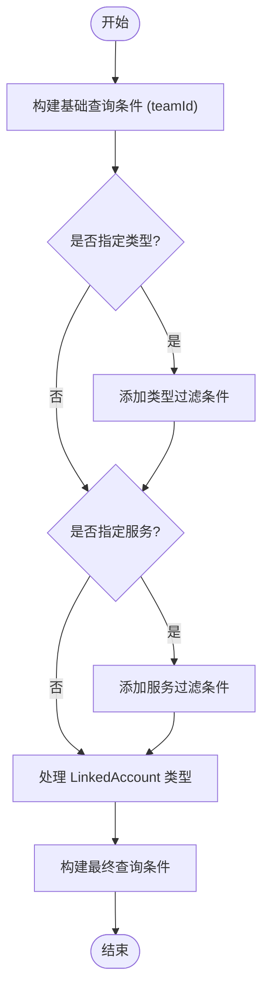
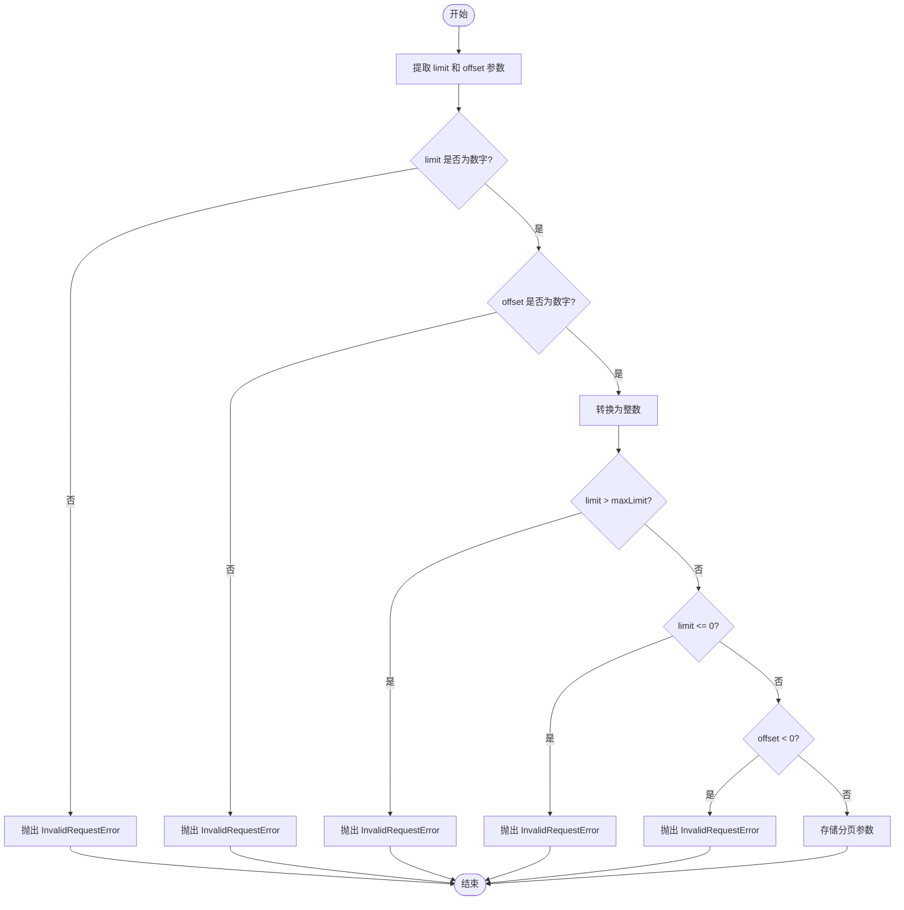
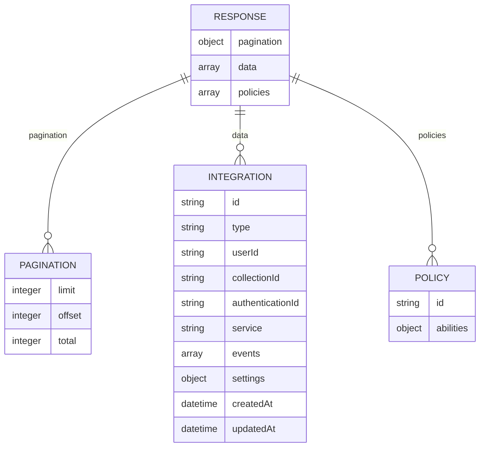

# 集成列表

<cite>
**本文档中引用的文件**  
- [integrations.ts](file://server/routes/api/integrations/integrations.ts)
- [Integration.ts](file://server/models/Integration.ts)
- [schema.ts](file://server/routes/api/integrations/schema.ts)
- [integration.ts](file://server/presenters/integration.ts)
- [pagination.ts](file://server/routes/api/middlewares/pagination.ts)
- [constants.ts](file://shared/constants.ts)
</cite>

## 目录
1. [简介](#简介)
2. [核心实现分析](#核心实现分析)
3. [查询参数与过滤机制](#查询参数与过滤机制)
4. [分页机制](#分页机制)
5. [响应数据结构](#响应数据结构)
6. [集成状态表示](#集成状态表示)
7. [查询示例](#查询示例)
8. [性能优化措施](#性能优化措施)

## 简介
本文档详细介绍了集成列表功能的实现，重点分析了 `integrations.ts` 文件中 `list` 方法的具体实现。文档涵盖了 `GET /api/integrations` 端点的查询参数、过滤条件和分页机制，解释了响应数据结构和集成状态的表示方式，并提供了按类型、状态等条件查询集成的示例。此外，还涵盖了性能优化措施，如查询优化和缓存策略。

## 核心实现分析
`integrations.ts` 文件中的 `list` 方法是集成列表功能的核心实现。该方法通过 `router.post` 定义了一个名为 `integrations.list` 的路由，处理集成列表的请求。方法首先从请求体中提取排序方向、服务类型、集成类型和排序字段等参数，然后根据用户身份构建查询条件，最后调用 `Integration.findAll` 和 `Integration.count` 方法获取集成列表和总数。



**Diagram sources**
- [integrations.ts](file://server/routes/api/integrations/integrations.ts#L0-L45)

**Section sources**
- [integrations.ts](file://server/routes/api/integrations/integrations.ts#L0-L45)

## 查询参数与过滤机制
`GET /api/integrations` 端点支持多种查询参数，用于过滤和排序集成列表。主要查询参数包括：

- **direction**: 排序方向，可选值为 `ASC` 或 `DESC`，默认为 `DESC`。
- **sort**: 排序字段，可选值为 `Integration` 模型中的任意字段，默认为 `updatedAt`。
- **type**: 集成类型，可选值为 `IntegrationType` 枚举中的任意值。
- **service**: 集成服务，可选值为 `IntegrationService` 枚举中的任意值。

查询条件的构建逻辑如下：
1. 首先根据用户所属团队构建基础查询条件。
2. 如果指定了集成类型，则添加类型过滤条件。
3. 如果指定了集成服务，则添加服务过滤条件。
4. 特殊处理 `LinkedAccount` 类型的集成，这些集成是用户特定的，其他集成是工作区范围的。



**Diagram sources**
- [integrations.ts](file://server/routes/api/integrations/integrations.ts#L0-L45)
- [schema.ts](file://server/routes/api/integrations/schema.ts#L0-L41)

**Section sources**
- [integrations.ts](file://server/routes/api/integrations/integrations.ts#L0-L45)
- [schema.ts](file://server/routes/api/integrations/schema.ts#L0-L41)

## 分页机制
分页机制通过 `pagination` 中间件实现，该中间件在请求处理过程中自动解析和验证分页参数。分页参数包括 `limit` 和 `offset`，分别表示每页显示的记录数和起始偏移量。默认每页显示 25 条记录，最大每页显示 100 条记录。

分页中间件的处理流程如下：
1. 从请求查询参数或请求体中提取 `limit` 和 `offset` 参数。
2. 验证参数是否为有效数字。
3. 将参数转换为整数类型。
4. 检查 `limit` 是否超过最大限制。
5. 检查 `limit` 是否大于 0。
6. 检查 `offset` 是否大于等于 0。
7. 将处理后的分页参数存储在 `ctx.state.pagination` 中，供后续处理使用。



**Diagram sources**
- [pagination.ts](file://server/routes/api/middlewares/pagination.ts#L0-L57)
- [constants.ts](file://shared/constants.ts#L0-L44)

**Section sources**
- [pagination.ts](file://server/routes/api/middlewares/pagination.ts#L0-L57)
- [constants.ts](file://shared/constants.ts#L0-L44)

## 响应数据结构
响应数据结构包含分页信息、集成列表和权限策略。具体结构如下：

- **pagination**: 分页信息，包含 `limit`、`offset` 和 `total` 字段。
- **data**: 集成列表，每个集成对象包含 `id`、`type`、`userId`、`collectionId`、`authenticationId`、`service`、`events`、`settings`、`createdAt` 和 `updatedAt` 字段。
- **policies**: 权限策略，包含用户对每个集成的权限信息。



**Diagram sources**
- [integrations.ts](file://server/routes/api/integrations/integrations.ts#L47-L104)
- [integration.ts](file://server/presenters/integration.ts#L0-L16)

**Section sources**
- [integrations.ts](file://server/routes/api/integrations/integrations.ts#L47-L104)
- [integration.ts](file://server/presenters/integration.ts#L0-L16)

## 集成状态表示
集成状态通过 `Integration` 模型的字段表示，主要包括：

- **type**: 集成类型，表示集成的功能类别，如 `Post`、`Command`、`Embed` 等。
- **service**: 集成服务，表示集成的具体服务提供商，如 `Slack`、`GoogleAnalytics` 等。
- **events**: 事件列表，表示集成监听的事件类型。
- **settings**: 配置信息，表示集成的具体配置参数。

这些字段共同描述了集成的状态和配置，用户可以通过这些字段了解集成的功能和配置情况。

**Section sources**
- [Integration.ts](file://server/models/Integration.ts#L25-L105)

## 查询示例
以下是一些常见的查询示例：

1. **按类型查询**:
   ```http
   POST /api/integrations.list
   Content-Type: application/json

   {
     "type": "post"
   }
   ```

2. **按服务查询**:
   ```http
   POST /api/integrations.list
   Content-Type: application/json

   {
     "service": "slack"
   }
   ```

3. **按类型和服务查询**:
   ```http
   POST /api/integrations.list
   Content-Type: application/json

   {
     "type": "post",
     "service": "slack"
   }
   ```

4. **排序查询**:
   ```http
   POST /api/integrations.list
   Content-Type: application/json

   {
     "sort": "createdAt",
     "direction": "ASC"
   }
   ```

5. **分页查询**:
   ```http
   POST /api/integrations.list
   Content-Type: application/json

   {
     "limit": 10,
     "offset": 0
   }
   ```

**Section sources**
- [integrations.ts](file://server/routes/api/integrations/integrations.ts#L0-L45)
- [schema.ts](file://server/routes/api/integrations/schema.ts#L0-L41)

## 性能优化措施
为了提高集成列表功能的性能，采取了以下优化措施：

1. **查询优化**: 使用 `Promise.all` 并行执行 `findAll` 和 `count` 查询，减少数据库访问时间。
2. **分页限制**: 设置最大分页限制，防止一次性查询过多数据导致性能问题。
3. **参数验证**: 在中间件中进行参数验证，确保请求参数的有效性，避免无效查询。
4. **缓存策略**: 虽然当前实现中未直接体现缓存策略，但可以通过在更高层次（如应用层或代理层）添加缓存来进一步优化性能。

这些优化措施共同确保了集成列表功能的高效性和稳定性。

**Section sources**
- [integrations.ts](file://server/routes/api/integrations/integrations.ts#L47-L104)
- [pagination.ts](file://server/routes/api/middlewares/pagination.ts#L0-L57)