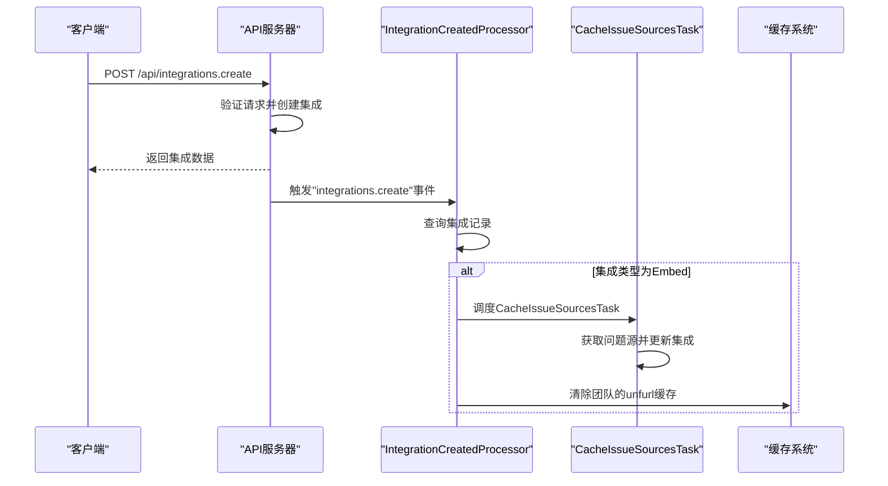

# 集成创建

<cite>
**本文档中引用的文件**  
- [integrations.ts](file://server/routes/api/integrations/integrations.ts)
- [Integration.ts](file://server/models/Integration.ts)
- [Integration.ts](file://app/models/Integration.ts)
- [IntegrationCreatedProcessor.ts](file://server/queues/processors/IntegrationCreatedProcessor.ts)
- [schema.ts](file://server/routes/api/integrations/schema.ts)
- [types.ts](file://shared/types.ts)
</cite>

## 目录
1. [简介](#简介)
2. [集成实体模型](#集成实体模型)
3. [创建集成端点](#创建集成端点)
4. [创建后的异步处理](#创建后的异步处理)
5. [具体集成示例](#具体集成示例)
6. [错误处理](#错误处理)
7. [结论](#结论)

## 简介
本文档详细介绍了系统中集成创建功能的实现，重点分析了 `integrations.ts` 文件中 `create` 方法的实现逻辑。文档涵盖了 `POST /api/integrations` 端点的请求参数、验证规则和响应格式，解释了 `Integration.ts` 模型中集成实体的字段定义、数据类型和约束条件，并描述了 `IntegrationCreatedProcessor` 如何处理集成创建后的异步任务，包括事件通知和资源初始化。此外，还提供了创建 Slack、GitHub 等集成的具体代码示例以及常见错误场景的处理方式。

## 集成实体模型

`Integration` 模型定义了集成实体的核心结构和数据约束。该模型在服务器端和客户端都有定义，确保了数据的一致性。

### 字段定义与数据类型
`Integration` 模型包含以下关键字段：

- **type**: 集成类型，使用 `IntegrationType` 枚举定义，包括 `Post`、`Command`、`Embed`、`Analytics`、`LinkedAccount` 和 `Import`。
- **service**: 集成服务，使用 `IntegrationService` 枚举定义，如 `Slack`、`GitHub`、`GoogleAnalytics` 等。
- **settings**: 集成的配置信息，存储为 JSONB 格式，其结构根据 `type` 和 `service` 的不同而变化。
- **events**: 事件列表，存储为字符串数组，用于指定集成监听的事件类型。
- **issueSources**: 问题源列表，存储为 JSONB 格式，用于映射外部问题跟踪系统。
- **userId**: 创建集成的用户ID，外键关联到 `User` 模型。
- **teamId**: 所属团队ID，外键关联到 `Team` 模型。
- **collectionId**: 关联的集合ID，外键关联到 `Collection` 模型（可选）。
- **authenticationId**: 认证信息ID，外键关联到 `IntegrationAuthentication` 模型。

### 约束条件
- `type` 和 `service` 字段使用 `@IsIn` 装饰器进行验证，确保其值在预定义的枚举范围内。
- `settings` 字段的结构由 `IntegrationsCreateSchema` 在 API 层进行验证，确保其符合特定服务的要求。
- 模型通过 `@BelongsTo` 和 `@ForeignKey` 装饰器定义了与其他模型的关联关系，确保了数据的完整性和一致性。

**Section sources**
- [Integration.ts](file://server/models/Integration.ts#L25-L105)
- [types.ts](file://shared/types.ts#L138-L140)

## 创建集成端点

`POST /api/integrations.create` 端点负责处理集成的创建请求。该端点位于 `server/routes/api/integrations/integrations.ts` 文件中。

### 请求参数
该端点接受以下请求参数：

- **type**: 集成类型 (`IntegrationType`)，必填。
- **service**: 集成服务 (`IntegrationService`)，必填。
- **settings**: 集成的配置对象，可选，其结构根据 `type` 和 `service` 的不同而变化。

### 验证规则
请求参数通过 `IntegrationsCreateSchema` 进行验证：

- `type` 必须是 `IntegrationType` 枚举中的一个有效值。
- `service` 必须是 `UserCreatableIntegrationService` 枚举中的一个有效值（如 `Diagrams`, `Grist`, `GoogleAnalytics` 等）。
- `settings` 对象的验证是动态的，根据 `type` 和 `service` 的组合进行：
  - 对于 `Embed` 类型的 `Diagrams` 或 `Grist` 服务，`settings` 必须包含一个有效的 `url`。
  - 对于 `Analytics` 类型的 `GoogleAnalytics` 服务，`settings` 必须包含 `measurementId`。
  - 其他组合有相应的特定验证规则。

### 响应格式
成功创建集成后，API 返回以下格式的响应：

```json
{
  "data": {
    "id": "string",
    "type": "string",
    "userId": "string",
    "collectionId": "string",
    "authenticationId": "string",
    "service": "string",
    "events": ["string"],
    "settings": {},
    "createdAt": "string",
    "updatedAt": "string"
  },
  "policies": [...]
}
```

响应体中的 `data` 字段包含了新创建的集成对象，`policies` 字段包含了与当前用户相关的权限策略。

**Section sources**
- [integrations.ts](file://server/routes/api/integrations/integrations.ts#L47-L104)
- [schema.ts](file://server/routes/api/integrations/schema.ts#L40-L95)

## 创建后的异步处理

当一个集成被成功创建时，系统会触发一个 `integrations.create` 事件。`IntegrationCreatedProcessor` 负责监听此事件并执行后续的异步任务。

### 处理流程
`IntegrationCreatedProcessor` 的处理逻辑如下：

1.  **事件监听**: 该处理器通过 `static applicableEvents` 属性声明其只处理 `integrations.create` 事件。
2.  **条件检查**: 处理器首先查询新创建的集成记录。如果集成的类型不是 `Embed`，则直接返回，不执行任何操作。
3.  **缓存问题源**: 如果集成类型是 `Embed`，处理器会调度一个 `CacheIssueSourcesTask` 任务。该任务负责从外部服务（如 GitHub、Linear）获取可用的问题源列表，并将其存储在集成记录的 `issueSources` 字段中。
4.  **清除缓存**: 处理器会清除与该集成所属团队相关的 unfurl 数据缓存。这是因为新集成的创建可能会影响链接预览（unfurl）的行为，需要刷新缓存以保证数据的最新性。

此异步处理机制确保了集成创建的主流程快速完成，而耗时的初始化任务（如获取问题源）则在后台执行，提高了系统的响应速度和用户体验。



**Diagram sources**
- [IntegrationCreatedProcessor.ts](file://server/queues/processors/IntegrationCreatedProcessor.ts#L7-L29)
- [integrations.ts](file://server/routes/api/integrations/integrations.ts#L47-L104)

**Section sources**
- [IntegrationCreatedProcessor.ts](file://server/queues/processors/IntegrationCreatedProcessor.ts#L7-L29)

## 具体集成示例

### 创建 Slack 集成
创建 Slack 集成通常通过 OAuth 流程完成。当用户授权后，系统会自动创建一个 `Post` 类型的集成。

```typescript
// 在 OAuth 回调中，系统会执行类似以下逻辑
await Integration.create({
  service: IntegrationService.Slack,
  type: IntegrationType.Post,
  userId: user.id,
  teamId: user.teamId,
  authenticationId: authentication.id,
  collectionId: collectionId,
  events: ["documents.update", "documents.publish"],
  settings: {
    url: data.incoming_webhook.url,
    channel: data.incoming_webhook.channel,
    channelId: data.incoming_webhook.channel_id,
  },
});
```

**Section sources**
- [slack.ts](file://plugins/slack/server/auth/slack.ts#L169-L205)

### 创建 GitHub 集成
创建 GitHub 集成同样通过 OAuth 流程完成，主要用于嵌入内容。

```typescript
// 在 GitHub OAuth 回调中
await Integration.createWithCtx(createContext({ user, transaction }), {
  service: IntegrationService.GitHub,
  type: IntegrationType.Embed,
  userId: user.id,
  teamId: user.teamId,
  authenticationId: authentication.id,
  settings: {
    github: {
      installation: {
        id: installationId!,
        account: {
          id: installation.account?.id,
          name: installation.account?.login,
          avatarUrl: installation.account?.avatar_url,
        },
      },
    },
  },
});
```

**Section sources**
- [github.ts](file://plugins/github/server/api/github.ts#L65-L127)

## 错误处理

### 验证失败
如果请求参数不符合 `IntegrationsCreateSchema` 的验证规则，API 会返回 HTTP 400 状态码和详细的错误信息。例如，为 `Diagrams` 服务提供一个无效的 URL 会导致 `url: Invalid url` 的错误。

### 权限不足
只有团队管理员 (`UserRole.Admin`) 才能创建集成。如果普通用户尝试创建，系统会返回权限拒绝错误。权限检查由 `auth({ role: UserRole.Admin })` 中间件和 `authorize(user, "createIntegration", user.team)` 函数共同完成。

**Section sources**
- [integrations.test.ts](file://server/routes/api/integrations/integrations.test.ts#L92-L132)
- [integration.ts](file://server/policies/integration.ts#L0-L30)

## 结论
本文档全面介绍了集成创建功能的实现细节。从 `Integration` 模型的定义，到 `POST /api/integrations.create` 端点的请求处理，再到 `IntegrationCreatedProcessor` 的异步任务执行，整个流程清晰且高效。通过严格的验证和权限控制，系统确保了集成创建的安全性和可靠性。开发者可以参考本文档中的示例来理解和实现新的集成。