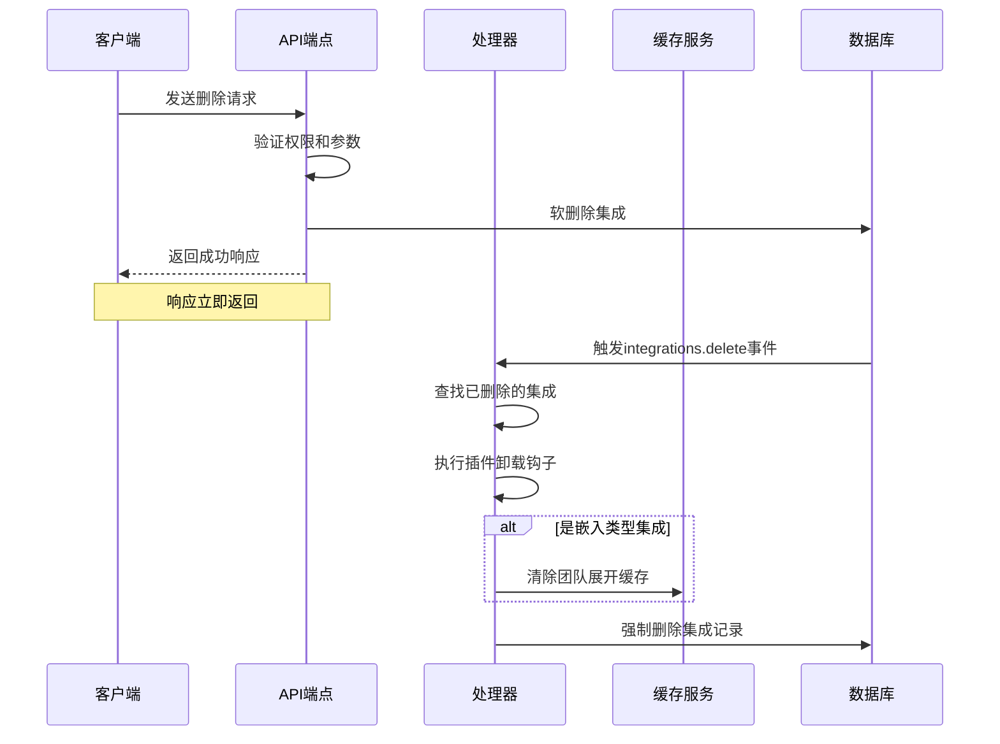
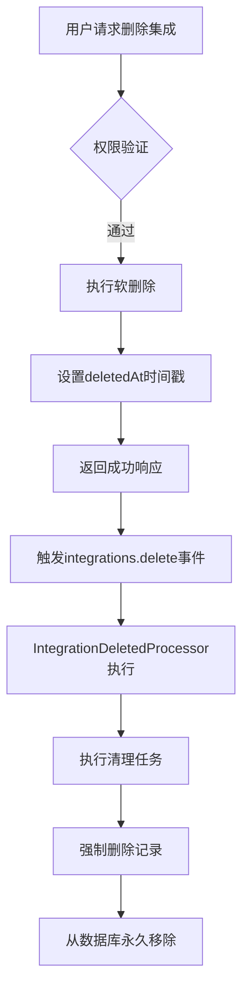

# 集成删除

<cite>
**本文档中引用的文件**  
- [integrations.ts](file://server/routes/api/integrations/integrations.ts)
- [IntegrationDeletedProcessor.ts](file://server/queues/processors/IntegrationDeletedProcessor.ts)
- [Integration.ts](file://server/models/Integration.ts)
- [schema.ts](file://server/routes/api/integrations/schema.ts)
- [integration-soft-delete.js](file://server/migrations/20240203061519-integration-soft-delete.js)
</cite>

## 目录
1. [简介](#简介)
2. [删除端点请求处理](#删除端点请求处理)
3. [响应格式](#响应格式)
4. [集成删除处理器](#集成删除处理器)
5. [软删除机制](#软删除机制)
6. [数据完整性保障](#数据完整性保障)
7. [安全考虑与确认流程](#安全考虑与确认流程)

## 简介
本文档详细说明了系统中集成删除功能的实现机制。重点介绍 `integrations.ts` 文件中 `delete` 方法的实现逻辑，涵盖从 API 请求处理到后台清理工作的完整流程。文档解释了软删除机制如何保障数据完整性，以及 `IntegrationDeletedProcessor` 如何在集成删除后执行必要的清理任务，包括插件卸载钩子调用、缓存清理和关联认证信息的删除。

## 删除端点请求处理
`DELETE /api/integrations/:id` 端点通过 `integrations.ts` 文件中的路由定义实现。该端点处理集成删除请求的主要流程如下：

1. **身份验证**：使用 `auth()` 中间件验证用户身份。
2. **参数验证**：通过 `validate(T.IntegrationsDeleteSchema)` 确保请求体中包含有效的集成 ID。
3. **事务处理**：使用 `transaction()` 中间件确保数据库操作的原子性。
4. **权限检查**：通过 `authorize` 函数验证当前用户是否有权删除指定的集成。
5. **执行删除**：调用 `integration.destroyWithCtx(ctx)` 方法启动删除流程。

该端点支持普通用户删除自己的关联账户集成，同时允许管理员删除工作区内的任何集成。

**Section sources**
- [integrations.ts](file://server/routes/api/integrations/integrations.ts#L150-L171)
- [schema.ts](file://server/routes/api/integrations/schema.ts#L92-L115)

## 响应格式
删除集成端点返回标准化的 JSON 响应格式：

```json
{
  "success": true
}
```

- `success`: 布尔值，表示删除操作是否成功。当集成被成功标记为已删除时，返回 `true`。

如果请求无效（如缺少 ID 或 ID 格式错误），端点将返回 400 错误状态码和相应的错误消息。如果用户无权删除指定集成，则返回 403 禁止访问错误。

**Section sources**
- [integrations.ts](file://server/routes/api/integrations/integrations.ts#L168-L170)

## 集成删除处理器
`IntegrationDeletedProcessor` 是一个后台任务处理器，负责在集成删除事件发生后执行清理工作。其主要职责包括：

1. **查找已删除的集成**：使用 `paranoid: false` 选项查询已被软删除的集成记录。
2. **执行插件卸载钩子**：遍历所有注册的 `Hook.Uninstall` 钩子，并将已删除的集成作为参数调用它们。
3. **清理缓存**：如果删除的集成是嵌入类型（`IntegrationType.Embed`），则清除与该团队相关的展开数据缓存。
4. **强制删除**：最后，对集成记录执行强制删除（`force: true`），从数据库中永久移除记录。

该处理器通过监听 `integrations.delete` 事件被触发，确保所有相关的清理任务都能在集成删除后自动执行。



**Diagram sources**
- [IntegrationDeletedProcessor.ts](file://server/queues/processors/IntegrationDeletedProcessor.ts#L7-L33)
- [integrations.ts](file://server/routes/api/integrations/integrations.ts#L165-L166)

**Section sources**
- [IntegrationDeletedProcessor.ts](file://server/queues/processors/IntegrationDeletedProcessor.ts#L7-L33)

## 软删除机制
系统采用软删除机制来处理集成删除操作，以保障数据完整性和支持撤销操作。该机制通过在 `integrations` 表中添加 `deletedAt` 字段实现：

- **软删除**：当调用 `destroyWithCtx` 方法时，系统将当前时间戳写入 `deletedAt` 字段，而不是立即从数据库中移除记录。
- **数据可见性**：大多数查询默认忽略 `deletedAt` 不为空的记录，使已删除的集成对用户不可见。
- **恢复可能性**：在后台任务执行强制删除之前，可以通过将 `deletedAt` 字段设为 `null` 来恢复已删除的集成。

此机制由 `20240203061519-integration-soft-delete.js` 迁移文件引入，为集成模型增加了 `deletedAt` 列。



**Diagram sources**
- [integration-soft-delete.js](file://server/migrations/20240203061519-integration-soft-delete.js#L0-L14)
- [Integration.ts](file://server/models/Integration.ts#L25-L105)

**Section sources**
- [integration-soft-delete.js](file://server/migrations/20240203061519-integration-soft-delete.js#L0-L14)
- [Integration.ts](file://server/models/Integration.ts#L25-L105)

## 数据完整性保障
系统通过多种机制确保集成删除过程中的数据完整性：

1. **事务性操作**：删除请求在数据库事务中执行，确保所有相关更改要么全部成功，要么全部回滚。
2. **行级锁定**：在查找和删除集成时使用 `LOCK.UPDATE`，防止并发修改导致的数据竞争。
3. **关联数据清理**：`Integration` 模型定义了 `@AfterDestroy` 钩子，确保在集成被强制删除时，其关联的 `IntegrationAuthentication` 记录也会被自动删除。
4. **缓存一致性**：对于嵌入类型集成，删除操作会触发相关缓存的清除，防止系统使用过时的展开数据。

这些措施共同确保了在删除集成时，系统状态的一致性和可靠性。

**Section sources**
- [integrations.ts](file://server/routes/api/integrations/integrations.ts#L158-L159)
- [Integration.ts](file://server/models/Integration.ts#L100-L105)

## 安全考虑与确认流程
集成删除功能包含多项安全措施：

- **权限控制**：只有集成所有者（对于关联账户）或管理员才能删除集成。
- **输入验证**：使用 Zod 模式验证确保提供的集成 ID 是有效的 UUID。
- **异步清理**：敏感的清理操作（如调用插件钩子）在后台异步执行，避免影响 API 响应时间。

典型的确认流程示例如下：
1. 用户在 UI 中选择要删除的集成。
2. 系统显示确认对话框，警告用户删除操作的影响。
3. 用户确认删除操作。
4. 前端向 `DELETE /api/integrations/:id` 端点发送请求。
5. 后端验证用户权限并执行软删除。
6. 系统立即返回成功响应，同时在后台队列中安排清理任务。

这种设计既保证了操作的安全性，又提供了良好的用户体验。

**Section sources**
- [integrations.ts](file://server/routes/api/integrations/integrations.ts#L154-L157)
- [schema.ts](file://server/routes/api/integrations/schema.ts#L92-L115)