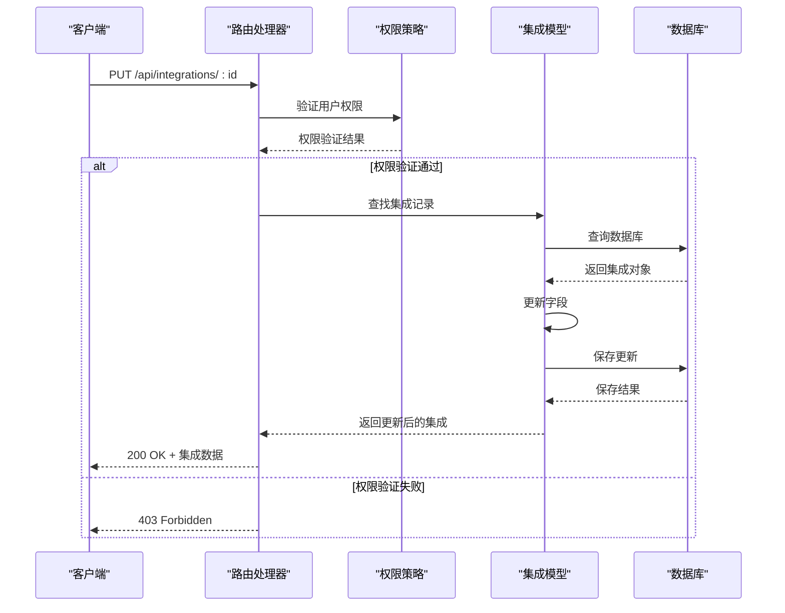
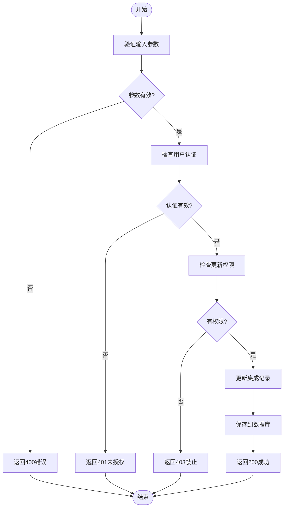
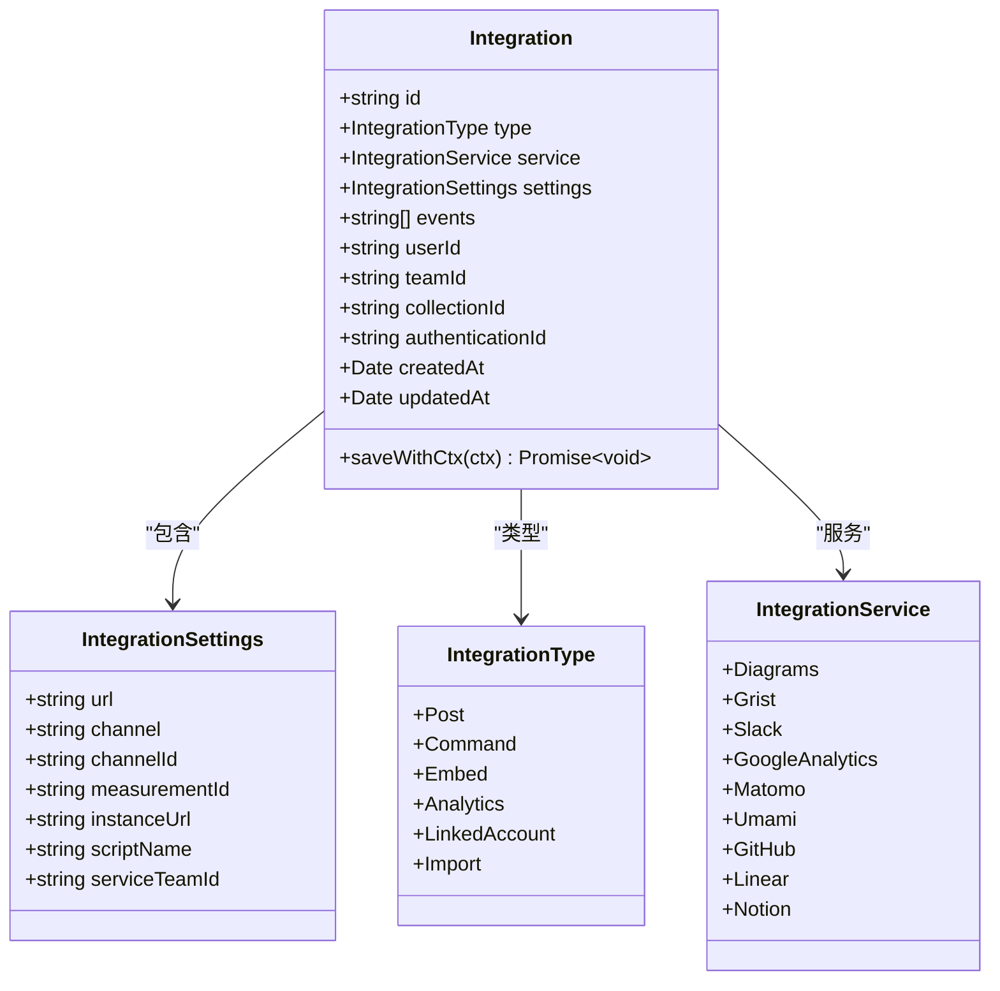
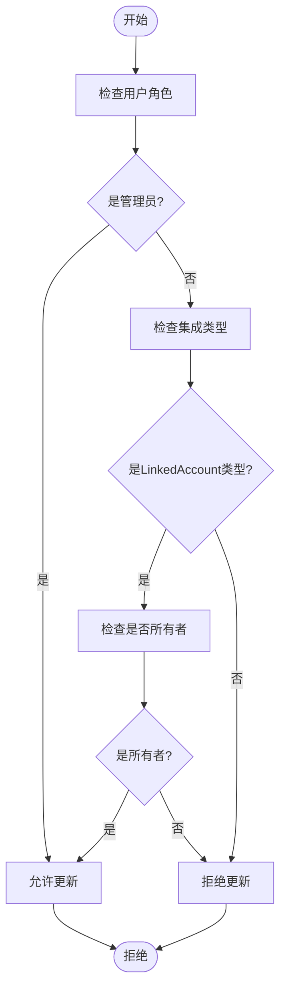
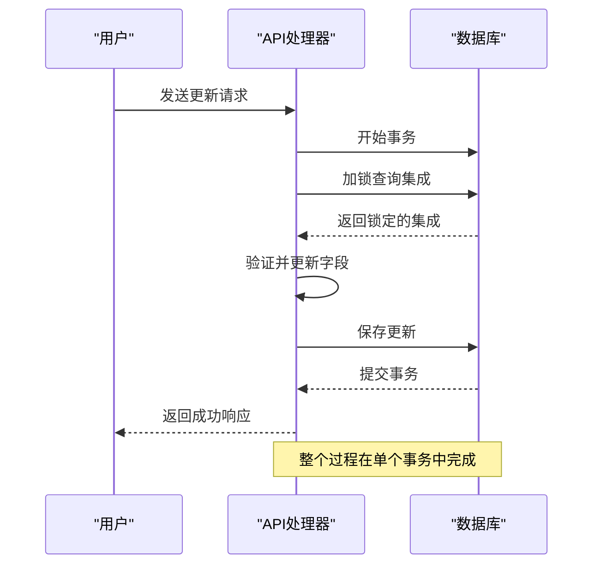

# 集成更新

<cite>
**Referenced Files in This Document**  
- [integrations.ts](file://server/routes/api/integrations/integrations.ts)
- [Integration.ts](file://server/models/Integration.ts)
- [schema.ts](file://server/routes/api/integrations/schema.ts)
- [integration.ts](file://server/policies/integration.ts)
- [types.ts](file://shared/types.ts)
- [integration.ts](file://server/presenters/integration.ts)
</cite>

## 目录
1. [集成更新功能概述](#集成更新功能概述)
2. [更新端点实现](#更新端点实现)
3. [请求参数与验证](#请求参数与验证)
4. [部分更新机制](#部分更新机制)
5. [响应格式](#响应格式)
6. [可更新字段与业务规则](#可更新字段与业务规则)
7. [权限验证机制](#权限验证机制)
8. [数据一致性保证](#数据一致性保证)
9. [错误处理策略](#错误处理策略)
10. [使用示例](#使用示例)

## 集成更新功能概述

集成更新功能允许管理员用户修改现有集成的配置参数和事件订阅。该功能通过 `PUT /api/integrations/:id` 端点实现，支持对集成配置的部分更新。系统支持多种类型的集成，包括嵌入式集成、分析集成、发布集成等，每种类型都有特定的可更新字段和业务规则。

**Section sources**
- [integrations.ts](file://server/routes/api/integrations/integrations.ts#L101-L171)
- [Integration.ts](file://server/models/Integration.ts#L0-L108)

## 更新端点实现

更新端点的实现位于 `server/routes/api/integrations/integrations.ts` 文件中，通过 `integrations.update` 路由处理。该端点使用事务处理确保数据一致性，并在更新过程中对集成记录加锁，防止并发修改。



**Diagram sources**
- [integrations.ts](file://server/routes/api/integrations/integrations.ts#L101-L171)

**Section sources**
- [integrations.ts](file://server/routes/api/integrations/integrations.ts#L101-L171)

## 请求参数与验证

更新请求的参数通过 Zod 模式进行验证，确保数据的完整性和正确性。主要请求参数包括：

| 参数 | 类型 | 必需 | 描述 |
|------|------|------|------|
| id | string (UUID) | 是 | 要更新的集成ID |
| settings | object | 否 | 集成配置参数 |
| events | string[] | 否 | 订阅的事件列表 |



**Diagram sources**
- [schema.ts](file://server/routes/api/integrations/schema.ts#L40-L95)
- [integrations.ts](file://server/routes/api/integrations/integrations.ts#L101-L171)

**Section sources**
- [schema.ts](file://server/routes/api/integrations/schema.ts#L40-L95)

## 部分更新机制

系统实现了部分更新机制，允许客户端只发送需要更新的字段，而保持其他字段不变。这种机制提高了API的灵活性和效率。



**Diagram sources**
- [Integration.ts](file://server/models/Integration.ts#L0-L108)
- [types.ts](file://shared/types.ts#L106-L131)

**Section sources**
- [Integration.ts](file://server/models/Integration.ts#L0-L108)
- [types.ts](file://shared/types.ts#L106-L131)

## 响应格式

更新成功后，API返回标准化的响应格式，包含更新后的集成数据和相关的权限策略。

```json
{
  "data": {
    "id": "integration-123",
    "type": "embed",
    "service": "diagrams",
    "settings": {
      "url": "https://new-url.example.com"
    },
    "events": ["documents.update"],
    "userId": "user-456",
    "teamId": "team-789",
    "createdAt": "2023-01-01T00:00:00.000Z",
    "updatedAt": "2023-01-02T00:00:00.000Z"
  },
  "policies": [
    {
      "id": "integration-123",
      "abilities": {
        "read": true,
        "update": true,
        "delete": true
      }
    }
  ]
}
```

**Section sources**
- [integration.ts](file://server/presenters/integration.ts#L2-L15)

## 可更新字段与业务规则

不同类型的集成有不同的可更新字段和业务规则。系统根据集成类型应用相应的验证逻辑。

### 嵌入式集成
- **可更新字段**: `settings.url`
- **验证规则**: URL必须是有效的网址
- **示例**: Diagrams、Grist集成

### 分析集成
- **可更新字段**: `settings.measurementId`, `settings.instanceUrl`
- **验证规则**: measurementId必须存在
- **示例**: Google Analytics、Matomo集成

### 发布集成
- **可更新字段**: `settings.url`, `settings.channel`, `settings.channelId`, `events`
- **验证规则**: events只能包含"documents.update"和"documents.publish"
- **示例**: Slack集成

**Section sources**
- [types.ts](file://shared/types.ts#L138-L150)
- [integrations.ts](file://server/routes/api/integrations/integrations.ts#L101-L171)

## 权限验证机制

系统实施严格的权限验证机制，确保只有授权用户才能更新集成。



**Diagram sources**
- [integration.ts](file://server/policies/integration.ts#L0-L31)

**Section sources**
- [integration.ts](file://server/policies/integration.ts#L0-L31)

## 数据一致性保证

系统通过多种机制确保数据一致性：

1. **事务处理**: 更新操作在数据库事务中执行
2. **行级锁定**: 使用`LOCK.UPDATE`防止并发修改
3. **上下文保存**: 使用`saveWithCtx`方法确保钩子和事件正确触发



**Section sources**
- [integrations.ts](file://server/routes/api/integrations/integrations.ts#L101-L171)
- [Model.ts](file://server/models/base/Model.ts#L61-L74)

## 错误处理策略

系统实现了全面的错误处理策略，确保API的稳定性和可靠性。

| 错误类型 | HTTP状态码 | 响应内容 | 处理方式 |
|---------|-----------|---------|---------|
| 未认证 | 401 | 无 | 要求用户登录 |
| 无权限 | 403 | 无 | 拒绝请求 |
| 集成不存在 | 404 | 无 | 返回未找到 |
| 参数无效 | 400 | 错误详情 | 返回验证错误 |
| 服务器错误 | 500 | 无 | 记录日志并返回通用错误 |

**Section sources**
- [integrations.ts](file://server/routes/api/integrations/integrations.ts#L101-L171)
- [errors.ts](file://server/errors.ts)

## 使用示例

### 更新嵌入式集成URL

```javascript
// 更新Diagrams集成的URL
fetch('/api/integrations/update', {
  method: 'POST',
  headers: {
    'Content-Type': 'application/json',
    'Authorization': 'Bearer <token>'
  },
  body: JSON.stringify({
    id: 'integration-123',
    settings: {
      url: 'https://new-diagrams-url.com'
    }
  })
});
```

### 更新Slack集成事件订阅

```javascript
// 更新Slack集成的事件订阅
fetch('/api/integrations/update', {
  method: 'POST',
  headers: {
    'Content-Type': 'application/json',
    'Authorization': 'Bearer <token>'
  },
  body: JSON.stringify({
    id: 'integration-456',
    events: ['documents.update', 'documents.publish']
  })
});
```

**Section sources**
- [integrations.ts](file://server/routes/api/integrations/integrations.ts#L101-L171)
- [schema.ts](file://server/routes/api/integrations/schema.ts#L40-L95)