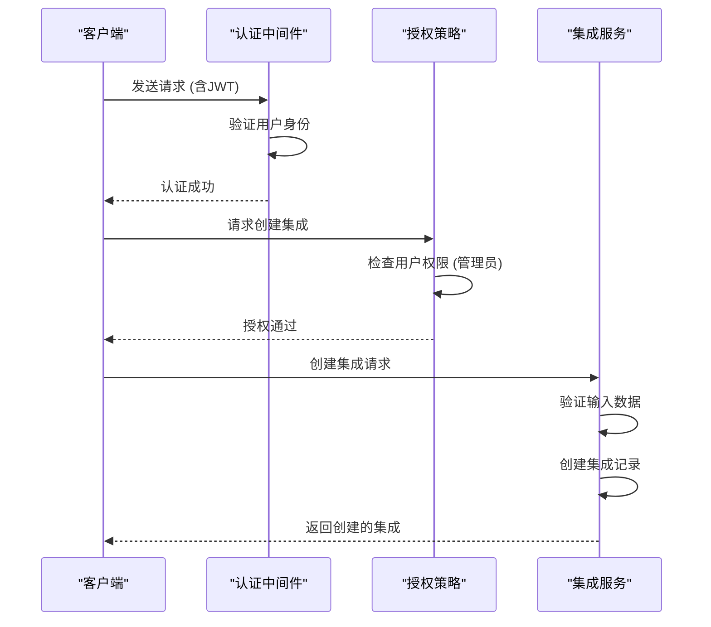
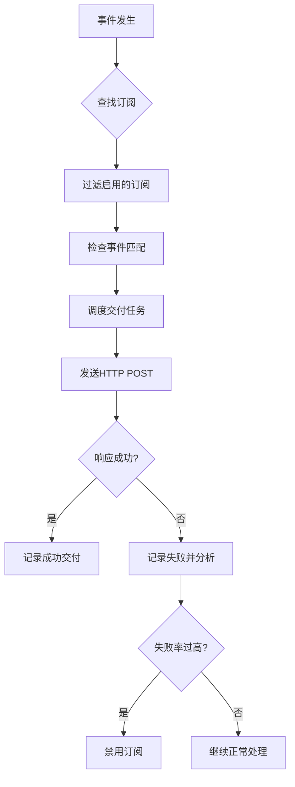
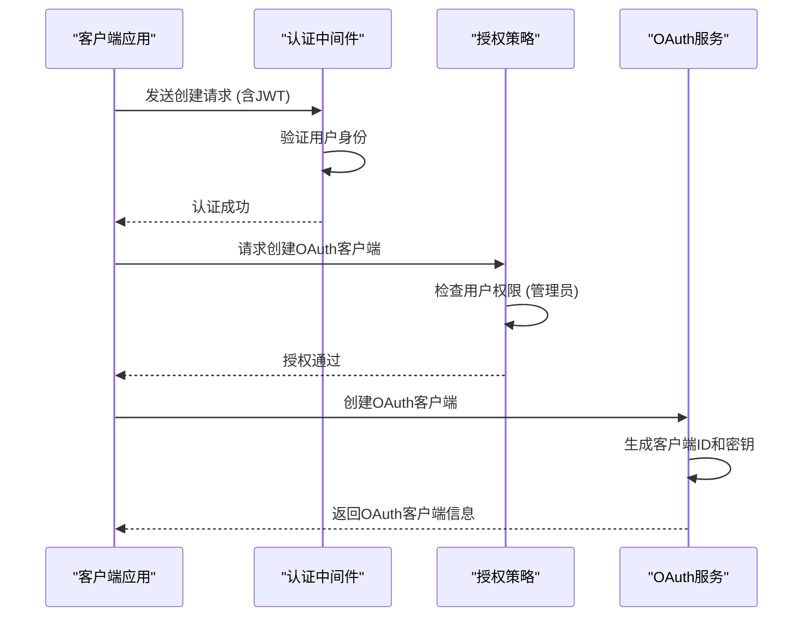
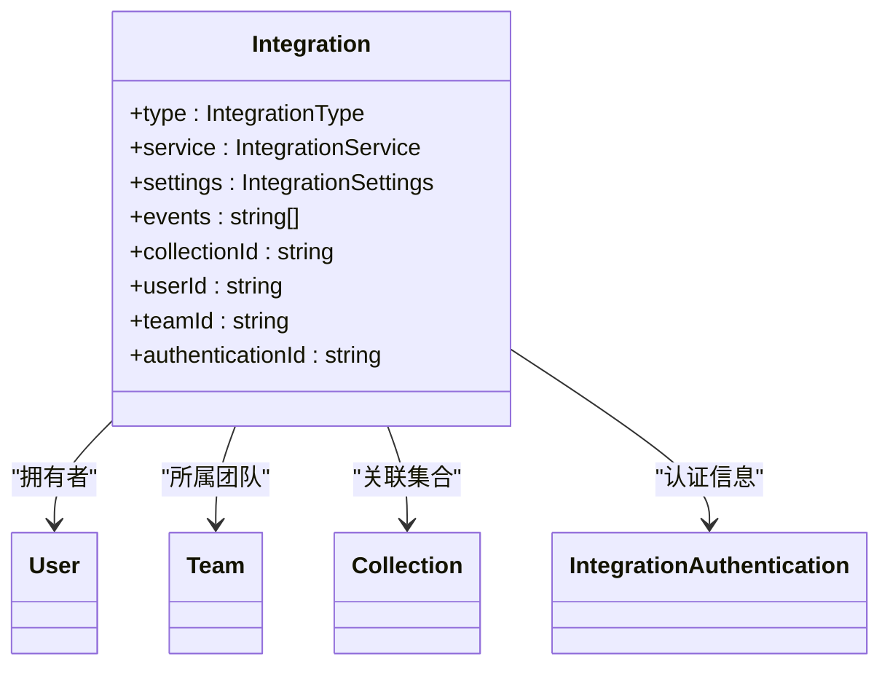
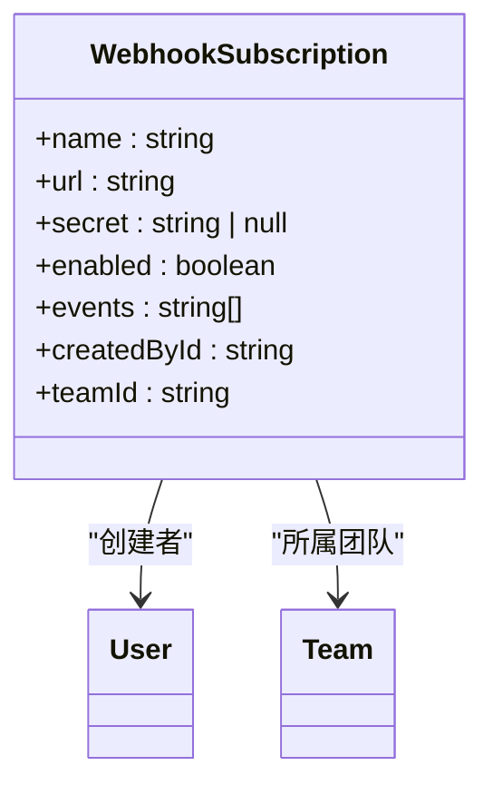
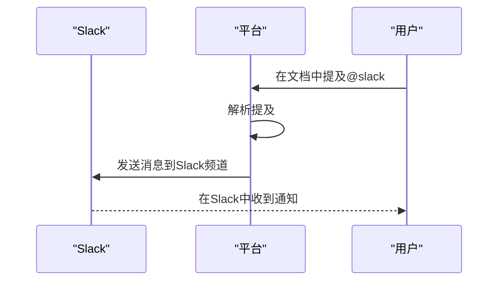
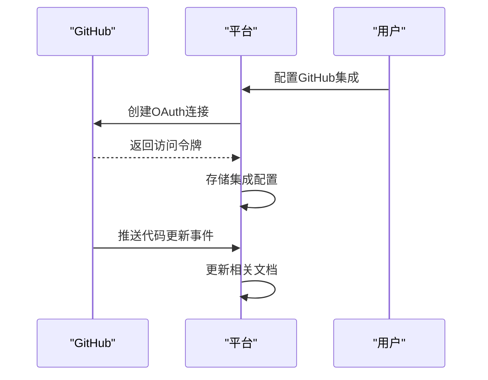

# 集成与扩展API

<cite>
**本文档引用的文件**
- [integrations.ts](file://server/routes/api/integrations/integrations.ts)
- [oauthClients.ts](file://server/routes/api/oauthClients/oauthClients.ts)
- [Integration.ts](file://app/models/Integration.ts)
- [Integration.ts](file://server/models/Integration.ts)
- [WebhookSubscription.ts](file://app/models/WebhookSubscription.ts)
- [WebhookSubscription.ts](file://server/models/WebhookSubscription.ts)
</cite>

## 目录
1. [简介](#简介)
2. [集成管理](#集成管理)
3. [Webhook订阅](#webhook订阅)
4. [OAuth客户端管理](#oauth客户端管理)
5. [数据模型](#数据模型)
6. [安全性考虑](#安全性考虑)
7. [事件类型](#事件类型)
8. [错误重试机制](#错误重试机制)
9. [实际示例](#实际示例)
10. [总结](#总结)

## 简介
本文档全面介绍了系统的集成与扩展API，重点涵盖第三方应用集成、Webhook订阅和OAuth应用管理功能。文档详细解释了`integrations.ts`中的集成创建/配置端点，`webhooks.ts`中的Webhook订阅和事件推送机制，以及`oauthClients.ts`实现的OAuth客户端管理。通过`Integration.ts`和`WebhookSubscription.ts`模型说明数据结构，阐述如何处理外部事件和数据同步。同时提供关于安全性考虑、事件类型、错误重试机制的详细说明，并给出与Slack、GitHub等服务集成的实际示例。

## 集成管理
集成管理API提供了创建、读取、更新和删除集成的端点。这些端点允许管理员配置与第三方服务的连接，如Slack、GitHub等。集成可以是工作区范围的，也可以是用户特定的链接账户。

**Diagram sources**
- [integrations.ts](file://server/routes/api/integrations/integrations.ts#L78-L84)

**Section sources**
- [integrations.ts](file://server/routes/api/integrations/integrations.ts#L20-L64)

## Webhook订阅
Webhook订阅机制允许外部系统订阅平台内的各种事件。当特定事件发生时，系统会向订阅的URL推送事件数据。每个团队最多可以创建10个Webhook订阅。

**Diagram sources**
- [WebhookProcessor.ts](file://plugins/webhooks/server/processors/WebhookProcessor.ts#L13-L18)
- [DeliverWebhookTask.ts](file://plugins/webhooks/server/tasks/DeliverWebhookTask.ts#L76-L88)

**Section sources**
- [WebhookProcessor.ts](file://plugins/webhooks/server/processors/WebhookProcessor.ts#L0-L33)
- [DeliverWebhookTask.ts](file://plugins/webhooks/server/tasks/DeliverWebhookTask.ts#L717-L761)

## OAuth客户端管理
OAuth客户端管理API允许管理员创建和管理OAuth客户端，用于第三方应用与平台的集成。这些客户端可以是内部应用或外部发布的应用。

**Diagram sources**
- [oauthClients.ts](file://server/routes/api/oauthClients/oauthClients.ts#L55-L58)

**Section sources**
- [oauthClients.ts](file://server/routes/api/oauthClients/oauthClients.ts#L26-L45)

## 数据模型
### 集成模型
集成模型定义了与第三方服务的连接配置，包括集成类型、服务名称、设置和事件列表。

**Diagram sources**
- [Integration.ts](file://server/models/Integration.ts#L25-L105)

**Section sources**
- [Integration.ts](file://app/models/Integration.ts#L11-L31)
- [Integration.ts](file://server/models/Integration.ts#L25-L105)

### Webhook订阅模型
Webhook订阅模型定义了外部系统订阅事件的配置，包括名称、URL、密钥、启用状态和感兴趣的事件列表。

**Diagram sources**
- [WebhookSubscription.ts](file://server/models/WebhookSubscription.ts#L30-L164)

**Section sources**
- [WebhookSubscription.ts](file://app/models/WebhookSubscription.ts#L4-L26)
- [WebhookSubscription.ts](file://server/models/WebhookSubscription.ts#L30-L164)

## 安全性考虑
系统在安全性方面采取了多项措施：
- 所有API端点都需要身份验证
- 集成和OAuth客户端管理需要管理员权限
- Webhook请求包含签名头，使用HMAC-SHA256算法
- 敏感数据如Webhook密钥在数据库中加密存储
- 实施速率限制防止滥用

## 事件类型
系统支持多种事件类型，涵盖用户、文档、集合、评论等操作。事件名称采用点分隔的命名空间，如`documents.create`、`users.update`等。订阅者可以订阅特定事件或使用通配符`*`订阅所有事件。

## 错误重试机制
当Webhook交付失败时，系统会记录失败状态，并在后续分析中检查失败率。如果在指定时间窗口内的失败率超过阈值，系统会自动禁用该订阅，防止持续的失败请求。管理员可以重新启用订阅。

## 实际示例
### Slack集成

### GitHub集成

## 总结
本文档详细介绍了系统的集成与扩展API，包括集成管理、Webhook订阅和OAuth客户端管理三大核心功能。通过这些API，平台能够与各种第三方服务无缝集成，实现数据同步和事件通知。系统在设计上注重安全性、可靠性和易用性，为开发者提供了强大的扩展能力。