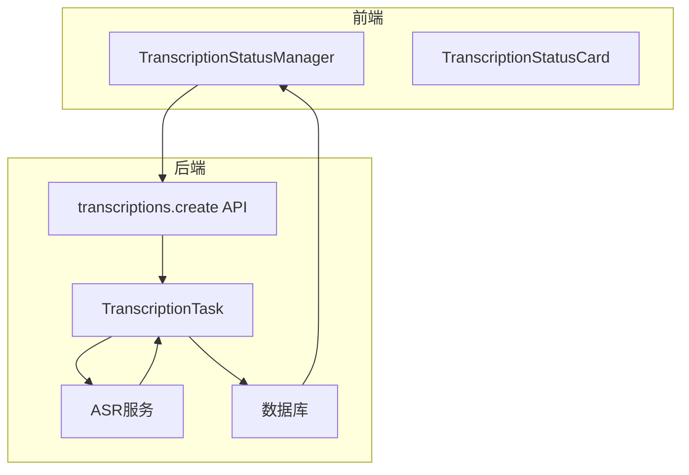
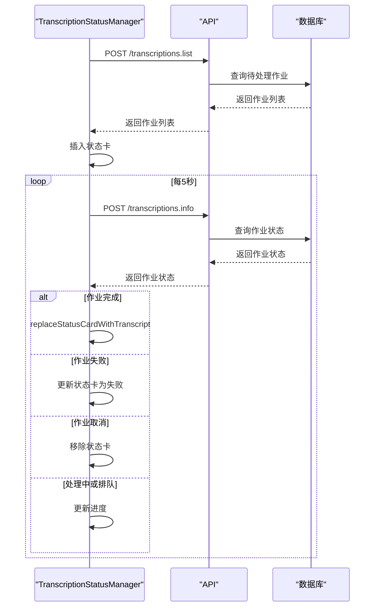
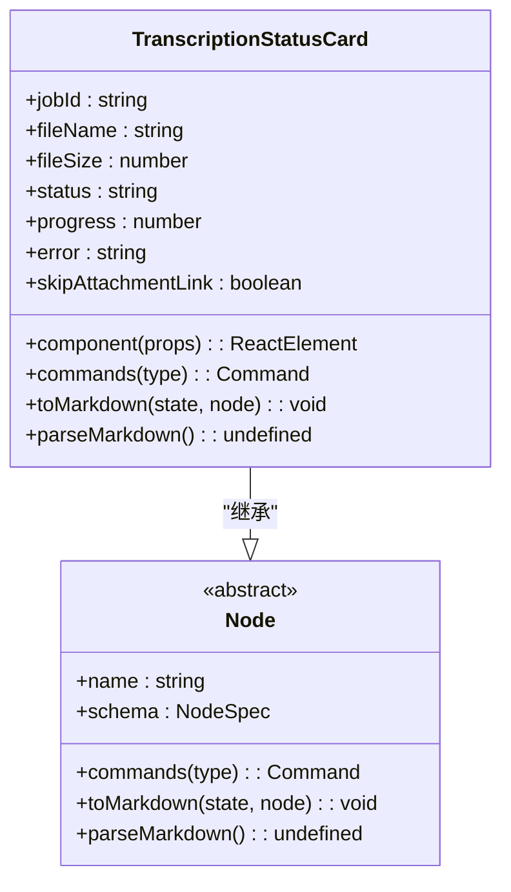
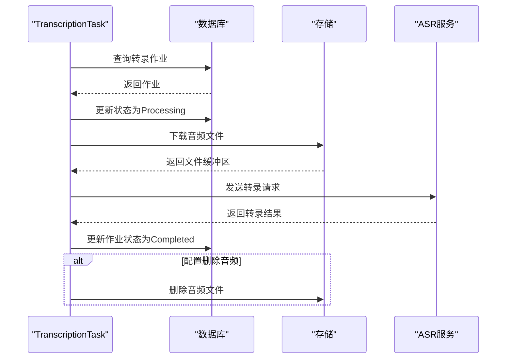
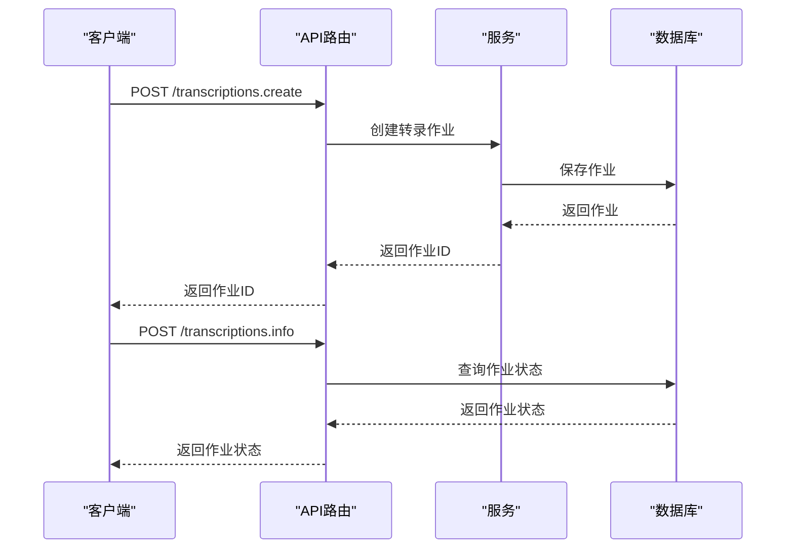
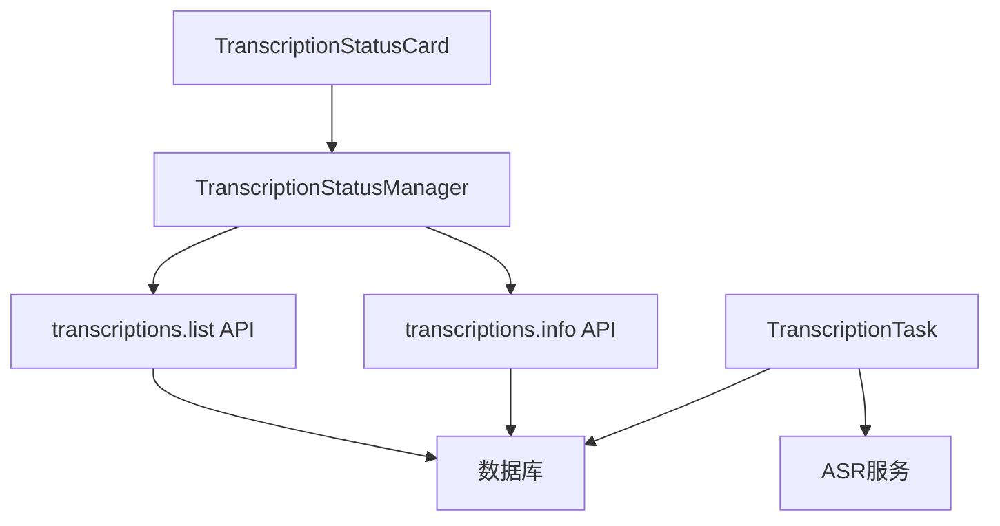

# 转录日志调试

<cite>
**本文档引用的文件**   
- [TRANSCRIPTION_DEBUG.md](file://TRANSCRIPTION_DEBUG.md)
- [server/models/TranscriptionJob.ts](file://server/models/TranscriptionJob.ts)
- [app/editor/components/TranscriptionStatusManager.tsx](file://app/editor/components/TranscriptionStatusManager.tsx)
- [shared/editor/nodes/TranscriptionStatusCard.tsx](file://shared/editor/nodes/TranscriptionStatusCard.tsx)
- [server/queues/tasks/TranscriptionTask.ts](file://server/queues/tasks/TranscriptionTask.ts)
- [server/routes/api/transcriptions/transcriptions.ts](file://server/routes/api/transcriptions/transcriptions.ts)
- [server/logging/Logger.ts](file://server/logging/Logger.ts)
</cite>

## 目录
1. [简介](#简介)
2. [问题描述](#问题描述)
3. [核心组件分析](#核心组件分析)
4. [架构概览](#架构概览)
5. [详细组件分析](#详细组件分析)
6. [依赖关系分析](#依赖关系分析)
7. [性能考虑](#性能考虑)
8. [故障排除指南](#故障排除指南)
9. [结论](#结论)

## 简介
本文档旨在深入分析转录功能的调试和日志记录机制。通过分析相关代码文件，我们将全面了解转录作业的生命周期、状态管理、前后端交互以及日志记录策略。文档将重点关注转录状态卡、作业管理、API路由和日志记录等核心组件，为开发人员提供一个全面的参考，以解决转录功能中的问题。

## 问题描述
生产系统中音频能够正确上传，ASR服务器也看到了请求正确被处理，但在转写完成后，document里没有任何显示。

### 可能的原因
1. **数据库状态未更新**：检查转录作业的状态是否正确更新为'completed'。
2. **前端轮询未找到状态卡**：检查编辑器中是否有状态卡元素。
3. **轮询API调用失败**：检查网络请求是否正常。
4. **replaceStatusCardWithTranscript失败**：检查事务是否成功。
5. **生产环境日志级别过高**：检查日志配置是否为debug或info。

## 核心组件分析
转录功能的核心组件包括转录作业模型、状态管理器、状态卡组件、任务处理器和API路由。这些组件协同工作，实现从音频上传到文本转录的完整流程。

**Section sources**
- [TRANSCRIPTION_DEBUG.md](file://TRANSCRIPTION_DEBUG.md#L1-L261)
- [server/models/TranscriptionJob.ts](file://server/models/TranscriptionJob.ts#L1-L253)

## 架构概览
转录功能的架构包括前端组件、后端API、任务队列和数据库。前端通过API创建转录作业，后端将作业添加到任务队列，任务处理器从队列中获取作业并调用ASR服务，最后将结果存储到数据库。



**Diagram sources **
- [app/editor/components/TranscriptionStatusManager.tsx](file://app/editor/components/TranscriptionStatusManager.tsx#L38-L865)
- [server/routes/api/transcriptions/transcriptions.ts](file://server/routes/api/transcriptions/transcriptions.ts#L0-L359)
- [server/queues/tasks/TranscriptionTask.ts](file://server/queues/tasks/TranscriptionTask.ts#L0-L322)

## 详细组件分析

### 转录作业模型分析
转录作业模型定义了转录作业的数据结构和业务逻辑。它包含作业状态、进度、错误信息和结果等属性，并提供了更新状态、完成作业和失败处理等方法。

#### 类图
```mermaid
classDiagram
class TranscriptionJob {
+status : TranscriptionJobStatus
+progress : number | null
+error : string | null
+result : TranscriptionResult | null
+teamId : string
+userId : string
+documentId : string
+attachmentId : string
+updateStatus(status, progress, error) : Promise~TranscriptionJob~
+complete(result) : Promise~TranscriptionJob~
+fail(error) : Promise~TranscriptionJob~
+emitWebsocketEvent() : Promise~void~
+findByDocumentId(documentId, where) : Promise~TranscriptionJob[]~
+findPending(where) : Promise~TranscriptionJob[]~
+deleteOlderThan(days) : Promise~number~
}
class TranscriptionJobStatus {
<<enumeration>>
Queued
Processing
Completed
Failed
Cancelled
}
class TranscriptionResult {
+text : string
+speakerSegments : {spk : number, text : string, start? : number, end? : number, timestamp? : number[][]}[]
}
TranscriptionJob --> TranscriptionJobStatus : "使用"
TranscriptionJob --> TranscriptionResult : "包含"
```

**Diagram sources **
- [server/models/TranscriptionJob.ts](file://server/models/TranscriptionJob.ts#L44-L249)

**Section sources**
- [server/models/TranscriptionJob.ts](file://server/models/TranscriptionJob.ts#L1-L253)

### 转录状态管理器分析
转录状态管理器负责管理转录状态卡的生命周期。它通过轮询API获取作业状态，并根据状态更新或替换状态卡。

#### 序列图


**Diagram sources **
- [app/editor/components/TranscriptionStatusManager.tsx](file://app/editor/components/TranscriptionStatusManager.tsx#L38-L865)

**Section sources**
- [app/editor/components/TranscriptionStatusManager.tsx](file://app/editor/components/TranscriptionStatusManager.tsx#L38-L865)

### 转录状态卡分析
转录状态卡是编辑器中的UI组件，用于显示转录作业的当前状态。

#### 类图


**Diagram sources **
- [shared/editor/nodes/TranscriptionStatusCard.tsx](file://shared/editor/nodes/TranscriptionStatusCard.tsx#L0-L380)

**Section sources**
- [shared/editor/nodes/TranscriptionStatusCard.tsx](file://shared/editor/nodes/TranscriptionStatusCard.tsx#L0-L380)

### 转录任务分析
转录任务是后台处理转录作业的处理器。

#### 序列图


**Diagram sources **
- [server/queues/tasks/TranscriptionTask.ts](file://server/queues/tasks/TranscriptionTask.ts#L0-L322)

**Section sources**
- [server/queues/tasks/TranscriptionTask.ts](file://server/queues/tasks/TranscriptionTask.ts#L0-L322)

### API路由分析
API路由处理转录相关的HTTP请求。

#### 序列图


**Diagram sources **
- [server/routes/api/transcriptions/transcriptions.ts](file://server/routes/api/transcriptions/transcriptions.ts#L0-L359)

**Section sources**
- [server/routes/api/transcriptions/transcriptions.ts](file://server/routes/api/transcriptions/transcriptions.ts#L0-L359)

## 依赖关系分析
转录功能的组件之间存在复杂的依赖关系。前端组件依赖后端API，后端API依赖数据库和任务队列，任务处理器依赖ASR服务。



**Diagram sources **
- [app/editor/components/TranscriptionStatusManager.tsx](file://app/editor/components/TranscriptionStatusManager.tsx#L38-L865)
- [server/queues/tasks/TranscriptionTask.ts](file://server/queues/tasks/TranscriptionTask.ts#L0-L322)
- [server/routes/api/transcriptions/transcriptions.ts](file://server/routes/api/transcriptions/transcriptions.ts#L0-L359)

**Section sources**
- [app/editor/components/TranscriptionStatusManager.tsx](file://app/editor/components/TranscriptionStatusManager.tsx#L38-L865)
- [server/queues/tasks/TranscriptionTask.ts](file://server/queues/tasks/TranscriptionTask.ts#L0-L322)
- [server/routes/api/transcriptions/transcriptions.ts](file://server/routes/api/transcriptions/transcriptions.ts#L0-L359)

## 性能考虑
1. **轮询频率**：当前轮询间隔为5秒，可根据需要调整。
2. **数据库查询**：优化数据库查询，避免N+1问题。
3. **日志级别**：在生产环境中使用适当的日志级别，避免过多的日志输出影响性能。

## 故障排除指南
1. **检查数据库**：确认转录作业的状态是否正确更新。
2. **检查网络请求**：确认前端是否正常调用API。
3. **检查日志**：查看服务器日志，寻找错误信息。
4. **检查ASR服务**：确认ASR服务是否正常运行。

**Section sources**
- [TRANSCRIPTION_DEBUG.md](file://TRANSCRIPTION_DEBUG.md#L1-L261)

## 结论
通过对转录功能的深入分析，我们了解了其核心组件和工作流程。为了确保功能的稳定运行，建议定期检查日志，优化性能，并及时处理可能出现的问题。