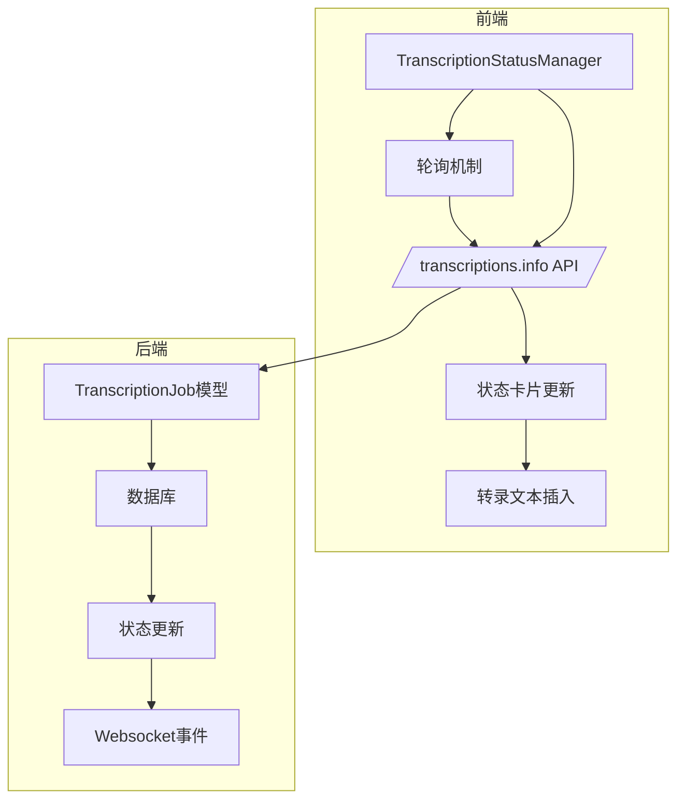
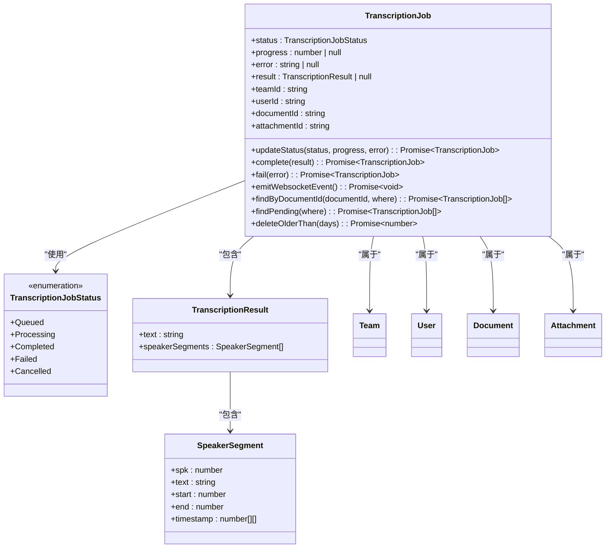
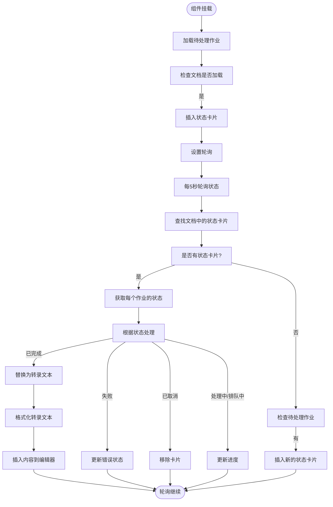
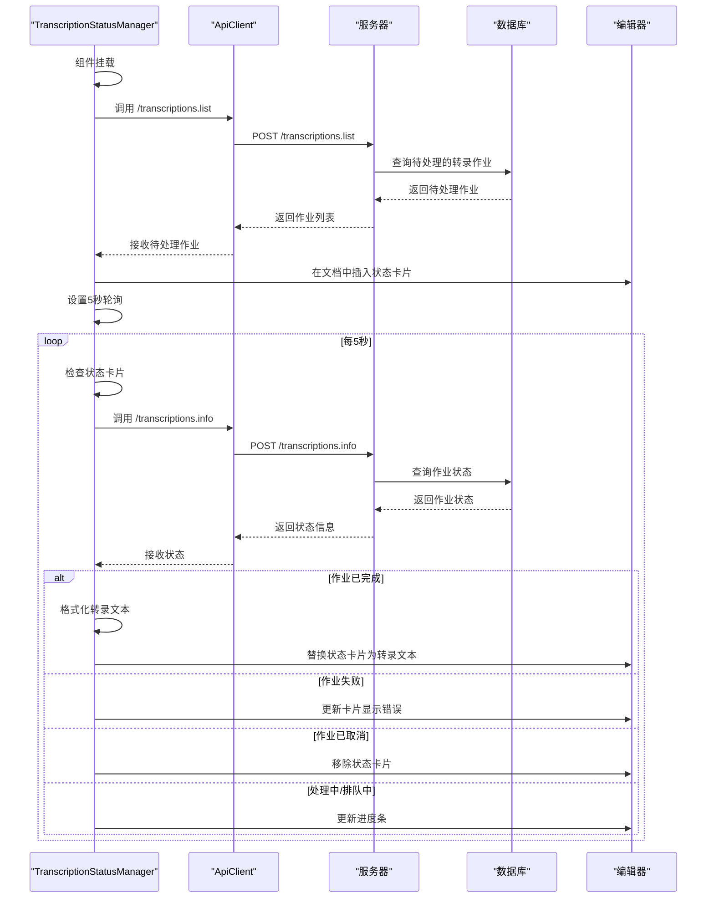
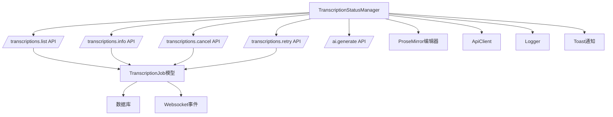

# 转录状态管理器

<cite>
**本文档引用的文件**
- [TranscriptionJob.ts](file://server/models/TranscriptionJob.ts)
- [TranscriptionStatusManager.tsx](file://app/editor/components/TranscriptionStatusManager.tsx)
- [TRANSCRIPTION_FIX.md](file://TRANSCRIPTION_FIX.md)
- [TRANSCRIPTION_PRODUCTION_FIX_V2.md](file://TRANSCRIPTION_PRODUCTION_FIX_V2.md)
- [TRANSCRIPTION_DEBUG.md](file://TRANSCRIPTION_DEBUG.md)
</cite>

## 目录
1. [简介](#简介)
2. [核心组件](#核心组件)
3. [架构概述](#架构概述)
4. [详细组件分析](#详细组件分析)
5. [依赖分析](#依赖分析)
6. [性能考虑](#性能考虑)
7. [故障排除指南](#故障排除指南)
8. [结论](#结论)

## 简介
转录状态管理器是系统中负责管理音频文件转录任务状态的核心组件。该系统通过轮询机制监控转录作业的生命周期，从创建到完成或失败，并在编辑器中实时更新用户界面。系统最初依赖WebSocket进行实时更新，但已重构为更可靠的轮询机制，以确保在各种网络条件下都能正确同步状态。

## 核心组件

转录状态管理器的核心功能包括：
- 通过轮询机制监控转录作业状态
- 在文档中管理转录状态卡片的生命周期
- 处理转录完成后的文本插入和格式化
- 提供取消和重试转录作业的功能

**Section sources**
- [TranscriptionStatusManager.tsx](file://app/editor/components/TranscriptionStatusManager.tsx#L0-L869)

## 架构概述

转录状态管理系统采用前后端分离的架构，前端通过轮询与后端API通信，获取转录作业的最新状态。系统避免了对WebSocket的依赖，提高了在不稳定网络环境下的可靠性。

**Diagram sources**
- [TranscriptionStatusManager.tsx](file://app/editor/components/TranscriptionStatusManager.tsx#L0-L869)
- [TranscriptionJob.ts](file://server/models/TranscriptionJob.ts#L44-L249)

## 详细组件分析

### 转录作业模型分析

转录作业模型定义了转录任务的核心数据结构和业务逻辑，包括状态管理、进度跟踪和结果存储。

#### 转录作业类图

**Diagram sources**
- [TranscriptionJob.ts](file://server/models/TranscriptionJob.ts#L44-L249)

**Section sources**
- [TranscriptionJob.ts](file://server/models/TranscriptionJob.ts#L44-L249)

### 转录状态管理器分析

转录状态管理器是React组件，负责在编辑器中监控和更新转录作业的状态。它通过轮询机制替代了原有的WebSocket方案，提高了系统的可靠性。

#### 转录状态管理流程图

**Diagram sources**
- [TranscriptionStatusManager.tsx](file://app/editor/components/TranscriptionStatusManager.tsx#L0-L869)

#### 转录状态更新序列图

**Diagram sources**
- [TranscriptionStatusManager.tsx](file://app/editor/components/TranscriptionStatusManager.tsx#L0-L869)

**Section sources**
- [TranscriptionStatusManager.tsx](file://app/editor/components/TranscriptionStatusManager.tsx#L0-L869)

## 依赖分析

转录状态管理系统依赖于多个核心组件和API端点，形成了一个完整的状态管理闭环。

**Diagram sources**
- [TranscriptionStatusManager.tsx](file://app/editor/components/TranscriptionStatusManager.tsx#L0-L869)
- [TranscriptionJob.ts](file://server/models/TranscriptionJob.ts#L44-L249)

**Section sources**
- [TranscriptionStatusManager.tsx](file://app/editor/components/TranscriptionStatusManager.tsx#L0-L869)
- [TranscriptionJob.ts](file://server/models/TranscriptionJob.ts#L44-L249)

## 性能考虑

转录状态管理系统在设计时考虑了多个性能因素：

1. **轮询间隔**：5秒的轮询间隔在响应性和服务器负载之间取得了良好平衡
2. **条件轮询**：仅在存在状态卡片时进行轮询，减少不必要的API调用
3. **错误处理**：对单个作业的轮询错误进行静默处理，避免影响整体轮询流程
4. **资源清理**：组件卸载时清除轮询定时器，防止内存泄漏
5. **批量处理**：在文档加载时批量处理待处理作业，减少API调用次数

系统通过这些优化确保了在高并发场景下的稳定性和性能。

## 故障排除指南

### 常见问题及解决方案

#### 问题1：作业状态为"completed"但前端未更新
**原因**：前端轮询可能未运行或找不到状态卡片

**解决方案**：
1. 刷新页面，检查是否加载待处理作业
2. 检查TranscriptionStatusManager组件是否正确挂载
3. 检查浏览器控制台是否有JavaScript错误

#### 问题2：作业状态一直是"processing"
**原因**：TranscriptionTask可能失败但未正确更新状态

**解决方案**：
1. 检查服务器日志中的错误
2. 检查ASR服务器是否真正返回了结果
3. 检查数据库连接是否正常

#### 问题3：轮询请求返回404或401
**原因**：API路由配置问题或认证问题

**解决方案**：
1. 检查API路由是否正确注册
2. 检查用户是否有权限访问该文档
3. 检查会话是否过期

#### 问题4：replaceStatusCardWithTranscript被调用但无效果
**原因**：ProseMirror事务可能失败

**解决方案**：
1. 检查浏览器控制台的错误日志
2. 检查pasteParser是否正确初始化
3. 检查markdown格式是否正确

### 调试步骤

1. **检查服务器日志**：查看最近的转录任务日志
2. **检查数据库**：确认转录作业的状态是否正确更新
3. **检查前端状态**：在浏览器控制台检查状态卡片和网络请求
4. **手动触发轮询**：通过浏览器控制台手动调用API测试

**Section sources**
- [TRANSCRIPTION_DEBUG.md](file://TRANSCRIPTION_DEBUG.md#L0-L261)
- [TRANSCRIPTION_FIX.md](file://TRANSCRIPTION_FIX.md#L0-L174)
- [TRANSCRIPTION_PRODUCTION_FIX_V2.md](file://TRANSCRIPTION_PRODUCTION_FIX_V2.md#L0-L339)

## 结论
转录状态管理器通过从WebSocket到轮询机制的重构，显著提高了系统的可靠性和稳定性。系统能够有效管理转录作业的整个生命周期，从创建到完成，并在编辑器中提供实时的用户反馈。通过详细的错误处理和恢复机制，系统能够在各种异常情况下保持正常运行，为用户提供一致的用户体验。