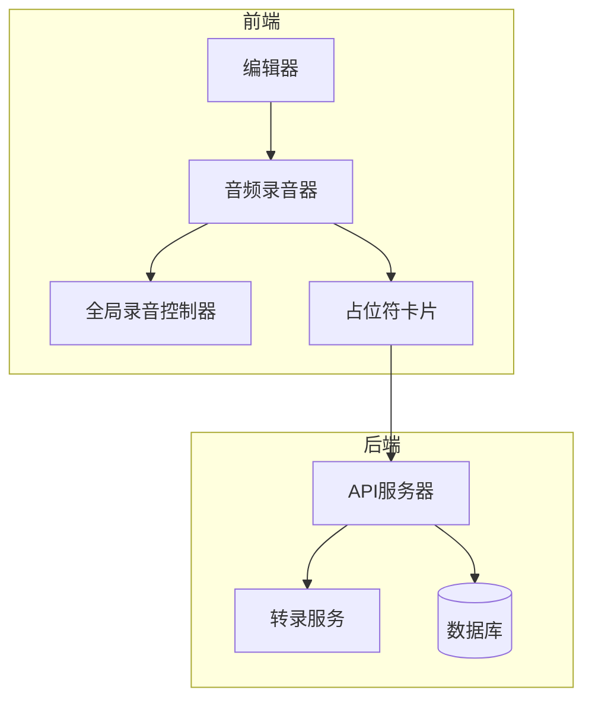
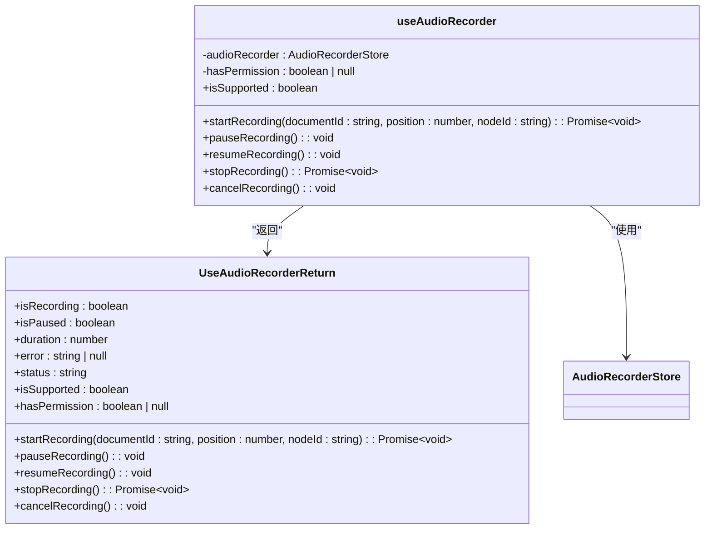
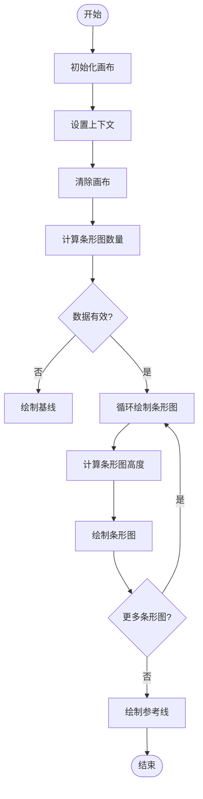
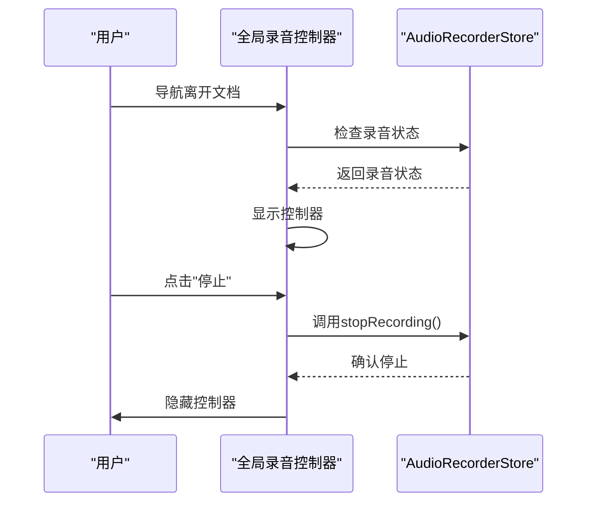
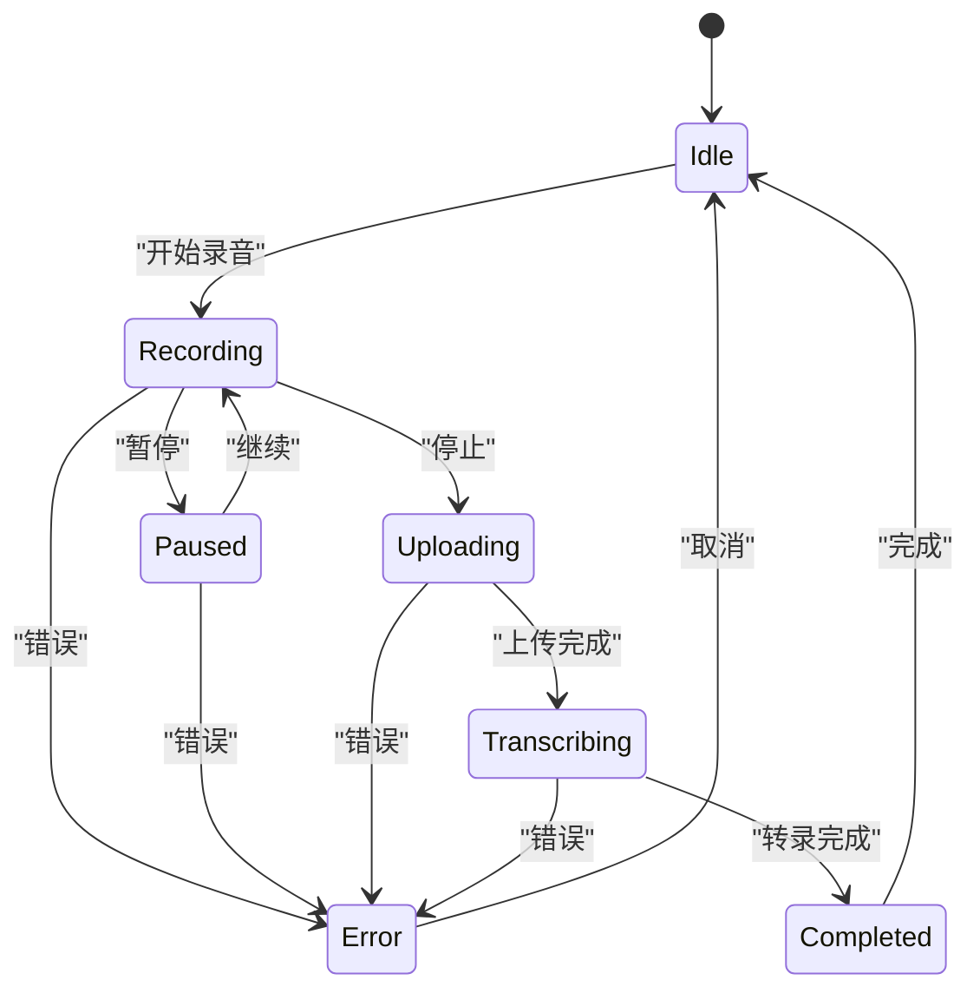
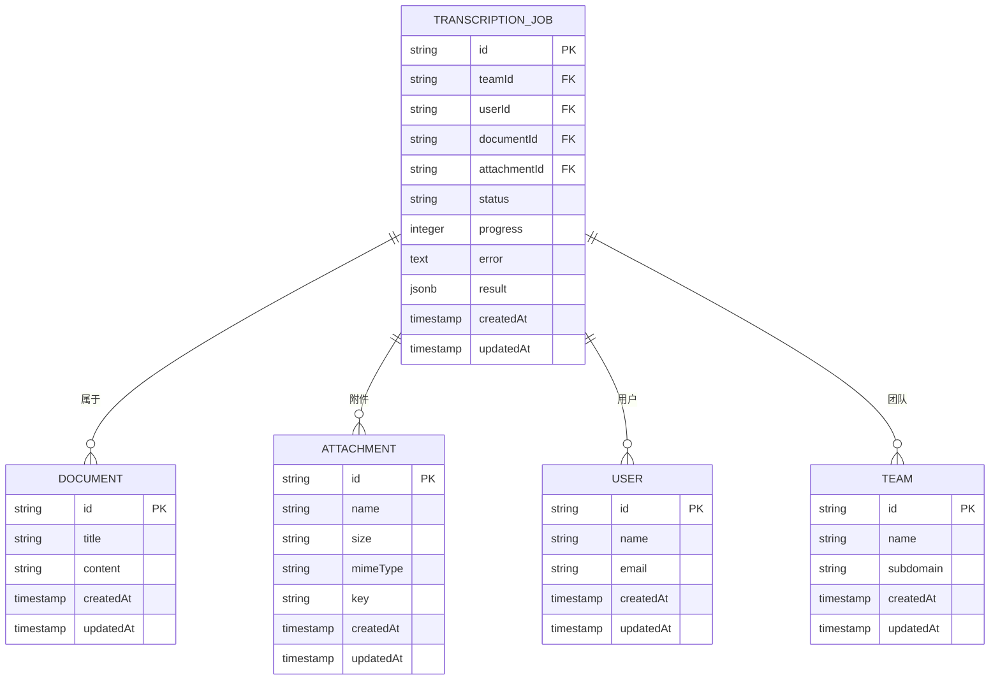

# 音频转录功能

<cite>
**本文档引用的文件**   
- [TRANSCRIPTION_FEATURE.md](file://TRANSCRIPTION_FEATURE.md)
- [TRANSCRIPTION_DEBUG.md](file://TRANSCRIPTION_DEBUG.md)
- [TRANSCRIPTION_FIX.md](file://TRANSCRIPTION_FIX.md)
- [TRANSCRIPTION_LOGGING_ENHANCEMENT.md](file://TRANSCRIPTION_LOGGING_ENHANCEMENT.md)
- [TRANSCRIPTION_PRODUCTION_FIX.md](file://TRANSCRIPTION_PRODUCTION_FIX.md)
- [TRANSCRIPTION_PRODUCTION_FIX_V2.md](file://TRANSCRIPTION_PRODUCTION_FIX_V2.md)
- [app/hooks/useAudioRecorder.ts](file://app/hooks/useAudioRecorder.ts)
- [app/components/AudioWaveform.tsx](file://app/components/AudioWaveform.tsx)
- [app/components/GlobalRecorderController.tsx](file://app/components/GlobalRecorderController.tsx)
- [app/components/RecordingPlaceholderCard.tsx](file://app/components/RecordingPlaceholderCard.tsx)
- [server/models/TranscriptionJob.ts](file://server/models/TranscriptionJob.ts)
- [server/migrations/20251103202123-create-transcription-jobs.js](file://server/migrations/20251103202123-create-transcription-jobs.js)
</cite>

## 目录
1. [简介](#简介)
2. [核心功能](#核心功能)
3. [系统架构](#系统架构)
4. [详细组件分析](#详细组件分析)
5. [依赖分析](#依赖分析)
6. [性能考虑](#性能考虑)
7. [故障排除指南](#故障排除指南)
8. [结论](#结论)

## 简介
音频转录功能允许用户上传音频文件并使用外部转录服务获取文本转录。该功能通过集成前端和后端组件实现，支持多种音频格式，并提供实时状态更新和错误处理。

**Section sources**
- [TRANSCRIPTION_FEATURE.md](file://TRANSCRIPTION_FEATURE.md#L0-L125)

## 核心功能
音频转录功能的核心包括环境配置、后端API、前端集成、翻译支持、验证和文件大小限制。用户可以通过在文档中输入`/transcript`命令来触发音频文件选择器，上传音频文件后，系统会自动将其发送到转录服务并插入转录文本。

**Section sources**
- [TRANSCRIPTION_FEATURE.md](file://TRANSCRIPTION_FEATURE.md#L0-L125)
- [app/hooks/useAudioRecorder.ts](file://app/hooks/useAudioRecorder.ts#L0-L100)

## 系统架构

**Diagram sources **
- [app/components/GlobalRecorderController.tsx](file://app/components/GlobalRecorderController.tsx#L0-L363)
- [app/components/RecordingPlaceholderCard.tsx](file://app/components/RecordingPlaceholderCard.tsx#L0-L708)
- [server/models/TranscriptionJob.ts](file://server/models/TranscriptionJob.ts#L0-L252)

## 详细组件分析

### 音频录音器分析
音频录音器组件管理使用MediaRecorder API进行音频录制的过程。它与AudioRecorderStore集成，提供开始、暂停、恢复、停止和取消录制的功能。

**Diagram sources **
- [app/hooks/useAudioRecorder.ts](file://app/hooks/useAudioRecorder.ts#L0-L100)

### 音频波形分析
音频波形组件可视化实时音频数据，渲染固定数量的垂直条形图以响应当前音频数据。条形图保持在原位，以便用户可以一目了然地读取音频电平。

**Diagram sources **
- [app/components/AudioWaveform.tsx](file://app/components/AudioWaveform.tsx#L0-L128)

### 全局录音控制器分析
全局录音控制器是一个浮动控制器，当用户从开始录音的文档导航离开时出现。它提供对录音控件的快速访问以及返回源文档的导航。

**Diagram sources **
- [app/components/GlobalRecorderController.tsx](file://app/components/GlobalRecorderController.tsx#L0-L363)

### 录音占位符卡片分析
录音占位符卡片是一个内联卡片组件，显示活动音频录音会话的状态。它显示录音状态、持续时间、实时转录预览和控制按钮。

**Diagram sources **
- [app/components/RecordingPlaceholderCard.tsx](file://app/components/RecordingPlaceholderCard.tsx#L0-L708)

## 依赖分析

**Diagram sources **
- [server/models/TranscriptionJob.ts](file://server/models/TranscriptionJob.ts#L0-L252)
- [server/migrations/20251103202123-create-transcription-jobs.js](file://server/migrations/20251103202123-create-transcription-jobs.js#L0-L99)

## 性能考虑
音频转录功能的性能考虑包括文件大小限制、轮询间隔和日志记录级别。默认情况下，音频文件最多可上传100MB，轮询间隔设置为5秒，以在响应性和服务器负载之间取得平衡。

**Section sources**
- [TRANSCRIPTION_FEATURE.md](file://TRANSCRIPTION_FEATURE.md#L0-L125)
- [TRANSCRIPTION_LOGGING_ENHANCEMENT.md](file://TRANSCRIPTION_LOGGING_ENHANCEMENT.md#L0-L536)

## 故障排除指南
故障排除指南包括检查数据库状态、前端轮询、API调用和日志级别。如果转录任务卡在"processing"状态，应检查服务器日志以查看TranscriptionTask是否成功完成。

**Section sources**
- [TRANSCRIPTION_DEBUG.md](file://TRANSCRIPTION_DEBUG.md#L0-L261)
- [TRANSCRIPTION_FIX.md](file://TRANSCRIPTION_FIX.md#L0-L174)
- [TRANSCRIPTION_PRODUCTION_FIX.md](file://TRANSCRIPTION_PRODUCTION_FIX.md#L0-L37)
- [TRANSCRIPTION_PRODUCTION_FIX_V2.md](file://TRANSCRIPTION_PRODUCTION_FIX_V2.md#L0-L339)

## 结论
音频转录功能通过集成前端和后端组件，为用户提供了一种方便的方式来上传音频文件并获取文本转录。该功能具有良好的错误处理和状态更新机制，确保用户体验流畅。