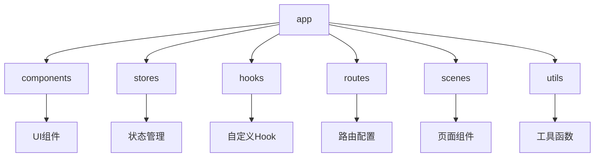
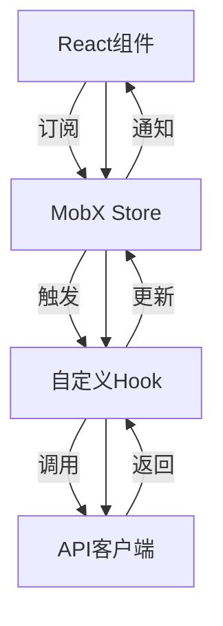
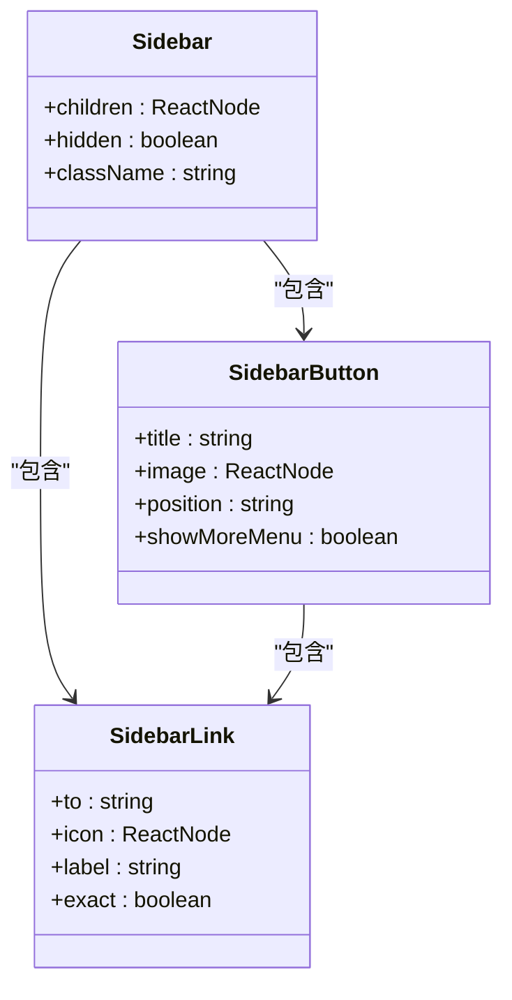
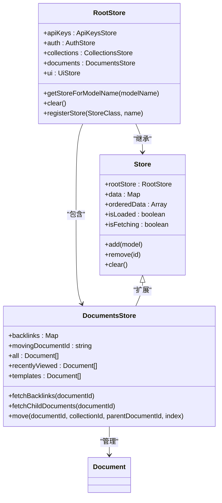
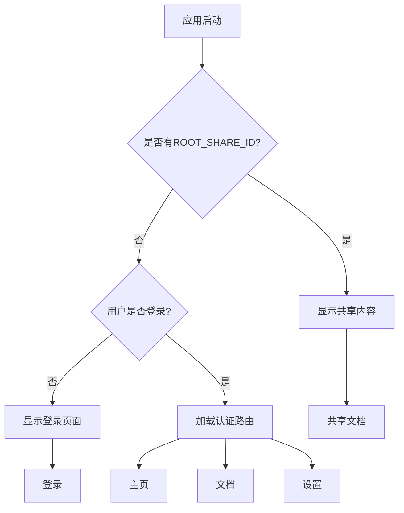
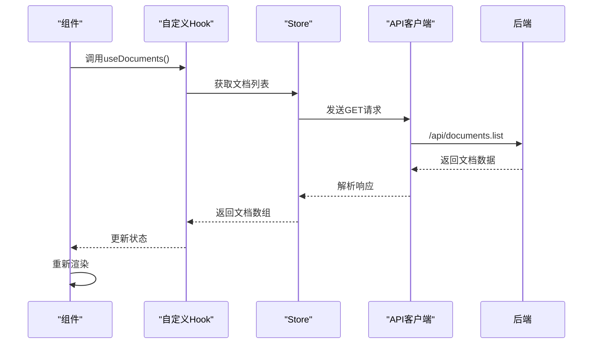
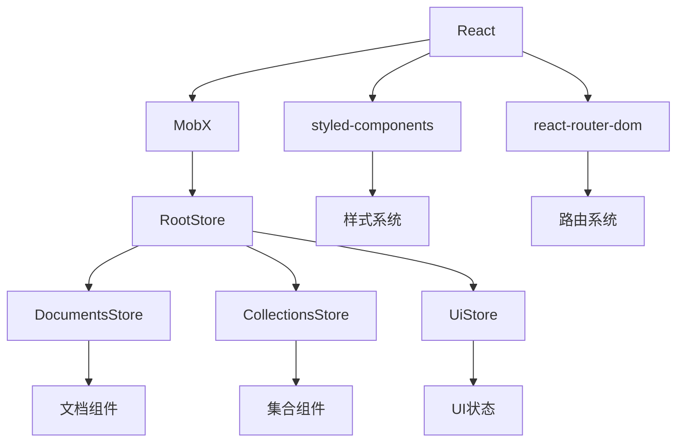

# 前端架构

<cite>
**本文档中引用的文件**  
- [RootStore.ts](file://app/stores/RootStore.ts)
- [ApiClient.ts](file://app/utils/ApiClient.ts)
- [Sidebar.tsx](file://app/components/Sidebar/Sidebar.tsx)
- [useStores.ts](file://app/hooks/useStores.ts)
- [index.tsx](file://app/routes/index.tsx)
</cite>

## 目录
1. [简介](#简介)
2. [项目结构](#项目结构)
3. [核心组件](#核心组件)
4. [架构概述](#架构概述)
5. [详细组件分析](#详细组件分析)
6. [依赖分析](#依赖分析)
7. [性能考虑](#性能考虑)
8. [故障排除指南](#故障排除指南)
9. [结论](#结论)

## 简介
baozi项目前端采用基于React和MobX的组件化架构设计，实现了高效的状态管理和灵活的组件组合。该架构通过RootStore统一管理所有Store实例，利用MobX的响应式机制实现状态变更的自动追踪和组件重新渲染。路由系统基于react-router-dom构建，支持动态路由和懒加载。前端通过自定义API客户端与后端进行通信，实现了请求重试、错误处理和认证管理等关键功能。本架构设计既考虑了初学者的易用性，又为经验丰富的开发者提供了深入的技术细节和优化空间。

## 项目结构
项目采用功能模块化的组织方式，主要分为actions、components、hooks、menus、models、routes、scenes、stores、styles、utils等目录。components目录包含可复用的UI组件，stores目录管理应用状态，hooks目录封装可复用的逻辑，routes和scenes目录处理路由和页面逻辑。这种清晰的分层结构有助于团队协作和代码维护。

**Diagram sources**
- [app/components](file://app/components)
- [app/stores](file://app/stores)
- [app/hooks](file://app/hooks)
- [app/routes](file://app/routes)
- [app/scenes](file://app/scenes)
- [app/utils](file://app/utils)

**Section sources**
- [app](file://app)

## 核心组件
前端架构的核心是基于React的组件化设计和MobX的状态管理。RootStore作为所有Store的容器，通过依赖注入的方式管理应用的全局状态。API客户端封装了与后端的通信逻辑，提供了统一的请求接口。路由系统通过懒加载和代码分割优化了应用的启动性能。这些核心组件共同构成了一个高效、可维护的前端架构。

**Section sources**
- [RootStore.ts](file://app/stores/RootStore.ts)
- [ApiClient.ts](file://app/utils/ApiClient.ts)
- [index.tsx](file://app/routes/index.tsx)

## 架构概述
baozi前端采用分层架构设计，从下到上分为数据层、状态管理层、逻辑层和视图层。数据层通过API客户端与后端交互；状态管理层使用MobX Store管理应用状态；逻辑层通过自定义Hook封装业务逻辑；视图层由React组件构成，通过Observer模式订阅状态变化。这种分层设计实现了关注点分离，提高了代码的可测试性和可维护性。

**Diagram sources**
- [RootStore.ts](file://app/stores/RootStore.ts)
- [ApiClient.ts](file://app/utils/ApiClient.ts)
- [useStores.ts](file://app/hooks/useStores.ts)

## 详细组件分析
### 组件体系结构
前端组件体系采用原子设计原则，从基础的原子组件（如Button、Input）到复合的分子组件（如Sidebar、Editor），再到完整的页面组件（如Document、Settings）。这种层次化的设计提高了组件的复用性和可维护性。例如，Sidebar组件由多个子组件（如SidebarButton、SidebarLink）组合而成，每个子组件都有明确的职责和接口。

#### 组件组合模式

**Diagram sources**
- [Sidebar.tsx](file://app/components/Sidebar/Sidebar.tsx)

**Section sources**
- [Sidebar.tsx](file://app/components/Sidebar/Sidebar.tsx)

### 状态管理机制
状态管理是前端架构的核心，通过RootStore统一管理所有Store实例。每个Store负责管理特定领域的状态，如DocumentsStore管理文档状态，CollectionsStore管理集合状态。RootStore通过registerStore方法注册所有Store，并提供getStoreForModelName方法根据模型名称获取对应的Store。

#### MobX状态管理

**Diagram sources**
- [RootStore.ts](file://app/stores/RootStore.ts)
- [DocumentsStore.ts](file://app/stores/DocumentsStore.ts)

**Section sources**
- [RootStore.ts](file://app/stores/RootStore.ts)

### 路由系统
路由系统基于react-router-dom构建，采用声明式路由配置。通过Suspense和lazy实现组件的懒加载，优化了应用的启动性能。路由配置分为认证路由和未认证路由，根据用户登录状态动态切换。共享文档路由支持通过分享ID访问文档，实现了灵活的文档共享功能。

#### 路由流程

**Diagram sources**
- [index.tsx](file://app/routes/index.tsx)

**Section sources**
- [index.tsx](file://app/routes/index.tsx)

### 数据流模式
数据流遵循单向数据流原则，从API客户端获取数据，通过Store更新状态，最终反映到视图层。API客户端负责与后端通信，处理请求和响应；Store管理应用状态，提供数据访问接口；组件通过useStores Hook订阅状态变化，实现视图的自动更新。这种数据流模式确保了状态的一致性和可预测性。

#### 数据流示例

**Diagram sources**
- [ApiClient.ts](file://app/utils/ApiClient.ts)
- [DocumentsStore.ts](file://app/stores/DocumentsStore.ts)
- [useStores.ts](file://app/hooks/useStores.ts)

## 依赖分析
前端架构的依赖关系清晰，各组件和模块之间的耦合度低。核心依赖包括React、MobX、styled-components等。通过模块化设计，各功能模块可以独立开发和测试。API客户端作为数据访问的统一入口，降低了组件与后端的耦合度。自定义Hook封装了可复用的逻辑，提高了代码的复用性。

**Diagram sources**
- [package.json](file://package.json)

## 性能考虑
架构设计充分考虑了性能优化。通过组件懒加载和代码分割减少初始加载时间；利用MobX的细粒度响应式系统，避免不必要的组件重新渲染；API客户端实现请求缓存和重试机制，提高网络请求的效率和可靠性。此外，通过虚拟滚动和分页加载处理大量数据，确保应用的流畅性。

## 故障排除指南
常见问题包括状态更新不及时、组件重新渲染过多、API请求失败等。解决状态更新问题需检查MobX的observable和action使用是否正确；减少重新渲染可通过优化observer组件的粒度和使用memoization；处理API请求失败需检查网络连接、认证状态和请求参数。开发工具如React DevTools和MobX DevTools有助于诊断和解决问题。

**Section sources**
- [errors.ts](file://app/utils/errors.ts)

## 结论
baozi前端架构通过React和MobX的有机结合，实现了高效、可维护的组件化设计。RootStore统一管理应用状态，API客户端封装后端通信，路由系统支持灵活的页面导航。该架构既满足了功能需求，又考虑了性能和可扩展性，为应用的持续发展奠定了坚实基础。未来可进一步优化状态管理，引入更精细的性能监控，提升用户体验。