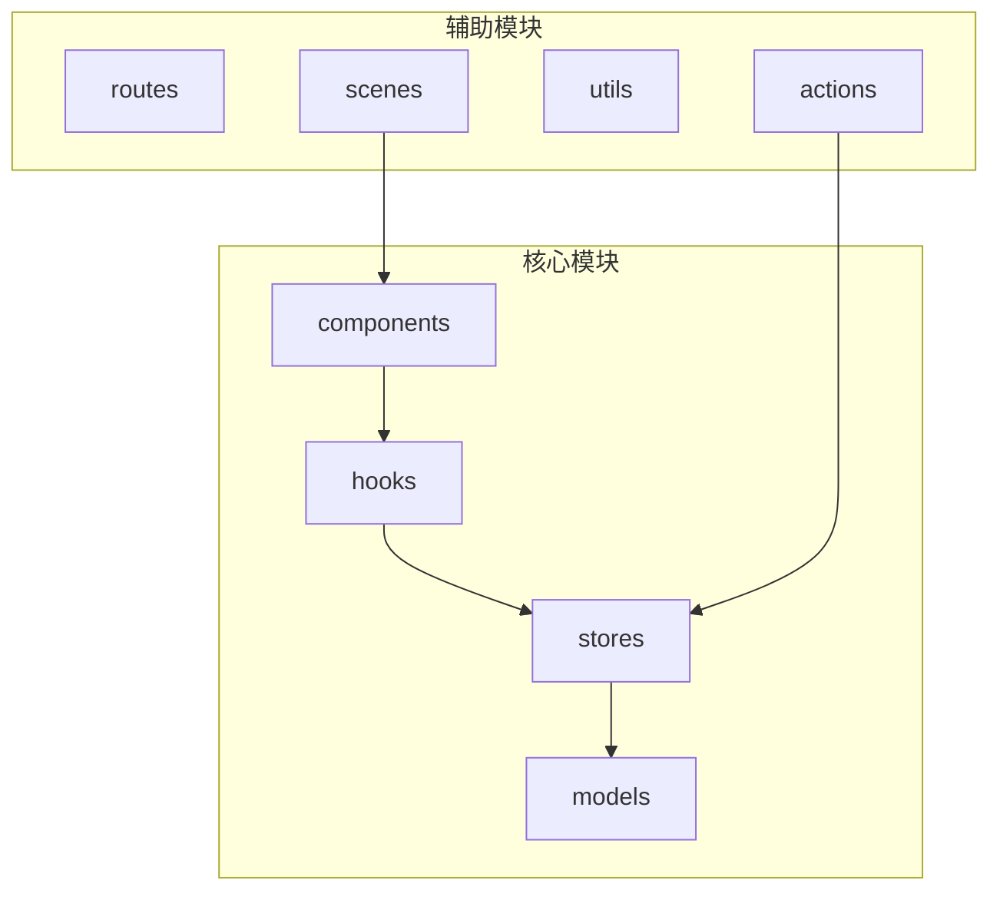
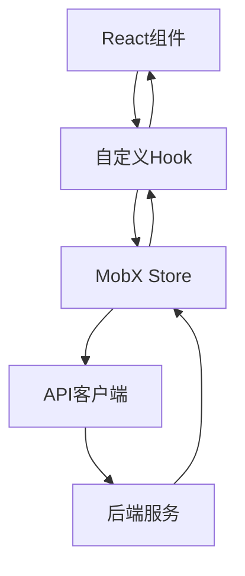
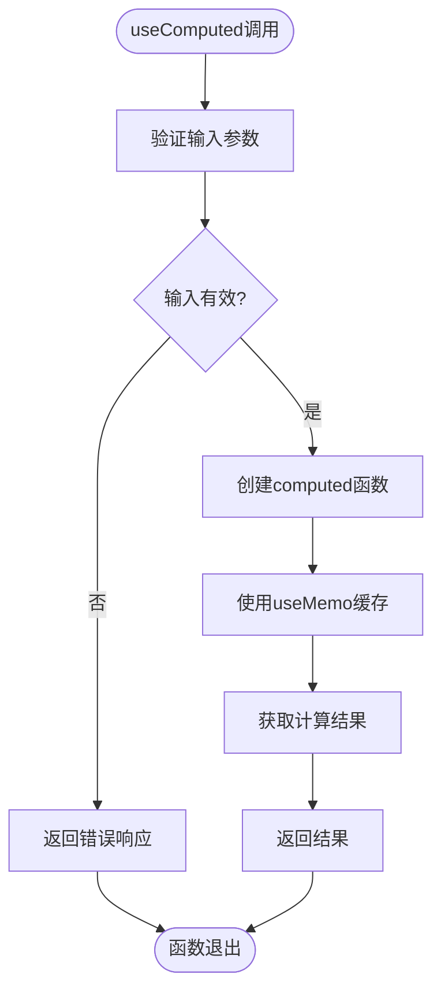
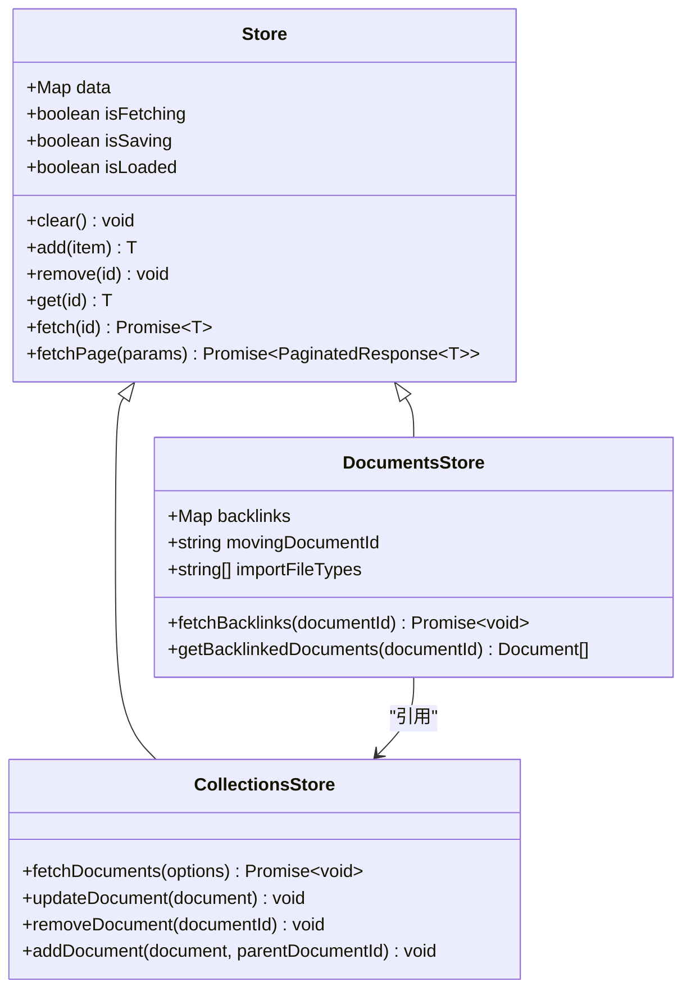
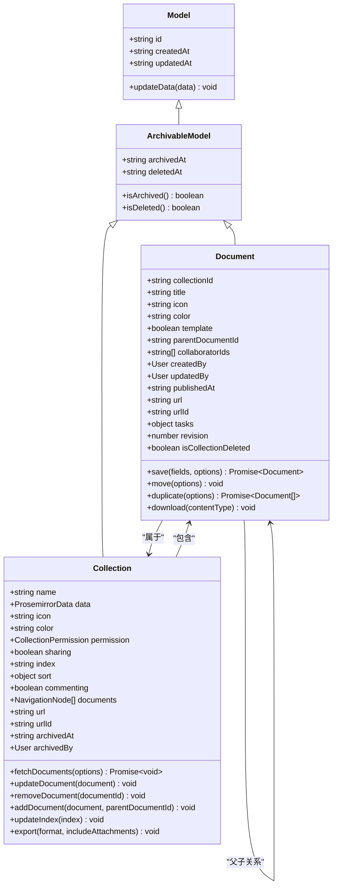
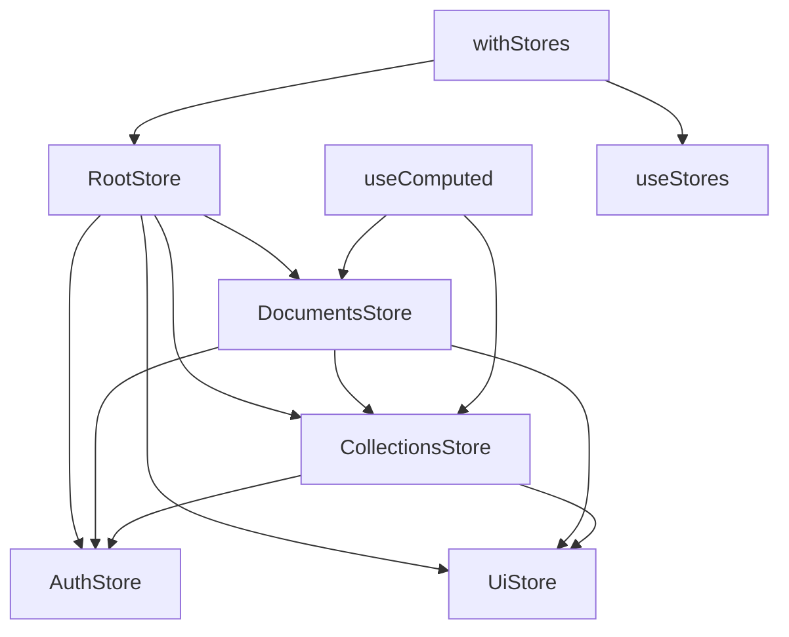

# 性能优化与最佳实践

<cite>
**本文档引用的文件**   
- [useComputed.ts](file://app/hooks/useComputed.ts)
- [RootStore.ts](file://app/stores/RootStore.ts)
- [UiStore.ts](file://app/stores/UiStore.ts)
- [DocumentsStore.ts](file://app/stores/DocumentsStore.ts)
- [base/Store.ts](file://app/stores/base/Store.ts)
- [Document.ts](file://app/models/Document.ts)
- [Collection.ts](file://app/models/Collection.ts)
- [withStores.tsx](file://app/components/withStores.tsx)
</cite>

## 目录
1. [简介](#简介)
2. [项目结构](#项目结构)
3. [核心组件](#核心组件)
4. [架构概述](#架构概述)
5. [详细组件分析](#详细组件分析)
6. [依赖分析](#依赖分析)
7. [性能考虑](#性能考虑)
8. [故障排除指南](#故障排除指南)
9. [结论](#结论)
10. [附录](#附录)（如有必要）

## 简介
本文档深入探讨了在大型应用中维护MobX状态高效性的策略。重点介绍如何使用computed属性优化计算性能、通过适当的action批处理减少不必要的重新渲染，以及如何管理Store的内存使用避免泄漏。文档还提供了自定义Hook如useComputed的实现和应用示例，以及Store的清理和资源释放方法。为初学者提供常见的性能陷阱和规避方法，同时为经验丰富的开发者提供高级优化技巧。

## 项目结构
项目采用模块化设计，主要分为actions、components、hooks、models、routes、scenes、stores等目录。stores目录包含所有MobX状态管理的Store类，models目录定义了数据模型，hooks目录提供了自定义React Hook，components目录包含UI组件。

**图表来源**
- [RootStore.ts](file://app/stores/RootStore.ts#L37-L170)
- [DocumentsStore.ts](file://app/stores/DocumentsStore.ts#L47-L752)

**章节来源**
- [RootStore.ts](file://app/stores/RootStore.ts#L37-L170)
- [DocumentsStore.ts](file://app/stores/DocumentsStore.ts#L47-L752)

## 核心组件
核心组件包括RootStore、各种Store类（如DocumentsStore、CollectionsStore）、模型类（如Document、Collection）以及自定义Hook（如useComputed）。这些组件共同构成了应用的状态管理基础。

**章节来源**
- [RootStore.ts](file://app/stores/RootStore.ts#L37-L170)
- [DocumentsStore.ts](file://app/stores/DocumentsStore.ts#L47-L752)
- [Document.ts](file://app/models/Document.ts#L1-L704)

## 架构概述
应用采用分层架构，顶层是React组件，中间层是自定义Hook，底层是MobX Store。状态流从Store流向Hook，再由Hook提供给组件使用。这种架构确保了状态管理的集中化和可预测性。

**图表来源**
- [useComputed.ts](file://app/hooks/useComputed.ts#L9-L15)
- [withStores.tsx](file://app/components/withStores.tsx#L7-L29)

## 详细组件分析

### useComputed Hook分析
useComputed是基于MobX computed函数的自定义Hook，用于在React组件中创建计算属性。它结合了React的useMemo和MobX的computed，确保计算属性在依赖项变化时重新计算。

**图表来源**
- [useComputed.ts](file://app/hooks/useComputed.ts#L9-L15)

**章节来源**
- [useComputed.ts](file://app/hooks/useComputed.ts#L9-L15)

### Store类分析
Store类继承自base/Store，提供了数据管理的基础功能。每个Store负责管理特定类型的数据，如DocumentsStore管理文档，CollectionsStore管理集合。

#### Store类关系图

**图表来源**
- [base/Store.ts](file://app/stores/base/Store.ts#L48-L486)
- [DocumentsStore.ts](file://app/stores/DocumentsStore.ts#L47-L752)
- [CollectionsStore.ts](file://app/stores/CollectionsStore.ts#L17-L254)

**章节来源**
- [base/Store.ts](file://app/stores/base/Store.ts#L48-L486)
- [DocumentsStore.ts](file://app/stores/DocumentsStore.ts#L47-L752)

### 模型类分析
模型类如Document和Collection定义了数据结构和业务逻辑。它们与Store类配合，实现了数据的持久化和状态管理。

#### 模型类关系图

**图表来源**
- [Document.ts](file://app/models/Document.ts#L1-L704)
- [Collection.ts](file://app/models/Collection.ts#L1-L456)

**章节来源**
- [Document.ts](file://app/models/Document.ts#L1-L704)
- [Collection.ts](file://app/models/Collection.ts#L1-L456)

## 依赖分析
项目依赖关系清晰，Store之间通过RootStore进行协调。组件通过Hook访问Store，实现了关注点分离。

**图表来源**
- [RootStore.ts](file://app/stores/RootStore.ts#L37-L170)
- [useComputed.ts](file://app/hooks/useComputed.ts#L9-L15)
- [withStores.tsx](file://app/components/withStores.tsx#L7-L29)

**章节来源**
- [RootStore.ts](file://app/stores/RootStore.ts#L37-L170)
- [useComputed.ts](file://app/hooks/useComputed.ts#L9-L15)

## 性能考虑
在大型应用中，MobX状态管理的性能优化至关重要。以下是一些关键策略：

1. **使用computed属性**：将复杂的计算逻辑封装在computed属性中，MobX会自动缓存结果并在依赖项变化时重新计算。
2. **批处理action**：将多个状态更新操作封装在单个action中，减少不必要的重新渲染。
3. **合理使用observable.shallow**：对于大型数组或对象，使用shallow observable避免深度监听。
4. **及时清理资源**：在组件卸载时清理autorun和reaction，避免内存泄漏。
5. **状态分片**：将大型Store拆分为多个小型Store，降低复杂度。
6. **懒加载Store**：按需加载Store，减少初始加载时间。
7. **性能监控**：集成性能监控工具，及时发现和解决性能瓶颈。

## 故障排除指南
### 常见性能陷阱
1. **过度使用computed**：过多的computed属性会增加计算开销，应仅在必要时使用。
2. **未清理的autorun**：忘记清理autorun会导致内存泄漏和不必要的计算。
3. **深层监听**：对大型对象使用深度监听会严重影响性能，应使用shallow observable。
4. **频繁的状态更新**：频繁调用action会导致组件频繁重新渲染，应合并更新操作。

### 高级优化技巧
1. **状态分片**：将大型Store按功能拆分为多个小型Store，每个Store负责特定领域的状态管理。
2. **懒加载Store**：在需要时才创建和初始化Store，减少应用启动时间。
3. **性能监控集成**：使用MobX的内置性能监控工具或第三方工具，实时监控状态变化和计算性能。
4. **异步计算**：对于耗时的计算操作，考虑使用异步计算或Web Worker。
5. **缓存策略**：实现合理的缓存策略，避免重复计算和网络请求。

**章节来源**
- [useComputed.ts](file://app/hooks/useComputed.ts#L9-L15)
- [base/Store.ts](file://app/stores/base/Store.ts#L48-L486)
- [DocumentsStore.ts](file://app/stores/DocumentsStore.ts#L47-L752)

## 结论
通过合理使用MobX的computed属性、批处理action、管理Store内存使用以及实现自定义Hook，可以显著提升大型应用的状态管理性能。遵循本文档中的最佳实践，可以避免常见的性能陷阱，并为应用的长期维护和扩展打下坚实基础。