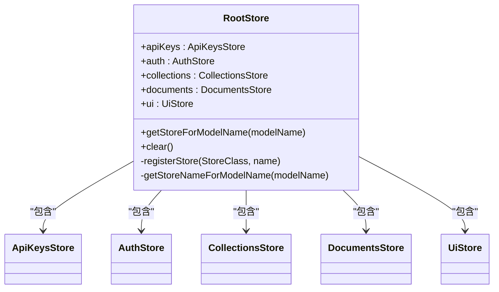
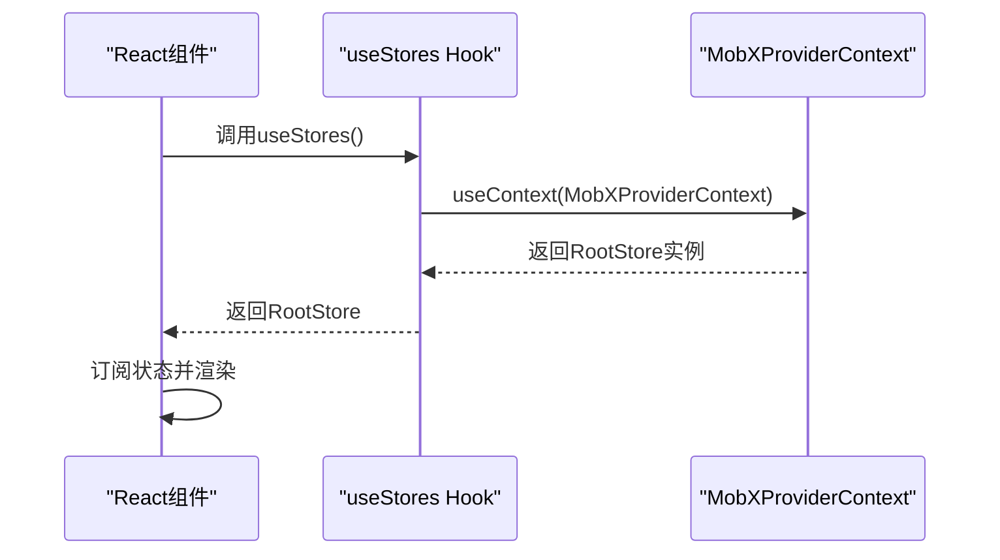
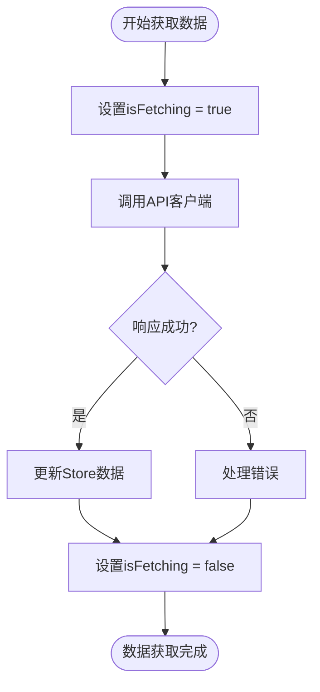

# 数据流与更新机制

<cite>
**本文档中引用的文件**  
- [RootStore.ts](file://app/stores/RootStore.ts)
- [useStores.ts](file://app/hooks/useStores.ts)
- [Store.ts](file://app/stores/base/Store.ts)
- [AuthStore.ts](file://app/stores/AuthStore.ts)
- [DocumentsStore.ts](file://app/stores/DocumentsStore.ts)
- [CollectionsStore.ts](file://app/stores/CollectionsStore.ts)
</cite>

## 目录
1. [项目状态管理概述](#项目状态管理概述)
2. [MobX状态流核心机制](#mobx状态流核心机制)
3. [RootStore与状态容器](#rootstore与状态容器)
4. [状态订阅与useStores Hook](#状态订阅与usestores-hook)
5. [状态变更与Action方法](#状态变更与action方法)
6. [异步数据获取与加载状态](#异步数据获取与加载状态)
7. [MobX反应式编程应用](#mobx反应式编程应用)
8. [数据流跟踪示例](#数据流跟踪示例)
9. [性能优化与调试技巧](#性能优化与调试技巧)

## 项目状态管理概述

baozi项目采用MobX作为核心状态管理解决方案，通过observable状态、computed计算属性和action方法构建响应式数据流。整个应用的状态被组织在多个Store中，通过RootStore统一管理，形成清晰的层次结构。React组件通过useStores等Hook订阅状态变化，实现自动重新渲染，确保视图与状态的同步。

## MobX状态流核心机制

MobX通过透明的函数式响应式编程（TFRP）实现状态管理。当observable状态发生变化时，所有依赖该状态的computed属性和React组件会自动更新。这种机制避免了手动管理状态依赖的复杂性，使开发者能够专注于业务逻辑的实现。

**Section sources**
- [Store.ts](file://app/stores/base/Store.ts#L69-L87)

## RootStore与状态容器

RootStore是整个应用状态的根容器，负责实例化和管理所有子Store。它通过registerStore方法将各个Store注册为自身的属性，形成统一的状态树。RootStore的构造函数按照特定顺序初始化Store，确保依赖关系的正确性，例如AuthStore在最后初始化，因为它依赖于其他Store。

**Diagram sources**
- [RootStore.ts](file://app/stores/RootStore.ts#L37-L170)

**Section sources**
- [RootStore.ts](file://app/stores/RootStore.ts#L37-L170)

## 状态订阅与useStores Hook

useStores Hook是React组件访问MobX状态的主要方式。它通过useContext从React上下文中获取RootStore实例，使组件能够订阅和访问应用的全局状态。该Hook在app和shared目录下均有实现，确保在不同上下文中的一致性。

**Diagram sources**
- [useStores.ts](file://app/hooks/useStores.ts#L9-L11)
- [useStores.ts](file://shared/hooks/useStores.ts#L3-L5)

**Section sources**
- [useStores.ts](file://app/hooks/useStores.ts#L9-L11)
- [useStores.ts](file://shared/hooks/useStores.ts#L3-L5)

## 状态变更与Action方法

Action方法是修改observable状态的唯一途径。它们被@action装饰器标记，确保状态变更的可追踪性和事务性。当Action方法被调用时，它会触发相关computed属性的重新计算和依赖组件的重新渲染。例如，DocumentsStore中的fetch方法通过action装饰器确保异步数据获取过程中的状态一致性。

**Section sources**
- [Store.ts](file://app/stores/base/Store.ts#L79-L87)

## 异步数据获取与加载状态

Store基类提供了统一的异步数据获取模式。fetch、fetchPage和fetchAll等方法处理API调用，管理加载状态（isFetching），并更新数据缓存。这些方法通过runInAction确保状态变更的原子性，并在finally块中重置加载状态，提供一致的用户体验。

**Diagram sources**
- [Store.ts](file://app/stores/base/Store.ts#L175-L219)

**Section sources**
- [Store.ts](file://app/stores/base/Store.ts#L175-L219)

## MobX反应式编程应用

项目中广泛使用autorun和reaction等MobX反应式编程概念。autorun用于创建自动执行的副作用，如将AuthStore的状态持久化到localStorage；reaction提供更精细的控制，只在特定数据变化时执行回调。这些机制确保了状态变化的自动响应和副作用的正确管理。

**Section sources**
- [AuthStore.ts](file://app/stores/AuthStore.ts#L84-L126)

## 数据流跟踪示例

以用户登录为例，数据流从用户操作开始：1) 用户提交登录表单；2) AuthStore的fetchAuth方法被调用；3) API客户端发送请求；4) 响应数据被处理并更新Store；5) 相关组件自动重新渲染。整个过程展示了从用户输入到视图更新的完整数据流。

**Section sources**
- [AuthStore.ts](file://app/stores/AuthStore.ts#L84-L126)

## 性能优化与调试技巧

为优化性能，建议使用useComputed Hook替代React的useMemo，因为它能更好地与MobX的响应式系统集成。调试时，可利用MobX的spy工具监听所有动作和状态变更，或使用mobx-devtools进行可视化调试。避免在render方法中直接访问Store属性，应使用observer或useObserver确保正确的依赖跟踪。

**Section sources**
- [useComputed.ts](file://app/hooks/useComputed.ts#L1-L15)