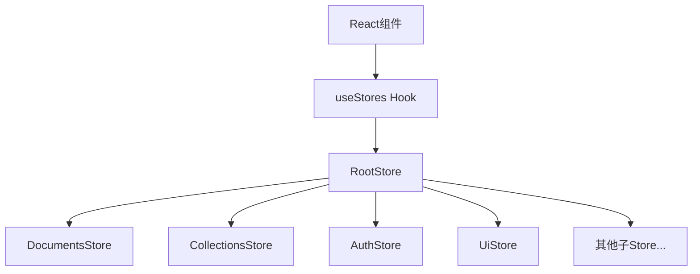
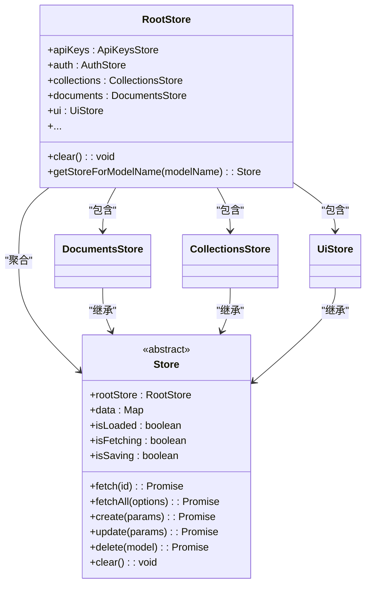
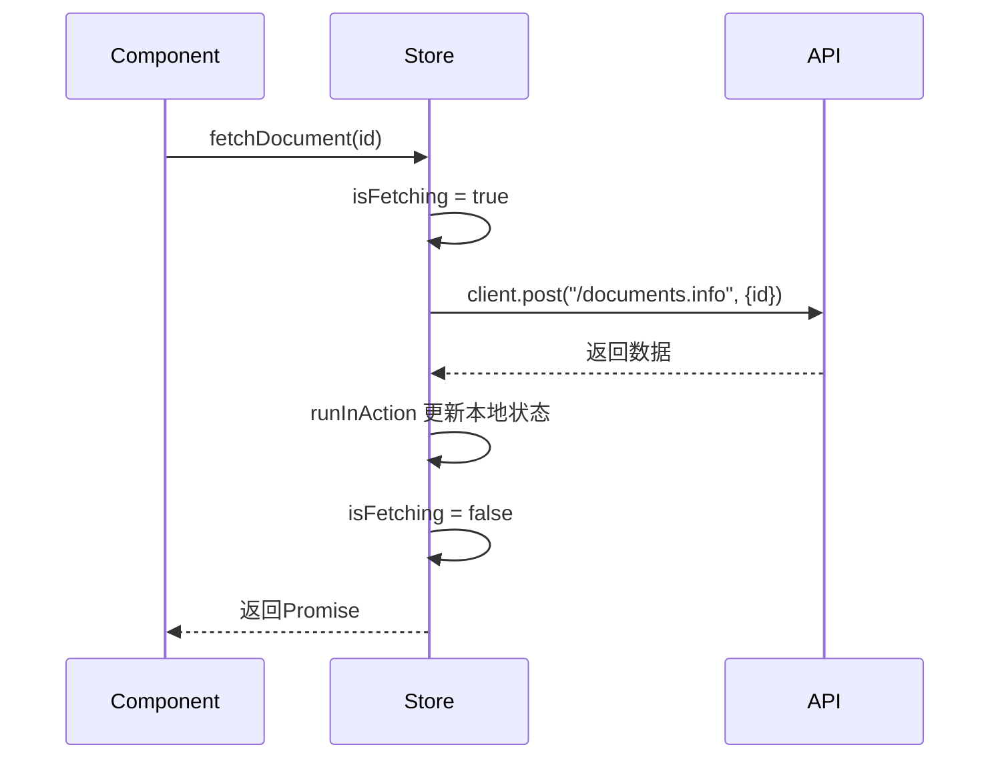

# 状态管理

<cite>
**Referenced Files in This Document**   
- [RootStore.ts](file://app/stores/RootStore.ts)
- [UiStore.ts](file://app/stores/UiStore.ts)
- [DocumentsStore.ts](file://app/stores/DocumentsStore.ts)
- [CollectionsStore.ts](file://app/stores/CollectionsStore.ts)
- [useStores.ts](file://app/hooks/useStores.ts)
- [index.ts](file://app/stores/index.ts)
</cite>

## 目录
1. [引言](#引言)
2. [核心状态管理架构](#核心状态管理架构)
3. [RootStore：状态聚合中心](#rootstore状态聚合中心)
4. [子Store详解](#子store详解)
5. [状态与React组件的连接](#状态与react组件的连接)
6. [异步操作与错误处理](#异步操作与错误处理)
7. [本地状态与持久状态的区分](#本地状态与持久状态的区分)
8. [MobX核心概念与最佳实践](#mobx核心概念与最佳实践)

## 引言

本项目采用MobX作为前端状态管理解决方案，构建了一个高效、可扩展的状态管理机制。该机制的核心是`RootStore`，它作为单一状态树的根节点，聚合管理所有子Store（如`DocumentsStore`、`CollectionsStore`等）。通过`observable`装饰器定义可观察状态，使用`action`方法管理状态变更，并利用`computed`属性实现派生数据。Store通过React Context与组件连接，确保状态变更能够自动触发视图更新。本文档将深入解析这一机制，为开发者提供从基础到高级的全面指导。

## 核心状态管理架构

项目的状态管理架构遵循分层聚合模式，以`RootStore`为顶层容器，协调所有子Store的生命周期和数据流。子Store负责管理特定领域（如文档、集合、用户界面）的业务数据和逻辑。这种设计实现了关注点分离，使得代码结构清晰，易于维护和测试。状态变更通过`action`方法发起，MobX的响应式系统会自动追踪依赖关系，并在`observable`状态变化时，高效地更新所有相关的`computed`属性和React组件。



**Diagram sources**
- [RootStore.ts](file://app/stores/RootStore.ts)
- [useStores.ts](file://app/hooks/useStores.ts)

**Section sources**
- [RootStore.ts](file://app/stores/RootStore.ts)
- [useStores.ts](file://app/hooks/useStores.ts)

## RootStore：状态聚合中心

`RootStore`是整个应用状态管理的核心，它负责实例化和注册所有子Store。在构造函数中，通过`registerStore`方法按特定顺序创建各个Store实例，确保依赖关系正确的初始化，例如`AuthStore`必须在其他Store之后初始化，因为它会依赖其他Store的数据。



**Diagram sources**
- [RootStore.ts](file://app/stores/RootStore.ts)
- [DocumentsStore.ts](file://app/stores/DocumentsStore.ts)
- [CollectionsStore.ts](file://app/stores/CollectionsStore.ts)
- [UiStore.ts](file://app/stores/UiStore.ts)

**Section sources**
- [RootStore.ts](file://app/stores/RootStore.ts)

## 子Store详解

### DocumentsStore：文档状态管理

`DocumentsStore`继承自基类`Store`，专门负责管理文档（Document）模型的状态。它通过`@observable`装饰器维护一个`Map`来存储所有文档实例，并提供了丰富的`@computed`属性来派生不同视图的数据，例如`all`（所有未归档和未删除的文档）、`recentlyUpdated`（最近更新的文档）和`drafts`（草稿）。这些计算属性会自动响应底层数据的变化。

**Section sources**
- [DocumentsStore.ts](file://app/stores/DocumentsStore.ts)

### CollectionsStore：集合状态管理

`CollectionsStore`同样继承自`Store`，用于管理集合（Collection）模型。它提供了`@computed`属性来获取当前活动的集合（`active`）、所有活动集合（`allActive`）以及按特定条件过滤的集合列表。其`fetch`方法在获取集合数据后，会自动调用`fetchDocuments`来加载该集合下的文档，体现了Store之间的协作。

**Section sources**
- [CollectionsStore.ts](file://app/stores/CollectionsStore.ts)

### UiStore：用户界面状态管理

`UiStore`是管理本地UI状态的典型代表。它不直接对应后端模型，而是存储如`activeDocumentId`（当前活动文档ID）、`sidebarCollapsed`（侧边栏折叠状态）、`theme`（主题偏好）等与用户交互相关的瞬时状态。这些状态被`@observable`装饰，当它们变化时，会触发视图更新。

```mermaid
classDiagram
class UiStore {
+activeDocumentId : string | undefined
+activeCollectionId : string | null | undefined
+sidebarCollapsed : boolean
+theme : Theme
+progressBarVisible : boolean
+setActiveDocument(document) : void
+setTheme(theme) : void
+collapseSidebar() : void
+expandSidebar() : void
}
enum Theme {
Light
Dark
System
}
UiStore --> Theme
```

**Diagram sources**
- [UiStore.ts](file://app/stores/UiStore.ts)

**Section sources**
- [UiStore.ts](file://app/stores/UiStore.ts)

## 状态与React组件的连接

Store与React组件的连接主要通过`useStores` Hook实现。该Hook利用React的`useContext`从`MobXProviderContext`中获取`RootStore`实例，使任何函数组件都能方便地访问到所有Store。

```typescript
// useStores.ts
import { MobXProviderContext } from "mobx-react";
import { useContext } from "react";
import RootStore from "~/stores";

export default function useStores() {
  return useContext(MobXProviderContext) as typeof RootStore;
}
```

在组件中，可以这样使用：
```typescript
const MyComponent = () => {
  const { documents, ui } = useStores();
  // 使用documents和ui中的状态和方法
};
```

此外，`withStores`高阶组件也提供了一种将Store作为props注入类组件的方式。

**Section sources**
- [useStores.ts](file://app/hooks/useStores.ts)
- [withStores.tsx](file://app/components/withStores.tsx)

## 异步操作与错误处理

Store中的异步操作（如`fetch`、`create`、`update`）均被`@action`装饰。`@action`确保这些操作在MobX的事务中执行，从而保证状态变更的原子性。异步操作通常遵循“加载中-成功/失败”的模式，通过`isFetching`和`isSaving`等`observable`状态来管理加载状态。



错误处理主要通过`try...catch`和`invariant`断言来实现。`invariant`用于在开发环境中捕获逻辑错误，而网络请求的错误则由底层的`ApiClient`处理。Store本身不直接管理错误状态，而是将错误抛出，由调用者（通常是组件）来决定如何展示错误信息。

**Section sources**
- [DocumentsStore.ts](file://app/stores/DocumentsStore.ts#L268-L323)
- [base/Store.ts](file://app/stores/base/Store.ts)

## 本地状态与持久状态的区分

项目清晰地区分了两种状态：
1.  **持久状态 (Persistent State)**：由`DocumentsStore`、`CollectionsStore`等管理，这些状态直接映射到后端数据库中的模型。它们通过API与服务器同步，是应用的核心业务数据。
2.  **本地状态 (Local State)**：由`UiStore`管理，这些状态仅存在于客户端，用于记录用户的UI偏好和交互状态。`UiStore`通过`Storage`（如localStorage）对部分状态（如`sidebarWidth`、`theme`）进行持久化，以实现跨会话的偏好记忆。

这种区分使得状态管理更加清晰，避免了将临时的UI状态与核心业务数据混为一谈。

**Section sources**
- [UiStore.ts](file://app/stores/UiStore.ts#L36-L105)
- [index.ts](file://app/stores/index.ts)

## MobX核心概念与最佳实践

### 核心概念
- **Observable**: 被`@observable`装饰的属性或对象，其变化会被MobX追踪。
- **Action**: 被`@action`装饰的方法，是修改`observable`状态的唯一推荐方式。
- **Computed**: 被`@computed`装饰的属性，其值由其他`observable`状态派生而来，自动缓存和更新。
- **Reaction**: 自动响应状态变化的副作用，如`autorun`或`reaction`。

### 性能优化策略
- **批量更新**: 使用`runInAction`将多个状态变更包裹在一个事务中，减少不必要的重新渲染。
- **选择性渲染**: 利用`observer`高阶组件或`useObserver` Hook，确保组件仅在依赖的`observable`状态变化时才重新渲染。
- **避免过度计算**: 确保`computed`属性的计算逻辑高效，避免不必要的复杂计算。

### 调试技巧
- **开发模式暴露**: 在开发环境中，`RootStore`实例被挂载到`window.stores`上，开发者可以直接在浏览器控制台中访问和调试所有状态。
- **MobX开发者工具**: 推荐使用MobX DevTools浏览器插件，可以直观地查看状态树、观察依赖关系和追踪动作。

**Section sources**
- [index.ts](file://app/stores/index.ts#L7-L9)
- [UiStore.ts](file://app/stores/UiStore.ts)
- [base/Store.ts](file://app/stores/base/Store.ts)