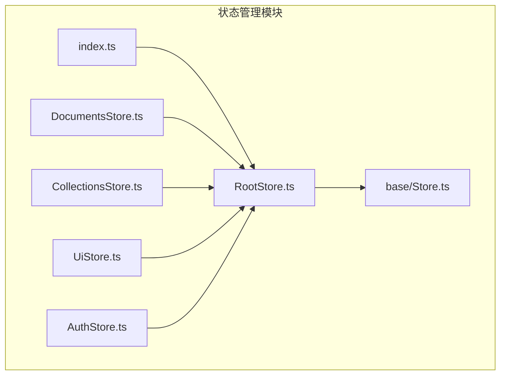
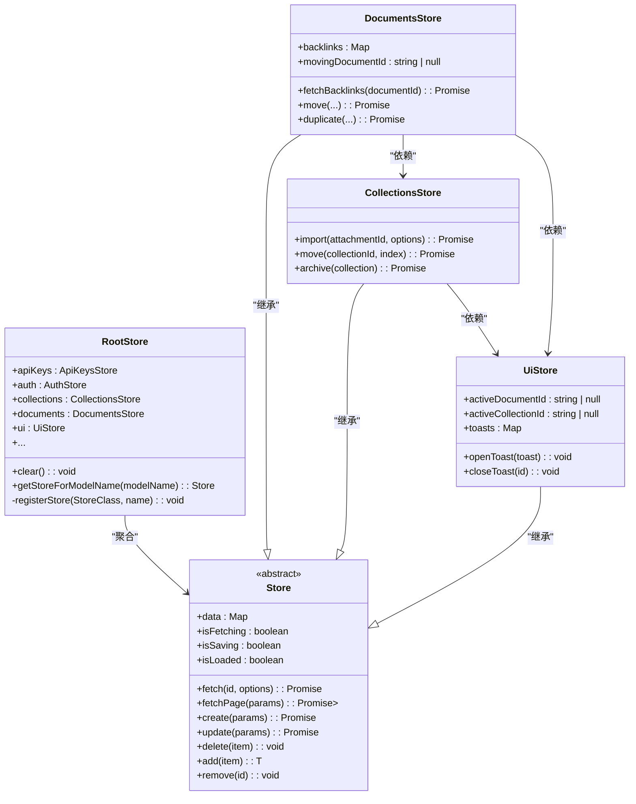
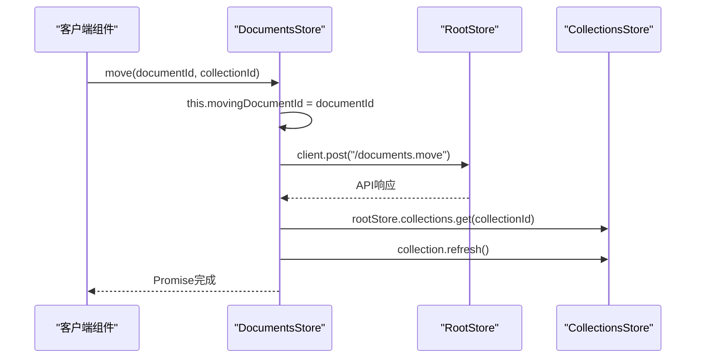
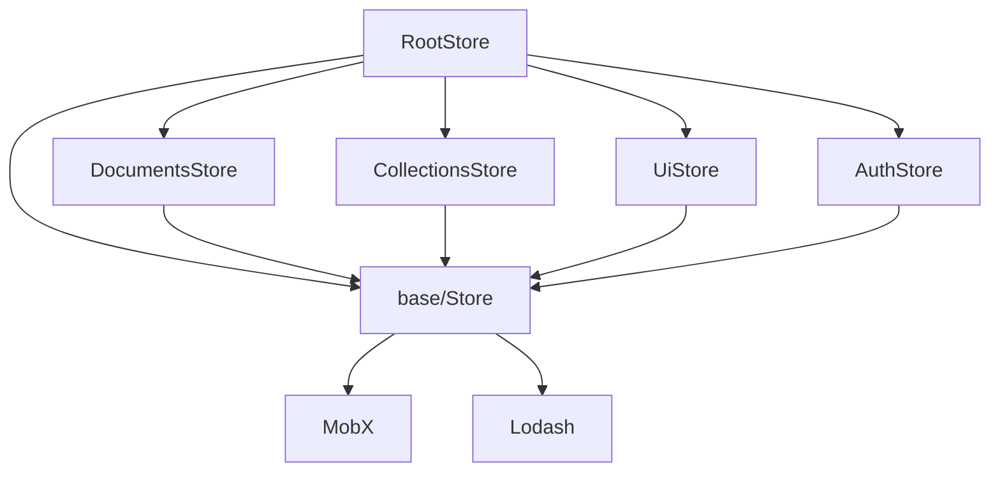

# 状态管理架构

<cite>
**本文档中引用的文件**
- [RootStore.ts](file://app/stores/RootStore.ts)
- [base/Store.ts](file://app/stores/base/Store.ts)
- [index.ts](file://app/stores/index.ts)
- [withStores.tsx](file://app/components/withStores.tsx)
- [useStores.ts](file://app/hooks/useStores.ts)
- [DocumentsStore.ts](file://app/stores/DocumentsStore.ts)
- [CollectionsStore.ts](file://app/stores/CollectionsStore.ts)
- [UiStore.ts](file://app/stores/UiStore.ts)
- [AuthStore.ts](file://app/stores/AuthStore.ts)
</cite>

## 目录
1. [简介](#简介)
2. [项目结构](#项目结构)
3. [核心组件](#核心组件)
4. [架构概述](#架构概述)
5. [详细组件分析](#详细组件分析)
6. [依赖分析](#依赖分析)
7. [性能考虑](#性能考虑)
8. [故障排除指南](#故障排除指南)
9. [结论](#结论)
10. [附录](#附录)（如有必要）

## 简介
本文档详细介绍了baozi项目中状态管理的整体架构，重点分析了RootStore的设计模式和核心作用。文档将解释RootStore如何作为单一入口点聚合管理所有子Store（如DocumentsStore、CollectionsStore、UiStore等），并实现依赖注入和生命周期管理。通过实际代码示例展示RootStore的初始化过程、子Store的注册机制以及Store之间的通信模式。同时，文档将详细说明类型定义和接口设计如何确保类型安全的状态访问，并为初学者提供清晰的架构图示，为经验丰富的开发者分析这种集中式状态管理模式的优势与潜在挑战。

## 项目结构
baozi项目的状态管理模块位于`app/stores`目录下，采用集中式架构设计。该目录包含一个核心的`RootStore.ts`文件，它作为所有状态存储的聚合点。此外，还有一系列专门的Store文件，如`DocumentsStore.ts`、`CollectionsStore.ts`、`UiStore.ts`等，每个文件负责管理特定领域（如文档、集合、用户界面）的应用状态。这些Store都继承自一个位于`base/Store.ts`的抽象基类，该基类提供了状态管理的通用功能，如数据获取、更新和删除。`index.ts`文件负责实例化`RootStore`并将其暴露给整个应用。



**Diagram sources**
- [RootStore.ts](file://app/stores/RootStore.ts#L37-L170)
- [base/Store.ts](file://app/stores/base/Store.ts#L48-L486)
- [index.ts](file://app/stores/index.ts#L3-L3)

**Section sources**
- [RootStore.ts](file://app/stores/RootStore.ts#L37-L170)
- [base/Store.ts](file://app/stores/base/Store.ts#L48-L486)
- [index.ts](file://app/stores/index.ts#L3-L3)

## 核心组件
状态管理架构的核心是`RootStore`类，它作为单一入口点，聚合了所有子Store。`RootStore`在构造函数中通过`registerStore`方法注册各个子Store实例，如`DocumentsStore`、`CollectionsStore`和`UiStore`。这种设计模式实现了依赖注入，使得子Store可以方便地访问`RootStore`的引用，从而与其他Store进行通信。`RootStore`还提供了`clear`方法，用于在用户登出等场景下清除除`auth`和`ui`外的所有状态数据，确保了状态的隔离和安全性。

**Section sources**
- [RootStore.ts](file://app/stores/RootStore.ts#L37-L170)
- [base/Store.ts](file://app/stores/base/Store.ts#L48-L486)

## 架构概述
baozi项目采用集中式状态管理架构，其核心是`RootStore`。`RootStore`作为应用状态的单一事实来源，负责创建、管理和协调所有子Store。每个子Store（如`DocumentsStore`、`CollectionsStore`）都继承自`Store`基类，该基类利用MobX库实现了响应式编程，能够自动追踪状态变化并更新视图。`RootStore`通过构造函数初始化所有子Store，并将自身作为参数传递给它们，从而建立了依赖关系。这种设计使得子Store可以轻松地访问其他Store的数据和方法，实现了Store间的高效通信。



**Diagram sources**
- [RootStore.ts](file://app/stores/RootStore.ts#L37-L170)
- [base/Store.ts](file://app/stores/base/Store.ts#L48-L486)
- [DocumentsStore.ts](file://app/stores/DocumentsStore.ts#L47-L752)
- [CollectionsStore.ts](file://app/stores/CollectionsStore.ts#L17-L254)
- [UiStore.ts](file://app/stores/UiStore.ts#L36-L301)

## 详细组件分析

### RootStore分析
`RootStore`是整个状态管理系统的中枢，其设计模式体现了集中式管理的核心思想。它的主要作用是作为单一入口点，聚合和管理所有子Store。

#### 设计模式与作用
`RootStore`的设计模式是一种典型的**依赖注入容器**。它在构造函数中主动创建所有子Store的实例，并将自身作为依赖项传递给它们。这种模式有以下几个关键优势：
1.  **单一入口点**: 所有状态都通过`RootStore`进行访问，简化了状态管理的复杂性。
2.  **依赖注入**: 子Store无需关心如何获取其他Store的实例，它们只需通过`this.rootStore`即可访问整个状态树。
3.  **生命周期管理**: `RootStore`的`clear`方法可以统一管理子Store的生命周期，在用户登出时清除缓存数据，保证了状态的纯净。

#### 初始化与注册机制
`RootStore`的初始化过程在构造函数中完成。它通过`registerStore`方法来注册每个子Store。该方法接受一个Store类和一个可选的名称作为参数。如果未提供名称，它会根据类名自动推断出一个名称（例如，`Document`模型会对应`documents`这个Store名称）。注册过程如下：
1.  创建Store类的实例，并将`RootStore`本身作为参数传入。
2.  确定该Store在`RootStore`实例上的属性名。
3.  将新创建的Store实例赋值给`RootStore`的相应属性。

这种机制确保了所有Store在应用启动时就被正确初始化和关联。

#### Store间通信模式
Store之间的通信主要通过`RootStore`作为中介来实现。由于每个子Store都持有对`RootStore`的引用，它们可以轻松地访问其他Store。例如，`DocumentsStore`中的`move`方法需要更新`CollectionsStore`中的集合数据，它会通过`this.rootStore.collections`来访问`CollectionsStore`的实例并调用其方法。这种模式避免了Store之间的直接耦合，提高了代码的可维护性。



**Diagram sources**
- [RootStore.ts](file://app/stores/RootStore.ts#L37-L170)
- [DocumentsStore.ts](file://app/stores/DocumentsStore.ts#L47-L752)
- [CollectionsStore.ts](file://app/stores/CollectionsStore.ts#L17-L254)

**Section sources**
- [RootStore.ts](file://app/stores/RootStore.ts#L37-L170)
- [DocumentsStore.ts](file://app/stores/DocumentsStore.ts#L47-L752)
- [CollectionsStore.ts](file://app/stores/CollectionsStore.ts#L17-L254)

### 类型安全分析
baozi项目通过TypeScript的类型系统和接口设计，确保了状态访问的类型安全。

#### 类型定义与接口设计
`RootStore`类本身就是一个大型的接口定义，它明确地声明了所有可用的Store属性及其类型，例如`documents: DocumentsStore`。`Store`基类使用了泛型`T`，使得每个具体的Store（如`DocumentsStore extends Store<Document>`）都能拥有类型安全的数据集合`data: Map<string, Document>`。`computed`和`action`装饰器也与TypeScript类型系统无缝集成，确保了计算属性和动作方法的类型正确性。

#### 类型安全的优势
这种类型定义方式带来了显著的优势：
1.  **编译时检查**: 开发者在编写代码时就能立即发现类型错误，减少了运行时错误。
2.  **代码提示**: IDE能够提供精确的代码补全和导航，极大地提高了开发效率。
3.  **重构安全**: 修改Store的接口时，TypeScript编译器会帮助找出所有需要更新的调用点，保证了重构的安全性。

**Section sources**
- [RootStore.ts](file://app/stores/RootStore.ts#L37-L170)
- [base/Store.ts](file://app/stores/base/Store.ts#L48-L486)
- [DocumentsStore.ts](file://app/stores/DocumentsStore.ts#L47-L752)

## 依赖分析
`RootStore`与各个子Store之间存在着明确的依赖关系。`RootStore`依赖于所有子Store的类定义，而每个子Store都依赖于`RootStore`的实例。此外，子Store之间也存在依赖，例如`DocumentsStore`依赖于`CollectionsStore`来获取集合信息。`base/Store.ts`是所有Store的基类，因此是整个状态管理模块的基础依赖。`mobx`和`lodash`等外部库为状态管理和数据处理提供了核心功能。



**Diagram sources**
- [RootStore.ts](file://app/stores/RootStore.ts#L37-L170)
- [base/Store.ts](file://app/stores/base/Store.ts#L48-L486)

**Section sources**
- [RootStore.ts](file://app/stores/RootStore.ts#L37-L170)
- [base/Store.ts](file://app/stores/base/Store.ts#L48-L486)

## 性能考虑
集中式状态管理架构在性能方面有其权衡。优点是状态集中，便于管理和调试。缺点是如果`RootStore`变得过于庞大，可能会导致不必要的重新渲染。为了优化性能，建议：
1.  **合理拆分Store**: 避免将所有状态都塞进一个Store，应根据业务领域进行合理拆分。
2.  **使用`computed`属性**: 将派生状态定义为`computed`属性，MobX会自动优化其计算，仅在依赖项变化时重新计算。
3.  **避免不必要的订阅**: 确保组件只订阅它们真正需要的状态，以减少观察者的数量。

## 故障排除指南
在使用此状态管理架构时，可能遇到的常见问题及解决方案包括：
- **问题**: Store数据未更新。
  **解决方案**: 检查是否在`action`修饰的方法中修改了状态，MobX要求状态变更必须在`action`中进行。
- **问题**: 组件未重新渲染。
  **解决方案**: 确认组件是否正确地使用了`observer`高阶组件或`useObserver`钩子来观察状态变化。
- **问题**: `RootStore`初始化失败。
  **解决方案**: 检查`index.ts`中`stores`实例的创建过程，确保`RootStore`的构造函数没有抛出异常。

**Section sources**
- [RootStore.ts](file://app/stores/RootStore.ts#L37-L170)
- [index.ts](file://app/stores/index.ts#L3-L3)
- [withStores.tsx](file://app/components/withStores.tsx#L7-L29)
- [useStores.ts](file://app/hooks/useStores.ts#L9-L11)

## 结论
baozi项目的状态管理架构通过`RootStore`实现了高效、类型安全的集中式管理。`RootStore`作为单一入口点，通过依赖注入模式将所有子Store组织成一个有机的整体，极大地简化了复杂应用的状态管理。其与TypeScript的深度集成确保了开发过程中的类型安全，而基于MobX的响应式系统则保证了UI的高效更新。对于初学者，这种清晰的架构易于理解和上手；对于经验丰富的开发者，它提供了强大的扩展性和维护性。尽管存在潜在的性能瓶颈，但通过合理的实践可以有效规避。总体而言，这是一个设计精良、成熟可靠的状态管理解决方案。

## 附录
### 如何在组件中使用Store
在React组件中，可以通过`useStores`钩子或`withStores`高阶组件来访问`RootStore`。

```typescript
// 使用 useStores 钩子
import useStores from "~/hooks/useStores";

function MyComponent() {
  const { documents, ui } = useStores();
  // 使用 stores...
}

// 使用 withStores 高阶组件
import withStores from "~/components/withStores";

function MyComponent({ documents, ui }) {
  // 使用 stores...
}

export default withStores(MyComponent);
```

**Section sources**
- [useStores.ts](file://app/hooks/useStores.ts#L9-L11)
- [withStores.tsx](file://app/components/withStores.tsx#L7-L29)