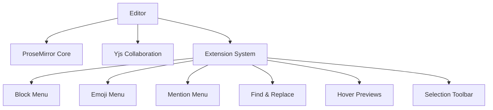
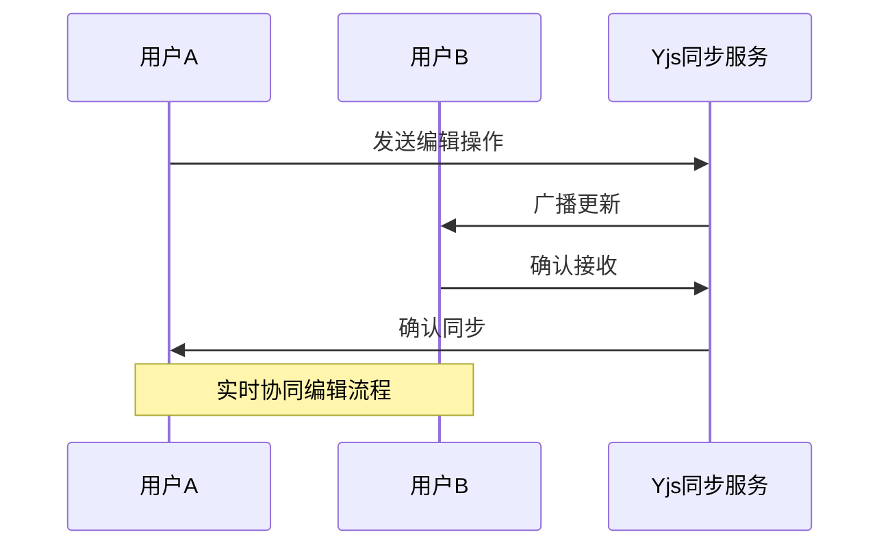
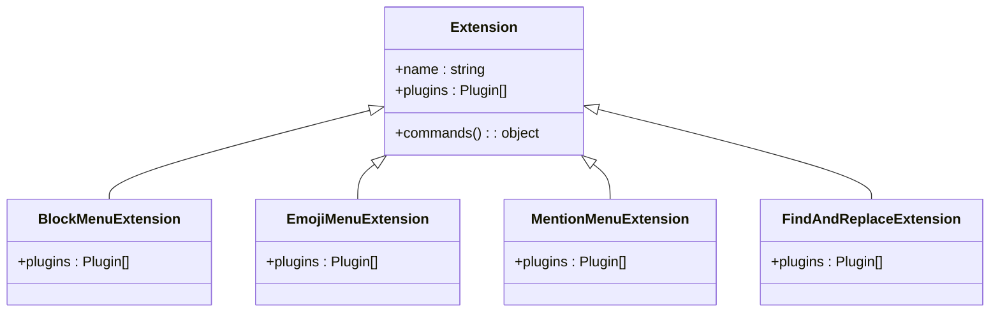
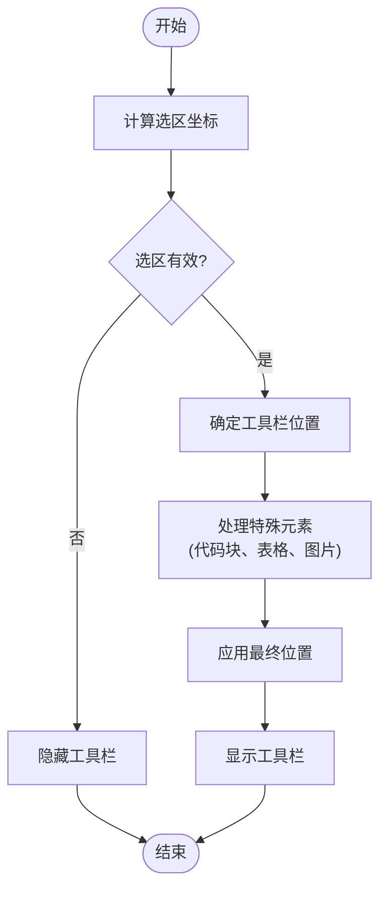

# 功能组件

<cite>
**本文档中引用的文件**  
- [EditorContext.tsx](file://app/editor/components/EditorContext.tsx)
- [FloatingToolbar.tsx](file://app/editor/components/FloatingToolbar.tsx)
- [Multiplayer.ts](file://app/editor/extensions/Multiplayer.ts)
- [index.ts](file://app/editor/extensions/index.ts)
</cite>

## 目录
1. [简介](#简介)
2. [核心架构与实现](#核心架构与实现)
3. [实时协作编辑能力](#实时协作编辑能力)
4. [扩展系统与菜单系统](#扩展系统与菜单系统)
5. [节点与标记系统](#节点与标记系统)
6. [状态管理与UI组件](#状态管理与ui组件)
7. [性能优化策略](#性能优化策略)
8. [使用指南与扩展开发](#使用指南与扩展开发)

## 简介
baozi项目中的编辑器（Editor）是一个基于ProseMirror和Yjs构建的富文本编辑核心组件，支持实时协作、多用户编辑、版本控制和丰富的格式化功能。该组件通过模块化设计实现了高度可扩展性，为用户提供流畅的文档编辑体验。

## 核心架构与实现
编辑器采用分层架构设计，底层基于ProseMirror提供文档模型和视图渲染能力，上层通过Yjs实现分布式协同编辑。整个系统通过扩展机制（extensions）实现功能解耦，允许动态添加新功能而无需修改核心代码。



**Diagram sources**
- [index.ts](file://app/editor/extensions/index.ts#L1-L32)

**Section sources**
- [index.ts](file://app/editor/extensions/index.ts#L1-L32)

## 实时协作编辑能力
编辑器通过Yjs库实现多用户实时协同编辑功能，利用WebRTC或WebSocket进行客户端间的状态同步。每个用户的编辑操作被转换为Yjs的CRDT（无冲突复制数据类型）更新，并通过网络广播到其他参与者。



**Diagram sources**
- [Multiplayer.ts](file://app/editor/extensions/Multiplayer.ts#L22-L121)

**Section sources**
- [Multiplayer.ts](file://app/editor/extensions/Multiplayer.ts#L22-L121)

## 扩展系统与菜单系统
编辑器采用插件式扩展架构，所有功能模块均以扩展形式注册。菜单系统通过独立的扩展实现，包括块级菜单、表情菜单、提及菜单等，支持动态加载和条件显示。



**Diagram sources**
- [index.ts](file://app/editor/extensions/index.ts#L1-L32)
- [Multiplayer.ts](file://app/editor/extensions/Multiplayer.ts#L22-L121)

**Section sources**
- [index.ts](file://app/editor/extensions/index.ts#L1-L32)

## 节点与标记系统
编辑器基于ProseMirror的节点（Node）和标记（Mark）系统构建内容模型。节点表示文档中的块级元素（如段落、标题、列表），标记表示行内样式（如加粗、斜体、链接）。这种设计确保了内容结构的语义化和可维护性。

## 状态管理与UI组件
### EditorContext状态管理
`EditorContext.tsx`使用React Context API管理编辑器全局状态，提供`useEditor` Hook供子组件访问编辑器实例。该上下文封装了ProseMirror视图对象，实现了状态的集中管理和跨组件共享。

**Section sources**
- [EditorContext.tsx](file://app/editor/components/EditorContext.tsx#L1-L9)

### FloatingToolbar富文本操作
`FloatingToolbar.tsx`实现了一个浮动工具栏组件，根据用户选择的内容动态显示格式化选项。工具栏位置通过精确计算选区坐标确定，支持移动端适配和多种对齐方式。



**Diagram sources**
- [FloatingToolbar.tsx](file://app/editor/components/FloatingToolbar.tsx#L1-L426)

**Section sources**
- [FloatingToolbar.tsx](file://app/editor/components/FloatingToolbar.tsx#L1-L426)

## 性能优化策略
编辑器实施了多项性能优化措施：
- **虚拟滚动**：对长文档进行分块渲染，只绘制可视区域内容
- **增量更新**：利用Yjs的差分算法最小化网络传输和DOM操作
- **防抖处理**：对频繁触发的操作（如输入、滚动）进行节流
- **懒加载**：延迟加载非关键资源和组件
- **缓存机制**：缓存计算结果和DOM测量值

## 使用指南与扩展开发
### 基本使用方法
对于初学者，可通过导入Editor组件并配置基础属性快速集成：
```typescript
import Editor from "~/editor";

function MyEditor() {
  return <Editor defaultValue="初始内容" />;
}
```

### 扩展自定义节点
经验丰富的开发者可通过继承Node类创建自定义节点：
1. 创建新的节点类并实现必要方法
2. 注册到编辑器扩展系统
3. 定义对应的React渲染组件
4. 配置序列化和反序列化逻辑

此架构支持无限扩展，开发者可构建复杂的内容类型如图表、公式、嵌入式应用等。