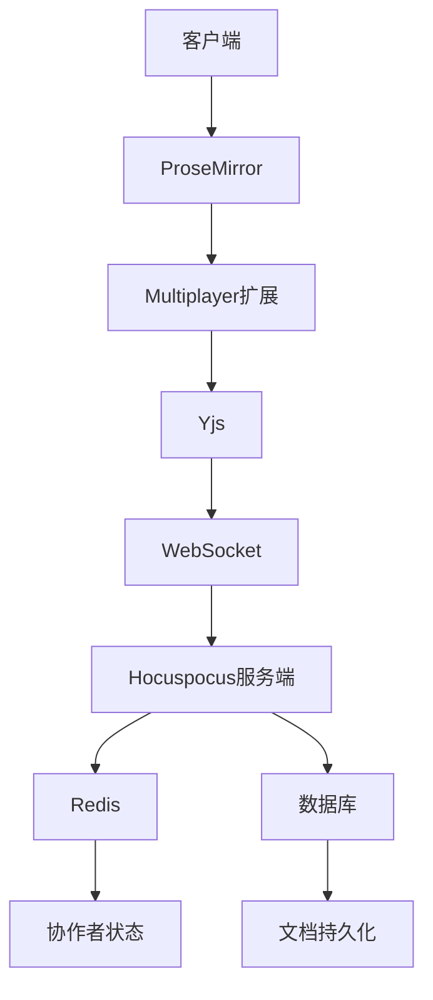
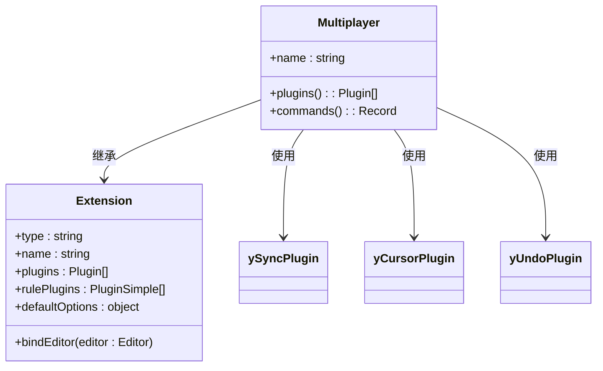
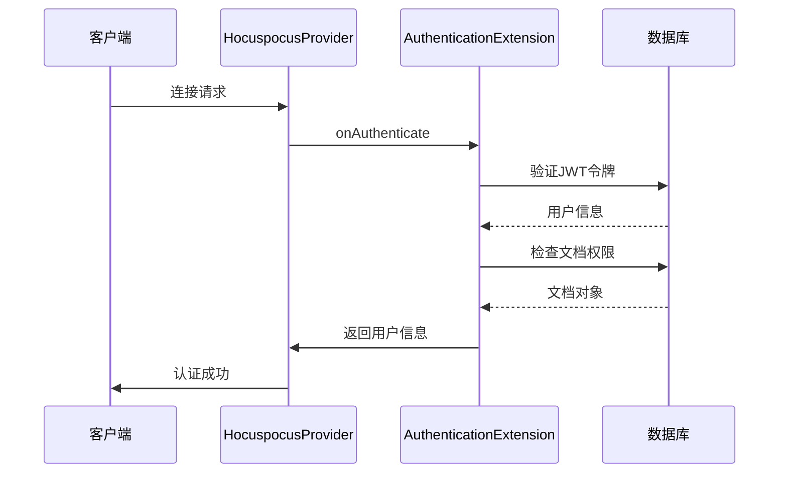
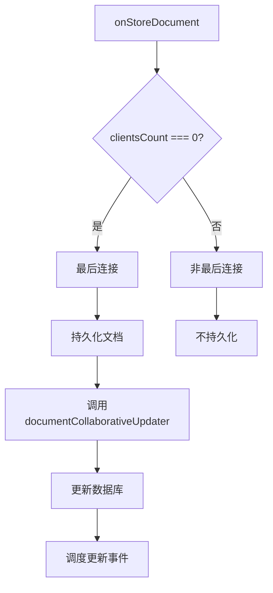
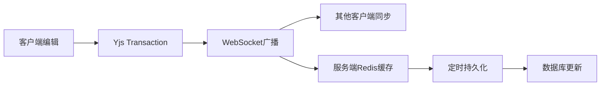

# 协作机制

<cite>
**本文档引用的文件**   
- [Multiplayer.ts](file://app/editor/extensions/Multiplayer.ts)
- [AuthenticationExtension.ts](file://server/collaboration/AuthenticationExtension.ts)
- [PersistenceExtension.ts](file://server/collaboration/PersistenceExtension.ts)
- [documentCollaborativeUpdater.ts](file://server/commands/documentCollaborativeUpdater.ts)
- [Document.ts](file://server/models/Document.ts)
- [ProsemirrorHelper.tsx](file://server/models/helpers/ProsemirrorHelper.tsx)
- [DocumentHelper.tsx](file://server/models/helpers/DocumentHelper.tsx)
- [redis.ts](file://server/storage/redis.ts)
- [MultiplayerEditor.tsx](file://app/scenes/Document/components/MultiplayerEditor.tsx)
</cite>

## 目录
1. [简介](#简介)
2. [核心架构](#核心架构)
3. [客户端实现](#客户端实现)
4. [服务端扩展](#服务端扩展)
5. [WebSocket通信协议](#websocket通信协议)
6. [状态同步机制](#状态同步机制)
7. [性能优化策略](#性能优化策略)
8. [初学者使用指南](#初学者使用指南)
9. [高级扩展指导](#高级扩展指导)
10. [最佳实践](#最佳实践)

## 简介
baozi项目通过集成Yjs和ProseMirror实现了实时协同编辑功能，为用户提供无缝的多人协作体验。该系统基于WebSocket协议构建，利用Yjs的CRDT（无冲突复制数据类型）技术确保数据一致性，同时通过ProseMirror提供强大的富文本编辑能力。协作机制的核心在于Multiplayer.ts扩展，它将Yjs的同步功能与ProseMirror的编辑器深度集成，处理操作转换（OT）和冲突解决。服务端通过Hocuspocus框架提供WebSocket服务，并使用AuthenticationExtension.ts和PersistenceExtension.ts等扩展来管理连接认证和数据持久化。整个系统设计注重性能优化，包括连接管理、状态同步和离线处理，确保在高并发场景下的稳定性和响应速度。

## 核心架构
baozi的协作机制采用客户端-服务端架构，以Yjs为核心同步引擎。客户端使用ProseMirror作为编辑器框架，通过Multiplayer扩展与Yjs集成，实现富文本的实时同步。服务端基于Hocuspocus构建，提供WebSocket连接和文档状态管理。当用户打开文档时，客户端通过MultiplayerEditor组件建立WebSocket连接，从服务端获取文档的Yjs状态。所有编辑操作都被转换为Yjs操作，并通过WebSocket广播给其他协作者。服务端使用Redis存储临时的协作者信息，并定期将Yjs状态持久化到数据库。这种架构确保了数据的一致性和可靠性，同时支持离线编辑和冲突解决。

**图表来源**
- [Multiplayer.ts](file://app/editor/extensions/Multiplayer.ts#L1-L122)
- [MultiplayerEditor.tsx](file://app/scenes/Document/components/MultiplayerEditor.tsx#L1-L332)
- [AuthenticationExtension.ts](file://server/collaboration/AuthenticationExtension.ts#L1-L46)
- [PersistenceExtension.ts](file://server/collaboration/PersistenceExtension.ts#L1-L124)

## 客户端实现
客户端的协作功能主要通过Multiplayer.ts扩展实现，该扩展继承自ProseMirror的Extension类。它利用y-prosemirror库提供的ySyncPlugin、yCursorPlugin和yUndoPlugin来集成Yjs功能。ySyncPlugin负责文档内容的同步，yCursorPlugin处理光标和选择区域的显示，yUndoPlugin提供撤销/重做功能。Multiplayer扩展的plugins方法返回这些插件的组合，并配置了用户感知（awareness）功能，用于跟踪协作者的状态。

**图表来源**
- [Multiplayer.ts](file://app/editor/extensions/Multiplayer.ts#L22-L121)
- [shared/editor/lib/Extension.ts](file://shared/editor/lib/Extension.ts#L10-L101)

### 用户感知与光标管理
Multiplayer扩展通过provider.setAwarenessField方法设置用户信息，包括用户ID、名称和颜色。它还实现了awarenessStateFilter和selectionBuilder函数，用于过滤和构建远程用户的光标选择区域。selectionBuilder函数根据用户最近的活动时间动态调整选择区域的透明度，当用户长时间无操作时，其选择区域会逐渐消失，避免界面混乱。

**代码片段路径**
- [Multiplayer.ts](file://app/editor/extensions/Multiplayer.ts#L50-L85)

### 操作转换与冲突解决
Yjs的CRDT算法自动处理操作转换和冲突解决。当多个用户同时编辑文档时，Yjs确保所有操作都能正确合并，而不会产生冲突。Multiplayer扩展通过监听afterTransaction事件，在用户首次做出更改时建立用户ID与客户端ID的映射关系，这通过Y.PermanentUserData实现，确保用户身份的持久性。

**代码片段路径**
- [Multiplayer.ts](file://app/editor/extensions/Multiplayer.ts#L25-L48)

## 服务端扩展
服务端协作功能通过Hocuspocus的扩展机制实现，主要包括AuthenticationExtension和PersistenceExtension。这些扩展在WebSocket连接的不同生命周期阶段执行特定逻辑，确保安全性和数据一致性。

### 认证扩展
AuthenticationExtension在用户连接时进行身份验证，确保只有授权用户才能访问文档。它解析JWT令牌获取用户信息，并检查用户对文档的读写权限。如果用户没有更新权限，连接将被设置为只读模式。

**图表来源**
- [AuthenticationExtension.ts](file://server/collaboration/AuthenticationExtension.ts#L7-L45)

### 持久化扩展
PersistenceExtension负责文档状态的加载和持久化。onLoadDocument方法在连接建立时从数据库加载文档状态，如果文档没有Yjs状态，则从内容或文本字段创建。onStoreDocument方法在连接关闭或定期时将Yjs状态保存回数据库。

**图表来源**
- [PersistenceExtension.ts](file://server/collaboration/PersistenceExtension.ts#L16-L123)

## WebSocket通信协议
协作系统使用WebSocket协议进行实时通信，基于Hocuspocus框架构建。连接URL为`/collaboration`，参数包括编辑器版本号。客户端使用HocuspocusProvider建立连接，并处理各种事件，如认证失败、感知状态变化和连接状态变化。

### 连接管理
MultiplayerEditor组件负责管理WebSocket连接的生命周期。它在useLayoutEffect中初始化provider，确保在React严格模式下不会创建多个连接。连接在用户空闲或页面不可见时自动断开，以节省服务器资源。

**代码片段路径**
- [MultiplayerEditor.tsx](file://app/scenes/Document/components/MultiplayerEditor.tsx#L75-L205)

### 事件处理
客户端监听多种WebSocket事件：
- `authenticationFailed`: 认证失败时重新获取认证信息
- `awarenessChange`: 感知状态变化时更新协作者信息
- `synced`: 同步完成时更新状态
- `close`: 连接关闭时处理错误码

**代码片段路径**
- [MultiplayerEditor.tsx](file://app/scenes/Document/components/MultiplayerEditor.tsx#L155-L167)

## 状态同步机制
状态同步是协作系统的核心，涉及客户端和服务端之间的双向数据流。当用户编辑文档时，ProseMirror的变化被转换为Yjs操作，并通过WebSocket发送到服务端。服务端将这些操作广播给其他协作者，同时将状态更新存储在Redis中。

### 初始状态加载
当用户首次连接时，PersistenceExtension的onLoadDocument方法从数据库加载文档状态。如果文档已有Yjs状态，则直接应用；否则，从内容或文本字段创建新的Yjs文档。

**代码片段路径**
- [PersistenceExtension.ts](file://server/collaboration/PersistenceExtension.ts#L25-L65)

### 增量更新
用户的每个编辑操作都会触发Yjs的transaction，这些变化通过WebSocket实时同步。服务端使用Redis的集合（set）存储当前连接的协作者ID，确保在持久化时能正确归因更改。

**代码片段路径**
- [PersistenceExtension.ts](file://server/collaboration/PersistenceExtension.ts#L90-L98)

### 持久化策略
documentCollaborativeUpdater命令负责将Yjs状态持久化到数据库。它比较当前内容与数据库内容，只有在有变化时才更新。更新时会合并来自Yjs的永久用户数据和会话中的协作者ID，确保所有贡献者都被记录。

**图表来源**
- [documentCollaborativeUpdater.ts](file://server/commands/documentCollaborativeUpdater.ts#L24-L113)

## 性能优化策略
协作系统采用多种策略优化性能，确保在高并发场景下的流畅体验。

### 连接优化
系统在用户空闲或页面不可见时自动断开WebSocket连接，减少服务器负载。当用户返回时，连接会自动重新建立。

**代码片段路径**
- [MultiplayerEditor.tsx](file://app/scenes/Document/components/MultiplayerEditor.tsx#L250-L270)

### 状态压缩
Yjs状态以二进制格式存储，通过Y.encodeStateAsUpdate方法编码，大大减少了存储空间和网络传输量。

**代码片段路径**
- [ProsemirrorHelper.tsx](file://server/models/helpers/ProsemirrorHelper.tsx#L58-L68)

### 批量持久化
系统不会为每个操作都进行数据库持久化，而是依赖Redis缓存协作者信息，并在连接关闭或定期时批量更新，减少数据库压力。

**代码片段路径**
- [PersistenceExtension.ts](file://server/collaboration/PersistenceExtension.ts#L90-L123)

## 初学者使用指南
对于初学者，使用baozi的协作功能非常简单。只需在编辑器中打开一个文档，系统会自动建立WebSocket连接并同步状态。用户可以看到其他协作者的光标和选择区域，实时看到他们的编辑。

### 基本功能
- **实时同步**: 所有编辑操作立即同步给其他协作者
- **光标显示**: 显示其他协作者的光标位置和选择区域
- **用户感知**: 显示协作者的名称和颜色
- **离线编辑**: 断开连接时仍可编辑，重连后自动同步

### 常见问题
- **连接失败**: 检查网络连接和认证令牌
- **同步延迟**: 网络状况不佳时可能出现短暂延迟
- **冲突解决**: Yjs自动处理所有冲突，无需用户干预

## 高级扩展指导
对于经验丰富的开发者，baozi提供了丰富的扩展点来定制协作功能。

### 自定义数据类型
可以通过Yjs的自定义类型系统添加新的数据结构。例如，可以创建一个Y.Map来存储文档的元数据，或使用Y.Array存储任务列表。

**扩展建议**
- 继承Y.AbstractType创建自定义类型
- 实现_toBinary和_fromBinary方法进行序列化
- 在文档加载时注册自定义类型

### 权限控制
可以在AuthenticationExtension中扩展权限检查逻辑，实现更细粒度的访问控制。例如，基于文档标签或用户角色的动态权限。

**扩展建议**
- 在onAuthenticate方法中添加自定义权限检查
- 使用Redis缓存权限信息以提高性能
- 实现基于属性的访问控制（ABAC）

### 离线同步
系统已经支持基本的离线编辑，但可以进一步优化。例如，使用IndexedDB存储更多历史状态，或实现更智能的冲突解决策略。

**扩展建议**
- 扩展IndexeddbPersistence以存储更多元数据
- 实现离线模式下的操作队列
- 添加离线状态的用户界面提示

## 最佳实践
### 数据模型设计
文档状态存储在数据库的state字段中，类型为BLOB。content字段存储JSON格式的快照，用于快速加载。这种双重存储策略平衡了性能和可靠性。

**代码片段路径**
- [Document.ts](file://server/models/Document.ts#L338-L356)

### 错误处理
系统实现了全面的错误处理机制。客户端监听全局错误事件，处理Yjs可能抛出的URIError。服务端使用try-catch包裹持久化操作，确保不会因单个错误影响整体服务。

**代码片段路径**
- [MultiplayerEditor.tsx](file://app/scenes/Document/components/MultiplayerEditor.tsx#L272-L284)
- [PersistenceExtension.ts](file://server/collaboration/PersistenceExtension.ts#L110-L123)

### 监控与日志
系统使用Logger记录关键操作，包括连接、同步和持久化事件。这些日志有助于调试和性能分析。

**代码片段路径**
- [PersistenceExtension.ts](file://server/collaboration/PersistenceExtension.ts#L30-L35)
- [documentCollaborativeUpdater.ts](file://server/commands/documentCollaborativeUpdater.ts#L50-L55)