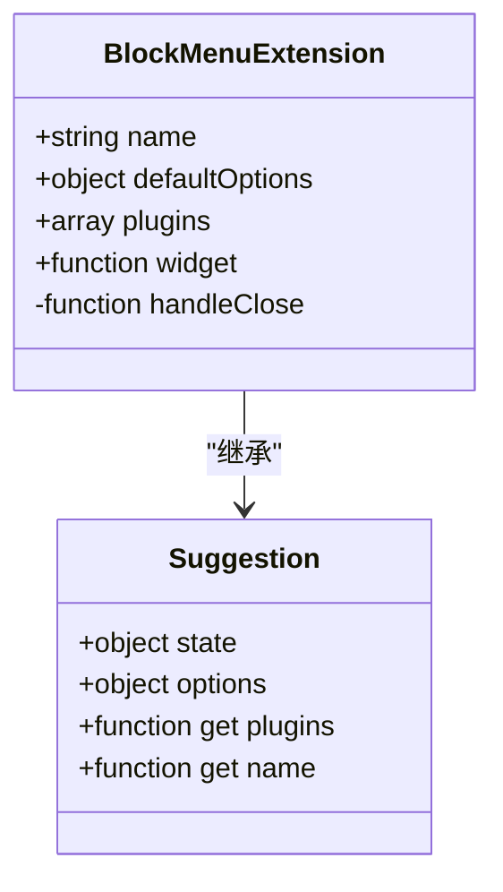
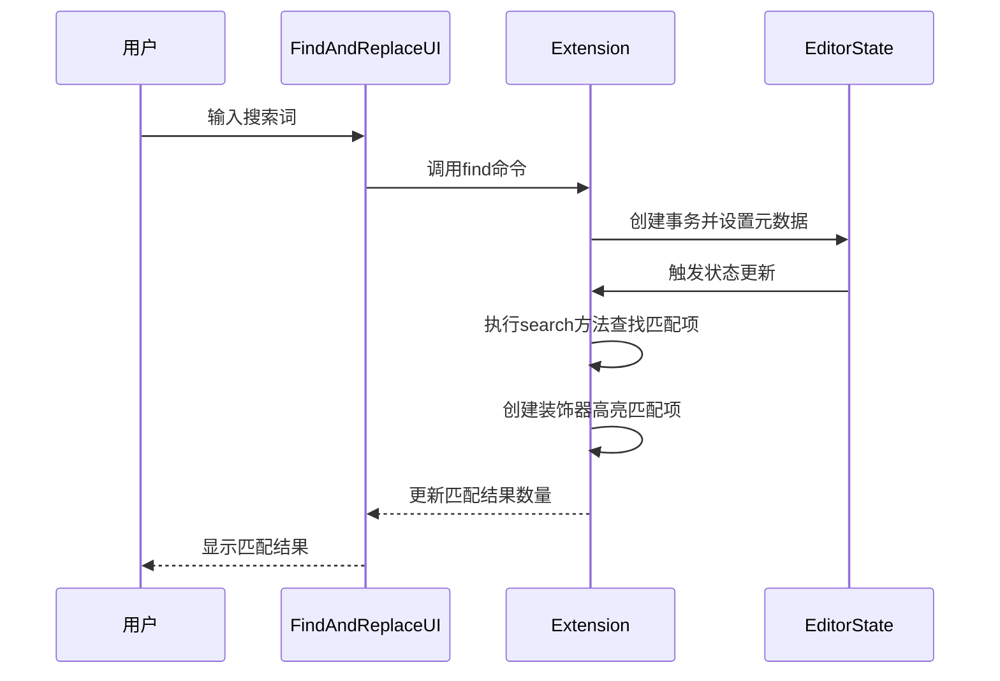
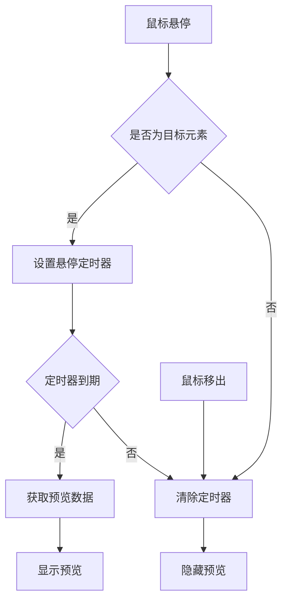
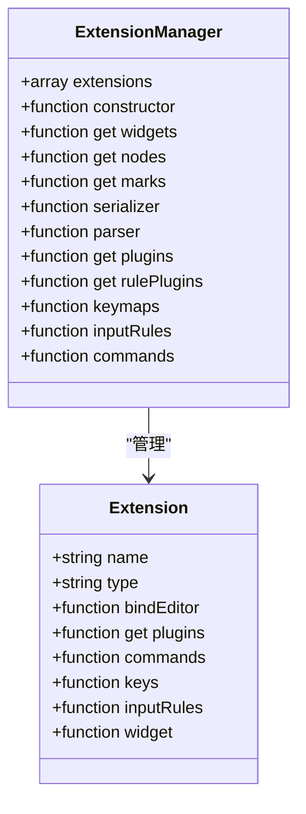
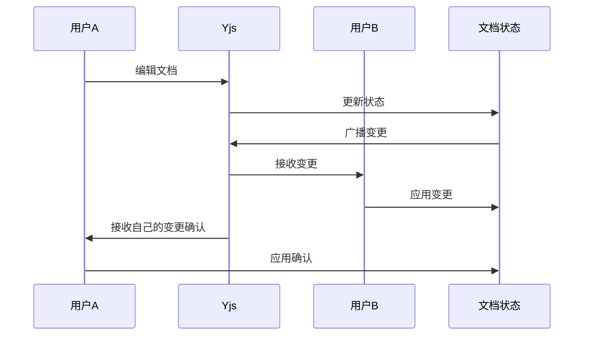
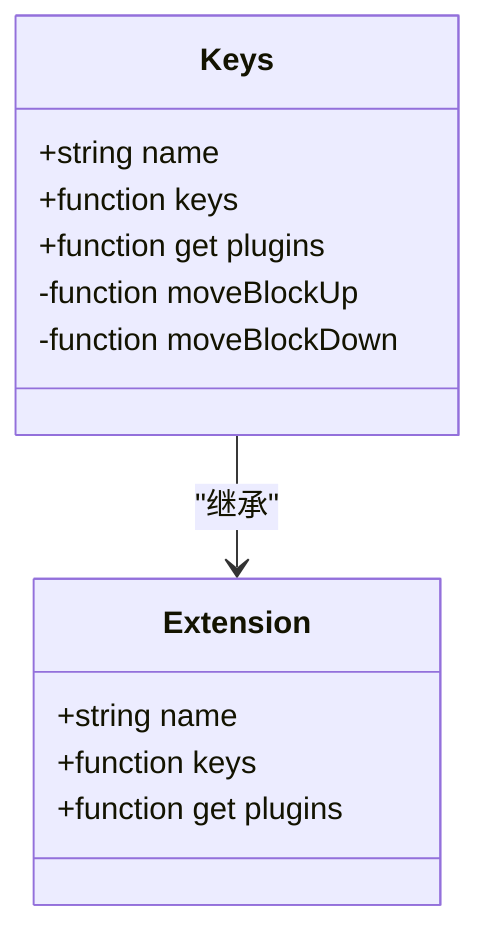
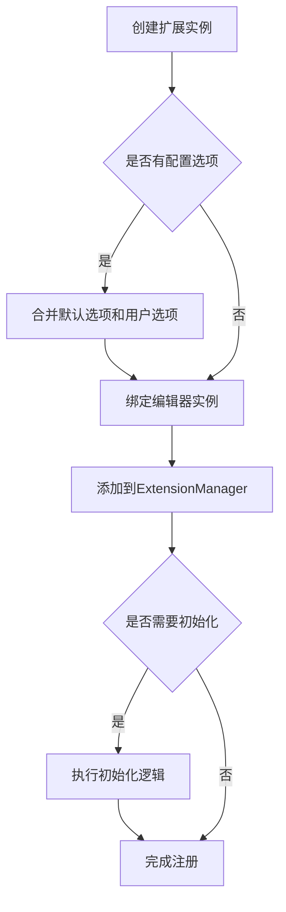

# 扩展系统

<cite>
**本文档中引用的文件**  
- [BlockMenu.tsx](file://app/editor/extensions/BlockMenu.tsx)
- [FindAndReplace.tsx](file://app/editor/extensions/FindAndReplace.tsx)
- [HoverPreviews.tsx](file://app/editor/extensions/HoverPreviews.tsx)
- [Multiplayer.ts](file://app/editor/extensions/Multiplayer.ts)
- [SmartText.ts](file://app/editor/extensions/SmartText.ts)
- [Keys.ts](file://app/editor/extensions/Keys.ts)
- [ExtensionManager.ts](file://shared/editor/lib/ExtensionManager.ts)
</cite>

## 目录
1. [简介](#简介)
2. [扩展架构概述](#扩展架构概述)
3. [核心扩展实现机制](#核心扩展实现机制)
4. [ExtensionManager生命周期管理](#extensionmanager生命周期管理)
5. [实时协作扩展](#实时协作扩展)
6. [智能文本与快捷键扩展](#智能文本与快捷键扩展)
7. [扩展注册与配置机制](#扩展注册与配置机制)
8. [为初学者提供的使用方法](#为初学者提供的使用方法)
9. [为开发者提供的深度指导](#为开发者提供的深度指导)
10. [最佳实践](#最佳实践)

## 简介
baozi项目扩展系统基于ProseMirror Extension构建，提供了一套灵活且强大的插件架构。该系统允许开发者通过扩展机制增强编辑器功能，支持从简单的文本替换到复杂的实时协作等多种功能。本文档将详细介绍扩展系统的架构、核心扩展的实现机制以及如何创建和管理自定义扩展。

## 扩展架构概述
baozi项目的扩展系统采用模块化设计，通过ExtensionManager统一管理所有扩展的生命周期。每个扩展都是一个独立的模块，可以注册节点、标记、插件、输入规则、命令和快捷键。扩展系统支持优先级机制，确保扩展之间的正确执行顺序。通过这种架构，开发者可以轻松地添加新功能或修改现有功能，而不会影响系统的稳定性。

**Section sources**
- [ExtensionManager.ts](file://shared/editor/lib/ExtensionManager.ts#L1-L277)

## 核心扩展实现机制
### BlockMenu扩展
BlockMenu扩展实现了块级菜单功能，允许用户通过输入"/"触发菜单，选择不同的内容块类型。该扩展使用ProseMirror的装饰器（Decoration）在空段落前显示一个加号按钮，点击按钮或输入"/"时激活菜单。菜单项包括标题、列表、代码块、表格等，每个菜单项都有对应的图标、快捷键和属性。



**Diagram sources**
- [BlockMenu.tsx](file://app/editor/extensions/BlockMenu.tsx#L11-L126)

**Section sources**
- [BlockMenu.tsx](file://app/editor/extensions/BlockMenu.tsx#L1-L127)

### FindAndReplace扩展
FindAndReplace扩展提供了查找和替换功能，支持区分大小写和正则表达式搜索。该扩展通过创建一个浮动面板实现用户界面，面板中包含搜索输入框、替换输入框、匹配选项和导航按钮。扩展使用ProseMirror的装饰器高亮显示匹配结果，并通过命令系统实现查找、替换、跳转到下一个/上一个匹配项等功能。



**Diagram sources**
- [FindAndReplace.tsx](file://app/editor/extensions/FindAndReplace.tsx#L12-L385)

**Section sources**
- [FindAndReplace.tsx](file://app/editor/extensions/FindAndReplace.tsx#L1-L386)

### HoverPreviews扩展
HoverPreviews扩展实现了悬停预览功能，当用户将鼠标悬停在链接上时，显示链接内容的预览。该扩展通过监听鼠标事件检测悬停状态，使用防抖技术避免频繁请求。预览数据通过API获取，包括标题、描述和缩略图等信息。扩展还支持自定义延迟时间和预览样式。



**Diagram sources**
- [HoverPreviews.tsx](file://app/editor/extensions/HoverPreviews.tsx#L14-L116)

**Section sources**
- [HoverPreviews.tsx](file://app/editor/extensions/HoverPreviews.tsx#L1-L117)

## ExtensionManager生命周期管理
ExtensionManager是扩展系统的核心组件，负责管理所有扩展的生命周期。它在初始化时接收扩展列表和编辑器实例，为每个扩展绑定编辑器并添加到内部列表中。ExtensionManager提供了多个方法来获取扩展的输出，包括节点、标记、插件、命令和快捷键等。



**Diagram sources**
- [ExtensionManager.ts](file://shared/editor/lib/ExtensionManager.ts#L1-L277)

**Section sources**
- [ExtensionManager.ts](file://shared/editor/lib/ExtensionManager.ts#L1-L277)

## 实时协作扩展
### Multiplayer扩展
Multiplayer扩展集成了Yjs实现实时协作功能。该扩展使用y-prosemirror库提供的同步插件、光标插件和撤销插件，实现多用户同时编辑文档。扩展通过WebRTC或WebSocket连接用户，实时同步文档状态和光标位置。每个用户的光标以不同颜色显示，并带有用户头像和名称。



**Diagram sources**
- [Multiplayer.ts](file://app/editor/extensions/Multiplayer.ts#L22-L121)

**Section sources**
- [Multiplayer.ts](file://app/editor/extensions/Multiplayer.ts#L1-L122)

## 智能文本与快捷键扩展
### SmartText扩展
SmartText扩展实现了智能文本替换功能，将常见的文本模式自动转换为更美观的符号。例如，将"--"替换为长破折号"—"，将"..."替换为省略号"…"，将"(c)"替换为版权符号"©️"。该扩展使用输入规则（InputRule）监听文本输入，当匹配到特定模式时自动替换。

```mermaid
flowchart LR
A[用户输入] --> B{匹配输入规则}
B --> |->| C[替换为→]
B --> |--| D[替换为—]
B --> |1/2| E[替换为½]
B --> |3/4| F[替换为¾]
B --> |(c)| G[替换为©️]
B --> |(r)| H[替换为®️]
B --> |(tm)| I[替换为™️]
B --> |...| J[替换为…]
C --> K[更新文档]
D --> K
E --> K
F --> K
G --> K
H --> K
I --> K
J --> K
```

**Diagram sources**
- [SmartText.ts](file://app/editor/extensions/SmartText.ts#L27-L52)

**Section sources**
- [SmartText.ts](file://app/editor/extensions/SmartText.ts#L1-L53)

### Keys扩展
Keys扩展处理键盘快捷键，提供了一系列编辑器操作的快捷方式。该扩展通过ProseMirror的键映射系统注册快捷键，支持跨平台的快捷键组合。例如，"Mod-Escape"用于取消操作，"Mod-s"用于保存，"Mod-Enter"用于完成编辑，"Mod-Alt-ArrowUp/Down"用于移动块。



**Diagram sources**
- [Keys.ts](file://app/editor/extensions/Keys.ts#L14-L191)

**Section sources**
- [Keys.ts](file://app/editor/extensions/Keys.ts#L1-L192)

## 扩展注册与配置机制
扩展系统支持灵活的注册和配置机制。扩展可以通过构造函数接收配置选项，这些选项可以来自编辑器属性或用户偏好设置。扩展的优先级通过注册顺序确定，先注册的扩展具有更高的优先级。扩展还可以根据运行时条件动态启用或禁用功能。



**Section sources**
- [ExtensionManager.ts](file://shared/editor/lib/ExtensionManager.ts#L1-L277)
- [BlockMenu.tsx](file://app/editor/extensions/BlockMenu.tsx#L1-L127)
- [SmartText.ts](file://app/editor/extensions/SmartText.ts#L1-L53)

## 为初学者提供的使用方法
对于初学者，使用现有扩展非常简单。只需在创建编辑器时将扩展添加到扩展列表中即可。例如，要启用查找替换功能，只需将FindAndReplace扩展添加到扩展列表：

```typescript
const editor = new Editor({
  extensions: [
    // 其他扩展...
    FindAndReplace,
  ],
});
```

大多数扩展都有合理的默认配置，无需额外设置即可使用。用户可以通过编辑器的UI界面访问扩展功能，如通过快捷键Ctrl+F打开查找替换面板。

**Section sources**
- [ExtensionManager.ts](file://shared/editor/lib/ExtensionManager.ts#L1-L277)

## 为开发者提供的深度指导
### 创建自定义扩展
创建自定义扩展需要继承Extension基类，并实现必要的方法。最基本的扩展需要实现`name`属性和`plugins`方法。`name`属性用于标识扩展，`plugins`方法返回ProseMirror插件数组。

```typescript
import Extension from "@shared/editor/lib/Extension";

export default class MyCustomExtension extends Extension {
  get name() {
    return "my-custom";
  }

  get plugins() {
    return [
      // 返回ProseMirror插件
    ];
  }
}
```

### 事务处理
在扩展中处理事务时，需要使用ProseMirror的事务系统。通过`view.state.tr`创建新事务，使用`dispatch`方法应用事务。在事务中可以执行各种操作，如插入文本、删除节点、设置选择等。

```typescript
const { view } = this.editor;
const { tr } = view.state;
const newTr = tr.insertText("Hello World");
view.dispatch(newTr);
```

### 状态管理
扩展的状态管理使用MobX实现。通过`@observable`装饰器定义可观察属性，这些属性的变化会自动触发UI更新。在扩展中可以定义状态对象，用于存储扩展的内部状态。

```typescript
import { observable } from "mobx";

class MyExtension extends Extension {
  @observable
  private state = {
    isOpen: false,
    data: null,
  };
}
```

### 事件监听
扩展可以通过ProseMirror插件的`props`属性监听各种事件。常用的事件包括`handleKeyDown`、`handleClick`、`handleDOMEvents`等。通过监听这些事件，扩展可以响应用户的交互操作。

```typescript
get plugins() {
  return [
    new Plugin({
      props: {
        handleKeyDown: (view, event) => {
          // 处理键盘事件
          return false;
        },
      },
    }),
  ];
}
```

**Section sources**
- [ExtensionManager.ts](file://shared/editor/lib/ExtensionManager.ts#L1-L277)
- [BlockMenu.tsx](file://app/editor/extensions/BlockMenu.tsx#L1-L127)
- [FindAndReplace.tsx](file://app/editor/extensions/FindAndReplace.tsx#L1-L386)
- [Multiplayer.ts](file://app/editor/extensions/Multiplayer.ts#L1-L122)

## 最佳实践
1. **保持扩展独立性**：每个扩展应该专注于单一功能，避免功能耦合。
2. **合理使用优先级**：通过注册顺序控制扩展的优先级，确保关键扩展优先执行。
3. **优化性能**：避免在频繁触发的事件中执行耗时操作，使用防抖和节流技术。
4. **提供默认配置**：为扩展提供合理的默认配置，降低使用门槛。
5. **处理边界情况**：充分考虑各种边界情况，如空文档、只读模式等。
6. **遵循ProseMirror规范**：遵循ProseMirror的设计模式和API规范，确保扩展的兼容性。
7. **提供清晰的文档**：为扩展提供详细的文档，包括使用方法、配置选项和API说明。

**Section sources**
- [ExtensionManager.ts](file://shared/editor/lib/ExtensionManager.ts#L1-L277)
- [BlockMenu.tsx](file://app/editor/extensions/BlockMenu.tsx#L1-L127)
- [FindAndReplace.tsx](file://app/editor/extensions/FindAndReplace.tsx#L1-L386)
- [Multiplayer.ts](file://app/editor/extensions/Multiplayer.ts#L1-L122)
- [SmartText.ts](file://app/editor/extensions/SmartText.ts#L1-L53)
- [Keys.ts](file://app/editor/extensions/Keys.ts#L1-L192)