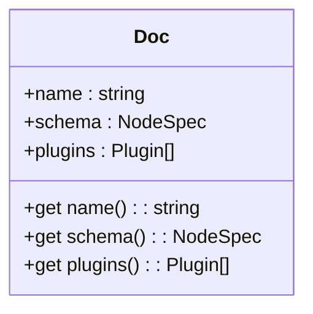
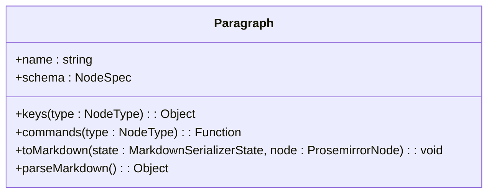
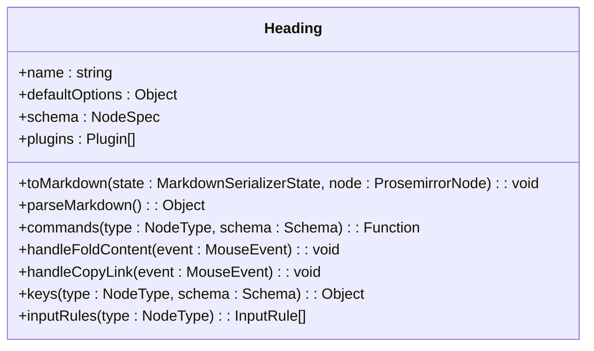
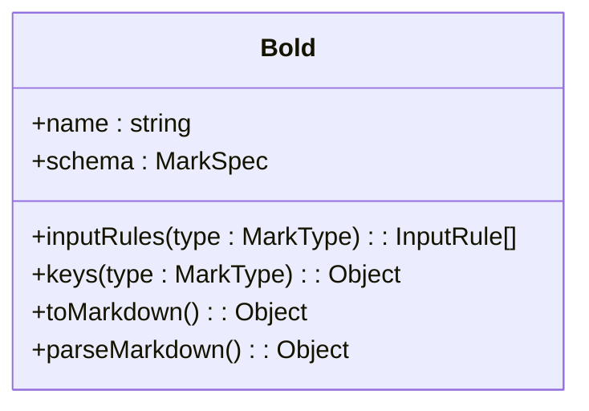
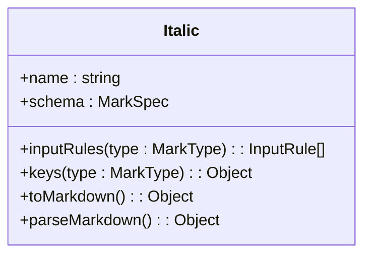
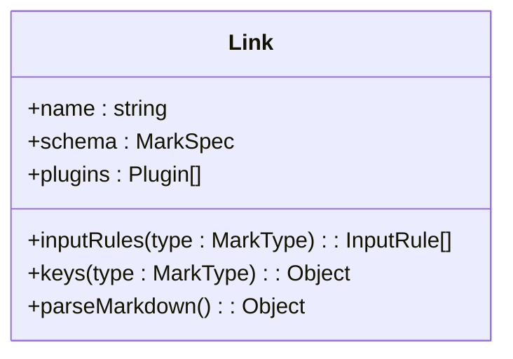
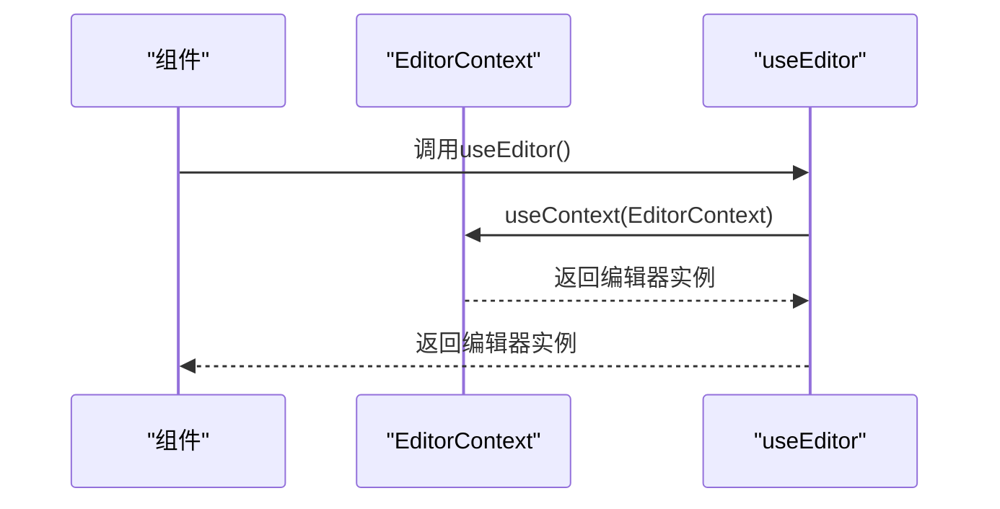
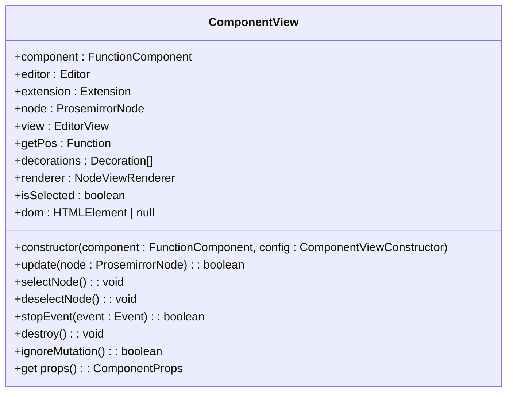
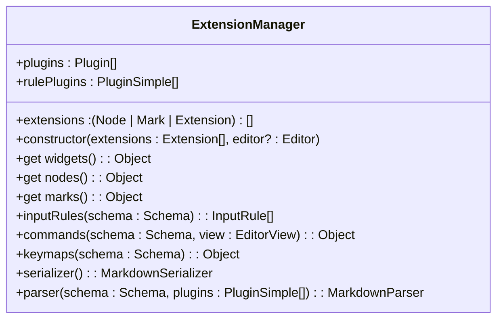
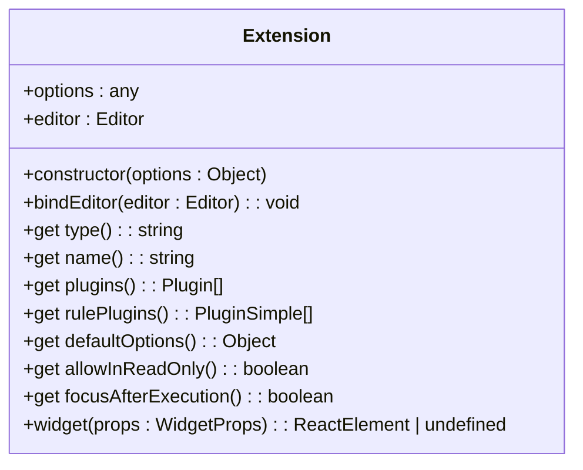

# 编辑器核心

<cite>
**本文档中引用的文件**  
- [Doc.ts](file://shared/editor/nodes/Doc.ts)
- [Paragraph.ts](file://shared/editor/nodes/Paragraph.ts)
- [Heading.ts](file://shared/editor/nodes/Heading.ts)
- [Bold.ts](file://shared/editor/marks/Bold.ts)
- [Italic.ts](file://shared/editor/marks/Italic.ts)
- [Link.tsx](file://shared/editor/marks/Link.tsx)
- [EditorContext.tsx](file://app/editor/components/EditorContext.tsx)
- [ComponentView.tsx](file://app/editor/components/ComponentView.tsx)
- [ExtensionManager.ts](file://shared/editor/lib/ExtensionManager.ts)
- [Extension.ts](file://shared/editor/lib/Extension.ts)
- [index.tsx](file://app/editor/index.tsx)
</cite>

## 目录
1. [简介](#简介)
2. [核心节点实现](#核心节点实现)
3. [标记定义](#标记定义)
4. [编辑器状态管理](#编辑器状态管理)
5. [UI渲染机制](#ui渲染机制)
6. [扩展机制](#扩展机制)
7. [节点与标记注册](#节点与标记注册)
8. [自定义节点与标记](#自定义节点与标记)
9. [序列化与反序列化](#序列化与反序列化)
10. [输入规则](#输入规则)

## 简介
baozi项目编辑器基于ProseMirror构建，提供强大的富文本编辑功能。该编辑器采用模块化架构，通过节点（Node）和标记（Mark）系统实现内容结构化。核心设计包括文档结构管理、格式化标记、状态上下文、UI组件渲染以及可扩展的插件体系。

## 核心节点实现

### 文档节点 (Doc.ts)
文档节点是编辑器的根节点，定义了文档的基本结构。它要求至少包含一个块级元素，并通过`PlaceholderPlugin`实现占位符功能。当文档为空时，插件会显示预设的占位文本，提升用户体验。

**Diagram sources**
- [Doc.ts](file://shared/editor/nodes/Doc.ts#L1-L34)

**Section sources**
- [Doc.ts](file://shared/editor/nodes/Doc.ts#L1-L34)

### 段落节点 (Paragraph.ts)
段落节点是基本的块级文本容器。它支持内联内容，通过`parseDOM`配置处理HTML解析，特别排除了图片标题被解析为段落的情况。提供了删除空首段的命令，并在Markdown序列化时将空段落转换为硬换行以保持格式一致性。

**Diagram sources**
- [Paragraph.ts](file://shared/editor/nodes/Paragraph.ts#L1-L68)

**Section sources**
- [Paragraph.ts](file://shared/editor/nodes/Paragraph.ts#L1-L68)

### 标题节点 (Heading.ts)
标题节点支持多级标题（默认1-4级），具有折叠功能。通过`attrs`定义级别和折叠状态属性。在`toDOM`方法中动态创建锚点按钮和折叠按钮，实现标题链接复制和内容折叠功能。`plugins`中的`foldPlugin`负责渲染折叠状态的装饰。

**Diagram sources**
- [Heading.ts](file://shared/editor/nodes/Heading.ts#L1-L251)

**Section sources**
- [Heading.ts](file://shared/editor/nodes/Heading.ts#L1-L251)

## 标记定义

### 加粗标记 (Bold.ts)
加粗标记对应HTML中的`<strong>`标签，支持多种触发方式：DOM标签`<b>`和`<strong>`、CSS样式`font-weight`（500以上）。通过正则表达式过滤正常字重的`<b>`标签。支持`**`语法的输入规则，快捷键`Mod-b`和`Mod-B`。

**Diagram sources**
- [Bold.ts](file://shared/editor/marks/Bold.ts#L1-L59)

**Section sources**
- [Bold.ts](file://shared/editor/marks/Bold.ts#L1-L59)

### 斜体标记 (Italic.ts)
斜体标记对应HTML中的`<em>`标签，支持`<i>`、`<em>`标签和`font-style: italic`样式。支持`_`和`*`两种语法的输入规则，快捷键`Mod-i`和`Mod-I`。

**Diagram sources**
- [Italic.ts](file://shared/editor/marks/Italic.ts#L1-L54)

**Section sources**
- [Italic.ts](file://shared/editor/marks/Italic.ts#L1-L54)

### 链接标记 (Link.tsx)
链接标记包含`href`和`title`属性，通过`parseDOM`处理`<a>`标签解析。`toDOM`方法中对URL进行安全化处理，添加`rel="noopener noreferrer nofollow"`属性。支持`[text](url)`语法的输入规则，快捷键`Mod-k`插入链接，`Mod-Enter`打开链接。

**Diagram sources**
- [Link.tsx](file://shared/editor/marks/Link.tsx#L1-L163)

**Section sources**
- [Link.tsx](file://shared/editor/marks/Link.tsx#L1-L163)

## 编辑器状态管理

### EditorContext.tsx
`EditorContext`使用React Context API管理编辑器实例，提供`useEditor`钩子供组件访问编辑器状态。它将编辑器实例作为上下文值，使任何嵌套组件都能方便地获取编辑器引用。

**Diagram sources**
- [EditorContext.tsx](file://app/editor/components/EditorContext.tsx#L1-L9)

**Section sources**
- [EditorContext.tsx](file://app/editor/components/EditorContext.tsx#L1-L9)

## UI渲染机制

### ComponentView.tsx
`ComponentView`是ProseMirror节点视图与React组件的桥梁。它包装React组件，将其集成到ProseMirror的视图系统中。构造函数创建DOM元素，初始化`NodeViewRenderer`，并将渲染器添加到编辑器的渲染器集合中。

**Diagram sources**
- [ComponentView.tsx](file://app/editor/components/ComponentView.tsx#L1-L123)

**Section sources**
- [ComponentView.tsx](file://app/editor/components/ComponentView.tsx#L1-L123)

## 扩展机制

### ExtensionManager.ts
`ExtensionManager`负责管理所有扩展（节点、标记、插件）。在构造函数中实例化扩展并绑定编辑器。`get nodes`和`get marks`方法收集所有节点和标记的schema定义，`get widgets`返回可观察的React组件。

**Diagram sources**
- [ExtensionManager.ts](file://shared/editor/lib/ExtensionManager.ts#L1-L250)

**Section sources**
- [ExtensionManager.ts](file://shared/editor/lib/ExtensionManager.ts#L1-L250)

## 节点与标记注册

### Extension.ts
`Extension`是所有扩展的基类，定义了统一的接口。`type`属性区分节点、标记或普通扩展。`bindEditor`方法将扩展与编辑器实例关联。`widget`方法返回上下文组件。

**Diagram sources**
- [Extension.ts](file://shared/editor/lib/Extension.ts#L1-L62)

**Section sources**
- [Extension.ts](file://shared/editor/lib/Extension.ts#L1-L62)

## 自定义节点与标记

### 基本节点创建
创建自定义节点需继承`Node`类，实现`name`、`schema`等getter。`schema`定义节点的属性、内容模型和解析规则。通过`inputRules`、`keys`、`commands`等方法添加交互功能。

### 深度自定义指导
1. **节点属性**：在`attrs`中定义可序列化的属性
2. **DOM解析**：配置`parseDOM`处理HTML到ProseMirror节点的转换
3. **DOM序列化**：实现`toDOM`方法定义节点的HTML表示
4. **输入规则**：使用`textblockTypeInputRule`等工具创建智能输入规则
5. **快捷键**：通过`keys`方法绑定键盘快捷方式
6. **命令**：实现`commands`方法提供编程接口

## 序列化与反序列化

### Markdown序列化
节点和标记通过`toMarkdown`和`parseMarkdown`方法实现Markdown格式的序列化和反序列化。`MarkdownSerializerState`提供写入和渲染接口，确保格式一致性。

### HTML处理
`parseDOM`和`toDOM`方法处理HTML的解析和生成。`parseDOM`配置选择器和属性提取逻辑，`toDOM`返回DOM描述数组。

## 输入规则

### 输入规则实现
输入规则通过`inputRules`方法返回`InputRule`数组。使用`textblockTypeInputRule`创建基于正则表达式的规则，如`^(#{1,${level}})\\s$`匹配标题语法。

### 规则注册
`ExtensionManager`收集所有扩展的输入规则，合并到编辑器的输入规则系统中。规则按注册顺序执行，确保预期的行为。