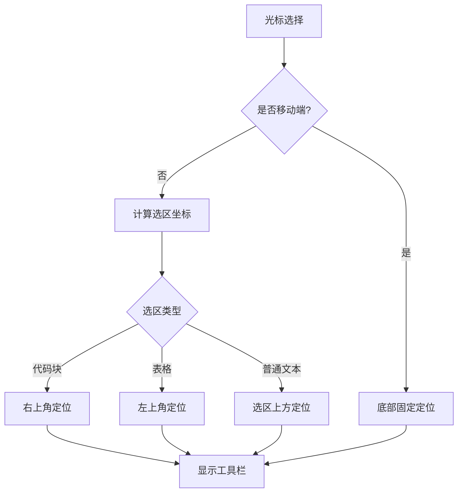
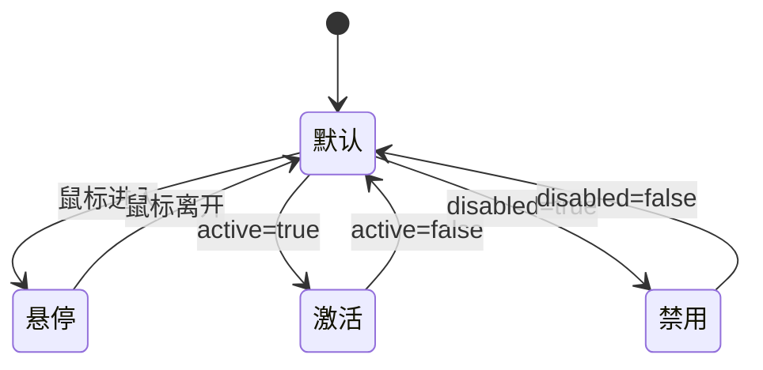
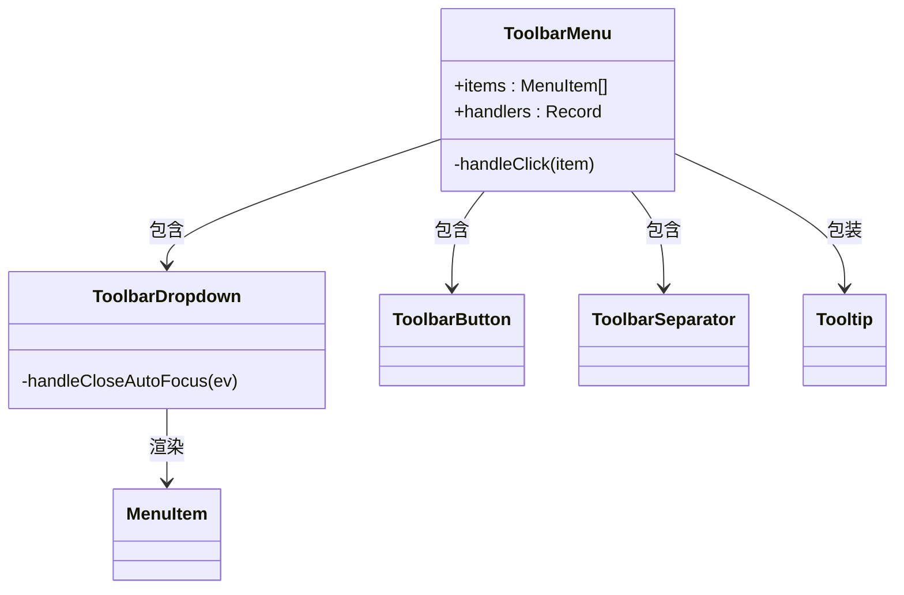

# 菜单系统

<cite>
**本文档中引用的文件**  
- [attachment.tsx](file://app/editor/menus/attachment.tsx)
- [block.tsx](file://app/editor/menus/block.tsx)
- [formatting.tsx](file://app/editor/menus/formatting.tsx)
- [FloatingToolbar.tsx](file://app/editor/components/FloatingToolbar.tsx)
- [ToolbarButton.tsx](file://app/editor/components/ToolbarButton.tsx)
- [ToolbarMenu.tsx](file://app/editor/components/ToolbarMenu.tsx)
</cite>

## 目录
1. [简介](#简介)
2. [菜单项实现](#菜单项实现)
3. [浮动工具栏动态显示机制](#浮动工具栏动态显示机制)
4. [工具栏按钮状态管理](#工具栏按钮状态管理)
5. [菜单层级组织](#菜单层级组织)
6. [权限控制与上下文感知](#权限控制与上下文感知)
7. [初学者使用指南](#初学者使用指南)
8. [高级自定义指导](#高级自定义指导)
9. [最佳实践](#最佳实践)

## 简介
baozi项目的菜单系统为富文本编辑器提供了完整的UI交互支持，通过模块化设计实现了高度可扩展的编辑功能。系统基于ProseMirror构建，采用React组件化架构，实现了从基础格式化到复杂块级元素的完整功能覆盖。本系统不仅支持桌面端的精确光标定位，还针对移动端进行了响应式优化。

## 菜单项实现

### 附件菜单项
附件菜单项（attachment.tsx）提供文件操作功能，包括替换、删除和下载附件。在只读模式下，该菜单项会自动隐藏所有编辑功能。菜单项通过字典对象实现国际化支持，确保用户界面文本的本地化显示。

**Section sources**
- [attachment.tsx](file://app/editor/menus/attachment.tsx#L5-L34)

### 块级菜单项
块级菜单项（block.tsx）提供文档结构化功能，包括标题、列表、代码块、表格等。该菜单项根据文档宽度动态计算表格列宽，确保布局合理性。支持AI生成文本、继续写作等智能功能，并通过关键词索引实现快速搜索。

**Section sources**
- [block.tsx](file://app/editor/menus/block.tsx#L41-L245)

### 格式化菜单项
格式化菜单项（formatting.tsx）提供文本样式功能，包括粗体、斜体、删除线、高亮等。支持嵌套菜单结构，如颜色选择器。根据编辑状态动态显示或隐藏菜单项，例如在代码块中隐藏大部分格式化选项。

**Section sources**
- [formatting.tsx](file://app/editor/menus/formatting.tsx#L45-L297)

## 浮动工具栏动态显示机制

### 位置计算逻辑
FloatingToolbar.tsx组件通过usePosition Hook计算工具栏位置。系统首先获取选区的坐标，然后根据选区类型（普通文本、代码块、表格等）应用不同的定位策略。对于代码块和通知块，工具栏显示在元素右上角；对于表格，工具栏定位在表格左上角。

### 移动端适配
在移动端，工具栏采用底部固定定位，通过安全区域 insets 避免与设备刘海或圆角冲突。使用React Portal确保工具栏始终显示在最上层，不受父组件z-index限制。

### 交互优化
系统监听鼠标事件，当用户开始选择文本时暂时隐藏工具栏，避免视觉干扰。使用requestAnimationFrame优化重排性能，确保滚动和选择操作的流畅性。



**Diagram sources**
- [FloatingToolbar.tsx](file://app/editor/components/FloatingToolbar.tsx#L234-L310)

**Section sources**
- [FloatingToolbar.tsx](file://app/editor/components/FloatingToolbar.tsx#L1-L425)

## 工具栏按钮状态管理

### 样式实现
ToolbarButton.tsx使用styled-components实现动态样式。按钮具有默认、悬停、激活和禁用四种状态。激活状态通过改变背景色和文字颜色来突出显示，悬停状态通过增加不透明度提供视觉反馈。

### 状态逻辑
按钮的激活状态由父组件通过active属性控制，通常与编辑器状态同步。例如，当文本已加粗时，粗体按钮显示为激活状态。禁用状态用于灰显不可用功能。



**Diagram sources**
- [ToolbarButton.tsx](file://app/editor/components/ToolbarButton.tsx#L1-L59)

**Section sources**
- [ToolbarButton.tsx](file://app/editor/components/ToolbarButton.tsx#L1-L59)

## 菜单层级组织

### 组件结构
ToolbarMenu.tsx采用组合模式组织菜单层级。基础按钮、分隔符和下拉菜单通过统一接口集成。使用React Context提供主题和工具提示支持，确保UI一致性。

### 事件处理
系统通过useCallback优化事件处理器性能，避免不必要的重新渲染。点击事件处理器根据菜单项名称分发到相应的命令或自定义处理器，支持函数式属性计算。

### 响应式布局
使用styled-components-breakpoint实现响应式设计。在移动设备上，菜单项均匀分布以适应小屏幕；在桌面端，保持紧凑布局。



**Diagram sources**
- [ToolbarMenu.tsx](file://app/editor/components/ToolbarMenu.tsx#L105-L175)

**Section sources**
- [ToolbarMenu.tsx](file://app/editor/components/ToolbarMenu.tsx#L1-L197)

## 权限控制与上下文感知

### 只读模式处理
系统通过readOnly参数控制菜单项可见性。在只读模式下，所有编辑相关菜单项自动隐藏，仅保留查看和下载功能。权限检查在菜单生成阶段完成，避免不必要的渲染开销。

### 上下文敏感显示
菜单项的visible属性根据编辑器状态动态计算。例如：
- 在代码块中隐藏大部分格式化选项
- 在表格选区显示合并/拆分单元格选项
- 在触摸设备上显示缩进/反缩进按钮

### 设备适配
系统检测移动设备和触摸屏特性，调整UI交互模式。在触摸设备上，增加点击区域大小，优化手指操作体验。

## 初学者使用指南

### 基本操作
1. 选择文本后，浮动工具栏自动出现
2. 点击格式化按钮应用样式
3. 使用下拉菜单选择预设样式
4. 通过快捷键快速执行常用操作

### 常见功能
- **粗体**: Ctrl+B
- **斜体**: Ctrl+I
- **链接**: Ctrl+K
- **标题**: Ctrl+Shift+数字

## 高级自定义指导

### 自定义菜单项
通过扩展MenuItem接口添加新功能：
```typescript
const customItem: MenuItem = {
  name: "customCommand",
  tooltip: "自定义功能",
  icon: <CustomIcon />,
  active: (state) => checkCustomState(state),
  visible: (state) => checkContext(state),
  attrs: { customParam: "value" }
};
```

### 布局调整
修改FlexibleWrapper样式调整布局：
```css
const FlexibleWrapper = styled.div`
  gap: 8px; /* 增加间距 */
  padding: 8px; /* 增加内边距 */
  justify-content: flex-start; /* 左对齐 */
`;
```

## 最佳实践

### 快捷键绑定
遵循平台惯例：
- **macOS**: Cmd+快捷键
- **Windows**: Ctrl+快捷键
- 避免与浏览器默认快捷键冲突

### 图标管理
- 使用SVG图标确保清晰度
- 保持图标风格一致
- 提供替代文本支持无障碍访问

### 响应式设计
- 移动端优先设计
- 使用相对单位（em, rem）
- 优化触摸目标大小（至少44px）
- 考虑横竖屏切换