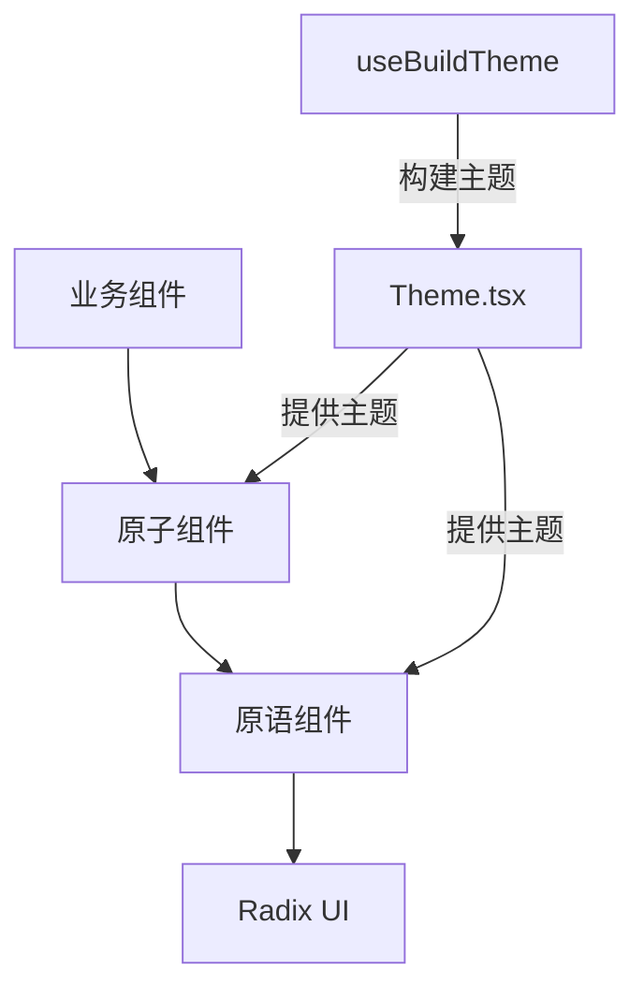
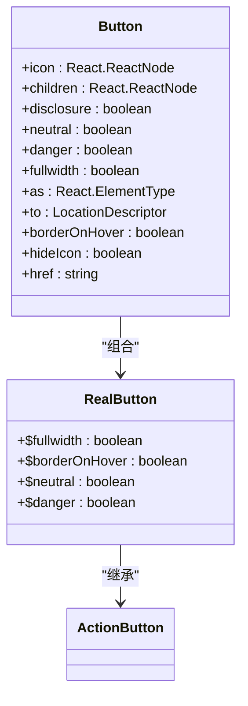
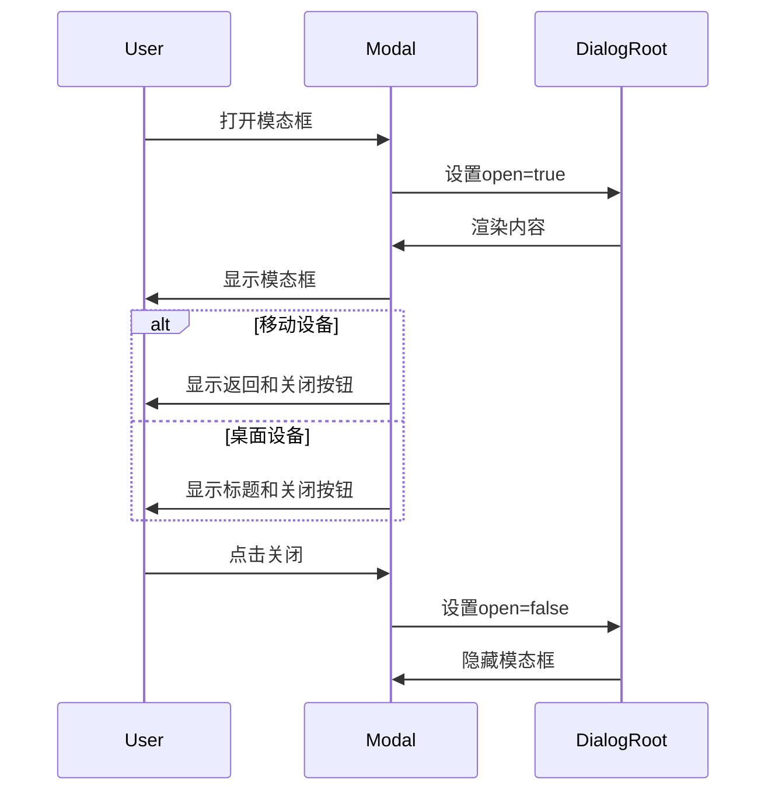
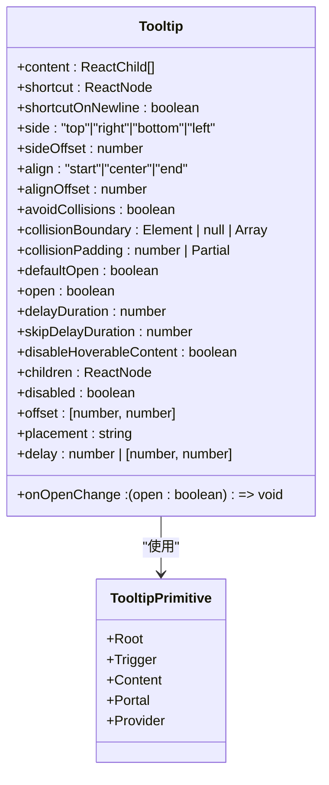
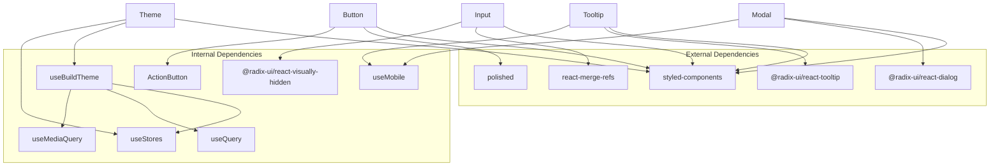

# 基础组件

<cite>
**本文档中引用的文件**  
- [Button.tsx](file://app/components/Button.tsx)
- [Input.tsx](file://app/components/Input.tsx)
- [Modal.tsx](file://app/components/Modal.tsx)
- [Tooltip.tsx](file://app/components/Tooltip.tsx)
- [Drawer.tsx](file://app/components/primitives/Drawer.tsx)
- [Form.tsx](file://app/components/primitives/Form.tsx)
- [Popover.tsx](file://app/components/primitives/Popover.tsx)
- [Theme.tsx](file://app/components/Theme.tsx)
</cite>

## 目录
1. [简介](#简介)
2. [项目结构](#项目结构)
3. [核心组件](#核心组件)
4. [架构概述](#架构概述)
5. [详细组件分析](#详细组件分析)
6. [依赖分析](#依赖分析)
7. [性能考虑](#性能考虑)
8. [故障排除指南](#故障排除指南)
9. [结论](#结论)

## 简介
本文档详细介绍了baozi项目中的基础UI原子级组件，包括Button、Input、Modal和Tooltip等。重点阐述这些组件的props接口定义、基于styled-components的样式处理机制以及可访问性（a11y）实现方式。通过primitives目录下的基础元素构建这些组件，并展示如何通过Theme.tsx进行主题定制。解释组件的设计原则，如一致性、可复用性和响应式支持，为初学者提供使用指南，同时为经验丰富的开发者提供性能优化建议和扩展方法。

## 项目结构
baozi项目的组件组织清晰，基础UI组件主要位于`app/components`目录下。核心原子组件如Button、Input、Modal、Tooltip等直接位于该目录根部，而更底层的原语组件（primitives）则集中于`primitives`子目录中，包括Drawer、Form、Popover等。主题系统通过`Theme.tsx`统一管理，利用styled-components的ThemeProvider实现动态主题切换。

```mermaid
graph TB
subgraph "Components"
Button["Button.tsx"]
Input["Input.tsx"]
Modal["Modal.tsx"]
Tooltip["Tooltip.tsx"]
end
subgraph "Primitives"
Drawer["Drawer.tsx"]
Form["Form.tsx"]
Popover["Popover.tsx"]
end
Theme["Theme.tsx"] --> |提供主题| Button
Theme --> |提供主题| Input
Theme --> |提供主题| Modal
Theme --> |提供主题| Tooltip
Theme --> |提供主题| Drawer
Theme --> |提供主题| Form
Theme --> |提供主题| Popover
Button --> |继承样式| ActionButton
Modal --> |使用| Dialog.Root
Tooltip --> |使用| TooltipPrimitive.Root
Drawer --> |使用| DrawerPrimitive.Root
Form --> |注入| CSRF Token
```

**Diagram sources**
- [Button.tsx](file://app/components/Button.tsx)
- [Input.tsx](file://app/components/Input.tsx)
- [Modal.tsx](file://app/components/Modal.tsx)
- [Tooltip.tsx](file://app/components/Tooltip.tsx)
- [Drawer.tsx](file://app/components/primitives/Drawer.tsx)
- [Form.tsx](file://app/components/primitives/Form.tsx)
- [Popover.tsx](file://app/components/primitives/Popover.tsx)
- [Theme.tsx](file://app/components/Theme.tsx)

**Section sources**
- [app/components](file://app/components)
- [app/components/primitives](file://app/components/primitives)

## 核心组件
本节深入分析Button、Input、Modal、Tooltip等核心原子组件的实现细节，包括其props接口、样式机制和可访问性支持。这些组件构成了baozi应用的UI基础，通过styled-components实现高度可定制的外观，并通过合理的props设计确保了良好的可复用性和一致性。

**Section sources**
- [Button.tsx](file://app/components/Button.tsx)
- [Input.tsx](file://app/components/Input.tsx)
- [Modal.tsx](file://app/components/Modal.tsx)
- [Tooltip.tsx](file://app/components/Tooltip.tsx)

## 架构概述
baozi的UI组件架构采用分层设计。顶层是业务组件，中间层是原子级UI组件（如Button、Input），底层是基于Radix UI等库的原语组件（如Drawer、Popover）。主题系统贯穿整个架构，通过`useBuildTheme`钩子和`ThemeProvider`提供统一的视觉风格。这种设计确保了组件的高度可复用性、一致的用户体验和灵活的主题定制能力。



**Diagram sources**
- [Theme.tsx](file://app/components/Theme.tsx)
- [useBuildTheme.ts](file://app/hooks/useBuildTheme.ts)

## 详细组件分析
本节对每个关键原子组件进行彻底分析，包括其设计模式、实现细节和最佳实践。

### Button 组件分析
Button组件是应用中最常用的交互元素之一。它通过styled-components进行样式定义，并支持多种变体（如中性、危险）和状态（如禁用、悬停）。

#### 组件接口与样式
Button组件的props接口设计灵活，支持标准的HTML按钮属性以及自定义的视觉属性。其样式通过styled-components的模板字符串定义，利用主题变量（如`s("accent")`）实现主题化。



**Diagram sources**
- [Button.tsx](file://app/components/Button.tsx#L1-L207)

**Section sources**
- [Button.tsx](file://app/components/Button.tsx#L1-L207)

### Input 组件分析
Input组件封装了原生的input和textarea元素，提供了统一的样式和增强的交互功能，如自动选择、快捷键提交等。

#### 可访问性与交互
Input组件通过`VisuallyHidden`组件确保标签的可访问性，并通过`mergeRefs`正确处理ref的合并。它还支持`autoSelect`和`onRequestSubmit`等高级交互功能。

```mermaid
flowchart TD
Start([组件渲染]) --> CheckType{"类型是textarea?"}
CheckType --> |是| RenderTextarea[渲染NativeTextarea]
CheckType --> |否| RenderInput[渲染NativeInput]
RenderTextarea --> HandleEvents[绑定onBlur, onFocus, onKeyDown]
RenderInput --> HandleEvents
HandleEvents --> CheckAutoSelect{"autoSelect为真?"}
CheckAutoSelect --> |是| AutoSelect[调用select()]
CheckAutoSelect --> |否| End([完成])
AutoSelect --> End
```

**Diagram sources**
- [Input.tsx](file://app/components/Input.tsx#L1-L282)

**Section sources**
- [Input.tsx](file://app/components/Input.tsx#L1-L282)

### Modal 组件分析
Modal组件基于Radix UI的Dialog实现，提供了跨平台（桌面/移动）的一致体验，并通过动画增强用户体验。

#### 响应式设计
Modal组件根据设备类型（通过`useMobile`判断）呈现不同的UI。在移动设备上，它显示为全屏视图并提供返回按钮；在桌面设备上，它显示为居中的模态框。



**Diagram sources**
- [Modal.tsx](file://app/components/Modal.tsx#L1-L252)

**Section sources**
- [Modal.tsx](file://app/components/Modal.tsx#L1-L252)

### Tooltip 组件分析
Tooltip组件基于Radix UI的Tooltip实现，支持键盘快捷键的显示，并向后兼容旧的Tippy API。

#### 向后兼容性
Tooltip组件通过处理`placement`、`delay`等旧属性，实现了平滑的API迁移。它还支持在内容中嵌入键盘快捷键，并以美观的样式呈现。



**Diagram sources**
- [Tooltip.tsx](file://app/components/Tooltip.tsx#L1-L289)

**Section sources**
- [Tooltip.tsx](file://app/components/Tooltip.tsx#L1-L289)

## 依赖分析
基础UI组件依赖于多个外部库和内部模块。主要依赖包括styled-components用于样式、Radix UI用于无障碍原语、polished用于颜色操作。内部依赖包括主题系统（Theme.tsx）、hooks（如useMobile）和共享样式（@shared/styles）。



**Diagram sources**
- [Button.tsx](file://app/components/Button.tsx)
- [Input.tsx](file://app/components/Input.tsx)
- [Modal.tsx](file://app/components/Modal.tsx)
- [Tooltip.tsx](file://app/components/Tooltip.tsx)
- [Theme.tsx](file://app/components/Theme.tsx)
- [useBuildTheme.ts](file://app/hooks/useBuildTheme.ts)

**Section sources**
- [Button.tsx](file://app/components/Button.tsx)
- [Input.tsx](file://app/components/Input.tsx)
- [Modal.tsx](file://app/components/Modal.tsx)
- [Tooltip.tsx](file://app/components/Tooltip.tsx)
- [Theme.tsx](file://app/components/Theme.tsx)
- [useBuildTheme.ts](file://app/hooks/useBuildTheme.ts)

## 性能考虑
为了优化性能，组件采用了多种策略。Button和Modal组件使用`React.forwardRef`和`observer`（来自mobx-react）来避免不必要的重渲染。Input组件通过`useRef`和`useState`正确管理内部状态。Tooltip组件通过`useTooltipContext`避免了Provider的嵌套问题。

对于初学者，建议直接使用这些组件的默认配置。对于高级用户，可以通过`as`属性自定义根元素，或通过主题系统深度定制外观。避免在渲染密集区域频繁创建内联函数或对象，以防止子组件不必要的重渲染。

## 故障排除指南
常见问题包括主题不生效、模态框无法关闭、工具提示不显示等。确保`Theme`组件包裹了整个应用，并检查`useStores`是否正确初始化。对于模态框问题，确认`onRequestClose`回调已正确定义。对于工具提示，检查是否在移动端被禁用（`isMobile`返回true）。

**Section sources**
- [Theme.tsx](file://app/components/Theme.tsx)
- [Modal.tsx](file://app/components/Modal.tsx)
- [Tooltip.tsx](file://app/components/Tooltip.tsx)

## 结论
baozi项目的基础UI组件设计精良，通过分层架构和主题系统实现了高度的可复用性和一致性。组件不仅提供了丰富的功能和良好的可访问性，还通过合理的性能优化确保了流畅的用户体验。开发者可以基于这些原子组件快速构建复杂的应用界面，同时保持代码的整洁和可维护性。