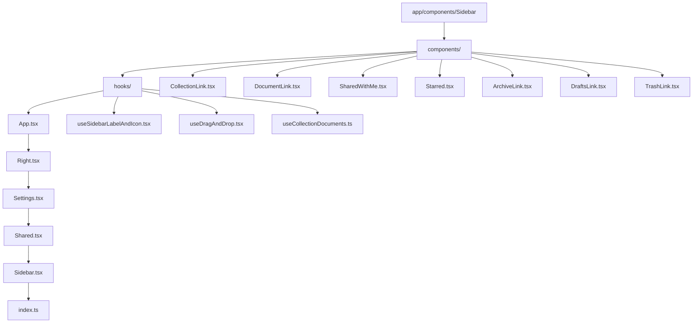
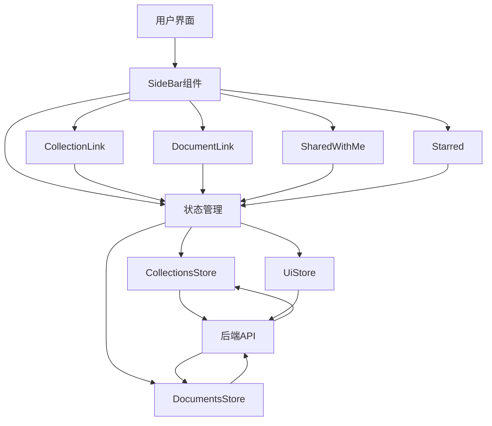
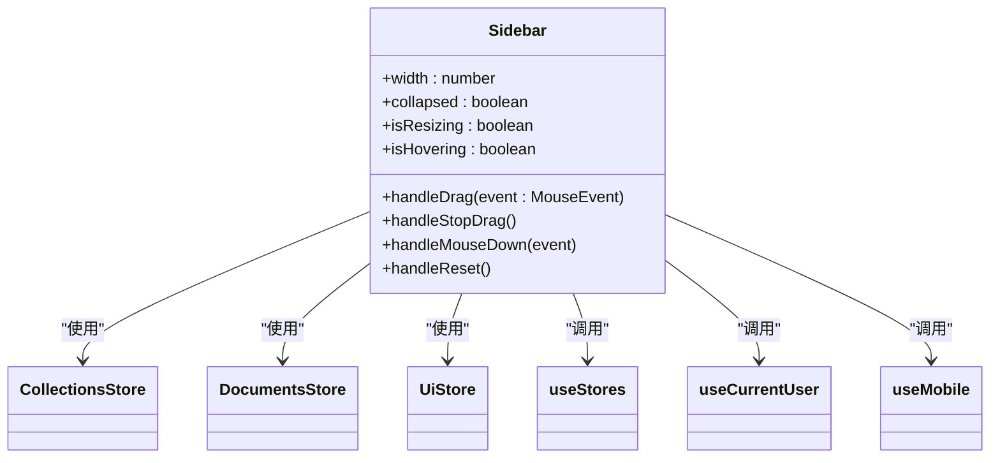
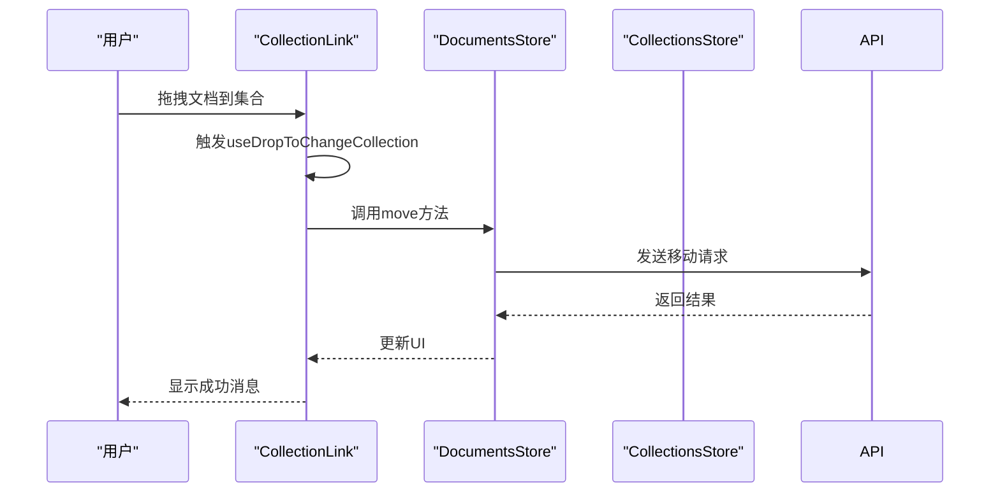
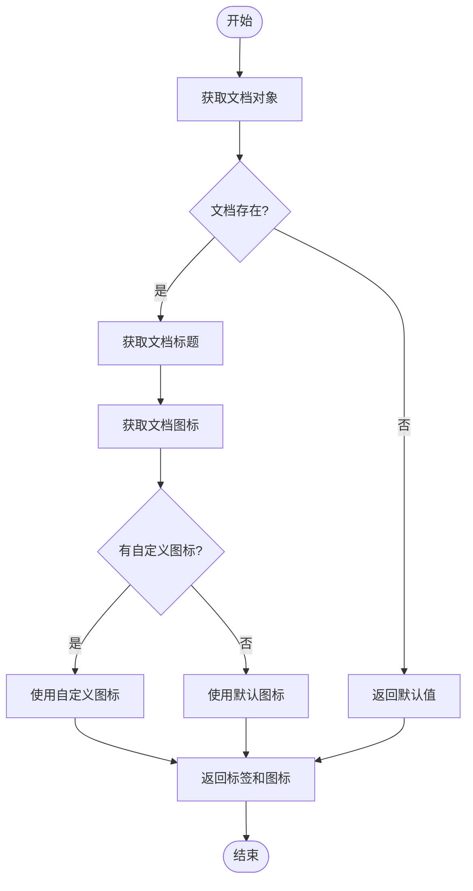
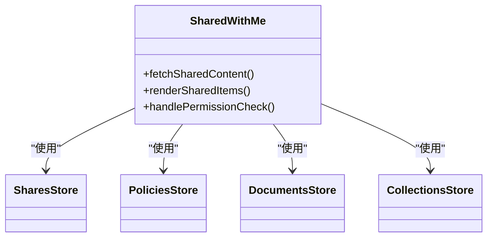
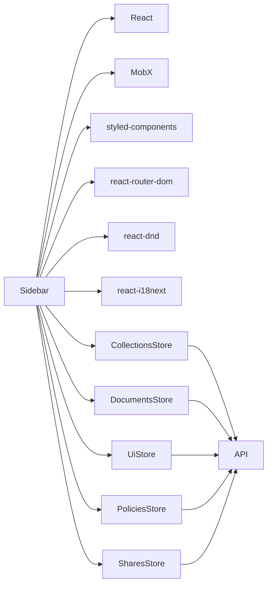

# 侧边栏系统

<cite>
**本文档中引用的文件**  
- [Sidebar.tsx](file://app/components/Sidebar/Sidebar.tsx)
- [CollectionsStore.ts](file://app/stores/CollectionsStore.ts)
- [DocumentsStore.ts](file://app/stores/DocumentsStore.ts)
- [useSidebarLabelAndIcon.tsx](file://app/components/Sidebar/hooks/useSidebarLabelAndIcon.tsx)
- [useDragAndDrop.tsx](file://app/components/Sidebar/hooks/useDragAndDrop.tsx)
- [CollectionLink.tsx](file://app/components/Sidebar/components/CollectionLink.tsx)
- [DocumentLink.tsx](file://app/components/Sidebar/components/DocumentLink.tsx)
- [SharedWithMe.tsx](file://app/components/Sidebar/components/SharedWithMe.tsx)
</cite>

## 目录
1. [简介](#简介)
2. [项目结构](#项目结构)
3. [核心组件](#核心组件)
4. [架构概述](#架构概述)
5. [详细组件分析](#详细组件分析)
6. [依赖分析](#依赖分析)
7. [性能考虑](#性能考虑)
8. [故障排除指南](#故障排除指南)
9. [结论](#结论)

## 简介
侧边栏系统是baozi项目中的核心导航组件，为用户提供直观的文档和集合管理界面。该系统通过响应式设计和丰富的交互功能，实现了高效的文档组织和访问。侧边栏不仅支持基本的导航功能，还集成了拖拽操作、权限控制和动态内容加载等高级特性，为不同层次的开发者提供了灵活的扩展能力。

## 项目结构
侧边栏系统的实现主要集中在`app/components/Sidebar`目录下，该目录包含了侧边栏的所有组件、钩子和子组件。系统采用模块化设计，将不同的功能分离到独立的文件中，便于维护和扩展。

**Diagram sources**
- [Sidebar.tsx](file://app/components/Sidebar/Sidebar.tsx)
- [CollectionLink.tsx](file://app/components/Sidebar/components/CollectionLink.tsx)
- [DocumentLink.tsx](file://app/components/Sidebar/components/DocumentLink.tsx)
- [SharedWithMe.tsx](file://app/components/Sidebar/components/SharedWithMe.tsx)

**Section sources**
- [Sidebar.tsx](file://app/components/Sidebar/Sidebar.tsx)
- [CollectionsStore.ts](file://app/stores/CollectionsStore.ts)
- [DocumentsStore.ts](file://app/stores/DocumentsStore.ts)

## 核心组件
侧边栏系统的核心组件包括`Sidebar`主组件、`CollectionLink`集合链接组件、`DocumentLink`文档链接组件以及`SharedWithMe`共享内容组件。这些组件通过状态管理和数据流协同工作，构建了一个完整的导航系统。

**Section sources**
- [Sidebar.tsx](file://app/components/Sidebar/Sidebar.tsx)
- [CollectionLink.tsx](file://app/components/Sidebar/components/CollectionLink.tsx)
- [DocumentLink.tsx](file://app/components/Sidebar/components/DocumentLink.tsx)
- [SharedWithMe.tsx](file://app/components/Sidebar/components/SharedWithMe.tsx)

## 架构概述
侧边栏系统采用分层架构设计，将UI组件、状态管理和业务逻辑分离。系统通过MobX状态管理库与后端API进行数据同步，确保用户界面的实时性和一致性。

**Diagram sources**
- [Sidebar.tsx](file://app/components/Sidebar/Sidebar.tsx)
- [CollectionsStore.ts](file://app/stores/CollectionsStore.ts)
- [DocumentsStore.ts](file://app/stores/DocumentsStore.ts)

## 详细组件分析

### Sidebar主组件分析
`Sidebar`组件是整个侧边栏系统的核心，负责管理侧边栏的整体状态和布局。它通过`useStores`钩子访问全局状态，并根据用户交互调整侧边栏的宽度和可见性。

**Diagram sources**
- [Sidebar.tsx](file://app/components/Sidebar/Sidebar.tsx)
- [CollectionsStore.ts](file://app/stores/CollectionsStore.ts)
- [DocumentsStore.ts](file://app/stores/DocumentsStore.ts)

**Section sources**
- [Sidebar.tsx](file://app/components/Sidebar/Sidebar.tsx)

### CollectionLink组件分析
`CollectionLink`组件负责渲染集合链接，支持展开/折叠、重命名和创建新文档等操作。它通过`useDropToChangeCollection`钩子实现拖拽功能，允许用户将文档拖入不同的集合。

**Diagram sources**
- [CollectionLink.tsx](file://app/components/Sidebar/components/CollectionLink.tsx)
- [DocumentsStore.ts](file://app/stores/DocumentsStore.ts)
- [useDragAndDrop.tsx](file://app/components/Sidebar/hooks/useDragAndDrop.tsx)

**Section sources**
- [CollectionLink.tsx](file://app/components/Sidebar/components/CollectionLink.tsx)

### DocumentLink组件分析
`DocumentLink`组件用于渲染文档链接，支持动态标签和图标显示。它通过`useSidebarLabelAndIcon`钩子获取文档的标签和图标信息，并根据文档状态进行渲染。

**Diagram sources**
- [DocumentLink.tsx](file://app/components/Sidebar/components/DocumentLink.tsx)
- [useSidebarLabelAndIcon.tsx](file://app/components/Sidebar/hooks/useSidebarLabelAndIcon.tsx)

**Section sources**
- [DocumentLink.tsx](file://app/components/Sidebar/components/DocumentLink.tsx)

### SharedWithMe组件分析
`SharedWithMe`组件显示共享给当前用户的内容，通过权限控制机制确保用户只能访问被授权的文档和集合。它利用`SharesStore`和`PoliciesStore`来验证用户的访问权限。

**Diagram sources**
- [SharedWithMe.tsx](file://app/components/Sidebar/components/SharedWithMe.tsx)
- [SharesStore.ts](file://app/stores/SharesStore.ts)
- [PoliciesStore.ts](file://app/stores/PoliciesStore.ts)

**Section sources**
- [SharedWithMe.tsx](file://app/components/Sidebar/components/SharedWithMe.tsx)

## 依赖分析
侧边栏系统依赖于多个核心模块和第三方库，这些依赖关系确保了系统的完整性和功能性。

**Diagram sources**
- [Sidebar.tsx](file://app/components/Sidebar/Sidebar.tsx)
- [CollectionsStore.ts](file://app/stores/CollectionsStore.ts)
- [DocumentsStore.ts](file://app/stores/DocumentsStore.ts)
- [UiStore.ts](file://app/stores/UiStore.ts)
- [PoliciesStore.ts](file://app/stores/PoliciesStore.ts)
- [SharesStore.ts](file://app/stores/SharesStore.ts)

**Section sources**
- [Sidebar.tsx](file://app/components/Sidebar/Sidebar.tsx)
- [CollectionsStore.ts](file://app/stores/CollectionsStore.ts)
- [DocumentsStore.ts](file://app/stores/DocumentsStore.ts)

## 性能考虑
侧边栏系统在设计时充分考虑了性能优化，通过以下机制确保流畅的用户体验：

1. **懒加载**: 使用`usePrevious`和`useEffect`钩子实现组件的懒加载，减少初始渲染的开销。
2. **事件节流**: 对鼠标移动和调整大小事件进行节流处理，避免频繁的重渲染。
3. **数据缓存**: 利用MobX的响应式系统缓存数据，减少不必要的API调用。
4. **虚拟滚动**: 对于大型集合和文档列表，采用虚拟滚动技术提高渲染性能。

**Section sources**
- [Sidebar.tsx](file://app/components/Sidebar/Sidebar.tsx)
- [CollectionsStore.ts](file://app/stores/CollectionsStore.ts)
- [DocumentsStore.ts](file://app/stores/DocumentsStore.ts)

## 故障排除指南
在使用侧边栏系统时，可能会遇到一些常见问题。以下是针对这些问题的解决方案：

1. **侧边栏无法展开/折叠**: 检查`UiStore`中的`sidebarIsClosed`状态是否正确更新。
2. **拖拽功能失效**: 确认`react-dnd`库已正确安装，并检查`useDrag`和`useDrop`钩子的使用是否正确。
3. **数据未及时更新**: 验证`CollectionsStore`和`DocumentsStore`的`fetch`方法是否被正确调用。
4. **权限错误**: 检查`PoliciesStore`中的权限策略是否正确配置。

**Section sources**
- [Sidebar.tsx](file://app/components/Sidebar/Sidebar.tsx)
- [CollectionsStore.ts](file://app/stores/CollectionsStore.ts)
- [DocumentsStore.ts](file://app/stores/DocumentsStore.ts)
- [PoliciesStore.ts](file://app/stores/PoliciesStore.ts)

## 结论
侧边栏系统是baozi项目中一个功能丰富且高度可扩展的组件。通过合理的架构设计和状态管理，它为用户提供了直观的导航体验。对于初学者，系统提供了清晰的集成指南；对于经验丰富的开发者，则提供了丰富的扩展点和自定义选项。未来可以通过引入更多动画效果和优化数据加载策略来进一步提升用户体验。