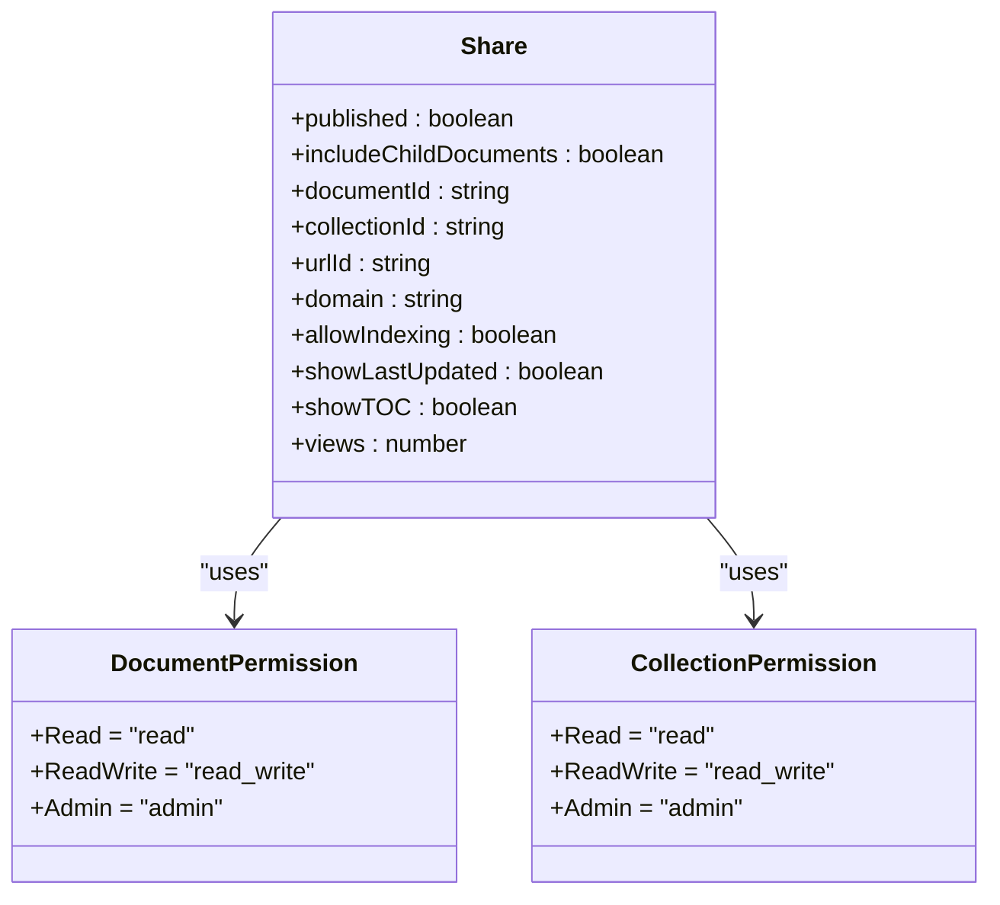
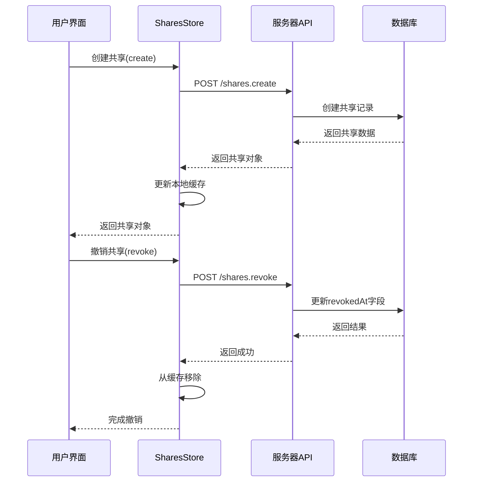

# 共享控制系统

<cite>
**本文档引用的文件**   
- [SharePopover.tsx](file://app/components/Sharing/Document/SharePopover.tsx)
- [AccessControlList.tsx](file://app/components/Sharing/Document/AccessControlList.tsx)
- [SharesStore.ts](file://app/stores/SharesStore.ts)
- [Share.ts](file://app/models/Share.ts)
- [shares.ts](file://server/routes/api/shares/shares.ts)
- [types.ts](file://shared/types.ts)
</cite>

## 目录
1. [简介](#简介)
2. [核心组件](#核心组件)
3. [权限模型实现](#权限模型实现)
4. [共享状态管理](#共享状态管理)
5. [API接口与共享链接管理](#api接口与共享链接管理)
6. [安全机制与访问控制](#安全机制与访问控制)
7. [用户使用指南](#用户使用指南)
8. [最佳实践](#最佳实践)

## 简介
共享控制系统是baozi项目的核心功能之一，它允许用户通过精细的权限控制来共享文档和集合。该系统提供了两种主要的共享方式：团队内部共享和公共访问。团队内部共享允许指定用户或用户组访问特定内容，而公共访问则通过生成的共享链接实现。系统实现了完整的权限管理，包括查看、编辑和管理三种权限级别，并提供了链接撤销、访问日志等安全功能。本文档将深入分析该系统的实现细节，为开发者提供全面的技术参考。

## 核心组件

共享控制系统由多个核心组件构成，主要包括SharePopover组件、AccessControlList组件和SharesStore状态管理器。SharePopover组件作为用户界面入口，提供了一个弹出式界面，用户可以通过它邀请成员、管理权限和生成共享链接。AccessControlList组件负责显示和管理当前文档或集合的访问控制列表，展示所有具有访问权限的用户和用户组。SharesStore作为全局状态管理器，负责维护所有共享状态，包括共享链接的创建、更新和撤销。这些组件协同工作，为用户提供了一个直观且功能强大的共享体验。

**Section sources**
- [SharePopover.tsx](file://app/components/Sharing/Document/SharePopover.tsx#L39-L384)
- [AccessControlList.tsx](file://app/components/Sharing/Document/AccessControlList.tsx#L47-L216)
- [SharesStore.ts](file://app/stores/SharesStore.ts#L14-L174)

## 权限模型实现

**Diagram sources**
- [types.ts](file://shared/types.ts#L175-L179)
- [types.ts](file://shared/types.ts#L169-L173)
- [Share.ts](file://app/models/Share.ts#L12-L129)

共享控制系统实现了基于角色的权限管理模型。对于文档，系统定义了三种权限级别：查看（View only）、编辑（Can edit）和管理（Manage），分别对应DocumentPermission枚举中的Read、ReadWrite和Admin值。集合的权限管理类似，使用CollectionPermission枚举。当用户创建共享链接时，可以选择相应的权限级别。系统通过AccessControlList组件中的InputMemberPermissionSelect和InputSelectPermission组件来实现权限选择界面。权限变更会通过API调用持久化到服务器，并实时更新到SharesStore中。这种设计确保了权限管理的灵活性和安全性，管理员可以精确控制每个共享对象的访问权限。

**Section sources**
- [types.ts](file://shared/types.ts#L169-L179)
- [AccessControlList.tsx](file://app/components/Sharing/Document/AccessControlList.tsx#L39-L267)

## 共享状态管理

**Diagram sources**
- [SharesStore.ts](file://app/stores/SharesStore.ts#L14-L174)
- [shares.ts](file://server/routes/api/shares/shares.ts#L237-L297)

SharesStore是共享控制系统的核心状态管理器，它继承自MobX的Store类，负责管理所有共享对象的状态。该Store实现了创建(create)、撤销(revoke)、获取(getByDocumentId/getByCollectionId)等核心方法。当用户创建共享链接时，create方法会首先检查是否已存在相同的共享对象，如果不存在则通过API调用创建新的共享记录。revoke方法用于撤销共享链接，它会向服务器发送POST请求，并在成功后从本地缓存中移除该共享对象。Store还维护了一个sharedCache，用于缓存共享对象的附加信息，如共享树结构和团队信息，这有助于提高性能并减少重复的API调用。通过这种集中式的状态管理，系统确保了共享状态的一致性和可预测性。

**Section sources**
- [SharesStore.ts](file://app/stores/SharesStore.ts#L14-L174)

## API接口与共享链接管理

共享控制系统通过RESTful API接口实现共享链接的创建、更新和撤销。创建共享链接的API端点为`/shares.create`，它接受documentId或collectionId作为参数，并可选地指定权限级别、是否包含子文档等配置。服务器端的实现位于`server/routes/api/shares/shares.ts`文件中，它首先验证用户权限，然后通过Share模型的findOrCreateWithCtx方法创建或获取现有的共享记录。更新共享链接的API端点为`/shares.update`，允许修改共享设置，如是否公开发布、是否允许索引等。撤销共享链接的API端点为`/shares.revoke`，它会设置共享对象的revokedAt字段，使其失效。这些API接口的设计遵循了幂等性原则，确保了操作的可靠性和一致性。

**Section sources**
- [shares.ts](file://server/routes/api/shares/shares.ts#L237-L297)

## 安全机制与访问控制

共享控制系统实现了多层次的安全机制。首先，公共访问和团队内部共享有明确的区别：公共访问通过共享链接实现，而团队内部共享需要用户登录并具有相应的权限。其次，系统提供了链接撤销功能，管理员可以随时撤销共享链接，使其立即失效。此外，系统还记录了访问日志，包括最后访问时间和访问次数，帮助管理员监控共享内容的使用情况。在服务器端，loadPublicShare函数实现了严格的访问控制，它会检查共享对象是否已被撤销、关联的集合或文档是否已归档等条件，确保只有合法的请求才能访问共享内容。这些安全机制共同构成了一个可靠的共享环境，保护了用户数据的安全。

**Section sources**
- [shares.ts](file://server/routes/api/shares/shares.ts#L137-L229)
- [shareLoader.ts](file://server/commands/shareLoader.ts#L190-L201)

## 用户使用指南

对于初学者，使用共享功能非常简单。首先，打开文档或集合的共享弹出窗口（SharePopover），然后在搜索框中输入要邀请的用户邮箱或选择现有用户。选择适当的权限级别后，点击邀请按钮即可完成共享。对于公共访问，只需点击"复制链接"按钮，然后将生成的链接分享给任何人。系统会自动创建一个共享记录，并确保被邀请的用户能够访问该内容。在共享过程中，用户可以看到实时的反馈，如成功邀请的提示信息。通过这个直观的界面，即使是技术背景较弱的用户也能轻松地共享内容。

**Section sources**
- [SharePopover.tsx](file://app/components/Sharing/Document/SharePopover.tsx#L39-L384)

## 最佳实践

对于经验丰富的开发者，扩展权限模型和集成第三方身份验证是提升系统功能的关键。可以通过扩展DocumentPermission和CollectionPermission枚举来添加新的权限级别，如"评论"权限。在集成第三方身份验证时，可以利用现有的OAuthClient组件和AuthenticationProvider模型，实现与Google、GitHub等服务的单点登录。此外，建议在创建共享链接时添加自定义的访问策略，如基于IP地址或时间的访问控制。为了提高性能，可以优化SharesStore的缓存策略，减少不必要的API调用。最后，在实现新的共享功能时，应遵循现有的代码风格和设计模式，确保系统的可维护性和可扩展性。

**Section sources**
- [SharePopover.tsx](file://app/components/Sharing/Document/SharePopover.tsx#L39-L384)
- [SharesStore.ts](file://app/stores/SharesStore.ts#L14-L174)
- [types.ts](file://shared/types.ts#L169-L179)