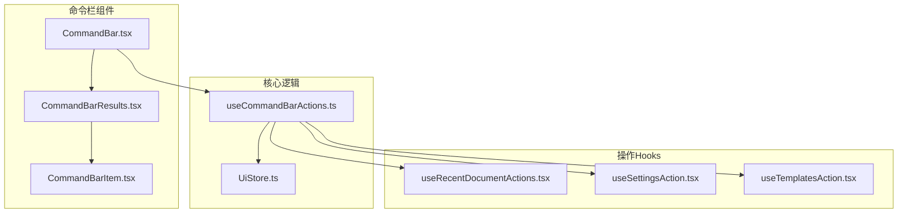
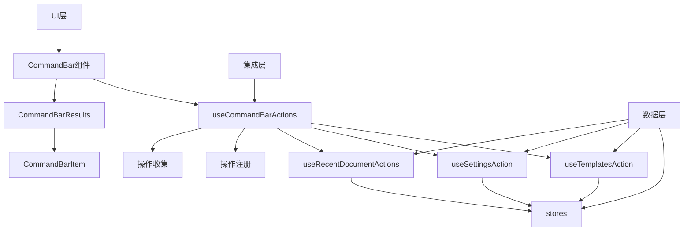
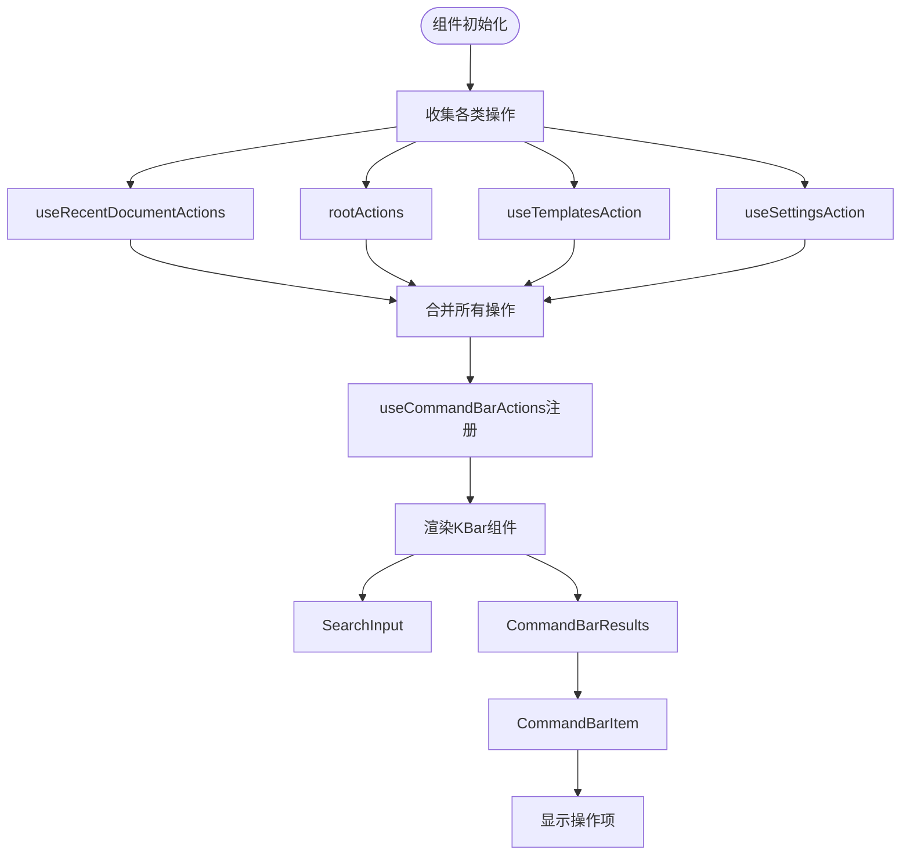
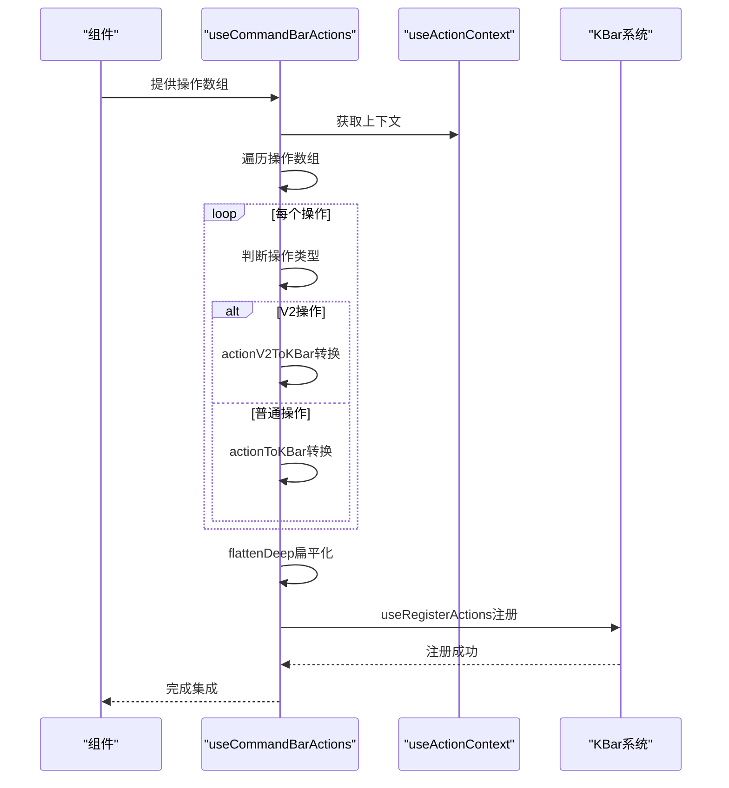
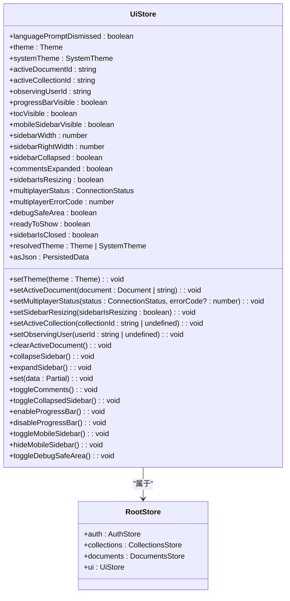

# 命令栏系统

<cite>
**本文档中引用的文件**  
- [CommandBar.tsx](file://app/components/CommandBar/CommandBar.tsx)
- [useCommandBarActions.ts](file://app/hooks/useCommandBarActions.ts)
- [UiStore.ts](file://app/stores/UiStore.ts)
- [useRecentDocumentActions.tsx](file://app/components/CommandBar/useRecentDocumentActions.tsx)
- [useSettingsAction.tsx](file://app/components/CommandBar/useSettingsAction.tsx)
- [useTemplatesAction.tsx](file://app/components/CommandBar/useTemplatesAction.tsx)
- [root.ts](file://app/actions/root.ts)
- [sections.ts](file://app/actions/sections.ts)
- [index.ts](file://app/actions/index.ts)
</cite>

## 目录
1. [简介](#简介)
2. [项目结构](#项目结构)
3. [核心组件](#核心组件)
4. [架构概述](#架构概述)
5. [详细组件分析](#详细组件分析)
6. [依赖分析](#依赖分析)
7. [性能考虑](#性能考虑)
8. [故障排除指南](#故障排除指南)
9. [结论](#结论)

## 简介
命令栏系统是baozi项目中的核心全局操作集成机制，为用户提供快速访问各种功能的统一入口。该系统通过`CommandBar`组件实现，支持键盘快捷键（如Ctrl+K）触发，提供搜索、过滤和动态加载最近使用操作的功能。本文档详细说明其架构设计、状态管理、操作集成机制以及扩展实践。

## 项目结构
命令栏系统主要由`app/components/CommandBar`目录下的组件和`app/hooks/useCommandBarActions.ts`钩子构成。系统通过模块化设计将不同功能的操作分离到独立的hooks中，实现了高内聚低耦合的架构。

**Diagram sources**
- [CommandBar.tsx](file://app/components/CommandBar/CommandBar.tsx)
- [useCommandBarActions.ts](file://app/hooks/useCommandBarActions.ts)
- [UiStore.ts](file://app/stores/UiStore.ts)

**Section sources**
- [CommandBar.tsx](file://app/components/CommandBar/CommandBar.tsx)
- [useCommandBarActions.ts](file://app/hooks/useCommandBarActions.ts)

## 核心组件
命令栏系统的核心组件包括`CommandBar`主组件、`useCommandBarActions`集成钩子和`UiStore`状态管理器。`CommandBar`组件负责UI渲染和用户交互，`useCommandBarActions`钩子负责收集和注册各种操作，`UiStore`则管理命令栏的显示状态。

**Section sources**
- [CommandBar.tsx](file://app/components/CommandBar/CommandBar.tsx)
- [useCommandBarActions.ts](file://app/hooks/useCommandBarActions.ts)
- [UiStore.ts](file://app/stores/UiStore.ts)

## 架构概述
命令栏系统采用分层架构设计，从上到下分为UI层、集成层和数据层。UI层由`CommandBar`及其子组件构成，负责用户界面展示；集成层由`useCommandBarActions`钩子构成，负责操作的收集和注册；数据层由各种操作hooks和stores构成，提供具体的操作数据。

**Diagram sources**
- [CommandBar.tsx](file://app/components/CommandBar/CommandBar.tsx)
- [useCommandBarActions.ts](file://app/hooks/useCommandBarActions.ts)
- [useRecentDocumentActions.tsx](file://app/components/CommandBar/useRecentDocumentActions.tsx)
- [useSettingsAction.tsx](file://app/components/CommandBar/useSettingsAction.tsx)
- [useTemplatesAction.tsx](file://app/components/CommandBar/useTemplatesAction.tsx)

## 详细组件分析
### CommandBar组件分析
`CommandBar`组件是命令栏系统的入口点，负责整合所有操作并渲染UI。组件通过多个自定义hooks收集不同类别的操作，并使用`useCommandBarActions`钩子将这些操作注册到全局命令系统中。

**Diagram sources**
- [CommandBar.tsx](file://app/components/CommandBar/CommandBar.tsx)
- [useRecentDocumentActions.tsx](file://app/components/CommandBar/useRecentDocumentActions.tsx)
- [useSettingsAction.tsx](file://app/components/CommandBar/useSettingsAction.tsx)
- [useTemplatesAction.tsx](file://app/components/CommandBar/useTemplatesAction.tsx)
- [root.ts](file://app/actions/root.ts)

**Section sources**
- [CommandBar.tsx](file://app/components/CommandBar/CommandBar.tsx)

### useCommandBarActions钩子分析
`useCommandBarActions`钩子是命令栏系统的核心集成机制，负责将各种操作转换为KBar系统可识别的格式并注册。钩子接受操作数组作为参数，通过`actionToKBar`和`actionV2ToKBar`函数进行格式转换，并使用`useRegisterActions`注册到全局系统中。

**Diagram sources**
- [useCommandBarActions.ts](file://app/hooks/useCommandBarActions.ts)
- [index.ts](file://app/actions/index.ts)

**Section sources**
- [useCommandBarActions.ts](file://app/hooks/useCommandBarActions.ts)

### 状态管理分析
命令栏的显示状态由`UiStore`统一管理，该store使用MobX实现响应式状态管理。`UiStore`不仅管理命令栏相关状态，还管理整个应用的UI状态，实现了状态的集中化管理。

**Diagram sources**
- [UiStore.ts](file://app/stores/UiStore.ts)

**Section sources**
- [UiStore.ts](file://app/stores/UiStore.ts)

## 依赖分析
命令栏系统依赖于多个核心模块和第三方库，形成了复杂的依赖网络。系统通过合理的依赖管理实现了功能的模块化和可维护性。

```mermaid
graph TD
CommandBar --> kbar["kbar (第三方库)"]
CommandBar --> mobx-react["mobx-react"]
CommandBar --> react-i18next["react-i18next"]
CommandBar --> react-portal["react-portal"]
CommandBar --> styled-components["styled-components"]
useCommandBarActions --> lodash["lodash/flattenDeep"]
useCommandBarActions --> react-router-dom["react-router-dom"]
useCommandBarActions --> kbar["kbar"]
useRecentDocumentActions --> outline-icons["outline-icons"]
useRecentDocumentActions --> react["react"]
useRecentDocumentActions --> shared["@shared/components/Icon"]
useSettingsAction --> outline-icons["outline-icons"]
useSettingsAction --> react["react"]
useTemplatesAction --> outline-icons["outline-icons"]
useTemplatesAction --> react["react"]
useTemplatesAction --> shared["@shared/components/Icon"]
UiStore --> mobx["mobx"]
UiStore --> react-dom["react-dom"]
UiStore --> shared["@shared/styles/theme"]
UiStore --> shared["@shared/utils/Storage"]
UiStore --> models["~/models/Document"]
```

**Diagram sources**
- [CommandBar.tsx](file://app/components/CommandBar/CommandBar.tsx)
- [useCommandBarActions.ts](file://app/hooks/useCommandBarActions.ts)
- [useRecentDocumentActions.tsx](file://app/components/CommandBar/useRecentDocumentActions.tsx)
- [useSettingsAction.tsx](file://app/components/CommandBar/useSettingsAction.tsx)
- [useTemplatesAction.tsx](file://app/components/CommandBar/useTemplatesAction.tsx)
- [UiStore.ts](file://app/stores/UiStore.ts)

**Section sources**
- [CommandBar.tsx](file://app/components/CommandBar/CommandBar.tsx)
- [useCommandBarActions.ts](file://app/hooks/useCommandBarActions.ts)
- [UiStore.ts](file://app/stores/UiStore.ts)

## 性能考虑
命令栏系统在性能方面进行了多项优化，包括使用`useMemo`缓存计算结果、`flattenDeep`扁平化操作数组、以及合理的依赖数组管理。这些优化确保了系统在大量操作存在时仍能保持良好的响应性能。

## 故障排除指南
当命令栏系统出现问题时，可以从以下几个方面进行排查：检查操作注册是否成功、验证状态管理是否正确、确认依赖项是否完整加载。特别需要注意`useCommandBarActions`钩子的依赖数组配置，错误的依赖配置可能导致操作无法正确更新。

**Section sources**
- [useCommandBarActions.ts](file://app/hooks/useCommandBarActions.ts)
- [UiStore.ts](file://app/stores/UiStore.ts)

## 结论
命令栏系统通过模块化设计和合理的架构分层，实现了功能的灵活扩展和高效的性能表现。系统将操作收集、格式转换和状态管理分离到不同的组件和hooks中，提高了代码的可维护性和可测试性。对于开发者而言，理解这一架构有助于更好地扩展和优化命令栏功能。