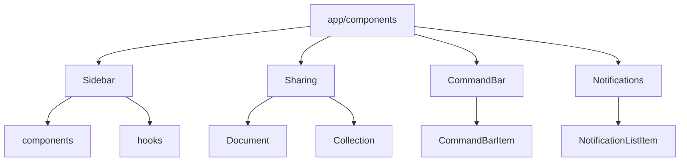
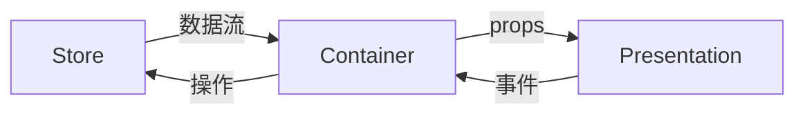
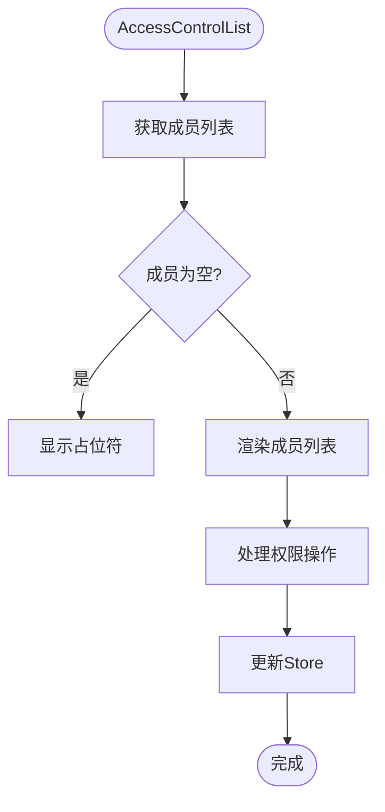
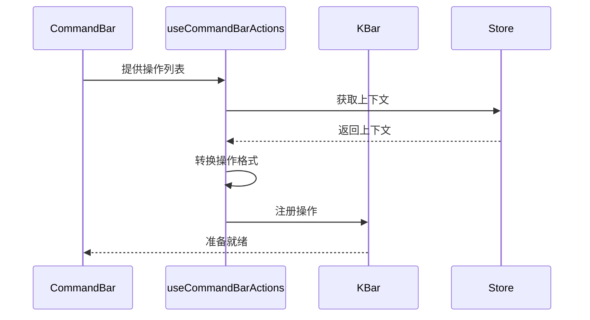
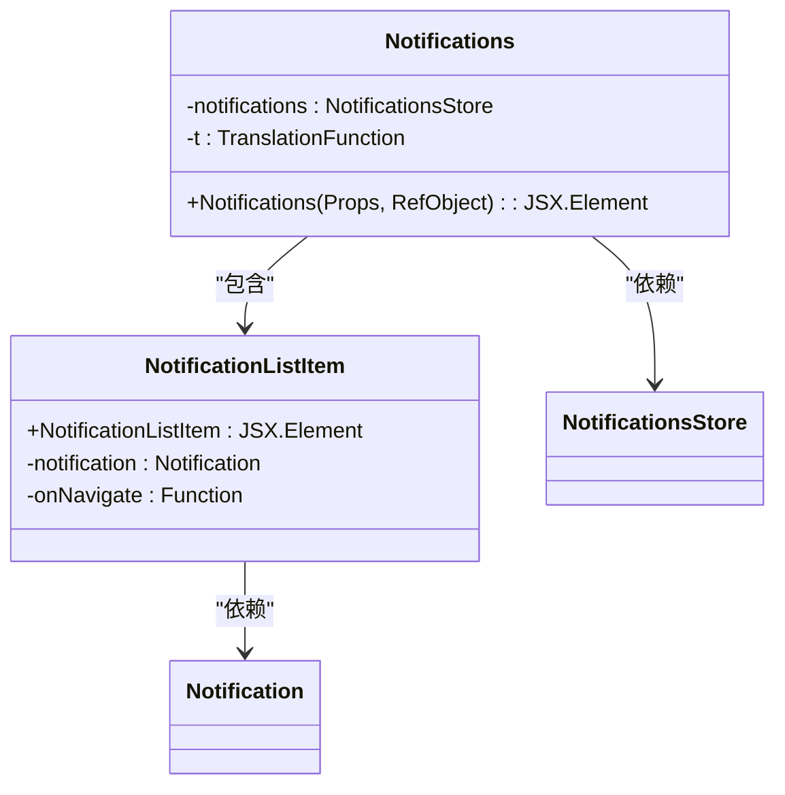
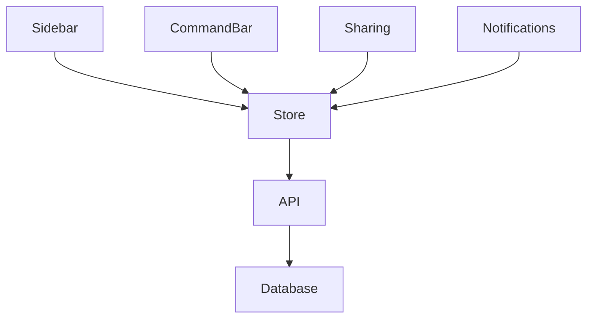

# 复合组件

<cite>
**本文档中引用的文件**  
- [Sidebar.tsx](file://app/components/Sidebar/Sidebar.tsx)
- [useSidebarLabelAndIcon.tsx](file://app/components/Sidebar/hooks/useSidebarLabelAndIcon.tsx)
- [CommandBar.tsx](file://app/components/CommandBar/CommandBar.tsx)
- [useCommandBarActions.ts](file://app/hooks/useCommandBarActions.ts)
- [Notifications.tsx](file://app/components/Notifications/Notifications.tsx)
- [AccessControlList.tsx](file://app/components/Sharing/Document/AccessControlList.tsx)
- [DocumentMemberList.tsx](file://app/components/Sharing/Document/DocumentMemberList.tsx)
</cite>

## 目录
1. [简介](#简介)
2. [项目结构](#项目结构)
3. [核心组件](#核心组件)
4. [架构概述](#架构概述)
5. [详细组件分析](#详细组件分析)
6. [依赖分析](#依赖分析)
7. [性能考虑](#性能考虑)
8. [故障排除指南](#故障排除指南)
9. [结论](#结论)

## 简介
本文档详细介绍了baozi项目中的复合组件，重点分析Sidebar、Sharing、CommandBar和Notifications等由多个基础组件组合而成的复杂组件。文档将深入探讨这些组件的内部结构、状态管理机制以及与其他系统（如Store、Context）的集成方式。通过实际代码示例，展示Sidebar如何通过hooks/useSidebarLabelAndIcon.tsx处理动态标签，Sharing组件如何实现细粒度权限控制，CommandBar如何通过useCommandBarActions.ts集成全局操作。同时，解释这些组件的设计模式，如容器/展示分离和关注点分离，为初学者提供集成指南，为经验丰富的开发者提供自定义和扩展的最佳实践。

## 项目结构
baozi项目的复合组件主要分布在app/components目录下，每个复合组件都有独立的子目录，包含其相关的hooks、子组件和样式文件。这种组织方式遵循了功能模块化的最佳实践，使得每个复合组件的代码高度内聚，易于维护和扩展。



**Diagram sources**
- [app/components/Sidebar](file://app/components/Sidebar)
- [app/components/Sharing](file://app/components/Sharing)
- [app/components/CommandBar](file://app/components/CommandBar)
- [app/components/Notifications](file://app/components/Notifications)

**Section sources**
- [app/components/Sidebar](file://app/components/Sidebar)
- [app/components/Sharing](file://app/components/Sharing)
- [app/components/CommandBar](file://app/components/CommandBar)
- [app/components/Notifications](file://app/components/Notifications)

## 核心组件
复合组件是baozi项目UI架构的核心，它们通过组合多个基础组件来实现复杂的用户交互和业务逻辑。这些组件不仅封装了自身的状态和行为，还通过hooks与全局状态管理Store进行通信，实现了高效的状态同步和数据流管理。

**Section sources**
- [app/components/Sidebar/Sidebar.tsx](file://app/components/Sidebar/Sidebar.tsx)
- [app/components/CommandBar/CommandBar.tsx](file://app/components/CommandBar/CommandBar.tsx)
- [app/components/Notifications/Notifications.tsx](file://app/components/Notifications/Notifications.tsx)
- [app/components/Sharing/Document/AccessControlList.tsx](file://app/components/Sharing/Document/AccessControlList.tsx)

## 架构概述
baozi项目的复合组件采用了一种分层的架构设计，将UI展示逻辑与业务逻辑分离。每个复合组件都由一个容器组件和多个展示组件组成，容器组件负责从Store中获取数据并通过props传递给展示组件，展示组件则专注于UI的渲染和用户交互。



**Diagram sources**
- [app/stores/RootStore.ts](file://app/stores/RootStore.ts)
- [app/components/Sidebar/Sidebar.tsx](file://app/components/Sidebar/Sidebar.tsx)
- [app/components/Notifications/Notifications.tsx](file://app/components/Notifications/Notifications.tsx)

## 详细组件分析

### Sidebar组件分析
Sidebar组件是baozi项目的主要导航区域，它通过useSidebarLabelAndIcon.tsx hook处理动态标签和图标。该hook根据传入的documentId或collectionId从Store中获取相应的模型，并返回对应的标签和图标。

```mermaid
classDiagram
class useSidebarLabelAndIcon {
+useSidebarLabelAndIcon(SidebarItem, React.ReactNode) : {label : string, icon : React.ReactNode}
-collections : CollectionsStore
-documents : DocumentsStore
}
class SidebarItem {
+documentId? : string
+collectionId? : string
}
useSidebarLabelAndIcon --> SidebarItem : "输入"
useSidebarLabelAndIcon --> CollectionsStore : "依赖"
useSidebarLabelAndIcon --> DocumentsStore : "依赖"
```

**Diagram sources**
- [app/components/Sidebar/hooks/useSidebarLabelAndIcon.tsx](file://app/components/Sidebar/hooks/useSidebarLabelAndIcon.tsx)
- [app/stores/CollectionsStore.ts](file://app/stores/CollectionsStore.ts)
- [app/stores/DocumentsStore.ts](file://app/stores/DocumentsStore.ts)

**Section sources**
- [app/components/Sidebar/hooks/useSidebarLabelAndIcon.tsx](file://app/components/Sidebar/hooks/useSidebarLabelAndIcon.tsx)
- [app/components/Sidebar/Sidebar.tsx](file://app/components/Sidebar/Sidebar.tsx)

### Sharing组件分析
Sharing组件实现了细粒度的权限控制，通过AccessControlList.tsx和DocumentMemberList.tsx两个主要组件来管理文档和集合的共享权限。AccessControlList组件展示了所有具有访问权限的用户和组，并提供了权限更新和移除的功能。



**Diagram sources**
- [app/components/Sharing/Document/AccessControlList.tsx](file://app/components/Sharing/Document/AccessControlList.tsx)
- [app/components/Sharing/Document/DocumentMemberList.tsx](file://app/components/Sharing/Document/DocumentMemberList.tsx)

**Section sources**
- [app/components/Sharing/Document/AccessControlList.tsx](file://app/components/Sharing/Document/AccessControlList.tsx)
- [app/components/Sharing/Document/DocumentMemberList.tsx](file://app/components/Sharing/Document/DocumentMemberList.tsx)

### CommandBar组件分析
CommandBar组件通过useCommandBarActions.ts hook集成全局操作，允许用户通过快捷键快速执行各种命令。该hook将传入的操作列表转换为KBar库可识别的格式，并注册到全局命令系统中。



**Diagram sources**
- [app/components/CommandBar/CommandBar.tsx](file://app/components/CommandBar/CommandBar.tsx)
- [app/hooks/useCommandBarActions.ts](file://app/hooks/useCommandBarActions.ts)

**Section sources**
- [app/components/CommandBar/CommandBar.tsx](file://app/components/CommandBar/CommandBar.tsx)
- [app/hooks/useCommandBarActions.ts](file://app/hooks/useCommandBarActions.ts)

### Notifications组件分析
Notifications组件负责管理用户的系统通知，通过Notifications.tsx和NotificationListItem.tsx两个组件实现通知列表的展示和交互。该组件利用MobX的observer模式自动响应Store中的状态变化。



**Diagram sources**
- [app/components/Notifications/Notifications.tsx](file://app/components/Notifications/Notifications.tsx)
- [app/components/Notifications/NotificationListItem.tsx](file://app/components/Notifications/NotificationListItem.tsx)
- [app/stores/NotificationsStore.ts](file://app/stores/NotificationsStore.ts)

**Section sources**
- [app/components/Notifications/Notifications.tsx](file://app/components/Notifications/Notifications.tsx)
- [app/components/Notifications/NotificationListItem.tsx](file://app/components/Notifications/NotificationListItem.tsx)

## 依赖分析
复合组件之间的依赖关系清晰，每个组件都通过明确的接口与Store和其他组件进行通信。这种松耦合的设计使得组件可以独立开发和测试，同时也便于未来的重构和扩展。



**Diagram sources**
- [app/stores/RootStore.ts](file://app/stores/RootStore.ts)
- [app/components/Sidebar/Sidebar.tsx](file://app/components/Sidebar/Sidebar.tsx)
- [app/components/CommandBar/CommandBar.tsx](file://app/components/CommandBar/CommandBar.tsx)
- [app/components/Sharing/Document/AccessControlList.tsx](file://app/components/Sharing/Document/AccessControlList.tsx)
- [app/components/Notifications/Notifications.tsx](file://app/components/Notifications/Notifications.tsx)

**Section sources**
- [app/stores/RootStore.ts](file://app/stores/RootStore.ts)

## 性能考虑
复合组件在设计时充分考虑了性能优化，通过React.memo、useMemo和useCallback等hooks避免不必要的重新渲染。同时，利用MobX的细粒度响应式系统，确保只有当相关数据发生变化时组件才会更新。

## 故障排除指南
当复合组件出现显示或功能问题时，首先检查相关Store中的数据状态是否正确。对于Sidebar组件，确认documentId或collectionId是否有效；对于Sharing组件，检查权限设置是否符合预期；对于CommandBar组件，验证操作列表是否正确注册；对于Notifications组件，确保通知数据已成功加载。

**Section sources**
- [app/stores/RootStore.ts](file://app/stores/RootStore.ts)
- [app/components/Sidebar/Sidebar.tsx](file://app/components/Sidebar/Sidebar.tsx)
- [app/components/CommandBar/CommandBar.tsx](file://app/components/CommandBar/CommandBar.tsx)
- [app/components/Sharing/Document/AccessControlList.tsx](file://app/components/Sharing/Document/AccessControlList.tsx)
- [app/components/Notifications/Notifications.tsx](file://app/components/Notifications/Notifications.tsx)

## 结论
baozi项目的复合组件通过精心设计的架构和高效的实现，为用户提供了一流的交互体验。这些组件不仅功能强大，而且具有良好的可维护性和扩展性，为项目的持续发展奠定了坚实的基础。通过遵循本文档中介绍的最佳实践，开发者可以有效地集成、自定义和扩展这些复合组件，满足不断变化的业务需求。